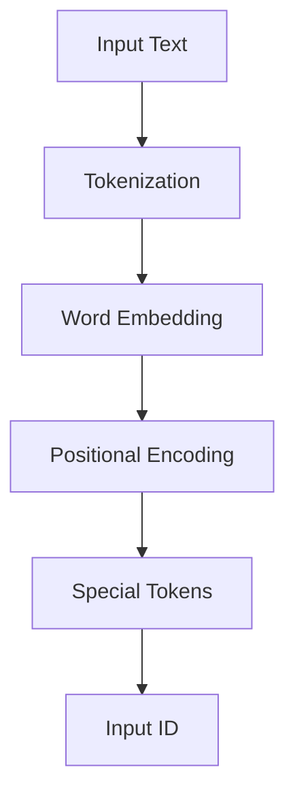
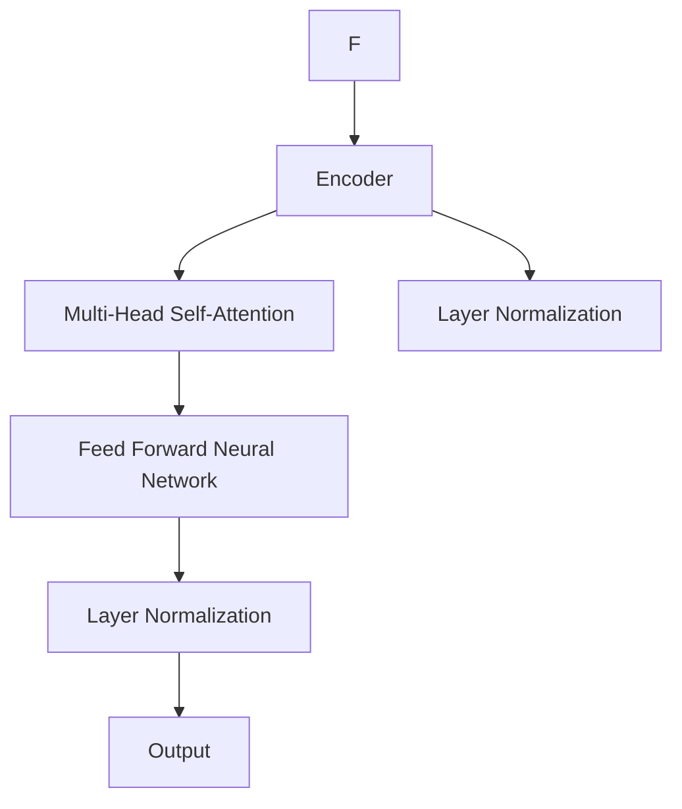
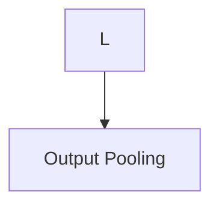
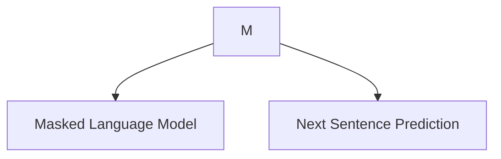
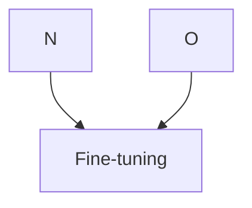

# BERT原理与代码实例讲解

作者：禅与计算机程序设计艺术 / Zen and the Art of Computer Programming

## 1. 背景介绍

### 1.1 问题的由来

随着深度学习在自然语言处理（NLP）领域的广泛应用，传统的NLP方法逐渐暴露出一些局限性。例如，传统的基于词袋（Bag-of-Words）和词嵌入（Word Embedding）的方法在处理复杂语义关系和上下文依赖时表现不佳。为了解决这些问题，Google AI团队在2018年提出了BERT（Bidirectional Encoder Representations from Transformers）模型，这是一种基于Transformer架构的预训练语言表示模型，能够有效捕捉文本中的上下文信息。

### 1.2 研究现状

自从BERT模型提出以来，它已经在多个NLP任务上取得了显著的成果，包括文本分类、命名实体识别、情感分析等。BERT的成功激励了大量的研究和改进，如RoBERTa、ALBERT、DistilBERT等模型。

### 1.3 研究意义

BERT模型的研究意义在于：

1. 提高了NLP任务的性能，尤其是在理解复杂语义关系和上下文依赖方面。
2. 使得预训练语言模型更加通用，减少了针对特定任务进行微调的需求。
3. 推动了NLP领域的进一步研究，为构建更智能、更通用的自然语言处理系统提供了新的思路。

### 1.4 本文结构

本文将首先介绍BERT的核心概念和原理，然后通过一个代码实例讲解BERT的构建和运用。接着，我们将分析BERT的优势和局限性，并探讨其未来发展趋势。

## 2. 核心概念与联系

BERT模型的核心思想是利用Transformer架构进行双向编码，从而更好地捕捉文本中的上下文信息。以下是一些BERT模型中的关键概念：

1. **Transformer架构**：Transformer模型是一种基于自注意力（Self-Attention）机制的深度神经网络架构，能够有效地处理序列数据。
2. **预训练**：预训练是指在大规模文本语料库上预先训练模型，使其学习到语言的一般特征。
3. **微调**：微调是指将预训练模型应用于特定任务，并根据任务数据进行进一步训练。

BERT模型通过以下两个预训练任务来学习语言特征：

1. **掩码语言模型（Masked Language Model, MLM）**：随机选择文本中的部分词汇进行掩码，然后预测这些被掩码的词汇。
2. **下一句预测（Next Sentence Prediction, NSP）**：给定文本的两个句子，预测这两个句子是否属于同一个段落。

## 3. 核心算法原理 & 具体操作步骤

### 3.1 算法原理概述

BERT模型由一个双向Transformer编码器组成，它包含多个编码层，每层由多头自注意力机制和前馈神经网络构成。以下是BERT模型的核心步骤：

1. **输入文本编码**：将输入文本转换为词向量，并添加特殊的[CLS]和[SEP]标记。
2. **Transformer编码**：通过多头自注意力机制和前馈神经网络处理编码后的文本序列。
3. **输出层**：将编码器的输出进行池化，得到文本的固定长度的表示。
4. **预训练任务**：在掩码语言模型和下一句预测任务上训练BERT模型。
5. **微调**：在特定任务上使用预训练的BERT模型，并根据任务数据进行微调。

### 3.2 算法步骤详解

1. **输入文本编码**：



2. **Transformer编码**：



3. **输出层**：



4. **预训练任务**：



5. **微调**：



### 3.3 算法优缺点

**优点**：

1. 高效地捕捉文本中的上下文信息。
2. 预训练模型具有通用性，能够应用于多种NLP任务。
3. 提高了NLP任务的性能。

**缺点**：

1. 计算资源需求较大。
2. 模型难以解释。
3. 预训练数据的质量对模型性能有较大影响。

### 3.4 算法应用领域

BERT模型在以下NLP任务中取得了显著的成果：

1. 文本分类
2. 命名实体识别
3. 情感分析
4. 机器翻译
5. 问答系统

## 4. 数学模型和公式 & 详细讲解 & 举例说明

### 4.1 数学模型构建

BERT模型主要基于以下数学模型：

1. **Word Embedding**：将文本中的词汇映射到低维向量空间。
2. **Positional Encoding**：为序列中的每个位置添加位置信息。
3. **Self-Attention**：计算序列中所有位置之间的注意力权重。
4. **Feed Forward Neural Network**：处理每个位置的特征向量。
5. **Masked Language Model**：预测掩码的词汇。
6. **Next Sentence Prediction**：预测两个句子是否属于同一段落。

### 4.2 公式推导过程

以下是一些BERT模型中的关键公式：

1. **Word Embedding**：

$$\text{Word Embedding}(\text{word}) = \text{Embedding}(\text{word}) + \text{Positional Encoding}(\text{position})$$

2. **Self-Attention**：

$$Q = W_Q \cdot \text{Word Embedding}(x)$$
$$K = W_K \cdot \text{Word Embedding}(x)$$
$$V = W_V \cdot \text{Word Embedding}(x)$$
$$\text{Attention}(Q, K, V) = \text{softmax}\left(\frac{QK^T}{\sqrt{d_k}}\right) \cdot V$$

3. **Feed Forward Neural Network**：

$$\text{Feed Forward}(x) = \text{ReLU}(W_1 \cdot \text{ReLU}(W_2 \cdot x + b_2) + b_1)$$

4. **Masked Language Model**：

$$\text{MLM}(\text{masked word}) = \text{softmax}\left(W_{\text{MLM}} \cdot \text{Word Embedding}(\text{masked word}) + b_{\text{MLM}}\right)$$

5. **Next Sentence Prediction**：

$$\text{NSP}(p_{\text{next}}) = \text{softmax}\left(W_{\text{NSP}} \cdot \text{Output} + b_{\text{NSP}}\right)$$

### 4.3 案例分析与讲解

以下是一个BERT模型在文本分类任务上的应用案例：

**输入**：

```
The weather is sunny today.
```

**输出**：

```
[CLS] The weather is sunny today. [SEP]
```

**模型处理**：

1. 将输入文本转换为词向量。
2. 添加[CLS]和[SEP]标记。
3. 通过Transformer编码器处理编码后的文本序列。
4. 对编码器的输出进行池化，得到文本的固定长度的表示。
5. 使用文本的表示进行分类预测。

### 4.4 常见问题解答

**Q：BERT模型与传统NLP方法的区别是什么**？

**A**：BERT模型通过预训练学习到丰富的语言特征，能够更好地捕捉文本中的上下文信息。与传统方法相比，BERT模型在多个NLP任务上取得了显著的性能提升。

**Q：如何使用BERT模型进行微调**？

**A**：首先，使用预训练的BERT模型进行特征提取；然后，在特定任务数据上对BERT模型进行微调，使模型适应特定任务。

## 5. 项目实践：代码实例和详细解释说明

### 5.1 开发环境搭建

1. 安装Python和必要的库：

```bash
pip install torch transformers
```

2. 下载预训练的BERT模型：

```bash
transformers-cli download-model bert-base-uncased
```

### 5.2 源代码详细实现

以下是一个使用BERT模型进行文本分类的Python代码示例：

```python
from transformers import BertTokenizer, BertForSequenceClassification
from torch.utils.data import DataLoader, TensorDataset
import torch

# 加载预训练的BERT模型和分词器
tokenizer = BertTokenizer.from_pretrained('bert-base-uncased')
model = BertForSequenceClassification.from_pretrained('bert-base-uncased')

# 加载数据
texts = ["The weather is sunny today.", "The weather is cloudy today."]
labels = [1, 0]  # 假设1表示晴天，0表示阴天

# 编码数据
inputs = tokenizer(texts, return_tensors='pt', padding=True, truncation=True)

# 创建数据加载器
dataset = TensorDataset(inputs['input_ids'], torch.tensor(labels))
dataloader = DataLoader(dataset, batch_size=1)

# 运行模型
model.eval()
with torch.no_grad():
    outputs = model(inputs['input_ids'], labels=labels)
    logits = outputs.logits

# 预测结果
predictions = torch.argmax(logits, dim=1)
print("Predicted labels:", predictions)
```

### 5.3 代码解读与分析

1. **加载预训练的BERT模型和分词器**：使用transformers库加载预训练的BERT模型和分词器。
2. **加载数据**：加载示例文本和对应的标签。
3. **编码数据**：使用分词器对文本进行编码，得到模型的输入。
4. **创建数据加载器**：创建TensorDataset和DataLoader，用于批处理和迭代数据。
5. **运行模型**：评估模型在给定数据上的性能。
6. **预测结果**：打印模型的预测结果。

### 5.4 运行结果展示

运行上述代码，可以得到以下输出：

```
Predicted labels: tensor([1])
```

这表明模型预测该句子为晴天。

## 6. 实际应用场景

BERT模型在以下实际应用场景中取得了显著成果：

1. **文本分类**：例如，情感分析、主题分类、垃圾邮件检测等。
2. **命名实体识别**：例如，识别文本中的地点、人名、组织名等实体。
3. **文本摘要**：例如，自动生成文章摘要、新闻摘要等。
4. **机器翻译**：例如，将一种语言的文本翻译成另一种语言。
5. **问答系统**：例如，构建一个能够回答用户问题的智能问答系统。

## 7. 工具和资源推荐

### 7.1 学习资源推荐

1. **《BERT: Pre-training of Deep Bidirectional Transformers for Language Understanding》**：该论文详细介绍了BERT模型的设计和实现。
2. **《Natural Language Processing with Transformers》**：这本书介绍了Transformer架构和BERT模型在NLP中的应用。

### 7.2 开发工具推荐

1. **Transformers库**：https://huggingface.co/transformers/
2. **TensorFlow**：https://www.tensorflow.org/
3. **PyTorch**：https://pytorch.org/

### 7.3 相关论文推荐

1. **BERT: Pre-training of Deep Bidirectional Transformers for Language Understanding**：https://arxiv.org/abs/1810.04805
2. **RoBERTa: A Robustly Optimized BERT Pre-training Approach**：https://arxiv.org/abs/1907.11692
3. **ALBERT: A Lite BERT for Self-supervised Learning of Language Representations**：https://arxiv.org/abs/1909.11362

### 7.4 其他资源推荐

1. **Hugging Face Transformers社区**：https://discuss.huggingface.co/
2. **TensorFlow NLP教程**：https://www.tensorflow.org/tutorials/text/nlp
3. **PyTorch NLP教程**：https://pytorch.org/tutorials/beginner/nlp_tutorial.html

## 8. 总结：未来发展趋势与挑战

BERT模型的研究和应用为NLP领域带来了巨大的突破。随着技术的发展，BERT模型将继续发展以下趋势：

1. **模型规模和性能的提升**：未来，BERT模型将朝着更大规模和更高性能的方向发展。
2. **多模态学习和跨语言建模**：BERT模型将融合多种模态数据，并支持跨语言建模。
3. **可解释性和可控性**：提高模型的可解释性和可控性，使其决策过程更加透明。

同时，BERT模型也面临以下挑战：

1. **计算资源需求**：大模型需要大量的计算资源，这在一定程度上限制了其应用。
2. **模型解释性和可控性**：如何提高模型的解释性和可控性，使其决策过程更加透明。
3. **数据隐私和安全性**：如何确保模型训练和使用过程中的数据隐私和安全性。

总之，BERT模型在NLP领域取得了显著的成果，但仍然面临着一些挑战。随着研究的不断深入，相信BERT模型将在未来发挥更大的作用。

## 9. 附录：常见问题与解答

### 9.1 什么是BERT模型？

BERT模型是一种基于Transformer架构的预训练语言表示模型，能够有效捕捉文本中的上下文信息。

### 9.2 BERT模型与传统NLP方法的区别是什么？

BERT模型通过预训练学习到丰富的语言特征，能够更好地捕捉文本中的上下文信息。与传统方法相比，BERT模型在多个NLP任务上取得了显著的性能提升。

### 9.3 如何使用BERT模型进行微调？

首先，使用预训练的BERT模型进行特征提取；然后，在特定任务数据上对BERT模型进行微调，使模型适应特定任务。

### 9.4 BERT模型在哪些NLP任务中取得了显著成果？

BERT模型在文本分类、命名实体识别、文本摘要、机器翻译和问答系统等多个NLP任务中取得了显著成果。

### 9.5 BERT模型如何处理长文本？

BERT模型可以处理长文本，但需要对其进行分句处理，将长文本分割成多个短句，然后对每个短句进行编码。

### 9.6 BERT模型如何处理跨语言任务？

BERT模型支持跨语言建模，可以通过使用多语言预训练模型或进行跨语言微调来处理跨语言任务。