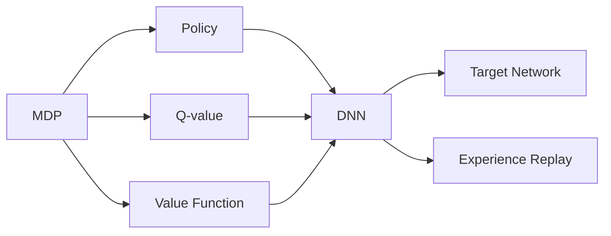

# DDPG的创新与社会责任

## 1. 背景介绍
### 1.1  问题的由来
随着人工智能技术的飞速发展,强化学习(Reinforcement Learning, RL)作为一种通用的学习和决策范式,在机器人控制、自动驾驶、游戏AI等领域展现出巨大的应用潜力。然而,传统的强化学习算法在连续动作空间上往往难以有效训练,这极大地限制了RL的实际应用。为了突破这一瓶颈,DeepMind团队在2015年提出了深度确定性策略梯度(Deep Deterministic Policy Gradient, DDPG)算法[1],开创性地将深度学习与确定性策略相结合,实现了连续动作空间上的高效策略学习。DDPG的诞生标志着深度强化学习进入了一个崭新的阶段。

### 1.2  研究现状
DDPG算法一经提出便引起了学界和业界的广泛关注。众多研究者开始围绕DDPG展开深入探索,提出了多种改进和扩展算法,如TD3[2]、SAC[3]等,进一步提升了DDPG的性能和稳定性。同时,DDPG在机器人操控[4]、自动驾驶[5]、电力调度优化[6]等实际场景中得到了成功应用,展现出良好的实用价值。然而,DDPG的研究尚未成熟,仍面临着诸多理论和实践挑战,如算法收敛性证明、大规模应用部署等,亟需研究者们的持续探索。

### 1.3  研究意义 
DDPG的研究具有重要的理论意义和实践价值:

- 在理论层面,DDPG开创性地将DL和RL结合,为连续动作空间上的策略学习提供了新思路,丰富和发展了现代AI理论体系。深入研究DDPG有助于加深对深度强化学习机理的理解,推动相关理论的进一步发展。

- 在实践层面,DDPG为众多具有连续动作空间的实际问题(如机器人控制)提供了一种高效的求解范式。研究和完善DDPG,有助于促进相关技术走向成熟,加速其产业化应用进程,为社会发展创造更大价值。

### 1.4  本文结构
本文将全面探讨DDPG算法的创新点与社会责任。第2节介绍DDPG的核心概念;第3节详解DDPG的算法原理;第4节构建DDPG的数学模型并举例说明;第5节通过代码实例演示DDPG的具体实现;第6节讨论DDPG的实际应用;第7节推荐DDPG的学习资源;第8节总结全文并展望未来;第9节列举常见问题解答。

## 2. 核心概念与联系
DDPG涉及以下核心概念:

- 马尔可夫决策过程(Markov Decision Process, MDP):描述智能体与环境交互的数学框架,包含状态、动作、转移概率和奖励函数。 

- 策略(Policy):将状态映射为动作的函数,分为随机性策略和确定性策略。DDPG采用确定性策略。

- Q值(Q-value):在某状态下采取某动作的期望累积奖励。

- 值函数(Value Function):状态的期望累积奖励。

- 深度神经网络(Deep Neural Network, DNN):用于逼近复杂函数(如策略、Q值)的强大工具。

- 目标网络(Target Network):缓解DNN训练不稳定性的技巧,通过缓慢更新的目标网络生成训练标签。

- 经验回放(Experience Replay):打破数据关联性、提高样本利用效率的机制,通过回放缓冲区采样训练数据。

下图展示了DDPG的核心概念及其关联:

DDPG在MDP框架下,利用DNN逼近确定性策略和Q值函数,并引入目标网络和经验回放以提升训练稳定性和样本效率,多个概念环环相扣,构建起完整的算法体系。

## 3. 核心算法原理 & 具体操作步骤
### 3.1  算法原理概述
DDPG的核心思想是利用DNN逼近确定性策略(Actor)和Q值函数(Critic),并交替优化两个网络:
1. Actor网络根据当前状态输出确定性动作
2. Critic网络根据状态-动作对估计Q值
3. 根据环境反馈的奖励和下一状态更新Critic网络  
4. 根据确定性策略梯度定理更新Actor网络
5. 软更新目标网络以缓解训练不稳定性
6. 将转移数据存入经验回放池并采样训练数据
7. 重复步骤1-6直至算法收敛

### 3.2  算法步骤详解
输入:初始策略网络 $\mu(s|\theta^\mu)$,初始Q值网络 $Q(s,a|\theta^Q)$,目标网络 $\mu'$ 和 $Q'$,经验回放池 $R$

输出:最优策略 $\mu^*(s)$

1. 随机初始化 $\theta^\mu$ 和 $\theta^Q$,令 $\theta^{\mu'}\leftarrow\theta^\mu$, $\theta^{Q'}\leftarrow\theta^Q$  

2. 循环:
   
   for episode = 1 to MAX_EPISODES do
      
      初始化环境状态 $s_1$
      
      for t = 1 to T do
         
         根据当前策略输出动作 $a_t=\mu(s_t|\theta^\mu)+\mathcal{N}_t$,其中 $\mathcal{N}_t$ 为探索噪声
         
         执行动作 $a_t$ 得到奖励 $r_t$ 和下一状态 $s_{t+1}$
         
         将转移数据 $(s_t,a_t,r_t,s_{t+1})$ 存入 $R$
         
         从 $R$ 中采样一批转移数据 $(s_i,a_i,r_i,s_{i+1})$
         
         令 $y_i=r_i+\gamma Q'(s_{i+1},\mu'(s_{i+1}|\theta^{\mu'})|\theta^{Q'})$
         
         更新Critic: $\theta^Q\leftarrow\arg\min_{\theta^Q}\frac{1}{N}\sum_i(y_i-Q(s_i,a_i|\theta^Q))^2$
         
         更新Actor: $\theta^\mu\leftarrow\arg\max_{\theta^\mu}\frac{1}{N}\sum_i Q(s_i,\mu(s_i|\theta^\mu)|\theta^Q)$
         
         软更新目标网络: 
         $\theta^{Q'}\leftarrow\tau\theta^Q+(1-\tau)\theta^{Q'}$
         $\theta^{\mu'}\leftarrow\tau\theta^\mu+(1-\tau)\theta^{\mu'}$
         
      end for
      
   end for

### 3.3  算法优缺点
优点:
- 首次实现连续动作空间上的有效策略学习
- 采用DNN逼近策略和值函数,具有强大的表示能力
- 引入目标网络和经验回放,提升训练稳定性和样本效率

缺点: 
- 对超参数敏感,难以调参
- 需要大量的环境交互数据
- 理论收敛性尚未证明

### 3.4  算法应用领域
- 机器人连续控制
- 自动驾驶决策 
- 电力负荷调度优化
- 金融投资组合管理
- 供应链库存优化

## 4. 数学模型和公式 & 详细讲解 & 举例说明
### 4.1  数学模型构建
考虑一个标准的MDP,其状态空间为 $\mathcal{S}$,动作空间为 $\mathcal{A}$,转移概率为 $\mathcal{P}:\mathcal{S}\times\mathcal{A}\times\mathcal{S}\to\mathbb{R}$,奖励函数为 $r:\mathcal{S}\times\mathcal{A}\to\mathbb{R}$,折扣因子为 $\gamma\in[0,1]$。

定义确定性策略 $\mu:\mathcal{S}\to\mathcal{A}$,状态值函数 $V^\mu(s)$ 和动作值函数 $Q^\mu(s,a)$ 如下:

$$
V^\mu(s)=\mathbb{E}[\sum_{t=0}^\infty\gamma^tr(s_t,\mu(s_t))|s_0=s]
$$

$$
Q^\mu(s,a)=\mathbb{E}[\sum_{t=0}^\infty\gamma^tr(s_t,a_t)|s_0=s,a_0=a]
$$

其中 $s_t\sim\mathcal{P}(\cdot|s_{t-1},a_{t-1})$。最优策略 $\mu^*$ 定义为:

$$
\mu^*=\arg\max_\mu V^\mu(s),\forall s\in\mathcal{S}
$$

相应的最优值函数满足Bellman最优方程:

$$
V^*(s)=\max_a\mathbb{E}[r(s,a)+\gamma V^*(s')]
$$

$$
Q^*(s,a)=\mathbb{E}[r(s,a)+\gamma\max_{a'}Q^*(s',a')]
$$

### 4.2  公式推导过程
DDPG的Actor目标是最大化 $J(\mu)=\mathbb{E}[V^\mu(s)]$,根据策略梯度定理[7]:

$$
\nabla_\theta J(\mu)=\mathbb{E}[\nabla_\theta\mu(s|\theta)\nabla_aQ^\mu(s,a)|_{a=\mu(s|\theta)}]
$$

其中 $Q^\mu$ 由Critic网络提供。因此Actor的更新为:

$$
\theta^\mu\leftarrow\theta^\mu+\alpha\nabla_\theta J(\mu)
$$

Critic网络的更新遵循最小化TD误差:

$$
L(\theta^Q)=\mathbb{E}[(r+\gamma Q'(s',\mu'(s'|\theta^{\mu'})|\theta^{Q'})-Q(s,a|\theta^Q))^2]
$$

$$
\theta^Q\leftarrow\theta^Q-\beta\nabla_{\theta^Q}L(\theta^Q)
$$

最后,目标网络的软更新为:

$$
\theta^{Q'}\leftarrow\tau\theta^Q+(1-\tau)\theta^{Q'}
$$

$$
\theta^{\mu'}\leftarrow\tau\theta^\mu+(1-\tau)\theta^{\mu'}
$$

其中 $\tau\ll 1$ 为软更新率。

### 4.3  案例分析与讲解
考虑倒立摆(Inverted Pendulum)问题,智能体的目标是通过水平推车的运动使摆竿保持竖直平衡。状态 $s=(x,\dot{x},\theta,\dot{\theta})$ 包含位置、速度、角度和角速度,动作 $a\in[-2,2]$ 表示推车施加的水平力,奖励函数为:

$$
r(s,a)=-(10\theta^2+0.1\dot{\theta}^2+x^2+0.1\dot{x}^2+0.001a^2)
$$

即偏离竖直平衡和使用过大控制力都会受到惩罚。

我们利用DDPG求解该问题,Actor和Critic均使用2层全连接网络,隐藏层设为64个节点。其他超参数设置为:

- 折扣因子 $\gamma=0.99$
- Actor学习率 $\alpha=10^{-4}$
- Critic学习率 $\beta=10^{-3}$
- 软更新率 $\tau=0.001$
- 经验回放池大小 $N=10^6$
- 批量大小 $B=64$

训练1000个episode后,DDPG成功学习到了一个稳定的平衡策略,摆竿能长时间保持竖直状态。这展示了DDPG在连续控制任务上的有效性。

### 4.4  常见问题解答
Q: DDPG中为什么要引入目标网络?

A: 目标网络通过缓慢更新参数来提供稳定的训练目标,避免因网络参数同步变化而导致的训练振荡和不稳定。

Q: DDPG能否处理离散动作空间?

A: 原始DDPG只适用于连续动作空间,离散动作需要特殊处理,如Gumbel-Softmax重参数化技巧[8]。

Q: DDPG的探索噪声有哪些选择?

A: 常见的探索噪声包括高斯噪声、OU噪声等,此外还可使用参数空间噪声[9]进行探索。

Q: DDPG是否能保证收敛?

A: 理