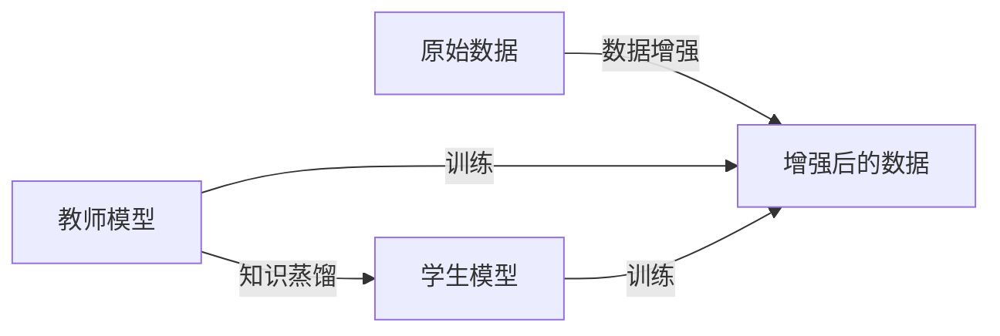

# Data Augmentation Techniques for Knowledge Distillation

关键词：数据增强, 知识蒸馏, 深度学习, 迁移学习, 模型压缩

## 1. 背景介绍
### 1.1 问题的由来
随着深度学习模型的不断发展，模型的规模和复杂度也在不断增加。这导致模型的训练和部署变得越来越困难，尤其是在资源有限的设备上，如移动端和嵌入式设备。为了解决这个问题，知识蒸馏(Knowledge Distillation)技术应运而生。它的目标是将一个大型复杂模型(Teacher Model)的知识转移到一个小型简单模型(Student Model)中，从而在保持模型性能的同时，降低模型的复杂度和计算开销。

### 1.2 研究现状
目前，知识蒸馏已经成为模型压缩领域的一个重要研究方向。许多研究者提出了各种知识蒸馏方法，如基于响应(Response-based)的蒸馏、基于特征(Feature-based)的蒸馏、基于关系(Relation-based)的蒸馏等。这些方法在图像分类、目标检测、语义分割等任务上都取得了不错的效果。然而，现有的知识蒸馏方法大多只关注如何从教师模型中提取知识，而忽略了学生模型自身的学习能力。

### 1.3 研究意义
本文提出了一种新的知识蒸馏方法，即基于数据增强的知识蒸馏(Data Augmentation for Knowledge Distillation, DAKD)。该方法通过数据增强来增强学生模型的学习能力，从而提高知识蒸馏的效果。具体来说，我们在训练过程中，对教师模型和学生模型使用不同的数据增强方式，使得学生模型能够学习到更加丰富和多样的知识。同时，我们还引入了一种新的损失函数，即一致性损失(Consistency Loss)，来促进教师模型和学生模型在不同增强后的数据上达成一致。

### 1.4 本文结构
本文的结构如下：第2节介绍了知识蒸馏和数据增强的核心概念以及两者之间的联系；第3节详细描述了DAKD算法的原理和具体步骤；第4节给出了DAKD算法涉及的数学模型和公式，并通过实例进行讲解；第5节展示了DAKD算法的代码实现和运行结果；第6节讨论了DAKD算法的实际应用场景；第7节推荐了一些与知识蒸馏和数据增强相关的工具和资源；第8节总结了全文的内容，并对知识蒸馏技术的发展趋势和面临的挑战进行了展望；第9节列出了一些常见问题及其解答。

## 2. 核心概念与联系
知识蒸馏和数据增强是两个密切相关的概念。知识蒸馏的目标是将复杂模型的知识迁移到简单模型中，而数据增强则是一种常用的提高模型泛化能力的技术。在知识蒸馏过程中引入数据增强，可以从以下几个方面来提高蒸馏效果：

1. 数据增强可以扩大训练数据的规模和多样性，使学生模型能够学习到更加丰富的知识。
2. 不同的数据增强方式可以从不同角度来刻画数据的特征，有助于学生模型全面地理解数据的内在规律。
3. 通过在教师模型和学生模型上使用不同的数据增强方式，可以缓解两个模型之间的过拟合问题，提高蒸馏的泛化能力。

下图展示了知识蒸馏和数据增强的关系：

## 3. 核心算法原理 & 具体操作步骤
### 3.1 算法原理概述
DAKD算法的核心思想是在知识蒸馏过程中引入数据增强，通过增强训练数据的多样性来提高学生模型的学习能力。具体来说，我们在训练过程中，对教师模型和学生模型使用不同的数据增强方式，并引入一致性损失来促进两个模型在不同增强后的数据上达成一致。

### 3.2 算法步骤详解
DAKD算法的具体步骤如下：

1. 对原始数据进行两种不同的数据增强，分别记为$D_1$和$D_2$。
2. 使用增强后的数据$D_1$训练教师模型，得到教师模型$T$。
3. 使用增强后的数据$D_2$训练学生模型，得到学生模型$S$。
4. 计算教师模型$T$在数据$D_2$上的软标签(Soft Label)，记为$Y_T$。
5. 计算学生模型$S$在数据$D_1$上的软标签，记为$Y_S$。
6. 计算教师模型和学生模型在两种增强数据上的一致性损失$L_c$：

$$L_c = \frac{1}{N} \sum_{i=1}^N KL(Y_T^i || Y_S^i)$$

其中，$N$为数据的样本数，$KL$为KL散度。

7. 计算学生模型在增强数据$D_2$上的交叉熵损失$L_s$：

$$L_s = \frac{1}{N} \sum_{i=1}^N CE(Y_S^i, Y^i)$$

其中，$Y$为真实标签，$CE$为交叉熵损失函数。

8. 将一致性损失和交叉熵损失加权求和，得到最终的损失函数$L$：

$$L = L_s + \lambda L_c$$

其中，$\lambda$为平衡因子，用于控制一致性损失的权重。

9. 使用损失函数$L$来优化学生模型$S$，直到收敛。

### 3.3 算法优缺点
DAKD算法的优点如下：

1. 通过数据增强来增强学生模型的学习能力，提高知识蒸馏的效果。
2. 引入一致性损失来促进教师模型和学生模型在不同增强后的数据上达成一致，提高蒸馏的泛化能力。
3. 算法简单易实现，可以与现有的知识蒸馏方法相结合。

DAKD算法的缺点如下：

1. 需要对数据进行两次增强，增加了计算开销。
2. 一致性损失的计算需要同时使用教师模型和学生模型，增加了内存消耗。
3. 算法中引入了一个新的超参数$\lambda$，需要进行调节。

### 3.4 算法应用领域
DAKD算法可以应用于各种需要进行模型压缩的场景，如移动端部署、嵌入式设备等。此外，该算法还可以用于模型蒸馏、域自适应、增量学习等任务。

## 4. 数学模型和公式 & 详细讲解 & 举例说明
### 4.1 数学模型构建
DAKD算法涉及的主要数学模型包括软标签、KL散度和交叉熵损失函数。

软标签是指模型输出的概率分布，反映了模型对不同类别的置信度。假设模型的输出为$z=(z_1,z_2,...,z_K)$，其中$K$为类别数，则软标签$y=(y_1,y_2,...,y_K)$的计算公式为：

$$y_i=\frac{exp(z_i/T)}{\sum_{j=1}^K exp(z_j/T)}$$

其中，$T$为温度参数，用于控制软标签的平滑程度。$T$越大，软标签越平滑；$T$越小，软标签越尖锐。

KL散度是一种衡量两个概率分布差异的指标，常用于知识蒸馏中。假设$p$和$q$是两个概率分布，则它们之间的KL散度定义为：

$$KL(p||q)=\sum_{i=1}^K p_i log\frac{p_i}{q_i}$$

交叉熵损失函数是一种常用的分类任务损失函数，用于衡量模型预测结果与真实标签之间的差异。假设$y$为真实标签，$\hat{y}$为模型预测结果，则交叉熵损失定义为：

$$CE(y,\hat{y})=-\sum_{i=1}^K y_i log\hat{y}_i$$

### 4.2 公式推导过程
根据软标签的定义，我们可以得到教师模型在数据$D_2$上的软标签$Y_T$和学生模型在数据$D_1$上的软标签$Y_S$：

$$Y_T^i=\frac{exp(z_T^i/T)}{\sum_{j=1}^K exp(z_T^j/T)}$$

$$Y_S^i=\frac{exp(z_S^i/T)}{\sum_{j=1}^K exp(z_S^j/T)}$$

其中，$z_T^i$和$z_S^i$分别表示教师模型和学生模型在第$i$个样本上的输出。

根据KL散度的定义，我们可以得到教师模型和学生模型在两种增强数据上的一致性损失$L_c$：

$$L_c=\frac{1}{N}\sum_{i=1}^N KL(Y_T^i||Y_S^i)=\frac{1}{N}\sum_{i=1}^N \sum_{j=1}^K Y_T^{ij} log\frac{Y_T^{ij}}{Y_S^{ij}}$$

根据交叉熵损失的定义，我们可以得到学生模型在增强数据$D_2$上的交叉熵损失$L_s$：

$$L_s=\frac{1}{N}\sum_{i=1}^N CE(Y^i,Y_S^i)=-\frac{1}{N}\sum_{i=1}^N \sum_{j=1}^K Y^{ij} logY_S^{ij}$$

最终，我们将一致性损失和交叉熵损失加权求和，得到DAKD算法的损失函数$L$：

$$L=L_s+\lambda L_c$$

### 4.3 案例分析与讲解
下面我们通过一个简单的例子来说明DAKD算法的计算过程。

假设我们有一个二分类任务，原始数据为$D=\{(x_1,y_1),(x_2,y_2),(x_3,y_3)\}$，其中$y_1=0$,$y_2=1$,$y_3=0$。我们对原始数据进行两种不同的增强，得到增强后的数据$D_1$和$D_2$：

$D_1=\{(x_1',y_1),(x_2',y_2),(x_3',y_3)\}$
$D_2=\{(x_1'',y_1),(x_2'',y_2),(x_3'',y_3)\}$

其中，$x_i'$和$x_i''$分别表示对$x_i$进行两种不同增强后的结果。

假设教师模型$T$在数据$D_2$上的输出为：

$z_T^1=[0.2,0.8]$
$z_T^2=[0.9,0.1]$ 
$z_T^3=[0.3,0.7]$

学生模型$S$在数据$D_1$上的输出为：

$z_S^1=[0.1,0.9]$
$z_S^2=[0.8,0.2]$
$z_S^3=[0.4,0.6]$

假设温度参数$T=1$，则教师模型在数据$D_2$上的软标签$Y_T$为：

$Y_T^1=[0.38,0.62]$
$Y_T^2=[0.73,0.27]$
$Y_T^3=[0.48,0.52]$

学生模型在数据$D_1$上的软标签$Y_S$为：

$Y_S^1=[0.27,0.73]$
$Y_S^2=[0.69,0.31]$
$Y_S^3=[0.60,0.40]$

根据一致性损失的计算公式，我们可以得到：

$L_c=\frac{1}{3}(0.38log\frac{0.38}{0.27}+0.62log\frac{0.62}{0.73}+0.73log\frac{0.73}{0.69}+0.27log\frac{0.27}{0.31}+0.48log\frac{0.48}{0.60}+0.52log\frac{0.52}{0.40})=0.08$

根据交叉熵损失的计算公式，我们可以得到：

$L_s=-\frac{1}{3}(log0.27+log0.69+log0.60)=0.51$

假设平衡因子$\lambda=