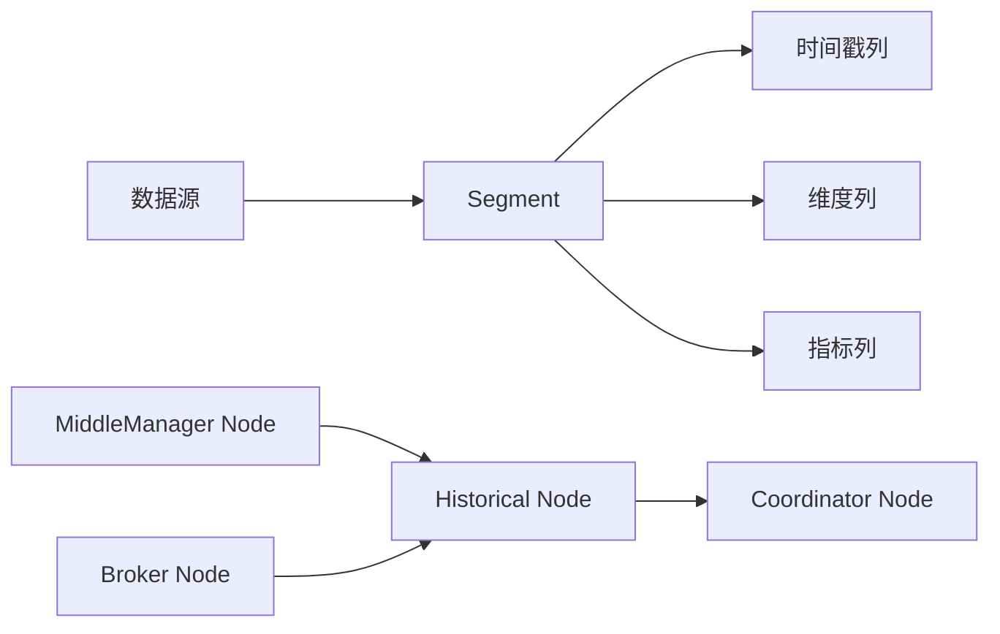

# Druid原理与代码实例讲解

## 1. 背景介绍

### 1.1 问题的由来
在大数据时代，随着数据量的不断增长，传统的数据处理和分析方式已经无法满足实时查询和分析的需求。为了应对这一挑战，Apache Druid应运而生。Druid是一个开源的分布式实时分析数据库，专为大规模实时分析而设计，能够快速查询海量数据并实时返回结果。

### 1.2 研究现状
目前，Druid已经被广泛应用于各个行业，如电商、金融、物联网等领域。许多知名公司如阿里巴巴、腾讯、优酷等都在使用Druid进行实时数据分析。同时，学术界对Druid的研究也在不断深入，涌现出许多优秀的论文和研究成果。

### 1.3 研究意义
深入研究Druid的原理和实现，对于理解和掌握大规模实时分析系统具有重要意义。通过学习Druid的架构设计、数据存储、查询优化等核心技术，可以帮助我们更好地设计和开发高性能的实时分析系统，应对大数据时代的挑战。

### 1.4 本文结构
本文将从以下几个方面对Druid进行深入探讨：

1. 介绍Druid的核心概念和系统架构
2. 详细讲解Druid的核心算法原理和操作步骤
3. 构建Druid的数学模型，推导相关公式，并给出案例分析
4. 通过代码实例，演示Druid的具体实现和应用
5. 探讨Druid的实际应用场景和未来发展趋势
6. 推荐Druid相关的学习资源、开发工具和研究论文
7. 总结Druid的研究成果、面临的挑战和未来展望

## 2. 核心概念与联系

在深入探讨Druid原理之前，我们需要了解一些核心概念：

- **数据源（DataSource）**：数据源是Druid中的顶级概念，类似于关系数据库中的表。每个数据源包含多个Segment。
- **段（Segment）**：Segment是Druid存储数据的基本单元，每个Segment对应一个时间段的数据。Segment 以列式存储的格式保存数据，可以高效地进行查询和聚合。
- **时间戳列（Timestamp Column）**：每个Segment都包含一个时间戳列，用于标识数据的时间。Druid使用时间戳列对数据进行分区和排序。
- **维度列（Dimension Column）**：维度列包含用于过滤和分组的属性，如类别、标签等。Druid对维度列进行索引，以加速过滤和分组操作。
- **指标列（Metric Column）**：指标列包含可聚合的数值，如计数、求和等。Druid对指标列进行预聚合，以加速查询。
- **Historical Node**：Historical Node是Druid的核心组件之一，负责存储和查询不可变的历史数据。
- **MiddleManager Node**：MiddleManager Node负责接收实时数据摄取任务，并将数据转发给Historical Node进行存储。
- **Coordinator Node**：Coordinator Node负责管理数据源的元数据信息，以及Segment的分配和均衡。
- **Broker Node**：Broker Node作为查询的接入层，接收客户端的查询请求，并将查询分发给Historical Node进行处理。

下图展示了Druid的核心组件及其之间的关系：

## 3. 核心算法原理 & 具体操作步骤

### 3.1 算法原理概述
Druid的核心算法包括数据摄取、数据存储、查询处理等几个方面。在数据摄取阶段，Druid使用实时和批量两种方式将数据导入系统。实时摄取通过MiddleManager Node接收数据并转发给Historical Node；批量摄取通过Hadoop等批处理系统将数据导入Druid。

在数据存储方面，Druid采用列式存储和预聚合的方式，将数据按照时间戳和维度进行分区和排序，并对指标列进行预计算，以加速查询。Druid使用基于LSM树的存储引擎，支持快速的数据写入和更新。

查询处理是Druid的核心功能，Broker Node接收查询请求后，将查询分解成多个子任务，分发给Historical Node进行处理。Historical Node利用预聚合的结果和索引快速完成聚合和过滤操作，并将结果返回给Broker Node。Broker Node对多个Historical Node的结果进行合并，最终返回给客户端。

### 3.2 算法步骤详解

1. 数据摄取
   - 实时摄取：通过HTTP POST或Kafka等消息队列将数据发送给MiddleManager Node，MiddleManager Node对数据进行校验和转换，然后将数据写入Historical Node。
   - 批量摄取：将数据文件上传至HDFS等分布式文件系统，通过Hadoop MapReduce、Spark等批处理框架将数据导入Historical Node。

2. 数据存储
   - 将数据按照时间戳和维度进行分区，每个分区对应一个Segment。
   - 对每个Segment内的数据按照时间戳进行排序，并构建索引。
   - 对指标列进行预聚合，计算不同粒度的聚合结果，如Sum、Min、Max等。
   - 使用基于LSM树的存储引擎，支持快速写入和更新。

3. 查询处理
   - Broker Node接收查询请求，解析查询语句，生成查询计划。
   - 根据查询涉及的时间范围和过滤条件，选择相关的Segment。
   - 将查询分解成多个子任务，分发给对应的Historical Node。
   - Historical Node利用预聚合结果和索引快速完成聚合和过滤操作。
   - Broker Node对Historical Node的结果进行合并，生成最终结果并返回给客户端。

### 3.3 算法优缺点

Druid的核心算法具有以下优点：
- 高性能：通过列式存储、预聚合和索引等技术，Druid能够快速完成复杂的实时查询和分析。
- 可扩展：Druid采用分布式架构设计，可以通过添加节点的方式线性扩展系统容量。
- 低延迟：Druid能够在数据摄取后秒级返回查询结果，满足实时分析的需求。
- 灵活性：Druid支持多种数据摄取方式和查询语言，可以灵活应对不同的业务场景。

同时，Druid也存在一些局限性：
- 有限的数据更新：Druid对于数据更新的支持有限，不适合频繁更新的场景。
- 批量摄取延迟：对于批量摄取的数据，需要等待数据完全导入后才能查询，存在一定的延迟。

### 3.4 算法应用领域
Druid的核心算法广泛应用于以下领域：
- 广告分析：实时统计广告的点击率、转化率等指标，优化广告投放策略。
- 用户行为分析：跟踪和分析用户的行为数据，如页面访问、购买记录等，进行用户画像和个性化推荐。
- 物联网数据分析：实时处理和分析海量的传感器数据，监控设备状态，预测故障。
- 运营指标监控：实时监控系统的各项关键指标，如QPS、延迟、错误率等，及时发现和解决问题。

## 4. 数学模型和公式 & 详细讲解 & 举例说明

### 4.1 数学模型构建
为了更好地理解Druid的原理，我们可以构建一个简化的数学模型。假设我们有一个数据源，包含$n$个Segment，每个Segment包含$m$行数据。我们定义以下符号：

- $S_i$：第$i$个Segment，$i=1,2,...,n$
- $R_j$：第$j$行数据，$j=1,2,...,m$
- $T_j$：第$j$行数据的时间戳
- $D_j$：第$j$行数据的维度向量
- $M_j$：第$j$行数据的指标向量

每个Segment $S_i$可以表示为一个三元组：

$$S_i = (T_i, D_i, M_i)$$

其中，$T_i$、$D_i$和$M_i$分别表示Segment $S_i$的时间戳列、维度列和指标列。

### 4.2 公式推导过程
对于一个查询$Q$，我们可以将其表示为一个四元组：

$$Q = (T_q, D_q, M_q, A_q)$$

其中，$T_q$表示查询的时间范围，$D_q$表示查询的过滤条件，$M_q$表示查询的指标，$A_q$表示查询的聚合函数。

给定查询$Q$，Druid的查询处理过程可以表示为以下步骤：

1. 选择相关的Segment：
$$S_q = \{S_i | T_i \cap T_q \neq \emptyset\}$$

2. 对每个Segment $S_i \in S_q$，执行过滤和聚合操作：
$$R_i = \{R_j | R_j \in S_i, D_j \cap D_q \neq \emptyset\}$$
$$A_i = A_q(M_j | R_j \in R_i)$$

3. 合并所有Segment的结果：
$$A = \sum_{i=1}^{|S_q|} A_i$$

最终，查询结果$A$即为所有相关Segment的聚合结果之和。

### 4.3 案例分析与讲解
下面我们通过一个具体的例子来说明Druid的查询处理过程。假设我们有一个电商数据源，包含以下数据：

| 时间戳 | 用户ID | 商品类别 | 销售额 |
|-------|--------|--------|--------|
| 2023-01-01 10:00:00 | 1001 | 电子产品 | 1000 |
| 2023-01-01 11:00:00 | 1002 | 服装 | 500 |
| 2023-01-01 12:00:00 | 1003 | 电子产品 | 800 |
| 2023-01-02 10:00:00 | 1004 | 家具 | 1200 |
| 2023-01-02 11:00:00 | 1005 | 服装 | 600 |

现在，我们要查询2023年1月1日电子产品的总销售额。查询可以表示为：

$$Q = (T_q, D_q, M_q, A_q)$$
$$T_q = [2023-01-01, 2023-01-01]$$
$$D_q = \{商品类别=电子产品\}$$
$$M_q = \{销售额\}$$
$$A_q = SUM$$

假设数据源包含两个Segment：$S_1$包含1月1日的数据，$S_2$包含1月2日的数据。

1. 选择相关的Segment：$S_q = \{S_1\}$

2. 对$S_1$执行过滤和聚合操作：
$$R_1 = \{R_1, R_3\}$$
$$A_1 = SUM(\{1000, 800\}) = 1800$$

3. 合并结果：$A = A_1 = 1800$

因此，2023年1月1日电子产品的总销售额为1800。

### 4.4 常见问题解答
1. Druid如何处理数据更新？
   Druid对数据更新的支持有限，主要通过追加新的Segment来实现。对于已经存在的Segment，可以通过重建索引的方式来更新数据，但代价较高。

2. Druid的数据摄取速度如何？
   Druid的实时数据摄取速度非常快，可以达到每秒数十万条记录。对于批量摄取，速度取决于Hadoop等外部系统的处理能力。

3. Druid的查询性能如何？
   Druid通过列式存储、预聚合和索引等技术，可以在百亿级数据规模下实现亚秒级的查询响应时间。但是，查询性能也受到数据量、查询复杂度等因素的影响。

## 5. 项目实践：代码实例和详细解释说明

### 5.1 开发环境搭建
要开始Druid的开发，我们需要准备以下环境：

- Java 8或更高版本
- Apache Maven
- Druid发行包

首先，从Druid官网下载最新的发行包，解压到本地