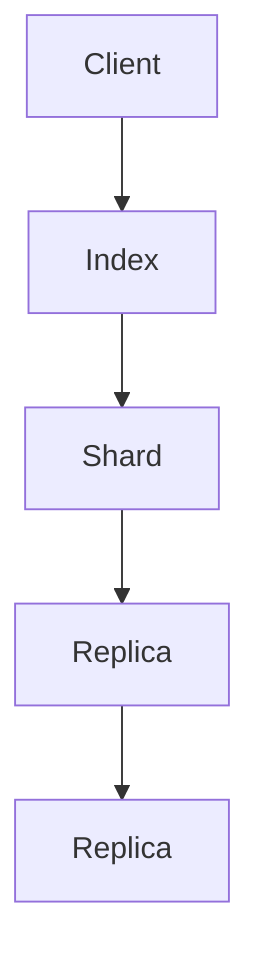

# ElasticSearch Mapping原理与代码实例讲解

作者：禅与计算机程序设计艺术 / Zen and the Art of Computer Programming

## 1. 背景介绍

### 1.1 问题的由来

随着大数据时代的到来，数据量呈爆炸式增长。如何高效地存储、检索和分析海量数据成为了一个重要的课题。ElasticSearch作为一个开源的分布式搜索引擎，凭借其强大的功能和易用的特性，在各个领域得到了广泛的应用。ElasticSearch的核心之一就是Mapping，它定义了索引的结构，包括字段类型、索引设置等。正确理解和使用Mapping对于构建高效、可扩展的ElasticSearch应用至关重要。

### 1.2 研究现状

目前，ElasticSearch已经发展成为一个功能完善、性能优越的搜索引擎。在Mapping方面，ElasticSearch提供了丰富的字段类型和索引设置选项，以满足不同场景的需求。同时，社区中也有大量的最佳实践和案例可供参考。

### 1.3 研究意义

正确理解ElasticSearch Mapping原理，有助于我们更好地设计索引结构，提高数据检索效率，确保数据的一致性和完整性。本文将从Mapping的核心概念、原理、配置方式以及代码实例等方面进行详细讲解，帮助读者深入理解ElasticSearch Mapping。

### 1.4 本文结构

本文将分为以下几个部分：

- 核心概念与联系
- 核心算法原理与具体操作步骤
- 数学模型和公式
- 项目实践：代码实例和详细解释说明
- 实际应用场景
- 工具和资源推荐
- 总结：未来发展趋势与挑战
- 附录：常见问题与解答

## 2. 核心概念与联系

### 2.1 索引（Index）

索引是ElasticSearch中的核心概念，它是存储文档的地方。每个索引都有自己的Mapping和Settings，用于定义文档的结构和配置。

### 2.2 文档（Document）

文档是ElasticSearch中存储的数据的基本单元。每个文档都是JSON格式的数据结构，可以包含多个字段。

### 2.3 字段（Field）

字段是文档中包含的数据的基本组成部分。字段可以是字符串、数值、布尔值、日期等多种类型。

### 2.4 字段类型（Field Type）

字段类型定义了字段的存储方式和搜索行为。ElasticSearch提供了多种字段类型，如字符串、数值、日期、布尔值等。

### 2.5 索引设置（Settings）

索引设置定义了索引的配置，如分片数、副本数、刷新策略等。

## 3. 核心算法原理与具体操作步骤

### 3.1 算法原理概述

ElasticSearch的Mapping主要涉及到以下算法原理：

- 字段类型定义：确定字段的存储方式和搜索行为。
- 字段映射：将字段类型映射到ElasticSearch的字段类型。
- 索引结构：根据字段的类型和索引设置构建索引结构。

### 3.2 算法步骤详解

1. 确定字段类型：根据数据的类型和需求选择合适的字段类型。
2. 字段映射：将字段类型映射到ElasticSearch的字段类型。
3. 构建索引结构：根据字段的类型和索引设置构建索引结构。
4. 保存Mapping：将Mapping保存到索引中。

### 3.3 算法优缺点

**优点**：

- 提高数据检索效率。
- 确保数据的一致性和完整性。
- 支持多种字段类型和索引设置。

**缺点**：

- 某些复杂场景下，Mapping配置较为繁琐。
- 过于复杂的Mapping可能导致索引效率降低。

### 3.4 算法应用领域

ElasticSearch的Mapping在以下领域得到广泛应用：

- 数据检索：快速搜索和过滤大量数据。
- 数据分析：对数据进行汇总、统计和分析。
- 实时搜索：实现实时搜索功能。

## 4. 数学模型和公式

ElasticSearch的Mapping主要涉及到以下数学模型和公式：

### 4.1 字段类型映射

字段类型映射是一个将用户定义的字段类型映射到ElasticSearch内置字段类型的映射表。以下是一个简单的映射表：

| 用户定义字段类型 | ElasticSearch字段类型 |
| :-------------- | :----------------- |
| 字符串          | text               |
| 数值            | integer、float、double等 |
| 布尔值          | boolean            |
| 日期            | date               |

### 4.2 索引结构

索引结构主要包括分片（Shard）和副本（Replica）。以下是一个简单的索引结构模型：



其中，Client代表客户端，Index代表索引，Shard代表分片，Replica代表副本。

### 4.3 常见公式

- 分片数：`number_of_shards = index.number_of_shards`
- 副本数：`number_of_replicas = index.number_of_replicas`
- 容量：`index.size = number_of_shards * number_of_replicas * shard_size`

## 5. 项目实践：代码实例和详细解释说明

### 5.1 开发环境搭建

1. 下载ElasticSearch：[https://www.elastic.co/cn/downloads/elasticsearch](https://www.elastic.co/cn/downloads/elasticsearch)
2. 解压下载的安装包。
3. 启动ElasticSearch服务。

### 5.2 源代码详细实现

以下是一个ElasticSearch Mapping的简单示例：

```json
PUT /my_index
{
  "mappings": {
    "properties": {
      "name": {
        "type": "text"
      },
      "age": {
        "type": "integer"
      },
      "email": {
        "type": "keyword"
      }
    }
  }
}
```

### 5.3 代码解读与分析

- PUT /my_index：创建一个名为`my_index`的索引。
- "mappings": {...}：定义索引的Mapping结构。
- "properties": {...}：定义索引的字段和字段类型。

### 5.4 运行结果展示

在ElasticSearch的Kibana界面中，可以看到以下信息：

- 索引名称：my_index
- 字段：name、age、email
- 字段类型：text、integer、keyword

## 6. 实际应用场景

ElasticSearch的Mapping在以下实际应用场景中得到广泛应用：

- 商品搜索引擎：根据用户查询快速检索商品信息。
- 内容管理系统：管理、搜索和展示大量文档。
- 实时监控平台：对实时数据进行索引和分析。
- 客户关系管理系统：索引和分析客户信息。

## 7. 工具和资源推荐

### 7.1 学习资源推荐

- ElasticSearch官方文档：[https://www.elastic.co/guide/en/elasticsearch/guide/current/index.html](https://www.elastic.co/guide/en/elasticsearch/guide/current/index.html)
- 《Elasticsearch权威指南》：[https://www.elastic.co/guide/cn/elasticsearch/guide/current/getting-started.html](https://www.elastic.co/guide/cn/elasticsearch/guide/current/getting-started.html)

### 7.2 开发工具推荐

- Kibana：[https://www.elastic.co/cn/kibana](https://www.elastic.co/cn/kibana)
- Logstash：[https://www.elastic.co/cn/logstash](https://www.elastic.co/cn/logstash)

### 7.3 相关论文推荐

- "Elasticsearch: The Definitive Guide" by Michael Noll
- "Elasticsearch: The Definitive Guide" by Carlos Santana

### 7.4 其他资源推荐

- ElasticSearch社区论坛：[https://discuss.elastic.co/c/elasticsearch](https://discuss.elastic.co/c/elasticsearch)
- ElasticSearch中文社区：[https://www.elasticsearch.cn/](https://www.elasticsearch.cn/)

## 8. 总结：未来发展趋势与挑战

ElasticSearch的Mapping作为其核心功能之一，在未来将继续得到发展和完善。以下是ElasticSearch Mapping的未来发展趋势与挑战：

### 8.1 未来发展趋势

- 个性化Mapping：根据不同场景和需求，动态调整Mapping配置。
- 智能化Mapping：利用机器学习技术自动生成和优化Mapping配置。
- 多语言支持：支持更多编程语言和框架的Mapping配置。

### 8.2 面临的挑战

- 复杂场景下的Mapping配置：如何简化复杂场景下的Mapping配置，提高易用性。
- 性能优化：如何优化Mapping配置，提高索引和搜索效率。
- 安全性：如何确保Mapping配置的安全性，防止恶意攻击。

## 9. 附录：常见问题与解答

### 9.1 什么是Mapping？

Mapping是ElasticSearch中定义索引结构和配置的机制。它包括字段类型、索引设置等，用于定义索引的结构和索引行为。

### 9.2 如何为字段指定类型？

在Mapping中，通过指定字段的`type`属性来为字段指定类型。

### 9.3 如何为索引设置分片和副本？

在索引创建时，可以通过设置`number_of_shards`和`number_of_replicas`属性来为索引设置分片和副本。

### 9.4 如何优化Mapping配置？

优化Mapping配置可以从以下几个方面入手：

- 选择合适的字段类型。
- 合理设置分片和副本数。
- 使用内置字段类型。
- 简化复杂的Mapping配置。

通过本文的讲解，相信读者对ElasticSearch Mapping有了更深入的了解。在实际应用中，合理配置Mapping能够提高ElasticSearch的性能和效率，为数据检索和分析提供有力支持。