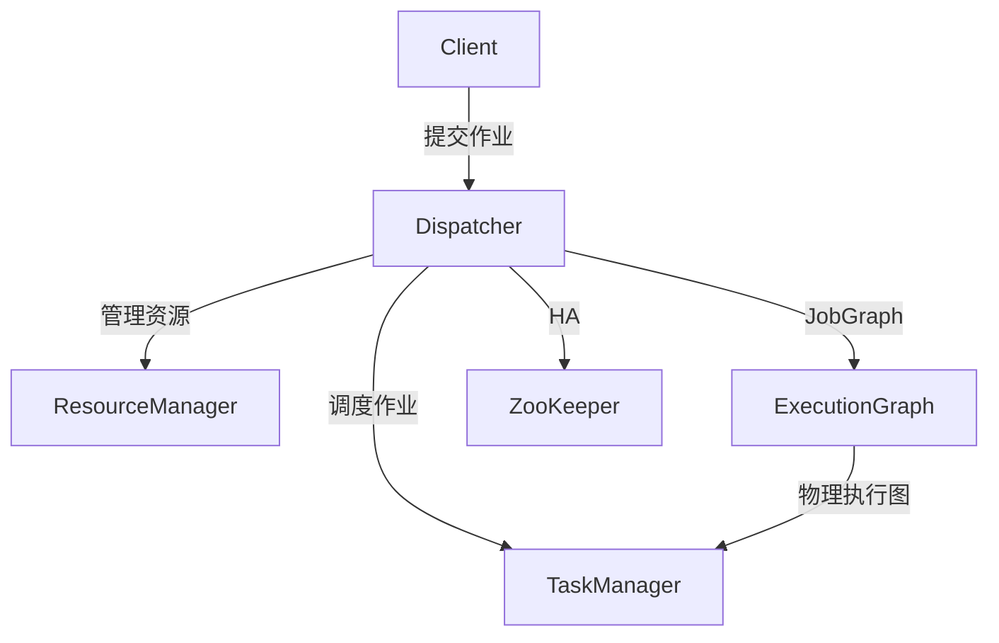
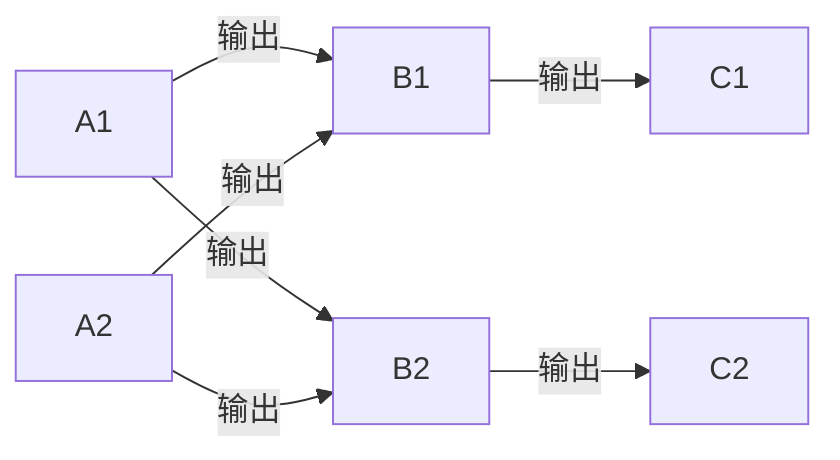
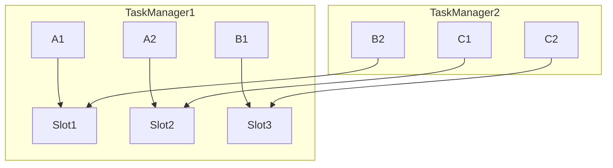

# Flink Dispatcher原理与代码实例讲解

## 1. 背景介绍
### 1.1 问题的由来
随着大数据时代的到来,海量数据的实时处理和分析已成为各行各业的迫切需求。传统的批处理框架如Hadoop MapReduce已经无法满足实时计算的要求。在此背景下,Apache Flink应运而生,成为新一代大数据流式计算引擎的佼佼者。作为Flink的核心组件之一,Dispatcher在Flink的作业调度和资源管理中扮演着至关重要的角色。深入理解Flink Dispatcher的原理和实现,对于开发高效稳定的流式计算应用具有重要意义。

### 1.2 研究现状
目前,国内外学术界和工业界对Flink的研究日益深入。许多研究者从不同角度对Flink的架构、性能优化、容错机制等方面展开了探索。然而,关于Flink Dispatcher的专门研究还相对较少,大多数文章只是对其功能作一个概括性的介绍,缺乏对内部原理和源码实现的深入剖析。因此,有必要对Flink Dispatcher开展系统全面的研究,揭示其内部工作机制,为Flink的应用和优化提供理论指导。

### 1.3 研究意义
Flink Dispatcher作为Flink的核心组件,承担了作业调度、资源管理、HA等重要职责。深入理解Dispatcher的实现原理,一方面有助于我们更好地掌握Flink的整体架构和工作流程,另一方面可以为Flink的性能调优、稳定性改进提供思路。通过剖析Dispatcher的源码,我们可以学习Flink在高并发、高可用等方面的优秀设计,为开发大规模实时计算应用积累经验。同时,对Dispatcher的研究也为Flink社区贡献了有价值的学习材料。

### 1.4 本文结构
本文将从以下几个方面对Flink Dispatcher展开深入讨论：
- 首先介绍Flink Dispatcher的基本概念和在Flink架构中的作用
- 然后重点剖析Dispatcher的工作原理,包括作业调度、资源管理、HA等主要功能的实现机制  
- 接着通过Dispatcher源码的解读,讲解其内部的核心类、接口以及它们之间的交互过程
- 最后总结Dispatcher的特点,分析其优缺点,并对Flink Dispatcher的未来发展趋势和面临的挑战进行展望。

## 2. 核心概念与联系
在正式讨论Flink Dispatcher原理之前,我们先来了解几个相关的核心概念：

- JobManager：Flink集群的管理者,负责作业的调度、资源分配、checkpoint协调等。  
- TaskManager：Flink集群的工作者,负责执行作业的具体计算任务。
- JobGraph：Flink作业的逻辑执行图,包含了所有的算子和数据流。
- ExecutionGraph：JobGraph的物理执行图,加入了并行度、任务链等执行相关信息。

Dispatcher是JobManager的一个组件,它的主要职责包括：

1. 接收客户端提交的作业,将JobGraph转换为ExecutionGraph。  
2. 调度ExecutionGraph到TaskManager上执行,监控和管理作业运行状态。
3. 负责TaskManager的注册与管理,资源的分配与回收。
4. 实现JobManager的HA,在Leader选举中充当候选者角色。

下图展示了Dispatcher在Flink架构中的位置和与其他组件的关系：



## 3. 核心算法原理 & 具体操作步骤 
### 3.1 算法原理概述
Flink Dispatcher的核心算法主要体现在以下几个方面：

1. JobGraph到ExecutionGraph的转换
2. 任务调度与部署
3. 资源管理与分配  
4. HA机制与状态恢复

其中,任务调度是Dispatcher的核心功能,采用了基于Slot的调度机制。Slot是TaskManager上的资源分配单元,每个Slot可以运行一个或多个Task。Dispatcher根据作业的并行度、Slot的可用性等信息,将ExecutionGraph中的Task分配到合适的Slot上执行。同时,Dispatcher还要负责Slot的申请、释放、管理等工作。

### 3.2 算法步骤详解
下面我们对Dispatcher的主要工作流程进行详细的步骤拆解：

1. 作业提交
   - 客户端将JobGraph提交给Dispatcher
   - Dispatcher对JobGraph进行解析和检查
   
2. ExecutionGraph生成
   - Dispatcher根据JobGraph生成ExecutionGraph
   - 确定作业的并行度,生成相应数量的Execution Vertex
   - 建立Execution Vertex之间的数据流关系
   
3. 资源申请
   - Dispatcher向ResourceManager申请Slot资源
   - ResourceManager从TaskManager中选取空闲Slot分配给Dispatcher
   
4. 任务调度与部署
   - Dispatcher根据调度策略选择Execution Vertex与Slot的对应关系
   - 将Execution Vertex部署到指定的TaskManager Slot上运行
   - TaskManager启动Task,开始执行计算
   
5. 作业监控
   - TaskManager定期向Dispatcher汇报Task状态
   - Dispatcher监控作业的执行进度和运行状态
   - 出现失败时,Dispatcher对失败的Task进行重试或恢复
   
6. 资源管理
   - 作业完成后,Dispatcher释放占用的Slot资源
   - Dispatcher监控TaskManager的心跳,发现宕机时触发容错处理
   
7. HA机制
   - Dispatcher定期向ZooKeeper写入心跳,参与Leader选举
   - 当Leader Dispatcher宕机时,备用Dispatcher接管作业管理
   - 从ZooKeeper恢复作业运行状态,继续调度执行

### 3.3 算法优缺点
Flink Dispatcher的调度算法具有以下优点：

- 基于Slot的细粒度资源管理,提高集群资源利用率
- 支持动态扩容,可根据负载情况弹性调整资源
- 基于ExecutionGraph的任务调度,充分考虑了作业的依赖关系
- 利用ZooKeeper实现高可用,保证作业的容错恢复

同时,Dispatcher的调度机制也存在一些局限性：

- Slot资源分配策略相对简单,未充分考虑异构资源、数据本地性等因素  
- Dispatcher单点故障时,作业恢复时间较长
- 对于特大规模作业,Dispatcher可能成为性能瓶颈

### 3.4 算法应用领域
Flink Dispatcher的调度算法广泛应用于各种流式计算场景,包括：

- 实时数据处理与分析
- 实时ETL与数据集成  
- 实时机器学习与预测
- 实时异常检测与告警
- 流式图计算与社交网络分析

## 4. 数学模型和公式 & 详细讲解 & 举例说明
### 4.1 数学模型构建
为了形式化描述Flink Dispatcher的调度问题,我们可以构建如下数学模型：

给定一个有向无环图$G=(V,E)$,其中$V$表示算子集合,$E$表示算子之间的数据依赖关系。每个算子$v_i$都有一个并行度$p_i$,表示需要分配的任务数。集群中有$m$个TaskManager,每个TaskManager拥有$n_k$个Slot。调度问题可以定义为：将$V$中的所有任务分配到$m \times n_k$个Slot上,并满足以下约束条件：

1. 每个任务都必须分配到一个Slot上
2. 同一个算子的任务必须分配到不同的Slot上
3. 存在数据依赖的两个任务必须分配到同一个TaskManager或相邻的TaskManager上
4. 每个TaskManager的Slot数不能超过$n_k$

调度的目标是最小化作业的完成时间,即$\min T_{completion}$。

### 4.2 公式推导过程
令$x_{ijk}$表示算子$v_i$的第$j$个任务是否分配到第$k$个TaskManager的Slot上,取值为0或1。令$start_{ij}$和$end_{ij}$分别表示任务$v_{ij}$的开始时间和结束时间。则调度问题可以表示为以下整数规划模型：

$$
\min T_{completion}
$$

subject to:

$$
\sum_{k=1}^m \sum_{l=1}^{n_k} x_{ijkl} = 1, \forall i,j
$$

$$
\sum_{j=1}^{p_i} x_{ijkl} \leq 1, \forall i,k,l
$$

$$
start_{ij} \geq end_{uv}, \forall (u,v) \in E, (i,j) \in V
$$

$$
\sum_{i=1}^{|V|} \sum_{j=1}^{p_i} x_{ijkl} \leq 1, \forall k,l
$$

$$
x_{ijkl} \in \{0,1\}, \forall i,j,k,l
$$

其中,第一个约束确保每个任务都被分配到一个Slot上,第二个约束确保同一算子的任务分配到不同Slot上,第三个约束确保存在数据依赖的任务满足开始时间的先后关系,第四个约束确保每个Slot只能分配一个任务。

### 4.3 案例分析与讲解
下面我们通过一个简单的例子来说明Flink Dispatcher的调度过程。假设我们有一个包含3个算子的作业,每个算子的并行度都为2。集群中有2个TaskManager,每个TaskManager有3个Slot。作业的DAG如下图所示：



Dispatcher的调度步骤如下：

1. 将算子A的两个任务A1和A2分别分配到TaskManager1的Slot1和Slot2上。
2. 由于B1和B2都依赖于A1和A2的输出,因此将B1和B2分别分配到TaskManager1的Slot3和TaskManager2的Slot1上。  
3. 将C1和C2分别分配到TaskManager2的Slot2和Slot3上。

最终的调度结果如下图所示：



可以看出,Dispatcher充分考虑了任务之间的数据依赖关系,将相关的任务尽可能调度到同一个TaskManager上,减少了数据传输的开销。同时,Dispatcher也均衡地将任务分配到不同的TaskManager和Slot上,提高了资源利用率。

### 4.4 常见问题解答
1. Q: Flink Dispatcher的调度策略是否支持数据本地性？
   A: 目前Dispatcher的调度策略主要考虑任务之间的数据依赖关系,尚未充分考虑数据本地性。但是Flink社区正在开发数据本地性感知的调度器,未来有望支持更智能的调度策略。

2. Q: Dispatcher能否实现跨集群的任务调度？
   A: 目前Dispatcher只能在单个Flink集群内部进行任务调度。如果要实现跨集群调度,需要借助Flink的多集群部署模式,通过Remote Dispatcher实现。

3. Q: Dispatcher是否支持任务的动态扩容和缩容？
   A: Dispatcher支持通过修改并行度动态扩容和缩容任务。当并行度增加时,Dispatcher会申请新的Slot并启动额外的任务;当并行度减小时,Dispatcher会停止多余的任务并释放Slot。

## 5. 项目实践：代码实例和详细解释说明
### 5.1 开发环境搭建
要深入研究Flink Dispatcher的源码,首先需要搭建Flink的开发环境。以下是详细步骤：

1. 安装JDK 8和Maven
2. 从Github克隆Flink源码仓库
   ```shell
   git clone https://github.com/apache/flink.git
   ```
3. 切换到Flink稳定版本分支,如release-1.12
   ```shell
   git checkout release-1.12
   ```
4. 编译Flink源码
   ```shell
   mvn clean package -DskipTests
   ```
5. 导入Flink源码到IDE,如IntelliJ IDEA

### 5.2 源代码详细实现
下面我们来分析Flink Dispatcher的核心源码实现。Dispatcher