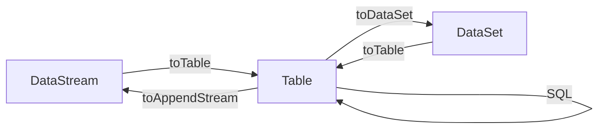

# Flink Table API和SQL原理与代码实例讲解

关键词：Flink、Table API、SQL、流处理、批处理、关系型API

## 1. 背景介绍 
### 1.1 问题的由来
在大数据处理领域,数据的多样性和处理的复杂性不断提高,传统的批处理方式已经无法满足实时性要求较高的应用场景。流处理因其低延迟、实时性强等特点而受到广泛关注。Apache Flink作为新一代大数据流处理引擎,凭借其优异的性能和灵活的API设计,成为流处理领域的佼佼者。然而,直接使用DataStream API进行流处理的门槛较高,需要开发人员具备扎实的编程能力和对Flink框架的深入理解。

### 1.2 研究现状
为了降低流处理应用的开发难度,Flink引入了Table API和SQL,使得用户可以采用声明式的关系型API或SQL来实现流处理逻辑。目前,越来越多的企业和开发者开始使用Flink Table API和SQL进行流处理应用的开发。一些典型的应用场景包括实时数据分析、实时数仓、实时风控等。同时,社区也在不断完善Table API和SQL的功能,例如支持更丰富的内置函数、提高SQL语句的性能等。

### 1.3 研究意义
尽管Flink Table API和SQL为流处理应用开发带来了便利,但实际应用中仍然存在不少问题和挑战。例如:

1. Table API和SQL的原理和内部实现机制并不被大多数用户所熟知,导致在使用过程中遇到问题时无法定位原因。
2. 面对复杂的流处理需求,如何使用Table API和SQL来实现也是一大难题。 
3. Table API和SQL的性能优化也需要进一步探索。

深入研究Flink Table API和SQL的原理、应用实践以及优化手段,对于推动其在流处理领域的应用具有重要意义。

### 1.4 本文结构
本文将重点介绍Flink Table API和SQL的原理、使用方法以及实际案例,内容安排如下:

1. 介绍Flink Table API和SQL的核心概念和特性。 
2. 阐述Table API和SQL的核心实现原理。
3. 结合案例讲解如何使用Table API和SQL进行流处理应用开发。
4. 总结Table API和SQL的优化方法和注意事项。
5. 展望Flink Table API和SQL的发展前景和挑战。

## 2. 核心概念与联系
在Flink中,Table API和SQL通过关系型API的方式来声明计算逻辑,背后的核心概念包括:

- 表(Table):表示一个二维的数据集,可以通过静态数据集或外部数据源来创建。
- 视图(View):从现有的Table派生出的虚拟表,通过类似SQL的方式定义。
- 连续查询(Continuous Query):对动态表的查询,可以将流数据转换为动态表,然后使用关系型操作处理。
- 动态表(Dynamic Table):随时间变化的表,可以通过在流上定义连续查询创建。

Table API和SQL与Flink的DataStream API和DataSet API之间可以相互转换,如下图所示:



## 3. 核心算法原理 & 具体操作步骤
### 3.1 算法原理概述
Flink Table API和SQL的核心是将关系型API或SQL语句转换为可执行的 Flink作业。整个过程主要分为以下几个步骤:

1. 解析SQL语句或Table API调用,生成抽象语法树(AST)。
2. 对AST进行验证和优化,生成关系查询逻辑计划。
3. 将逻辑计划转换为可执行的物理计划。
4. 生成Flink作业图,提交到集群执行。

### 3.2 算法步骤详解
1. SQL解析
   
   Flink使用Apache Calcite框架对SQL语句进行解析。Calcite会将SQL解析为抽象语法树。例如对于语句:
   ```sql
   SELECT user, SUM(amount) 
   FROM Orders
   GROUP BY user
   ```
   解析后的AST如下:
   ```
   LogicalAggregate(group=[{0}], agg#0=[SUM($1)])
     LogicalProject(user=[$0], amount=[$1])
       LogicalTableScan(table=[[Orders]])
   ```

2. 生成逻辑计划
   
   在得到AST后,Flink会对其进行一系列的Rule和优化,最终生成逻辑计划。逻辑计划是一个与物理实现无关的关系表达式树。优化规则包括谓词下推、列剪裁、常量折叠等。

3. 生成物理执行计划
   
   Flink会将逻辑计划转换为可执行的物理计划。对于流式作业,物理计划通常是一个StreamGraph;对于批式作业,物理计划是一个OptimizedPlan。物理计划中包含了具体的算子(如Map、FlatMap等)和数据传输方式(如Shuffle、Broadcast等)。

4. 生成作业图
   
   在得到物理执行计划后,Flink会生成JobGraph提交到集群运行。JobGraph包含了所有可以并发执行的任务(Task)以及任务之间的数据依赖关系。

### 3.3 算法优缺点
优点:
- 声明式API,用户只需关注计算逻辑的定义,无需了解底层实现。
- 查询优化器可以自动优化执行计划,提高性能。
- 支持动态表,可以方便地处理流数据。

缺点:
- 部分复杂的计算逻辑使用SQL难以表达。
- 调试和问题定位相对困难。
- 性能调优的手段相对有限。

### 3.4 算法应用领域
Flink Table API和SQL目前主要应用于以下领域:

- 实时数据分析:通过SQL对流数据进行连续查询和聚合分析。
- 实时数仓:将多源数据实时抽取和集成到数仓系统中。
- 实时风控:通过SQL定义风控规则,实时检测异常行为。

## 4. 数学模型和公式 & 详细讲解 & 举例说明
### 4.1 数学模型构建
Flink Table API和SQL使用关系代数作为数学模型。关系代数定义了一组集合运算符,常见的运算符包括:

- 选择(Selection):从关系中选择满足给定谓词的元组。公式定义为:

$$
\sigma_{condition}(R) = \{t | t \in R \wedge condition(t)\}
$$

- 投影(Projection):从关系中选择指定的属性列。公式定义为:

$$
\pi_{a_1, a_2, ..., a_n}(R) = \{(a_1, a_2, ..., a_n) | (a_1, a_2, ..., a_n) \in R\}
$$

- 并(Union):将两个关系合并成一个关系。公式定义为:

$$
R \cup S = \{t | t \in R \vee t \in S\}
$$

- 差(Difference):从一个关系中去除另一个关系中存在的元组。公式定义为:

$$
R - S = \{t | t \in R \wedge t \notin S\}
$$

- 笛卡尔积(Cartesian Product):两个关系做笛卡尔乘积。公式定义为:

$$
R \times S = \{(r, s) | r \in R \wedge s \in S\}
$$

- 连接(Join):关系的连接运算。公式定义为:

$$
R \bowtie_{join-condition} S = \sigma_{join-condition}(R \times S)
$$

### 4.2 公式推导过程
下面我们以一个具体的SQL语句为例,推导其执行过程中用到的关系代数公式。

SQL语句如下:
```sql
SELECT dept, SUM(salary) AS total_salary 
FROM employee
WHERE state = 'CA'
GROUP BY dept
HAVING SUM(salary) > 10000
```

该SQL语句的执行过程可以表示为以下关系代数公式:

1. 选择(Selection):

$$
\sigma_{state='CA'}(employee)
$$

2. 投影(Projection):

$$
\pi_{dept,salary}(\sigma_{state='CA'}(employee))
$$

3. 分组和聚合(Grouping and Aggregation):

$$
\gamma_{dept,SUM(salary) \to total\_salary}(\pi_{dept,salary}(\sigma_{state='CA'}(employee)))
$$

4. 选择(Selection):

$$
\sigma_{total\_salary > 10000}(\gamma_{dept,SUM(salary) \to total\_salary}(\pi_{dept,salary}(\sigma_{state='CA'}(employee))))
$$

5. 投影(Projection):

$$
\pi_{dept,total\_salary}(\sigma_{total\_salary > 10000}(\gamma_{dept,SUM(salary) \to total\_salary}(\pi_{dept,salary}(\sigma_{state='CA'}(employee)))))
$$

### 4.3 案例分析与讲解
下面我们通过一个实际的案例来说明如何使用Flink Table API和SQL进行流处理。

假设我们有一个实时的订单数据流,schema如下:
```
order_id: BIGINT
user_id: BIGINT
product_id: BIGINT
price: DOUBLE
quantity: INT 
```

我们希望实时统计每个用户的订单总金额,并且只统计金额大于1000的用户。

使用Table API实现如下:

```scala
// 创建表环境
val env = StreamExecutionEnvironment.getExecutionEnvironment
val tableEnv = StreamTableEnvironment.create(env)

// 从Kafka读取数据
val orders = env
  .addSource(new FlinkKafkaConsumer[String](...))
  .map(parseOrder)

// 注册数据源
tableEnv.registerDataStream("Orders", orders, 'order_id, 'user_id, 'product_id, 'price, 'quantity)

// 执行查询
val result = tableEnv
  .scan("Orders")
  .groupBy('user_id)
  .select('user_id, 'price.sum as 'total_price)
  .filter('total_price > 1000)
  
// 输出结果  
result.toRetractStream[(Long, Double)].print()
```

使用SQL实现如下:

```scala
// 注册数据源
tableEnv.registerDataStream("Orders", orders, 'order_id, 'user_id, 'product_id, 'price, 'quantity)

// 执行SQL查询
val sql =
  """
    |SELECT user_id, SUM(price) AS total_price
    |FROM Orders 
    |GROUP BY user_id
    |HAVING SUM(price) > 1000
  """.stripMargin

val result = tableEnv.sqlQuery(sql)

// 输出结果
result.toRetractStream[(Long, Double)].print()
```

可以看到,使用Table API和SQL,我们只需要几行代码就可以实现复杂的流式计算逻辑。

### 4.4 常见问题解答
1. 如何处理流数据中的延迟数据和乱序数据?
   
   可以使用Flink的Watermark机制来处理乱序数据。在Table API和SQL中,可以通过定义Watermark策略来指定数据的时间属性和最大延迟时间。例如:
   ```scala
   // 定义Watermark
   val orders = env
     .addSource(...)
     .assignTimestampsAndWatermarks(
        new BoundedOutOfOrdernessTimestampExtractor[Order](Time.seconds(10)) {
            override def extractTimestamp(order: Order): Long = order.eventTime
        }
     )
     
   // 在表中指定时间属性  
   val table = tableEnv.fromDataStream(orders, 'order_id, 'price, 'eventTime.rowtime)
   ```

2. 如何处理状态数据?
   
   Flink提供了状态化的Table API,可以通过定义状态变量来维护计算过程中的状态数据。例如:
   ```scala
   // 定义状态变量
   val counts = tableEnv
     .scan("Orders")
     .groupBy('productId)
     .select('productId, 'quantity.sum as 'quantity)
     
   // 定义状态更新逻辑  
   val result = counts
     .join(counts.addColumns('total.sum as 'lastTotal))
     .select('productId, 'quantity, 'lastTotal)
   ```

3. 如何控制Table的物理分区?
   
   可以使用Table的partitionBy子句来指定物理分区字段。这样可以让Flink根据分区字段将数据发送到不同的Task实例,提高查询性能。例如:
   ```scala
   val partitionedTable = tableEnv
     .scan("Orders")
     .partitionBy('userId)
   ```

## 5. 项目实践：代码实例和详细解释说明
### 5.1 开发环境搭建
要使用Flink Table API和SQL开发流处理应用,需要搭建以下开发环境:

- Java 8+
- Scala 2.11/2.12
- Flink 1.9+
- IDE工具,如IntelliJ IDEA

可以通过以下Maven依赖引入Flink Table API和SQL所需