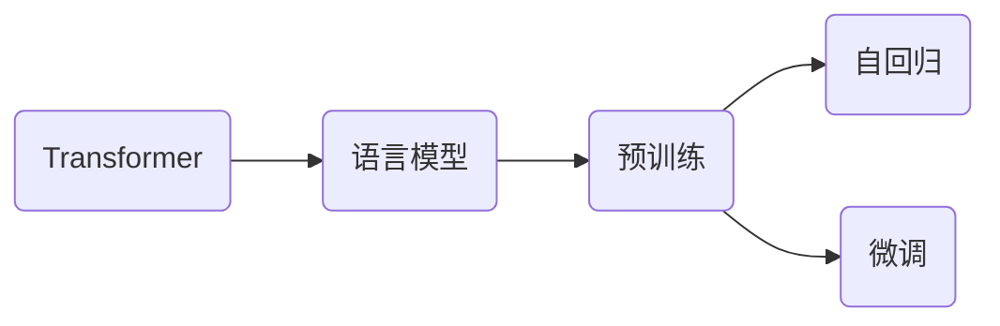

# GPT-2原理与代码实例讲解

## 1. 背景介绍
### 1.1 问题的由来
随着人工智能的快速发展,自然语言处理(NLP)领域也取得了长足的进步。从早期的基于规则的方法到基于统计的机器学习方法,再到如今基于深度学习的方法,NLP技术不断突破,为人机交互、信息检索、机器翻译等应用带来了革命性的变化。而在众多NLP模型中,以Transformer为代表的预训练语言模型更是引领了这一波浪潮。GPT(Generative Pre-Training)系列模型作为其中的杰出代表,展现出了惊人的语言理解和生成能力,备受业界关注。本文将重点介绍GPT-2模型的原理和代码实现,帮助读者深入理解这一强大的NLP模型。

### 1.2 研究现状 
GPT系列模型由OpenAI于2018年提出,其核心思想是在海量无标注文本数据上进行预训练,通过自监督学习的方式学习语言的内在规律和表示,再针对下游任务进行微调,从而实现良好的任务适应能力。GPT-1证明了这一思路的可行性,在多个NLP任务上取得了不错的效果。此后,OpenAI又相继推出了GPT-2和GPT-3,通过增大模型规模、扩充训练数据等方式,不断刷新NLP基准的记录。

GPT-2作为GPT-1的改进版本,在模型结构和训练方式上进行了优化,使用了更大规模的数据和计算资源。它采用了类似语言模型的单向Transformer结构,通过因果注意力机制建模文本的顺序依赖关系。在预训练阶段,GPT-2以自回归的方式学习文本序列的生成概率,即根据前面的词预测下一个词。这使得它能够自如地生成连贯、通顺的长文本。GPT-2一经推出便在学术界掀起轰动,展现出了媲美人类的文本生成能力,在文本摘要、对话生成、问答等任务上取得了瞩目的成绩。

### 1.3 研究意义
GPT-2的研究意义主要体现在以下几个方面:

1. 推动NLP技术的发展。GPT-2开创了预训练语言模型的新范式,证明了在大规模无标注数据上学习通用语言表示的可行性和有效性,为后续的研究指明了方向。它的成功激励着更多的研究者投身于这一领域,不断探索新的模型结构和训练方法。

2. 拓宽NLP的应用场景。得益于其强大的语言理解和生成能力,GPT-2在许多NLP任务上取得了突破性的进展,使得一些此前难以实现的应用成为可能,如自动写作、知识问答、对话系统等。这为NLP技术在更广泛的领域发挥价值提供了机遇。

3. 引发对AI安全和伦理的思考。GPT-2展现出了生成假新闻、虚假评论等风险,引发了人们对AI滥用的担忧。这促使研究者和从业者更加审慎地看待AI技术,重视其潜在的负面影响,并探讨相应的应对措施,以确保AI造福人类。

4. 启发跨领域的研究。GPT-2的成功不仅局限于NLP领域,其思想和方法也为其他领域的研究带来启示,如计算机视觉、语音识别等。跨领域的交流和借鉴有助于推动人工智能的整体发展。

### 1.4 本文结构
本文将从以下几个方面对GPT-2进行详细介绍:

- 第2部分介绍GPT-2涉及的核心概念及其联系。
- 第3部分阐述GPT-2的核心算法原理和具体操作步骤。
- 第4部分给出GPT-2所基于的数学模型和公式,并进行详细讲解和举例说明。
- 第5部分展示GPT-2的代码实例,并对其进行解释说明。
- 第6部分讨论GPT-2的实际应用场景。
- 第7部分推荐GPT-2相关的工具和学习资源。
- 第8部分总结全文,分析GPT-2的未来发展趋势与面临的挑战。
- 第9部分列举GPT-2的常见问题,并给出解答。

## 2. 核心概念与联系
在深入探讨GPT-2之前,我们有必要了解其所涉及的一些核心概念。

**Transformer**:这是一种基于自注意力机制的神经网络结构,最初应用于机器翻译任务。不同于此前的RNN和CNN等结构,Transformer通过自注意力机制直接建模序列内部的依赖关系,避免了RNN的长距离依赖问题和CNN的局部感受野限制。Transformer包含编码器和解码器两部分,分别用于对输入序列进行编码和对输出序列进行解码。GPT-2使用了Transformer的解码器结构。

**语言模型**:语言模型是一种对语言进行建模的方法,旨在学习语言的统计规律和生成模式。给定一个词序列,语言模型能够估计该序列的概率。传统的语言模型多基于n-gram等统计方法,而基于神经网络的语言模型则通过深度学习的方式学习词嵌入和上下文表示,能够更好地刻画语言的语义信息。GPT-2本质上就是一个神经网络语言模型。

**预训练**:预训练是指在大规模无标注数据上进行自监督学习,学习数据的一般性表示。这种表示可以作为下游任务的初始化参数,再通过少量标注数据进行微调,从而实现更好的任务性能。预训练一方面能够利用大量无标注数据,缓解标注数据稀缺的问题;另一方面,学习到的通用表示能够加速下游任务的训练收敛,提升模型的泛化能力。GPT-2采用了基于语言模型的预训练方式。

**自回归**:自回归是一种序列生成的方法,即根据之前的输出预测当前的输出。在语言模型中,自回归就是根据之前的词预测下一个词。这种生成方式能够保证生成序列的连贯性和语法正确性。GPT-2使用自回归的方式进行文本生成。

**微调**:微调是指在预训练的基础上,针对特定任务进行参数调整和模型优化的过程。通过在下游任务的标注数据上进行训练,微调能够使预训练模型适应任务的特点,提升任务性能。相比从头训练,微调通常只需较少的数据和计算资源,能够快速实现任务适配。GPT-2可以通过微调的方式应用于各类NLP任务。

这些概念之间的联系可以用下图表示:

可以看到,Transformer是GPT-2的基础网络结构,语言模型是其训练目标,预训练是其训练方式,自回归是其生成方法,微调是其任务适配手段。这些概念环环相扣,共同构成了GPT-2的核心原理。

## 3. 核心算法原理 & 具体操作步骤
### 3.1 算法原理概述
GPT-2的核心算法可以概括为"预训练+微调"的范式。在预训练阶段,GPT-2以自回归的方式在大规模无标注文本数据上训练语言模型。具体而言,它使用Transformer的解码器结构,通过因果自注意力机制建模文本序列的顺序依赖关系。给定前面的词,模型学习预测下一个词的概率分布。通过最大化文本序列的生成概率,GPT-2学习到了语言的统计规律和生成模式。

在微调阶段,GPT-2在预训练的基础上,针对下游任务的标注数据进行训练。对于不同的任务,GPT-2采用不同的输入输出格式和损失函数。例如,对于文本分类任务,可以在文本序列后附加一个特殊的分类标记,让模型预测该标记的概率分布;对于序列标注任务,可以让模型逐个预测每个词的标签。通过在任务数据上进行训练,GPT-2学习了任务的特定知识和技能。

### 3.2 算法步骤详解
下面我们对GPT-2的算法步骤进行详细说明。

**预训练步骤**:
1. 数据准备:收集大规模无标注的文本数据,并进行清洗和预处理,如去除特殊字符、统一大小写、分词等。
2. 数据编码:将文本数据转换为模型可读的数字序列。通常使用Byte Pair Encoding (BPE)等方法对词进行编码,以平衡词汇表大小和编码效率。
3. 模型构建:搭建GPT-2的模型结构。主要包括输入嵌入层、位置嵌入层、多头自注意力层、前馈神经网络层和输出嵌入层。模型的层数、隐藏层维度、注意力头数等超参数可以根据需要进行设置。
4. 模型训练:使用自回归的方式对模型进行训练。具体而言,将文本序列作为模型的输入和目标,让模型学习根据前面的词预测下一个词。使用交叉熵损失函数衡量预测概率与真实概率的差异,并通过反向传播算法更新模型参数。为了加速训练和提高泛化性,可以使用批次化训练、学习率衰减、梯度裁剪等优化技巧。
5. 模型评估:在验证集上评估模型的性能,如perplexity、生成质量等指标。根据评估结果调整超参数,进行多轮迭代训练,直到模型收敛或达到预期效果。

**微调步骤**:
1. 任务定义:明确下游任务的类型和目标,如文本分类、序列标注、问答等。
2. 数据准备:收集任务相关的标注数据,并进行预处理和编码。
3. 模型调整:根据任务的特点,对GPT-2的输入输出格式进行调整。例如,在输入中添加任务特定的标记,在输出中添加分类或标注标记。
4. 损失函数:根据任务的类型,选择合适的损失函数。对于分类任务,可以使用交叉熵损失;对于生成任务,可以使用自回归损失;对于序列标注任务,可以使用条件随机场损失等。
5. 模型训练:在预训练模型的基础上,使用任务数据对模型进行微调训练。通常使用较小的学习率和较少的训练轮数,以避免过拟合和灾难性遗忘。
6. 模型评估:在任务的验证集上评估模型性能,使用任务相关的评价指标,如准确率、F1值、BLEU等。根据评估结果进行模型选择和超参数调优。

### 3.3 算法优缺点
GPT-2算法的优点主要包括:

1. 强大的语言理解和生成能力。得益于大规模预训练和自回归生成方式,GPT-2能够生成连贯、流畅、富有语义的文本,在多个NLP任务上达到甚至超越人类的水平。
2. 良好的泛化性和迁移能力。通过在无标注数据上学习通用语言表示,GPT-2能够快速适应新的任务和领域,只需少量标注数据进行微调即可达到不错的效果。
3. 灵活的任务适配性。GPT-2可以通过调整输入输出格式和损失函数,适用于各类NLP任务,如分类、生成、标注等。这种灵活性使其成为一个通用的NLP基础模型。

但GPT-2算法也存在一些局限性:

1. 计算和存储开销大。GPT-2是一个大规模的神经网络模型,训练和推理都需要大量的计算资源和存储空间。这对于资源有限的场景构成挑战。
2. 对长文本的建模能力有限。由于Transformer的计算复杂度与序列长度呈平方关系,GPT-2难以处理过长的文本序列。这限制了其在一些长文档任务上的应用。
3. 缺乏对常识和因果关系的理解。GPT-2主要从数据中学习语言的表面模式,对于隐含的常识知识和因果逻辑掌握不足。这可能导