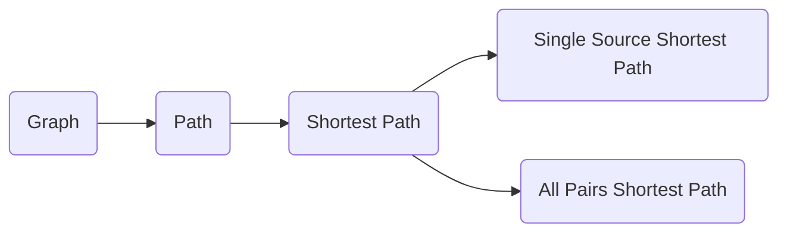
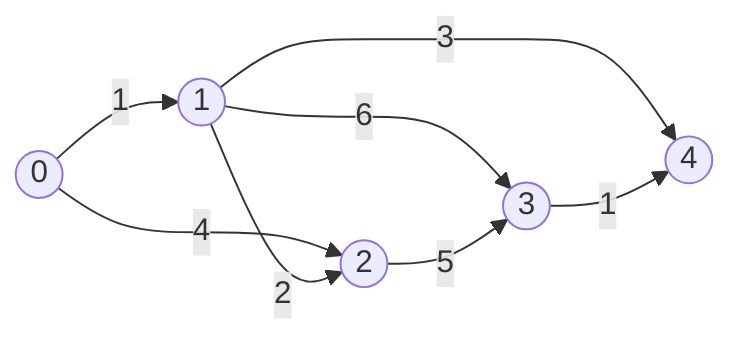
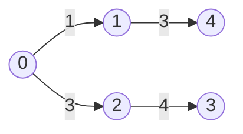

# Graph Path原理与代码实例讲解

关键词：图论、Graph Path、最短路径、Dijkstra算法、Floyd算法、Bellman-Ford算法、A*算法、图搜索算法、Python实现

## 1. 背景介绍

### 1.1 问题的由来

在计算机科学和现实生活中，我们经常会遇到寻找图中两点之间最短路径的问题。例如在导航系统中寻找两地之间的最短路线，在通信网络中寻找两个节点之间的最优传输路径，在游戏中寻找两个位置之间的最短移动路径等。这些问题都可以抽象为图论中的Graph Path问题。

### 1.2 研究现状

目前针对Graph Path问题，学术界和工业界已经提出了多种高效的算法，如Dijkstra算法、Floyd算法、Bellman-Ford算法、A*算法等。这些算法在实际应用中取得了很好的效果，极大地提升了相关领域的计算效率。同时，对于超大规模图上的最短路径计算，还有一些近似算法和并行算法，以平衡计算效率和结果精度。

### 1.3 研究意义

研究Graph Path问题具有重要的理论意义和实践价值：

- 在理论上，Graph Path算法是图论、组合优化、动态规划等多个领域的经典问题，对算法设计思想具有启发意义。
- 在实践中，Graph Path算法在众多领域有着广泛应用，如网络路由、地图导航、物流配送、社交网络等。研究高效的Graph Path算法，可以显著提升这些系统的性能。

### 1.4 本文结构

本文将全面讲解Graph Path问题的相关知识，内容安排如下：

- 第2部分介绍Graph Path的核心概念与各概念之间的联系
- 第3部分讲解几种主要的Graph Path算法原理和具体步骤
- 第4部分从数学角度对算法原理进行建模和推导，并举例说明
- 第5部分给出Python语言的代码实现，并详细解释关键代码
- 第6部分总结Graph Path算法在实际场景中的应用
- 第7部分推荐Graph Path相关的学习资源、开发工具和文献
- 第8部分对全文进行总结，并展望Graph Path问题的发展趋势和挑战
- 第9部分列举Graph Path的常见问题，并给出专业解答

## 2. 核心概念与联系

在讨论Graph Path算法之前，我们先明确一些核心概念：

- 图(Graph)：由顶点(Vertex)和边(Edge)组成的数据结构，可以表示对象之间的关系网络。
- 路径(Path)：图中顶点v1到顶点v2的一个顶点序列。路径的长度是路径上所有边的权重之和。
- 最短路径：图中两个顶点之间所有路径中，长度最小的路径。
- 单源最短路径：固定一个源点，求其到图中所有其他顶点的最短路径。
- 多源最短路径：求图中任意两个顶点之间的最短路径。

这些概念之间的关系如下图所示：



可见，最短路径问题是在图和路径的基础上提出的，而单源最短路径和多源最短路径又是最短路径问题的两个重要分支。

## 3. 核心算法原理 & 具体操作步骤

### 3.1 算法原理概述

解决Graph Path问题的核心算法主要有以下几种：

1. Dijkstra算法：基于贪心思想，适用于没有负权边的图，可以高效地解决单源最短路径问题。
2. Floyd算法：基于动态规划思想，可以解决多源最短路径问题，即求任意两点间的最短路径。 
3. Bellman-Ford算法：可以处理负权边，适用于求单源最短路径，但时间复杂度较高。
4. A*算法：在Dijkstra算法的基础上引入了启发式函数，适用于求解特定终点的最短路径，大幅提升了搜索效率。

这几种算法在原理上有所差异，但大体思路都是维护一个距离数组，记录源点到每个顶点的最短距离，并不断更新这个距离，直到找到最短路径。

### 3.2 算法步骤详解

下面以Dijkstra算法为例，详细讲解其步骤：

1. 初始化距离数组dist，源点s到自身的距离为0，到其他所有点的距离为无穷大。
2. 初始化一个访问数组visited，记录每个顶点是否已经找到最短路径。
3. 重复以下步骤，直到所有顶点都被访问过：
   a. 在未访问的顶点中，选择dist最小的顶点u，标记u为已访问
   b. 遍历u的所有邻居v，如果`dist[u] + edge(u,v) < dist[v]`，则更新`dist[v] = dist[u] + edge(u,v)`
4. 最终dist数组中的值就是源点s到每个顶点的最短距离

可见，Dijkstra算法的核心是贪心地选择距离最近的顶点，不断更新距离数组。

### 3.3 算法优缺点

Dijkstra算法的优点是实现简单，时间复杂度为O(V^2)，V为顶点数。在稀疏图上使用优先队列优化，复杂度可以降到O(ElogV)，E为边数。

但Dijkstra算法也有局限性，主要有两点：
1. 不能处理负权边。若图中包含负权边，Dijkstra算法无法得到正确答案。
2. 只能求单源最短路径。如果要求任意两点间的最短路径，需要多次调用Dijkstra算法。

针对这些局限性，我们需要根据具体问题选择合适的算法。Floyd算法可以求任意两点间最短路径，Bellman-Ford算法可以处理负权边。

### 3.4 算法应用领域

Graph Path算法在众多领域有着广泛应用，下面列举一些典型场景：

- 地图导航：GPS导航系统中的路径规划，需要在道路网络图上求两地间的最短路径。
- 网络路由：在通信网络中，需要为数据包选择传输延迟最小的路由路径。
- 社交网络：在社交网络图上，求两个用户之间的最短关系链。
- 游戏寻路：在游戏场景图中，NPC需要寻找到目标位置的最短移动路径。
- 线路设计：如地铁线路、电路板布线等，需要在图上求最优的连通路径。

## 4. 数学模型和公式 & 详细讲解 & 举例说明

### 4.1 数学模型构建

我们可以使用邻接矩阵或邻接表来表示图，本文以邻接矩阵为例进行说明。设图G=(V,E)有n个顶点，顶点编号为0 ~ n-1。邻接矩阵`matrix`定义为：
$$
matrix[i][j]=
\begin{cases}
  w, & \text{if }(i,j)\in E \text{ and } weight(i,j)=w\\
  \infty, & \text{if }(i,j)\notin E\\
  0, & \text{if } i=j
\end{cases}
$$

设源点为s，Dijkstra算法维护一个距离数组dist，其中`dist[i]`表示从源点s到顶点i的最短距离。初始时：
$$
dist[i]=
\begin{cases}
  0, & \text{if } i = s \\
  \infty, & \text{otherwise}
\end{cases}
$$

### 4.2 公式推导过程

设顶点集合V被划分为两个子集S和U，S中的顶点已经找到最短路径，U中的顶点尚未找到最短路径。初始时S中只有源点s。

每一轮，从U中选择一个dist最小的顶点u加入S，然后对u的所有邻居v进行松弛操作：
$$
dist[v]=min(dist[v], dist[u]+matrix[u][v])
$$

重复这个过程直到U为空，最终dist数组中的值就是源点s到每个顶点的最短距离。

设顶点数为V，Dijkstra算法的时间复杂度为O(V^2)。如果使用优先队列存储U中的顶点，可以将时间复杂度优化到O(ElogV)，其中E为边数。

### 4.3 案例分析与讲解

下面以一个具体例子来说明Dijkstra算法的执行过程。考虑下图所示的有向加权图：



设顶点0为源点，Dijkstra算法执行过程如下：

1. 初始化dist数组为`[0, ∞, ∞, ∞, ∞]`，S集合为`{0}`，U集合为`{1,2,3,4}`
2. 从U中选择dist最小的顶点1加入S，更新dist为`[0, 1, 4, ∞, ∞]`
3. 从U中选择dist最小的顶点2加入S，更新dist为`[0, 1, 3, 8, 4]` 
4. 从U中选择dist最小的顶点4加入S，更新dist为`[0, 1, 3, 7, 4]`
5. 从U中选择dist最小的顶点3加入S，更新dist为`[0, 1, 3, 7, 4]`

最终，源点0到各顶点的最短距离为`[0, 1, 3, 7, 4]`，最短路径树如下图所示：



### 4.4 常见问题解答

Q：Dijkstra算法能否处理负权边？
A：不能。Dijkstra算法的贪心策略是基于权重非负的假设，如果有负权边，则无法保证算法的正确性。此时可以使用Bellman-Ford算法。

Q：Dijkstra算法的时间复杂度与图的存储方式有关吗？
A：有关。如果使用邻接矩阵存储图，时间复杂度为O(V^2)；如果使用邻接表存储图，并配合优先队列，时间复杂度可以优化到O(ElogV)。

## 5. 项目实践：代码实例和详细解释说明

### 5.1 开发环境搭建

本文使用Python 3语言实现Dijkstra算法，需要安装Python 3解释器。推荐使用Jupyter Notebook作为开发工具，以便编写和运行代码。

### 5.2 源代码详细实现

下面是使用邻接矩阵实现Dijkstra算法的Python代码：

```python
def dijkstra(graph, src):
    V = len(graph)
    dist = [float('inf')] * V
    dist[src] = 0
    visited = [False] * V
    
    for _ in range(V):
        u = min_distance(dist, visited)
        visited[u] = True
        
        for v in range(V):
            if not visited[v] and graph[u][v] != 0 and dist[u] + graph[u][v] < dist[v]:
                dist[v] = dist[u] + graph[u][v]
    
    return dist

def min_distance(dist, visited):
    min_dist = float('inf')
    min_index = -1
    for v in range(len(dist)):
        if not visited[v] and dist[v] < min_dist:
            min_dist = dist[v]
            min_index = v
    return min_index
```

### 5.3 代码解读与分析

- 函数`dijkstra`接受邻接矩阵`graph`和源点`src`作为输入，返回源点到各顶点的最短距离数组`dist`
- 初始化`dist`数组为无穷大，`dist[src]`为0，`visited`数组全为False
- 外层循环进行V次，每次选择一个未访问且dist最小的顶点u，将其标记为已访问
- 内层循环遍历u的所有邻居v，尝试通过u来更新v的最短距离
- 函数`min_distance`用于在未访问的顶点中找到dist最小的顶点

算法的时间复杂度为O(V^2)，其中最耗时的部分是在`min_distance`函数中找最小值，需要O(V)的时间。如果使用优先队列存储dist，可以将时间复杂度优化到O(ElogV)。

### 5.4 运行结果展示

以