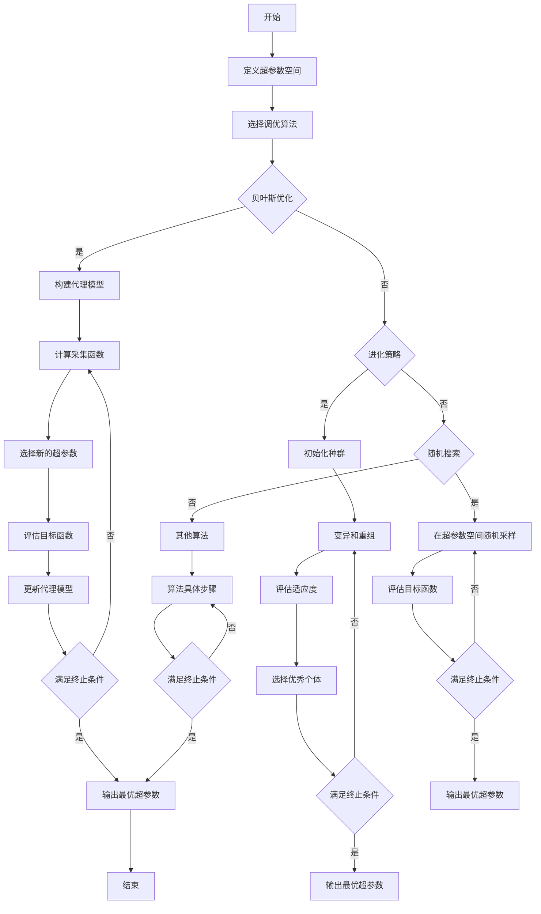

# Hyperparameter Tuning 原理与代码实战案例讲解

## 1. 背景介绍

### 1.1 问题的由来

在机器学习和深度学习领域中,模型的性能在很大程度上取决于超参数(Hyperparameters)的选择。超参数是指在模型训练过程之前需要手动设置的参数,例如学习率、正则化系数、网络层数等。选择合适的超参数对于获得良好的模型性能至关重要。然而,由于超参数空间通常是高维和非凸的,手动搜索最优超参数组合是一项艰巨的任务。

### 1.2 研究现状  

传统上,研究人员和工程师通常依赖经验和反复试验来调整超参数。这种方法不仅效率低下,而且难以找到全局最优解。为了解决这一问题,研究人员提出了各种自动化超参数调优(Hyperparameter Tuning)技术,旨在系统地探索超参数空间并找到最优或近似最优的超参数组合。

### 1.3 研究意义

自动化超参数调优技术可以显著提高机器学习模型的性能,同时节省大量的人力和计算资源。通过有效地搜索超参数空间,这些技术可以发现人工难以找到的最优超参数组合,从而提高模型的准确性、泛化能力和鲁棒性。此外,自动化超参数调优还可以促进机器学习的民主化,使非专家用户也能轻松地训练出高性能的模型。

### 1.4 本文结构

本文将全面介绍超参数调优的原理和实践。我们将首先探讨超参数调优的核心概念和算法,包括贝叶斯优化、进化策略、随机搜索等。接下来,我们将深入研究这些算法的数学模型和公式推导。然后,我们将通过代码示例和实际应用场景,展示如何在实践中应用这些技术。最后,我们将讨论相关工具和资源,并总结未来的发展趋势和挑战。

## 2. 核心概念与联系

超参数调优旨在自动化地搜索超参数空间,以找到最优或近似最优的超参数组合。这个过程可以被视为一个黑盒优化问题,其中目标函数是模型在验证集上的性能指标(如准确率或损失函数值)。由于目标函数通常是非凸的、高维的和计算代价高昂的,因此传统的优化算法(如梯度下降)往往难以有效地解决这一问题。

为了解决这一挑战,研究人员提出了多种专门的超参数调优算法,包括:

1. **贝叶斯优化(Bayesian Optimization, BO)**: 利用高效的代理模型(如高斯过程)来近似目标函数,并通过采集函数(Acquisition Function)来平衡探索(Exploration)和利用(Exploitation)。

2. **进化策略(Evolutionary Strategies, ES)**: 借鉴自然进化过程,通过变异、重组和选择等操作来逐步优化解决方案。

3. **随机搜索(Random Search)**: 在超参数空间中随机采样,并评估相应的目标函数值。尽管简单,但在高维空间中往往比网格搜索等方法更有效。

4. **人工免疫算法(Artificial Immune Systems, AIS)**: 模拟生物免疫系统的原理,通过克隆、变异和选择等操作来进化出优秀的解决方案。

5. **粒子群优化(Particle Swarm Optimization, PSO)**: 模拟鸟群捕食行为,通过粒子在解空间中的运动和信息交互来寻找最优解。

6. **模拟退火(Simulated Annealing, SA)**: 借鉴固体退火过程,通过控制"温度"参数来平衡全局和局部搜索。

这些算法各有优缺点,适用于不同的场景和约束条件。例如,贝叶斯优化在低维空间中表现出色,但在高维空间中可能受到诅咒;进化策略则更适合于并行计算环境;随机搜索简单高效,但可能需要更多的计算资源。

### 2.1 Mermaid 流程图

以下是超参数调优过程的 Mermaid 流程图:

## 3. 核心算法原理 & 具体操作步骤

在本节中,我们将重点介绍三种广泛应用的超参数调优算法:贝叶斯优化、进化策略和随机搜索。我们将探讨它们的原理、具体操作步骤、优缺点和适用场景。

### 3.1 算法原理概述

#### 3.1.1 贝叶斯优化

贝叶斯优化(Bayesian Optimization, BO)是一种有效的黑盒优化算法,广泛应用于超参数调优、机器学习模型选择和自动机器学习等领域。它利用高效的代理模型(如高斯过程)来近似目标函数,并通过采集函数(Acquisition Function)来平衡探索(Exploration)和利用(Exploitation)。

贝叶斯优化的核心思想是:在每一次迭代中,基于已观测到的数据点,构建一个代理模型来近似目标函数。然后,通过优化采集函数来选择下一个最有希望改善目标函数的超参数组合。采集函数通常结合了对目标函数期望值的估计和对不确定性的探索,从而在利用已有信息和探索新区域之间达成平衡。

常用的采集函数包括期望改善(Expected Improvement, EI)、上置信界(Upper Confidence Bound, UCB)和熵搜索(Entropy Search, ES)等。通过反复更新代理模型和优化采集函数,贝叶斯优化可以逐步缩小搜索空间,最终找到近似最优的超参数组合。

#### 3.1.2 进化策略

进化策略(Evolutionary Strategies, ES)是一种基于进化计算的黑盒优化算法,灵感来源于生物进化过程。它通过变异、重组和选择等操作,在解空间中进化出优秀的解决方案。

进化策略的基本思想是:首先初始化一个种群,其中每个个体代表一组超参数组合。然后,通过变异和重组操作生成新的个体。对于每个新个体,都会评估其在目标函数上的适应度(通常是模型在验证集上的性能指标)。根据适应度,选择出优秀的个体,并将它们作为父代,进行下一代的进化。这个过程反复进行,直到满足终止条件(如达到最大迭代次数或性能收敛)。

进化策略的优点是可以并行化计算,从而加快搜索速度。它还具有全局搜索能力,可以逃离局部最优解。然而,进化策略也存在一些缺点,如参数设置对性能影响较大,并且在高维空间中可能收敛缓慢。

#### 3.1.3 随机搜索

随机搜索(Random Search)是一种简单而有效的超参数调优算法。它的思想是在超参数空间中随机采样,并评估相应的目标函数值。尽管简单,但在高维空间中,随机搜索往往比网格搜索等方法更有效。

随机搜索的具体步骤如下:首先定义超参数空间及其边界。然后,在该空间中随机采样一组超参数组合。使用这些超参数训练模型,并在验证集上评估模型性能(目标函数值)。重复上述过程,直到满足终止条件(如达到最大迭代次数或性能收敛)。最后,选择性能最佳的超参数组合作为输出。

随机搜索的优点是简单、易于实现,并且在高维空间中表现出色。然而,它也存在一些缺点,如需要大量的计算资源,并且无法利用先验知识来加速搜索过程。

### 3.2 算法步骤详解

#### 3.2.1 贝叶斯优化步骤

1. **定义超参数空间**:确定需要调优的超参数及其取值范围,构建超参数空间。

2. **初始化**:选择一个合适的代理模型(如高斯过程)和采集函数(如期望改善或上置信界)。通常需要先评估一些初始点,以提供初始数据。

3. **构建代理模型**:基于已观测到的数据点,使用选定的代理模型(如高斯过程回归)来近似目标函数。

4. **优化采集函数**:在当前的代理模型下,优化采集函数以找到下一个最有希望改善目标函数的超参数组合。

5. **评估目标函数**:使用选定的超参数组合训练模型,并在验证集上评估模型性能(目标函数值)。

6. **更新模型**:将新观测到的数据点加入到数据集中,重新构建代理模型。

7. **终止检查**:检查是否满足终止条件(如达到最大迭代次数或性能收敛)。如果满足,则输出当前最优的超参数组合;否则,返回步骤4继续优化。

#### 3.2.2 进化策略步骤

1. **初始化种群**:随机生成一个初始种群,其中每个个体代表一组超参数组合。

2. **评估适应度**:对于每个个体,使用相应的超参数组合训练模型,并在验证集上评估模型性能(目标函数值)作为适应度。

3. **选择操作**:根据适应度,选择出优秀的个体作为父代。常用的选择方法包括锦标赛选择、随机选择等。

4. **变异和重组**:对选定的父代进行变异和重组操作,生成新的个体(子代)。变异操作通过小幅度改变超参数值来产生新的解;重组操作则通过交换父代的部分超参数来产生新的解。

5. **终止检查**:检查是否满足终止条件(如达到最大迭代次数或性能收敛)。如果满足,则输出当前最优的超参数组合;否则,返回步骤2继续进化。

#### 3.2.3 随机搜索步骤

1. **定义超参数空间**:确定需要调优的超参数及其取值范围,构建超参数空间。

2. **随机采样**:在超参数空间中随机采样一组超参数组合。

3. **评估目标函数**:使用采样的超参数组合训练模型,并在验证集上评估模型性能(目标函数值)。

4. **更新最优解**:如果当前解的性能优于之前的最优解,则更新最优解。

5. **终止检查**:检查是否满足终止条件(如达到最大迭代次数或性能收敛)。如果满足,则输出当前最优的超参数组合;否则,返回步骤2继续搜索。

### 3.3 算法优缺点

#### 3.3.1 贝叶斯优化

**优点**:

- 高效:通过构建代理模型和优化采集函数,可以有效地探索超参数空间,减少目标函数评估的次数。
- 全局优化:采集函数可以平衡探索和利用,从而具有一定的全局优化能力。
- 可解释性:代理模型和采集函数可以提供一些见解,如超参数对目标函数的影响程度和敏感性。

**