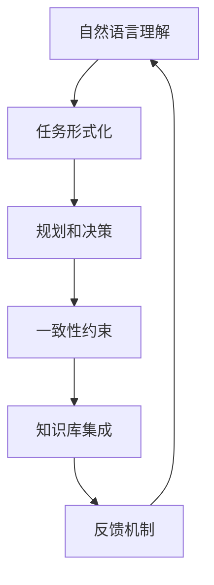
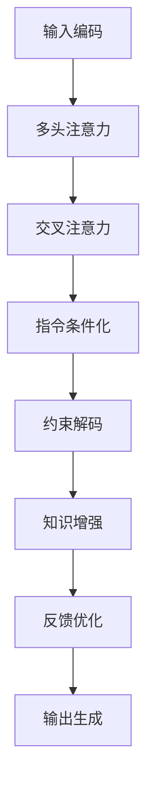

# InstructGPT原理与代码实例讲解

## 1. 背景介绍

### 1.1 问题的由来

近年来,大型语言模型在自然语言处理(NLP)任务中取得了令人瞩目的成就。然而,这些模型在没有人类指导的情况下生成的文本,往往缺乏连贯性、一致性和针对性。为了解决这一问题,InstructGPT应运而生。

InstructGPT是一种新型的大型语言模型,它被设计用于理解和执行自然语言指令。传统的语言模型通过从大量文本数据中学习模式来生成文本,而InstructGPT则是通过学习大量的任务指令和示例输出对,从而学会如何根据指令生成所需的输出。

### 1.2 研究现状

虽然InstructGPT是一个相对新兴的研究领域,但它已经在多个领域展现出了令人鼓舞的应用前景。例如,它可以用于生成高质量的文本内容、进行任务规划和决策、提供个性化的对话系统等。

目前,InstructGPT的主要研究方向包括:

1. 指令理解和表示
2. 指令跟踪和一致性
3. 长期记忆和知识整合
4. 多模态指令处理
5. 安全性和可控性

### 1.3 研究意义

InstructGPT的研究对于推进人工智能系统的发展具有重要意义。它有望解决传统语言模型存在的局限性,为构建更加智能、更加人性化的人工智能系统奠定基础。具体来说,InstructGPT的研究意义体现在以下几个方面:

1. 提高人工智能系统的可控性和可解释性
2. 增强人工智能系统的任务执行能力
3. 促进人机协作和交互
4. 为开发新型智能应用系统提供技术支持

### 1.4 本文结构

本文将全面介绍InstructGPT的原理、算法和实现细节。文章主要分为以下几个部分:

1. 核心概念与联系
2. 核心算法原理与具体操作步骤
3. 数学模型和公式详细讲解与案例分析
4. 项目实践:代码实例和详细解释
5. 实际应用场景
6. 工具和资源推荐
7. 总结:未来发展趋势与挑战
8. 附录:常见问题与解答

## 2. 核心概念与联系

InstructGPT的核心思想是将自然语言指令作为输入,通过特殊的训练方式,使得语言模型能够生成满足指令要求的输出。为了实现这一目标,InstructGPT融合了多个关键概念,包括:

1. **自然语言理解(NLU)**: 准确理解指令的语义含义。
2. **任务形式化**: 将指令转化为可执行的形式表示。
3. **规划和决策**: 制定执行指令的策略和步骤。 
4. **一致性约束**: 确保生成的输出与指令要求保持一致。
5. **知识库集成**: 整合外部知识以辅助指令执行。
6. **反馈机制**: 通过人类反馈持续改进模型性能。

这些概念相互关联、环环相扣,共同构成了InstructGPT的理论基础和技术框架。下面将对它们进行更详细的阐述。

### 2.1 自然语言理解

自然语言理解(NLU)是InstructGPT的基础,它负责从自然语言指令中准确提取语义信息。NLU通常包括以下几个关键步骤:

1. **词法分析**: 将文本拆分为词元(token)序列。
2. **句法分析**: 确定词元之间的句法关系。
3. **语义分析**: 从句法结构中提取语义表示。
4. **指令解析**: 识别指令的意图和参数。

在InstructGPT中,NLU模块的输出是一个结构化的语义表示,它捕获了指令的核心要素,如意图、参数、约束条件等。这为后续的任务形式化和执行奠定了基础。

### 2.2 任务形式化

任务形式化的目标是将自然语言指令转化为可执行的形式表示。这种形式表示应当具有清晰的语义,并且易于由计算机理解和操作。

常见的任务形式化方法包括:

1. **逻辑形式化**: 使用一阶逻辑或其他逻辑形式来表示指令。
2. **程序化**: 将指令转化为某种编程语言或伪代码。
3. **结构化数据**: 使用结构化数据(如XML、JSON等)来表示指令。

无论采用何种形式化方法,关键是要保留指令的核心语义,同时使其具有可操作性。任务形式化的输出将作为后续规划和决策模块的输入。

### 2.3 规划和决策

规划和决策模块的作用是根据形式化的任务表示,制定执行指令的策略和步骤。这通常涉及以下几个方面:

1. **目标分解**: 将复杂的指令分解为多个子目标。
2. **行动规划**: 确定实现每个子目标所需的行动序列。
3. **资源分配**: 分配所需的计算资源和外部知识。
4. **约束处理**: 满足指令中的各种约束条件。

规划和决策过程可以借助各种人工智能技术,如启发式搜索、自动规划、强化学习等。输出是一个明确的执行计划,指导后续的输出生成过程。

### 2.4 一致性约束

一致性约束模块的作用是确保生成的输出与指令要求保持一致。这包括以下几个方面:

1. **语义一致性**: 输出的语义内容符合指令的意图。
2. **结构一致性**: 输出的组织结构满足指令的要求。
3. **风格一致性**: 输出的语言风格与指令的语气相符。
4. **事实一致性**: 输出不违背已知的事实和常识。

为了实现一致性约束,InstructGPT通常采用discriminator(判别器)机制。判别器被训练为判断输出是否符合指令要求,并将判断结果作为反馈,指导语言模型的生成过程。

### 2.5 知识库集成

对于许多复杂的指令,仅依赖语言模型的内部知识是不够的,需要整合外部知识库以辅助执行。知识库集成包括以下几个关键步骤:

1. **知识检索**: 根据指令,从知识库中检索相关的事实和信息。
2. **知识理解**: 理解检索到的知识的语义含义。
3. **知识融合**: 将外部知识与语言模型的内部知识相融合。
4. **知识跟踪**: 跟踪已使用的知识,避免重复和矛盾。

知识库可以是结构化的(如知识图谱)或非结构化的(如文本语料库)。有效的知识库集成能够极大提高InstructGPT处理复杂指令的能力。

### 2.6 反馈机制

反馈机制是InstructGPT持续学习和改进的关键。它包括以下几个环节:

1. **输出评估**: 由人工或自动化系统对生成的输出进行评估。
2. **反馈收集**: 收集评估反馈,可以是分数、标注或自然语言反馈。
3. **模型更新**: 根据反馈,对语言模型和相关模块进行优化和调整。
4. **人机交互**: 通过人机交互,不断优化指令的表达和模型的响应。

反馈机制确保了InstructGPT能够从实践中持续学习,不断提高其理解和执行指令的能力。

通过上述核心概念的相互作用,InstructGPT能够高效地将自然语言指令转化为所需的输出。下一部分将详细介绍InstructGPT的核心算法原理和具体操作步骤。

## 3. 核心算法原理与具体操作步骤

### 3.1 算法原理概述

InstructGPT的核心算法原理是基于Transformer的序列到序列(Seq2Seq)模型,并在此基础上进行了多方面的改进和扩展。算法的主要流程如下:

1. **输入编码**: 将自然语言指令编码为token序列,作为Transformer的输入。
2. **多头注意力**: 通过多头自注意力机制捕获输入序列中的长程依赖关系。
3. **交叉注意力**: 在解码器端,通过交叉注意力机制关注输入序列的不同部分。
4. **指令条件化**: 在模型的各个部分(如注意力、前馈网络等)引入指令条件,强化模型对指令的理解。
5. **约束解码**: 在解码过程中,通过各种约束机制(如判别器、控制码等)确保输出符合指令要求。
6. **知识增强**: 整合外部知识,为模型提供所需的背景信息。
7. **反馈优化**: 根据人类反馈,对模型进行持续优化和调整。

该算法的核心思想是将指令的语义信息融入到Transformer的各个组件中,使得模型在生成输出时能够充分考虑指令的要求。下面将对算法的关键步骤进行详细阐述。

### 3.2 算法步骤详解

#### 3.2.1 输入编码

输入编码的目标是将自然语言指令转化为token序列,作为Transformer的输入。这通常包括以下几个步骤:

1. **词元化(Tokenization)**: 将指令文本拆分为一系列token(词元)。
2. **词元embedding**: 将每个token映射为一个固定长度的向量表示。
3. **位置编码**: 为每个token添加位置信息,捕获它在序列中的位置。

在InstructGPT中,输入编码还会考虑指令的语义信息。例如,可以为指令的不同部分(如意图、参数等)赋予不同的embedding,以强化模型对指令结构的理解。

#### 3.2.2 多头注意力

多头注意力是Transformer的核心机制,它能够捕获输入序列中的长程依赖关系。在InstructGPT中,多头注意力被应用于编码器和解码器的各个层次。

具体来说,每个注意力头都会计算一个注意力分数矩阵,表示每个token对其他token的关注程度。然后,这些注意力分数矩阵被组合起来,形成最终的注意力表示。

在InstructGPT中,注意力机制还会受到指令条件的影响。例如,可以为指令的不同部分赋予不同的注意力权重,使模型更多地关注与当前任务相关的token。

#### 3.2.3 交叉注意力

在解码器端,InstructGPT还引入了交叉注意力机制。交叉注意力允许解码器关注编码器输出的不同部分,从而更好地理解输入序列的语义信息。

具体来说,交叉注意力计算了解码器每个时间步的隐状态与编码器输出之间的注意力分数矩阵。这些注意力分数被用于计算解码器的隐状态表示,从而影响最终的输出生成。

与多头注意力类似,交叉注意力也可以受到指令条件的影响。例如,可以根据指令的不同部分,为交叉注意力赋予不同的权重,使解码器更多地关注与当前任务相关的输入token。

#### 3.2.4 指令条件化

指令条件化是InstructGPT算法的一个关键创新,它的目的是将指令的语义信息融入到模型的各个部分,从而增强模型对指令的理解和响应能力。

具体来说,指令条件化可以应用于以下几个方面:

1. **Embedding层**: 为指令的不同部分(如意图、参数等)赋予不同的embedding表示。
2. **注意力层**: 根据指令的语义信息,为注意力机制赋予不同的权重。
3. **前馈网络层**: 在前馈网络中引入指令条件