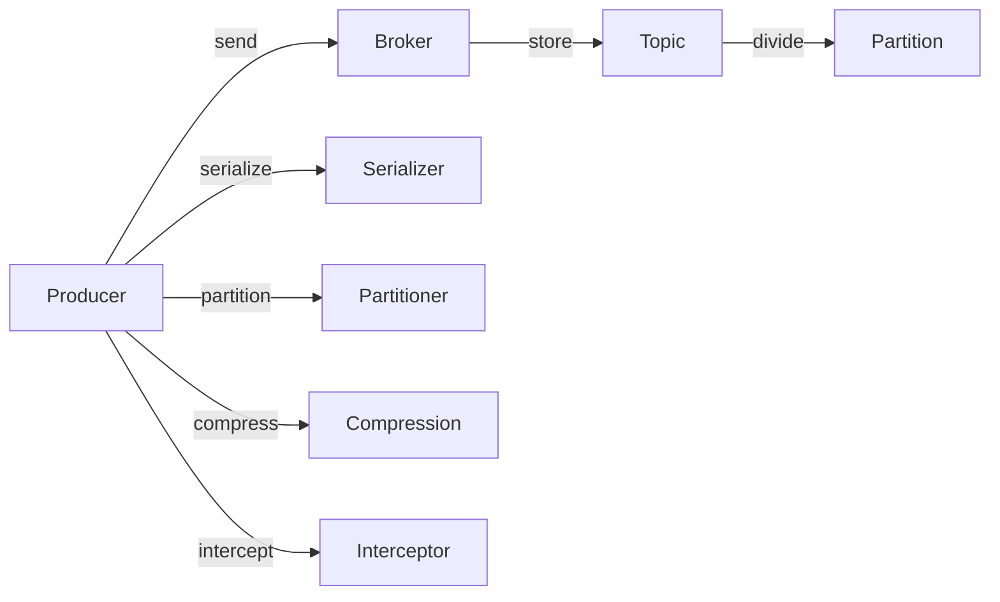

# Kafka Producer原理与代码实例讲解

## 1. 背景介绍
### 1.1 问题的由来
在当今大数据时代,数据的实时处理和传输变得越来越重要。传统的消息队列系统如ActiveMQ、RabbitMQ等已经无法满足海量数据的高吞吐、低延迟、高可用等需求。Apache Kafka应运而生,它是一个分布式的流处理平台,专为实时处理、高吞吐量的数据而设计。
### 1.2 研究现状
目前,Kafka已经被广泛应用于日志收集、监控数据聚合、流式数据处理、在线和离线分析等各个领域。许多知名公司如LinkedIn、Netflix、Uber、Twitter、Airbnb等都在使用Kafka。Kafka生态圈日益完善,围绕着Kafka出现了许多衍生项目,如Kafka Connect、Kafka Streams、KSQL等。
### 1.3 研究意义
深入理解Kafka Producer的工作原理,对于开发高性能、高可靠的实时数据处理应用至关重要。通过学习Kafka Producer的内部机制和最佳实践,可以优化系统性能,提高数据传输效率和可靠性。
### 1.4 本文结构
本文将从Kafka Producer的核心概念出发,深入探讨其内部工作原理,并结合代码实例进行讲解。内容涵盖Kafka Producer的整个生命周期,包括消息发送、序列化、分区、批次发送、异步发送、回调机制、拦截器等。同时,本文还将介绍Kafka Producer的最佳实践和性能调优策略。

## 2. 核心概念与联系
在深入探讨Kafka Producer原理之前,我们需要了解一些核心概念:
- Producer: 消息生产者,负责将消息发送到Kafka集群。
- Broker: Kafka集群中的服务器,负责存储和转发消息。
- Topic: 消息的类别,Producer将消息发送到特定的Topic。
- Partition: Topic的分区,一个Topic可以划分为多个Partition,以实现并行处理和负载均衡。
- Message: 消息,Producer发送的数据单元,包含Key和Value。
- Batch: 批次,Producer将多条消息打包成Batch进行发送,以提高传输效率。
- Compression: 压缩,Producer可以将消息进行压缩,以减小传输和存储开销。
- Serializer: 序列化器,将消息的Key和Value序列化为字节数组。
- Partitioner: 分区器,根据Key或其他策略将消息路由到特定的Partition。
- Interceptor: 拦截器,在消息发送前后进行拦截和处理。

下图展示了这些核心概念之间的关系:



## 3. 核心算法原理 & 具体操作步骤
### 3.1 算法原理概述
Kafka Producer的核心算法可以概括为以下几个步骤:
1. 消息序列化:将消息的Key和Value序列化为字节数组。
2. 消息分区:根据Key或其他策略将消息路由到特定的Partition。
3. 批次发送:将多条消息打包成Batch,提高传输效率。
4. 压缩:对Batch进行压缩,减小传输和存储开销。
5. 消息发送:将Batch发送到Broker。
6. 回调处理:异步发送完成后,触发回调函数进行后续处理。

### 3.2 算法步骤详解
1. 消息序列化
   - Producer创建时,指定Key和Value的序列化器。
   - 调用`send()`方法发送消息时,Key和Value被序列化为字节数组。
   - 常见的序列化器有:StringSerializer、IntegerSerializer、ByteArraySerializer等。

2. 消息分区
   - Producer根据指定的分区器策略,将消息路由到特定的Partition。
   - 默认分区器`DefaultPartitioner`根据Key的哈希值对Partition数量取模。
   - 也可以自定义分区器,根据业务需求实现更复杂的路由逻辑。

3. 批次发送
   - Producer将多条消息缓存在内存中,打包成Batch。
   - 通过`batch.size`参数控制Batch的大小。
   - 通过`linger.ms`参数控制Batch的发送延迟。
   - Batch满足大小或延迟条件时,触发发送操作。

4. 压缩
   - Producer可以对Batch进行压缩,减小传输和存储开销。
   - 通过`compression.type`参数指定压缩算法,如`gzip`、`snappy`、`lz4`等。
   - 压缩发生在序列化之后,发送之前。

5. 消息发送
   - Producer将Batch发送到Broker。
   - 通过`bootstrap.servers`参数指定Broker的地址。
   - 通过`acks`参数控制发送的可靠性。
   - 发送可以是同步的,也可以是异步的。

6. 回调处理
   - 异步发送时,可以指定回调函数。
   - 发送完成后,触发回调函数,进行结果处理或异常处理。
   - 回调函数在单独的线程中执行,不阻塞主线程。

### 3.3 算法优缺点
优点:
- 高吞吐量:批次发送和压缩机制提高了传输效率。
- 高可靠性:可以通过`acks`参数控制发送的可靠性。
- 灵活性:支持自定义分区器、序列化器、拦截器等。

缺点:
- 复杂性:Producer内部涉及多个组件和算法,理解和调优需要一定的学习成本。
- 内存开销:Batch缓存和压缩操作需要额外的内存开销。

### 3.4 算法应用领域
Kafka Producer广泛应用于各种实时数据处理场景,如:
- 日志收集:将应用程序的日志数据发送到Kafka进行集中处理。
- 事件流处理:将事件数据实时发送到Kafka,供下游的流处理应用消费。
- 数据集成:将不同来源的数据发送到Kafka,实现数据的汇总和传输。

## 4. 数学模型和公式 & 详细讲解 & 举例说明
### 4.1 数学模型构建
Kafka Producer的性能可以用以下数学模型来表示:

吞吐量 = $\frac{消息数量}{时间}$

延迟 = $发送时间 - 生成时间$

其中,影响吞吐量和延迟的因素包括:
- Batch大小:Batch越大,吞吐量越高,但延迟也越高。
- 压缩比:压缩比越高,传输和存储开销越小,但压缩和解压的CPU开销越大。
- 网络带宽:网络带宽越大,吞吐量越高,延迟越低。
- 发送可靠性:可靠性要求越高,吞吐量越低,延迟越高。

### 4.2 公式推导过程
假设单条消息的大小为$m$,Batch大小为$b$,压缩比为$c$,网络带宽为$w$,发送时间为$t$,则吞吐量$T$可以表示为:

$T = \frac{m \times b}{t} \times c \times w$

延迟$L$可以表示为:

$L = t - t_0$

其中,$t_0$为消息生成的时间戳。

### 4.3 案例分析与讲解
假设我们要发送1000条消息,每条消息大小为1KB,Batch大小为10KB,压缩比为50%,网络带宽为10MB/s,发送时间为1s,则吞吐量为:

$T = \frac{1KB \times 10}{1s} \times 50\% \times 10MB/s = 50MB/s$

延迟为:

$L = 1s - 0s = 1s$

可以看出,增大Batch大小和压缩比可以提高吞吐量,但也会增加延迟。需要根据具体的业务需求和硬件条件进行权衡和调优。

### 4.4 常见问题解答
1. 如何选择合适的Batch大小?
   - Batch大小需要根据消息的生成速率、网络带宽、延迟要求等因素综合考虑。
   - 一般建议Batch大小不超过1MB,以避免单个Batch过大影响延迟。
   - 可以通过调整`batch.size`和`linger.ms`参数来控制Batch大小和发送延迟。

2. 如何选择合适的压缩算法?
   - `gzip`压缩比高,但压缩和解压的CPU开销也高,适合对带宽敏感的场景。
   - `snappy`压缩比相对较低,但压缩和解压的速度很快,适合对延迟敏感的场景。
   - `lz4`压缩比和速度介于`gzip`和`snappy`之间,是一种平衡的选择。

3. 如何控制发送的可靠性?
   - `acks=0`:Producer不等待Broker的确认,可能会丢失消息,但吞吐量最高。
   - `acks=1`:Producer等待Leader的确认,可以容忍Leader的失败,但不能容忍Follower的失败。
   - `acks=all`:Producer等待所有副本的确认,可靠性最高,但吞吐量最低。

## 5. 项目实践：代码实例和详细解释说明
### 5.1 开发环境搭建
- JDK 8+
- Maven 3+
- Kafka 2.x+

添加Kafka依赖:
```xml
<dependency>
    <groupId>org.apache.kafka</groupId>
    <artifactId>kafka-clients</artifactId>
    <version>2.7.0</version>
</dependency>
```

### 5.2 源代码详细实现
```java
import org.apache.kafka.clients.producer.*;
import org.apache.kafka.common.serialization.StringSerializer;
import java.util.Properties;

public class KafkaProducerExample {
    public static void main(String[] args) {
        // 配置Producer属性
        Properties props = new Properties();
        props.put(ProducerConfig.BOOTSTRAP_SERVERS_CONFIG, "localhost:9092");
        props.put(ProducerConfig.KEY_SERIALIZER_CLASS_CONFIG, StringSerializer.class.getName());
        props.put(ProducerConfig.VALUE_SERIALIZER_CLASS_CONFIG, StringSerializer.class.getName());
        props.put(ProducerConfig.BATCH_SIZE_CONFIG, 10240);
        props.put(ProducerConfig.LINGER_MS_CONFIG, 500);
        props.put(ProducerConfig.COMPRESSION_TYPE_CONFIG, "snappy");

        // 创建Producer实例
        KafkaProducer<String, String> producer = new KafkaProducer<>(props);

        // 发送消息
        for (int i = 0; i < 10; i++) {
            String key = "key-" + i;
            String value = "value-" + i;
            ProducerRecord<String, String> record = new ProducerRecord<>("my-topic", key, value);
            producer.send(record, new Callback() {
                @Override
                public void onCompletion(RecordMetadata metadata, Exception exception) {
                    if (exception != null) {
                        System.err.println("发送失败: " + exception.getMessage());
                    } else {
                        System.out.println("发送成功: " + metadata.topic() + "-" + metadata.partition() + "-" + metadata.offset());
                    }
                }
            });
        }

        // 关闭Producer
        producer.close();
    }
}
```

### 5.3 代码解读与分析
1. 配置Producer属性
   - `bootstrap.servers`:指定Kafka集群的地址。
   - `key.serializer`:指定Key的序列化器。
   - `value.serializer`:指定Value的序列化器。
   - `batch.size`:指定Batch的大小,单位为字节。
   - `linger.ms`:指定Batch的发送延迟,单位为毫秒。
   - `compression.type`:指定压缩算法。

2. 创建Producer实例
   - 使用配置属性创建KafkaProducer实例。
   - 泛型参数指定Key和Value的类型。

3. 发送消息
   - 创建ProducerRecord,指定Topic、Key和Value。
   - 调用`send()`方法发送消息,可以指定回调函数。
   - 回调函数在发送完成后异步执行,处理成功或失败情况。

4. 关闭Producer
   - 调用`close()`方法关闭Producer,释放资源。
   - 关闭前会等待未完成的发送请求完成。

### 5.4 运行结果展示
```
发送成功: my-topic-0-0
发送成功: my-topic-1-0
发送成功: my-topic-2-0
发送成功: my-topic-0-1
发送成功: my-topic-1-1
发送成功: my-topic-2-1
发送成功: my-topic-0-2
发送成功: my-