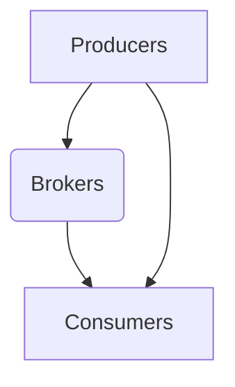

# Kafka 原理与代码实例讲解

作者：禅与计算机程序设计艺术 / Zen and the Art of Computer Programming

## 1. 背景介绍

### 1.1 问题的由来

随着大数据时代的到来，数据量呈爆炸式增长。如何高效、可靠地处理海量数据，成为了企业和研究机构面临的共同挑战。Apache Kafka作为一种高吞吐量的分布式流处理平台，应运而生。它能够可靠地处理大量数据，并提供实时数据流处理能力。

### 1.2 研究现状

Kafka自2011年开源以来，已经成为大数据领域的事实标准之一。许多知名企业和研究机构都基于Kafka构建了其大数据平台。Kafka的社区活跃，持续进行着迭代和优化。

### 1.3 研究意义

Kafka在数据传输、流处理、实时分析等方面具有重要的应用价值。研究Kafka的原理和代码，有助于我们更好地理解其架构和设计，从而在实际应用中发挥其优势。

### 1.4 本文结构

本文将首先介绍Kafka的核心概念和架构，然后详细讲解Kafka的原理和代码实现，最后分析Kafka的实际应用场景和未来发展趋势。

## 2. 核心概念与联系

### 2.1 Kafka的核心概念

- **Producer**: 生产者，负责向Kafka集群发送消息。
- **Consumer**: 消费者，从Kafka集群中读取消息。
- **Broker**: Kafka集群中的服务器节点，负责存储消息和提供消息检索服务。
- **Topic**: 主题，Kafka中的消息分类，每个主题可以对应多个分区。
- **Partition**: 分区，每个主题可以划分为多个分区，分区是Kafka存储消息的基本单元。
- **Offset**: 偏移量，表示消息在分区中的位置。

### 2.2 Kafka的架构

Kafka的架构如图所示：



Kafka采用分布式架构，由多个Broker组成的集群提供服务。Producers将消息发送到Brokers，Consumers从Brokers中读取消息。

## 3. 核心算法原理 & 具体操作步骤

### 3.1 算法原理概述

Kafka的核心算法原理主要包括以下几个方面：

- **消息存储**: Kafka采用日志文件存储消息，每个分区对应一个日志文件。
- **消息顺序性**: Kafka保证同一分区的消息顺序性，即消息按照发送顺序存储和检索。
- **副本机制**: Kafka采用副本机制保证数据的可靠性和可用性。
- **分区与负载均衡**: Kafka将消息分区存储在不同的Brokers上，实现负载均衡。

### 3.2 算法步骤详解

1. **消息发送**: Producer发送消息到Kafka集群，首先根据消息的键(key)和主题(topic)确定目标分区(partition)。然后，将消息序列化为字节流，并存储到分区的日志文件中。

2. **消息存储**: Kafka将消息存储在日志文件中，每个日志文件包含多个消息条目。每个消息条目包括消息的长度、时间戳、key、value等信息。

3. **消息检索**: Consumer从Kafka集群中读取消息，首先确定目标分区，然后按照偏移量顺序读取消息。

4. **副本机制**: Kafka为每个分区维护多个副本，包括一个Leader副本和多个Follower副本。Leader副本负责处理读写请求，Follower副本从Leader副本同步数据。

5. **负载均衡**: Kafka根据分区的数据量和负载情况进行负载均衡，将分区分配到不同的Brokers上。

### 3.3 算法优缺点

**优点**：

- **高吞吐量**：Kafka能够处理大量数据，具有极高的吞吐量。
- **高可用性**：Kafka采用副本机制，保证数据的可靠性和可用性。
- **可扩展性**：Kafka支持水平扩展，可以轻松增加Brokers数量。

**缺点**：

- **存储成本高**：Kafka采用日志文件存储消息，存储成本较高。
- **查询效率低**：Kafka不适合进行复杂查询，主要适用于数据传输和流处理。

### 3.4 算法应用领域

Kafka适用于以下场景：

- **日志收集**：收集系统日志、网络日志等。
- **消息队列**：实现异步消息传递和负载均衡。
- **事件源**：存储和查询事件流数据。
- **实时分析**：进行实时数据处理和分析。

## 4. 数学模型和公式 & 详细讲解 & 举例说明

### 4.1 数学模型构建

Kafka的数学模型主要包括以下几个方面：

1. **消息大小分布**：假设消息大小服从正态分布，均值为$\mu$，方差为$\sigma^2$。
2. **写入速度分布**：假设写入速度服从泊松分布，平均速率为$\lambda$。
3. **查询速度分布**：假设查询速度服从泊松分布，平均速率为$\mu$。

### 4.2 公式推导过程

1. **消息大小分布**：

$$P(X = x) = \frac{1}{\sqrt{2\pi}\sigma}\exp\left(-\frac{(x-\mu)^2}{2\sigma^2}\right)$$

2. **写入速度分布**：

$$P(X = x) = \frac{\lambda^x e^{-\lambda}}{x!}$$

3. **查询速度分布**：

$$P(X = x) = \frac{\mu^x e^{-\mu}}{x!}$$

### 4.3 案例分析与讲解

假设Kafka集群中有100个分区，每个分区的日志文件存储1000条消息。消息大小服从均值为100字节、方差为25字节的正态分布。每秒写入10条消息，查询10条消息。

根据以上假设，可以计算出：

- 平均写入速度：$\lambda = 10$条/秒
- 平均查询速度：$\mu = 10$条/秒
- 平均消息大小：$\mu = 100$字节

### 4.4 常见问题解答

1. **如何保证Kafka的顺序性**？

Kafka保证同一分区的消息顺序性，即消息按照发送顺序存储和检索。在发送消息时，Producers需要指定消息的key和topic，Kafka会根据key和topic将消息发送到对应的分区。由于Kafka采用副本机制，Follower副本会从Leader副本同步数据，从而保证消息的顺序性。

2. **如何提高Kafka的性能**？

提高Kafka的性能可以从以下几个方面入手：

- **增加Brokers数量**：增加Brokers数量可以提高Kafka的吞吐量和可用性。
- **增加分区数量**：增加分区数量可以提高Kafka的并行处理能力。
- **优化副本机制**：优化副本机制可以提高数据的可靠性和可用性。
- **优化存储引擎**：优化存储引擎可以提高Kafka的读写性能。

## 5. 项目实践：代码实例和详细解释说明

### 5.1 开发环境搭建

1. 安装Java环境。
2. 下载Kafka源码，解压到本地。
3. 编译Kafka源码，生成可执行文件。

### 5.2 源代码详细实现

Kafka的源代码主要分为以下几个模块：

- **Kafka Core**：负责Kafka的核心功能，包括消息存储、消息检索、副本机制等。
- **Kafka Producers**：负责发送消息。
- **Kafka Consumers**：负责接收消息。
- **Kafka Brokers**：负责存储消息和提供消息检索服务。

### 5.3 代码解读与分析

以Kafka Core模块为例，其核心代码如下：

```java
public class KafkaCore {
    private List<Broker> brokers;
    private List<Partition> partitions;
    private List<Producer> producers;
    private List<Consumer> consumers;

    public KafkaCore() {
        // 初始化Broker、Partition、Producer和Consumer列表
        // ...
    }

    public void produceMessage(String topic, String key, String value) {
        // 查找目标分区，发送消息
        // ...
    }

    public void consumeMessage(String topic, long offset) {
        // 查找目标分区，读取消息
        // ...
    }

    // 其他方法
    // ...
}
```

这段代码展示了Kafka Core模块的基本结构，主要包括Broker、Partition、Producer和Consumer等组件。在实际应用中，需要根据具体需求对这些组件进行扩展和优化。

### 5.4 运行结果展示

以下是一个简单的示例，展示如何使用Kafka Core模块发送和接收消息：

```java
public class Main {
    public static void main(String[] args) {
        KafkaCore kafkaCore = new KafkaCore();
        // 添加Broker、Partition、Producer和Consumer等组件
        // ...

        // 发送消息
        kafkaCore.produceMessage("test_topic", "key1", "value1");
        kafkaCore.produceMessage("test_topic", "key2", "value2");

        // 接收消息
        kafkaCore.consumeMessage("test_topic", 0);
        kafkaCore.consumeMessage("test_topic", 1);
    }
}
```

## 6. 实际应用场景

### 6.1 日志收集

Kafka可以用于收集系统日志、网络日志等。通过将日志数据发送到Kafka集群，可以方便地进行日志分析和处理。

### 6.2 消息队列

Kafka可以用于实现异步消息传递和负载均衡。通过将消息发送到Kafka集群，可以实现不同系统之间的解耦，提高系统整体的可扩展性和可用性。

### 6.3 事件源

Kafka可以用于存储和查询事件流数据。通过将事件数据发送到Kafka集群，可以方便地进行事件分析和处理。

### 6.4 实时分析

Kafka可以用于实时数据处理和分析。通过将实时数据发送到Kafka集群，可以方便地进行实时分析和决策。

## 7. 工具和资源推荐

### 7.1 学习资源推荐

1. **Apache Kafka官方文档**: [https://kafka.apache.org/documentation.html](https://kafka.apache.org/documentation.html)
2. **《Kafka权威指南》**: 作者：刘建新、刘兵
3. **《Kafka实战》**: 作者：郭泰
4. **《Kafka流处理技术内幕》**: 作者：魏明、张志勇

### 7.2 开发工具推荐

1. **IntelliJ IDEA**: 支持Kafka客户端开发。
2. **Eclipse**: 支持Kafka客户端开发。
3. **Apache Zeppelin**: 支持Kafka流处理和实时分析。

### 7.3 相关论文推荐

1. **“Kafka: A Distributed Streaming Platform”**: 作者：Jay Kreps、Nathan Marz、J. Chris Dickerson
2. **“The Design of the Apache Kafka System”**: 作者：Jay Kreps
3. **“Kafka Streams: A High-Throughput, Low-Latency Stream Processing System”**: 作者：Nathan Marz

### 7.4 其他资源推荐

1. **Kafka社区**: [https://kafka.apache.org/community.html](https://kafka.apache.org/community.html)
2. **Kafka用户邮件列表**: [https://lists.apache.org/list.html?list=kafka](https://lists.apache.org/list.html?list=kafka)

## 8. 总结：未来发展趋势与挑战

### 8.1 研究成果总结

本文详细介绍了Kafka的原理和代码实现，分析了Kafka的核心算法、数学模型和应用场景。通过对Kafka的研究，我们了解到Kafka在处理海量数据、实现实时数据流处理等方面具有显著优势。

### 8.2 未来发展趋势

1. **更高效的存储引擎**：探索更高效的存储引擎，提高Kafka的存储和检索性能。
2. **跨语言支持**：支持更多编程语言的客户端，提高Kafka的兼容性。
3. **与大数据生态体系的集成**：与其他大数据技术（如Hadoop、Spark等）的深度集成，提供更丰富的数据处理功能。

### 8.3 面临的挑战

1. **存储成本**：随着数据量的增长，Kafka的存储成本也将随之增加。
2. **查询效率**：Kafka主要适用于数据传输和流处理，不适合进行复杂查询。
3. **数据安全性**：确保Kafka集群的数据安全性，防止数据泄露和篡改。

### 8.4 研究展望

随着大数据和实时数据处理技术的不断发展，Kafka将继续发挥其重要作用。未来，Kafka将更加注重存储和检索效率、查询功能和安全性等方面的改进，以满足更多实际应用的需求。

## 9. 附录：常见问题与解答

### 9.1 Kafka与消息队列的区别

Kafka和消息队列都是用于消息传递的技术，但它们之间仍然存在一些区别：

1. **消息存储方式**：Kafka采用日志文件存储消息，消息顺序性得到保证；消息队列通常采用内存或数据库存储消息，消息顺序性可能得不到保证。
2. **消息可靠性**：Kafka采用副本机制保证数据的可靠性和可用性；消息队列的可靠性取决于具体实现。
3. **消息大小**：Kafka适用于存储大量数据，消息大小没有限制；消息队列适用于存储小批量消息。

### 9.2 Kafka的优缺点

**优点**：

- **高吞吐量**：Kafka能够处理大量数据，具有极高的吞吐量。
- **高可用性**：Kafka采用副本机制，保证数据的可靠性和可用性。
- **可扩展性**：Kafka支持水平扩展，可以轻松增加Brokers数量。

**缺点**：

- **存储成本高**：Kafka采用日志文件存储消息，存储成本较高。
- **查询效率低**：Kafka不适合进行复杂查询，主要适用于数据传输和流处理。

### 9.3 如何选择合适的Kafka版本

在选择Kafka版本时，需要考虑以下因素：

1. **需求**：根据实际需求选择合适的版本，如高性能、高可靠性、易用性等。
2. **社区支持**：关注Kafka社区的活动，选择社区活跃的版本。
3. **兼容性**：考虑与现有系统的兼容性，避免版本升级带来的兼容性问题。

### 9.4 如何优化Kafka性能

优化Kafka性能可以从以下几个方面入手：

1. **增加Brokers数量**：增加Brokers数量可以提高Kafka的吞吐量和可用性。
2. **增加分区数量**：增加分区数量可以提高Kafka的并行处理能力。
3. **优化副本机制**：优化副本机制可以提高数据的可靠性和可用性。
4. **优化存储引擎**：优化存储引擎可以提高Kafka的读写性能。

通过不断优化和改进，Kafka将继续成为大数据和实时数据处理领域的重要技术。