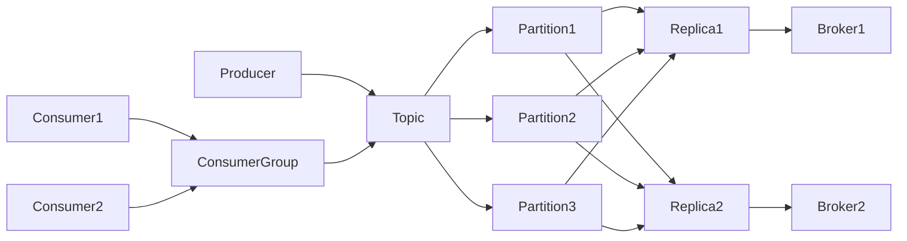

# Kafka原理与代码实例讲解

## 1. 背景介绍

### 1.1 问题的由来

在当今大数据时代,海量数据的实时处理和分析已成为众多企业面临的重大挑战。传统的消息队列系统如ActiveMQ、RabbitMQ等在高并发、高吞吐量场景下往往力不从心。为了应对这一难题,LinkedIn公司开发了一个分布式的消息流平台——Kafka。

### 1.2 研究现状

自2011年开源以来,Kafka凭借其优异的性能和可靠性,迅速成为了业界主流的分布式消息队列方案。目前已被Apple、Netflix、Uber、Airbnb等众多知名互联网公司广泛应用于日志收集、流式数据处理、在线和离线分析等多个领域。Kafka生态系统也日趋完善,诸如Kafka Stream、KSQL、Kafka Connect等组件进一步扩展了其应用场景。

### 1.3 研究意义

深入理解Kafka的设计原理和实现细节,对于构建大规模实时数据处理平台具有重要意义。通过剖析Kafka的架构设计、数据存储、消息投递等核心机制,可以帮助开发者更好地应用Kafka来解决实际问题。同时,Kafka所蕴含的分布式系统设计思想,如分区、副本、水平扩展等,对于开发高性能、高可用的分布式应用也有很大启发。

### 1.4 本文结构

本文将从以下几个方面对Kafka进行深入探讨:

- 首先介绍Kafka的核心概念和总体架构,帮助读者建立对Kafka的整体认知。 
- 然后重点剖析Kafka的核心原理,包括分区机制、副本机制、消息投递语义等,阐明其独特的设计理念。
- 接着通过实际代码示例,演示如何使用Kafka的Producer和Consumer API进行消息的生产和消费。
- 最后总结Kafka的应用场景和未来发展趋势,展望其在流处理领域的广阔前景。

## 2. 核心概念与联系

在深入探讨Kafka原理之前,有必要先了解一下Kafka的一些核心概念:

- Producer:消息生产者,负责将消息发布到Kafka中。
- Consumer:消息消费者,负责从Kafka中拉取消息并进行消费。
- Broker:Kafka集群中的服务器,负责存储和管理消息。
- Topic:消息的主题或者类别,Producer将消息发送到特定的Topic,Consumer从特定的Topic拉取消息。
- Partition:Topic的分区,一个Topic可以分为多个Partition,以实现负载均衡和水平扩展。
- Replica:Partition的副本,用于提供高可用性和数据冗余。
- Consumer Group:消费者组,多个Consumer可以组成一个Group,同一个Group中的Consumer不会消费相同的消息。
- Offset:消息在Partition中的偏移量,用于记录Consumer的消费进度。

下图展示了这些核心概念之间的关系:

可以看出,Producer和Consumer通过Topic进行解耦,Broker负责Topic的存储和管理,每个Topic又可以划分为多个Partition,每个Partition有多个副本分布在不同的Broker上,从而实现了高吞吐、高可用、可扩展的分布式消息系统。

## 3. 核心算法原理 & 具体操作步骤

### 3.1 算法原理概述

Kafka的核心是基于日志结构(Log-structured)的消息引擎。Producer发送的消息被追加到Partition的尾部形成一个有序的日志,Consumer通过移动Offset游标来消费这个日志。这种简洁的设计有几个重要的优点:

1. 顺序写入,避免了随机写的寻址开销,充分利用了磁盘的吞吐能力。
2. 顺序读取,避免了随机读的寻址开销,同样可以充分利用磁盘吞吐。
3. 利用操作系统的Page Cache,充分利用内存提升I/O性能。
4. 数据可以长期保留在磁盘上而不会丢失。
5. 容易实现Partition的水平扩展和数据复制。

### 3.2 算法步骤详解

1. Producer发送消息
   - Producer先将消息序列化,并指定要发送到的Topic和Partition。
   - 然后Producer将消息发送给Broker,Broker在收到消息后会返回一个确认。
   - Producer可以选择同步或异步的发送方式,同步发送会等待Broker的确认,异步发送则不会等待。

2. Broker处理消息
   - Broker在收到Producer发来的消息后,会将其追加到指定Partition的日志文件末尾。
   - 同时Broker会更新Partition的元数据,记录下新的日志偏移量(Log Offset)。
   - Broker会定期将内存中的数据刷新到磁盘上,以保证数据的持久性。
   - Follower副本会定期从Leader副本拉取新的消息,以保持与Leader的同步。

3. Consumer消费消息  
   - Consumer通过指定Topic和Partition,向Broker发起拉取请求。
   - 拉取请求中包含了Consumer希望消费的偏移量(Offset)。
   - Broker收到请求后,会从指定Offset位置开始读取Partition的消息返回给Consumer。  
   - Consumer在收到消息后,会更新自己的Offset,以记录消费进度。
   - Consumer可以通过调整拉取的Offset来实现消息的重复消费或者跳读。

### 3.3 算法优缺点

Kafka这种基于日志的消息引擎有如下优点:

- 高吞吐量:可以充分利用磁盘和网络的吞吐能力,实现百万级别的消息传输。
- 高可靠性:消息被持久化到磁盘,并且支持多副本容错,保证了消息不会丢失。
- 高可扩展性:可以方便地增加新的Partition和Broker,实现水平扩展。
- 灵活的消费模型:支持消息的重复消费、跳读等灵活的消费方式。

但是Kafka也有一些局限性:

- 有限的消息查询能力,不支持按照消息内容进行随机查询。
- 消息无法被修改或删除,只能被追加。
- 消息的有序性只能在Partition内部保证,无法在Topic层面保证。

### 3.4 算法应用领域

Kafka凭借其优异的性能和可靠性,在很多领域得到了广泛应用,主要包括:

- 日志收集:将分布式系统的日志统一收集到Kafka中,便于集中处理和分析。
- 消息系统:作为分布式的发布-订阅消息系统,实现系统间的解耦和异步通信。
- 流式处理:结合Kafka Stream等流处理框架,构建实时的流数据处理管道。
- 事件溯源:将应用程序的状态变化作为一系列事件记录在Kafka中,便于故障回溯和重建。
- 数据集成:作为数据管道,实现不同数据源之间的数据同步和集成。

## 4. 数学模型和公式 & 详细讲解 & 举例说明

### 4.1 数学模型构建

Kafka的吞吐量可以用以下数学模型来表示:

$$Throughput = \frac{BatchSize \times Compression}{Latency}$$

其中:
- BatchSize:Producer批量发送的消息大小或者Consumer批量拉取的消息大小。
- Compression:消息的压缩比,Kafka支持GZIP、Snappy、LZ4等压缩算法。
- Latency:消息从Producer发送到Broker,再从Broker发送到Consumer的端到端延迟。

可以看出,提高BatchSize、Compression或者降低Latency,都可以提升Kafka的吞吐量。

### 4.2 公式推导过程

假设Kafka的Partition数量为P,Broker数量为B,每个Partition的副本数为R,那么整个集群的总吞吐量可以估算为:

$$TotalThroughput = P \times \frac{BatchSize \times Compression}{Latency} \times \frac{B}{R}$$

推导过程如下:
1. 每个Partition的吞吐量为$\frac{BatchSize \times Compression}{Latency}$。
2. 总共有P个Partition,因此总吞吐量为$P \times \frac{BatchSize \times Compression}{Latency}$。
3. 但是每个Partition有R个副本,这R个副本需要分布在不同的Broker上,因此实际的Broker利用率为$\frac{B}{R}$。
4. 将Partition总吞吐量与Broker利用率相乘,得到整个集群的总吞吐量。

### 4.3 案例分析与讲解

假设我们有一个Kafka集群,包含10个Broker,每个Broker有3个Partition,每个Partition有2个副本。Producer以16KB为单位进行批量发送,压缩比为50%,端到端延迟为10ms。那么这个集群的总吞吐量可以估算为:

$$TotalThroughput = 10 \times 3 \times \frac{16KB \times 50\%}{10ms} \times \frac{10}{2} = 24MB/s$$

可以看出,在这个场景下,Kafka集群每秒可以处理24MB的数据。如果我们把BatchSize增加到32KB,压缩比提高到60%,端到端延迟降低到5ms,那么总吞吐量可以提升到:

$$TotalThroughput = 10 \times 3 \times \frac{32KB \times 60\%}{5ms} \times \frac{10}{2} = 115.2MB/s$$

可见调整这些参数可以显著提升Kafka的吞吐能力。当然实际场景中还需要根据具体的业务需求、网络带宽、磁盘性能等因素进行平衡和权衡。

### 4.4 常见问题解答

1. Kafka的吞吐量主要受哪些因素影响?
   
   Kafka的吞吐量主要受到以下因素的影响:
   - BatchSize:批量发送或拉取的消息大小,BatchSize越大,吞吐量越高。
   - Compression:消息压缩比,压缩比越高,吞吐量越高。
   - Latency:端到端延迟,延迟越低,吞吐量越高。
   - Partition数量:Partition越多,可以支持更多的并发生产和消费,吞吐量越高。
   - Broker数量:Broker越多,可以支持更多的Partition副本,负载均衡能力越强,吞吐量越高。

2. 如何提高Kafka的吞吐量?

   可以从以下几个方面来提高Kafka的吞吐量:
   - 增加BatchSize,减少网络I/O次数。
   - 提高压缩比,减少网络传输数据量。
   - 减少端到端延迟,例如使用更高效的序列化方式、优化网络配置等。
   - 增加Partition数量,提高并发生产和消费能力。
   - 增加Broker数量,提高负载均衡能力。
   - 使用SSD等高性能磁盘,提高I/O吞吐能力。
   - 调优操作系统和JVM参数,例如优化内存、线程、GC等配置。

3. Kafka的吞吐量和延迟是否有trade-off?
   
   是的,通常提高吞吐量会导致延迟增加,减少延迟会导致吞吐量下降。例如:
   - 增加BatchSize可以提高吞吐量,但是会增加消息的发送和拉取延迟。
   - 减少Ack等待副本数可以降低延迟,但是会影响消息的可靠性和吞吐量。
   - 增加Partition数量可以提高吞吐量,但是过多的Partition会导致元数据开销增加,延迟变大。
   
   因此在实际应用中需要根据业务需求在吞吐量和延迟之间进行权衡,找到最佳的平衡点。

## 5. 项目实践：代码实例和详细解释说明

下面我们通过一个简单的Java代码示例,演示如何使用Kafka的Producer API发送消息,Consumer API消费消息。

### 5.1 开发环境搭建

1. 安装JDK 8+并配置JAVA_HOME环境变量。
2. 从官网下载Kafka安装包并解压到本地目录。
3. 启动Zookeeper服务:`bin/zookeeper-server-start