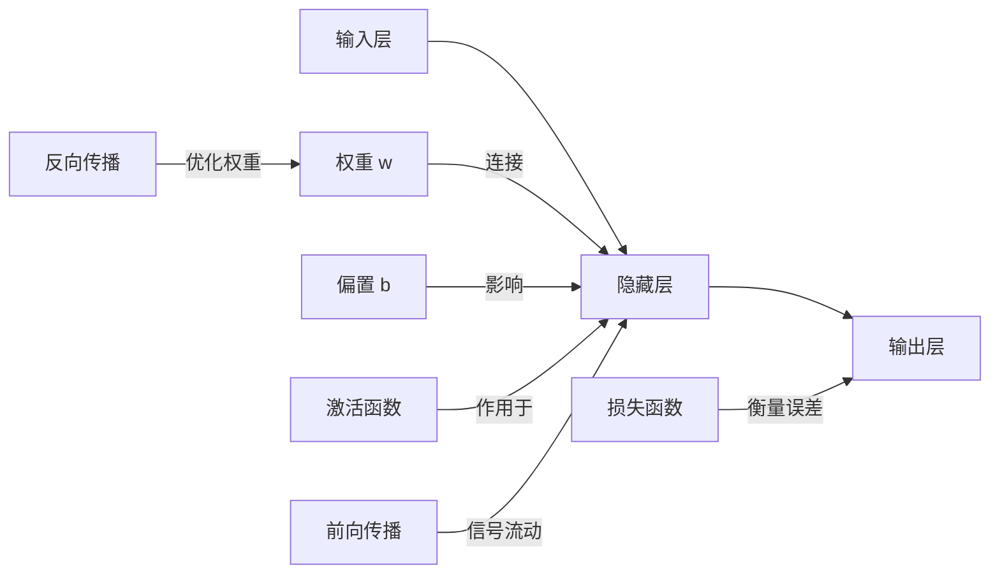

# Neural Networks原理与代码实例讲解

## 1. 背景介绍
### 1.1 问题的由来
神经网络(Neural Networks)是人工智能领域中一个非常重要且广泛应用的技术。它源于对人脑神经元网络工作机制的仿真，试图通过模拟大脑的信息处理过程来实现智能。自20世纪40年代神经网络概念提出以来，经过数十年的发展，神经网络已经成为机器学习和人工智能的核心技术之一。

### 1.2 研究现状
目前，神经网络已经在计算机视觉、语音识别、自然语言处理、推荐系统等诸多领域取得了突破性的进展。以计算机视觉为例，基于深度卷积神经网络(CNN)的图像分类模型已经在ImageNet比赛中达到了超越人类的准确率。在自然语言处理领域，基于注意力机制的Transformer模型和BERT预训练模型也取得了显著的效果提升。

### 1.3 研究意义
神经网络之所以如此重要，是因为它为我们理解智能提供了一种全新的视角。通过对神经网络的研究，我们可以探索大脑的工作原理，揭示智能的本质。同时，神经网络强大的学习和泛化能力，使其在解决复杂问题上展现出了巨大的潜力。深入研究神经网络技术，对于推动人工智能的进一步发展具有重要意义。

### 1.4 本文结构
本文将全面介绍神经网络的基本原理和代码实现。内容安排如下：第2部分介绍神经网络的核心概念；第3部分详细讲解神经网络的算法原理；第4部分给出神经网络涉及的数学模型和公式推导；第5部分通过代码实例演示如何用Python和TensorFlow实现一个神经网络；第6部分讨论神经网络的实际应用场景；第7部分推荐相关的学习资源；第8部分总结全文并展望神经网络的未来发展方向。

## 2. 核心概念与联系

神经网络中有几个核心概念需要理解：

- 神经元(Neuron)：神经网络的基本单元，类似于大脑中的神经元，接收输入信号并产生输出。
- 权重(Weight)：神经元之间连接的强度，决定了信号的传递效率。 
- 偏置(Bias)：神经元的一个属性，相当于神经元的阈值。
- 激活函数(Activation Function)：神经元将输入信号转化为输出信号的函数，如Sigmoid、ReLU等。
- 层(Layer)：神经元按层组织形成网络结构，包括输入层、隐藏层和输出层。
- 前向传播(Forward Propagation)：信号从输入层向输出层传播的过程。
- 损失函数(Loss Function)：衡量网络输出与期望输出之间差异的函数。
- 反向传播(Backpropagation)：根据损失函数计算梯度，调整权重以优化网络的过程。

下图展示了一个简单的神经网络结构和核心概念之间的联系：

## 3. 核心算法原理 & 具体操作步骤
### 3.1 算法原理概述
神经网络的核心是通过不断调整神经元之间的权重，来学习输入数据到输出结果之间的映射关系。这个过程主要分为两个阶段：前向传播和反向传播。

前向传播时，输入信号沿着网络结构逐层传递，每个神经元接收来自上一层神经元的加权输入，并通过激活函数产生输出，直到生成最终的网络输出。然后，将网络输出与期望输出进行比较，通过损失函数计算出误差。

反向传播时，根据损失函数对各个参数（主要是权重）计算梯度，然后沿着梯度下降的方向更新参数，使得网络输出不断逼近期望输出。这个过程不断重复迭代，直到网络达到最优状态。

### 3.2 算法步骤详解

1. 定义网络结构，确定输入层、隐藏层、输出层的节点数，初始化权重和偏置。
2. 开始训练迭代：
   
   a. 前向传播：
      - 输入数据经过输入层，信号传递到隐藏层；
      - 隐藏层神经元接收加权输入，通过激活函数处理产生输出；
      - 信号继续传递，最终生成网络输出。
   
   b. 计算损失函数，衡量网络输出与期望输出的误差。
   
   c. 反向传播：
      - 根据损失函数计算输出层神经元的梯度；
      - 利用链式法则，将梯度逐层向前传播到隐藏层和输入层； 
      - 根据梯度下降算法更新各层权重，以最小化损失函数。
3. 重复步骤2，直到满足终止条件（如误差足够小或达到最大迭代次数）。

### 3.3 算法优缺点

神经网络算法的主要优点包括：
- 强大的非线性拟合能力，可以学习复杂的模式和规律；
- 具有自适应性和容错性，对噪声和缺失数据有较强的鲁棒性；
- 可以处理高维数据，在图像、语音等领域表现出色。

但神经网络也存在一些缺点：
- 训练过程需要大量数据和计算资源，耗时较长；
- 网络结构和超参数的选择需要经验和反复调试；
- 模型可解释性差，难以理解网络内部的工作机制。

### 3.4 算法应用领域
神经网络在很多领域都有广泛应用，如：
- 计算机视觉：图像分类、目标检测、语义分割等
- 自然语言处理：文本分类、情感分析、机器翻译等  
- 语音识别：语音转文本、说话人识别等
- 推荐系统：个性化推荐、协同过滤等
- 控制决策：自动驾驶、智能机器人等

## 4. 数学模型和公式 & 详细讲解 & 举例说明
### 4.1 数学模型构建
神经网络可以表示为一个多层感知机模型。对于一个L层的神经网络，定义如下符号：

- $x$：输入数据
- $y$：输出数据
- $W^{[l]}$：第$l$层的权重矩阵
- $b^{[l]}$：第$l$层的偏置向量 
- $z^{[l]}$：第$l$层的净输入
- $a^{[l]}$：第$l$层的激活值（输出）
- $\sigma$：激活函数，常用的有Sigmoid、tanh、ReLU等
- $J(W,b)$：损失函数，衡量网络输出与真实值的误差

则神经网络的前向传播过程可以用数学公式表示为：

$$
\begin{aligned}
z^{[l]} &= W^{[l]} \cdot a^{[l-1]} + b^{[l]} \\
a^{[l]} &= \sigma(z^{[l]})
\end{aligned}
$$

其中，$a^{[0]} = x$表示网络的输入，$a^{[L]} = \hat{y}$表示网络的输出。

网络的训练目标是找到最优的权重$W$和偏置$b$，使得损失函数$J(W,b)$最小化。

### 4.2 公式推导过程

反向传播算法的核心是利用链式法则计算损失函数对每一层权重的梯度，并根据梯度下降法更新权重。

首先，定义单个样本的损失函数为：

$$J(W,b) = \frac{1}{2} \left\| \hat{y} - y \right\|^2$$

其中，$\hat{y} = a^{[L]}$是网络的输出，$y$是真实值。

接下来，利用链式法则计算损失函数对输出层权重$W^{[L]}$的梯度：

$$
\begin{aligned}
\frac{\partial J}{\partial W^{[L]}} &= \frac{\partial J}{\partial a^{[L]}} \cdot \frac{\partial a^{[L]}}{\partial z^{[L]}} \cdot \frac{\partial z^{[L]}}{\partial W^{[L]}} \\
&= (\hat{y} - y) \odot \sigma'(z^{[L]}) \cdot (a^{[L-1]})^T
\end{aligned}
$$

其中，$\odot$表示按元素相乘，$\sigma'$表示激活函数的导数。

类似地，可以推导出损失函数对隐藏层权重$W^{[l]} (l<L)$的梯度：

$$
\begin{aligned}
\frac{\partial J}{\partial W^{[l]}} &= \frac{\partial J}{\partial z^{[l]}} \cdot \frac{\partial z^{[l]}}{\partial W^{[l]}} \\
&= \delta^{[l]} \cdot (a^{[l-1]})^T
\end{aligned}
$$

其中，$\delta^{[l]}$表示第$l$层的误差项，可以递归计算：

$$
\delta^{[l]} = (W^{[l+1]})^T \cdot \delta^{[l+1]} \odot \sigma'(z^{[l]})
$$

最后，利用梯度下降法更新权重：

$$W^{[l]} := W^{[l]} - \alpha \cdot \frac{\partial J}{\partial W^{[l]}}$$

其中，$\alpha$表示学习率。

对偏置$b^{[l]}$的梯度计算和权重类似，这里不再赘述。

### 4.3 案例分析与讲解

下面以一个简单的二分类问题为例，说明神经网络的训练过程。

假设有一个二维的输入数据集$\{(x_1, y_1), (x_2, y_2), ..., (x_N, y_N)\}$，其中$x_i \in \mathbb{R}^2$，$y_i \in \{0, 1\}$。我们要训练一个单隐藏层的神经网络，来完成这个二分类任务。

网络结构如下：
- 输入层：2个节点
- 隐藏层：4个节点，激活函数为ReLU
- 输出层：1个节点，激活函数为Sigmoid

训练步骤如下：

1. 随机初始化权重矩阵$W^{[1]}, W^{[2]}$和偏置向量$b^{[1]}, b^{[2]}$。

2. 对每个样本$(x_i, y_i)$，执行前向传播：
   
   $z^{[1]} = W^{[1]} \cdot x_i + b^{[1]}$ 
   
   $a^{[1]} = ReLU(z^{[1]})$
   
   $z^{[2]} = W^{[2]} \cdot a^{[1]} + b^{[2]}$
   
   $\hat{y}_i = a^{[2]} = Sigmoid(z^{[2]})$

3. 计算损失函数：
   
   $J(W,b) = -\frac{1}{N} \sum_{i=1}^N [y_i \log \hat{y}_i + (1-y_i) \log (1-\hat{y}_i)]$

4. 通过反向传播计算梯度：
   
   $\delta^{[2]} = \hat{y}_i - y_i$
   
   $\delta^{[1]} = (W^{[2]})^T \cdot \delta^{[2]} \odot ReLU'(z^{[1]})$
   
   $\frac{\partial J}{\partial W^{[2]}} = \delta^{[2]} \cdot (a^{[1]})^T$
   
   $\frac{\partial J}{\partial b^{[2]}} = \delta^{[2]}$
   
   $\frac{\partial J}{\partial W^{[1]}} = \delta^{[1]} \cdot x_i^T$
   
   $\frac{\partial J}{\partial b^{[1]}} = \delta^{[1]}$

5. 根据梯度下降法更新权重和偏置：
   
   $W^{[l]} := W^{[l]} - \alpha \cdot \frac{\partial J}{\partial W^{[l]}}$
   
   $b^{[l]} := b^{[l]} - \alpha \cdot \frac{\partial J}{\partial b^{[l]}}$

6. 重复步骤2-5，直到损失函数收敛或达到最大迭代