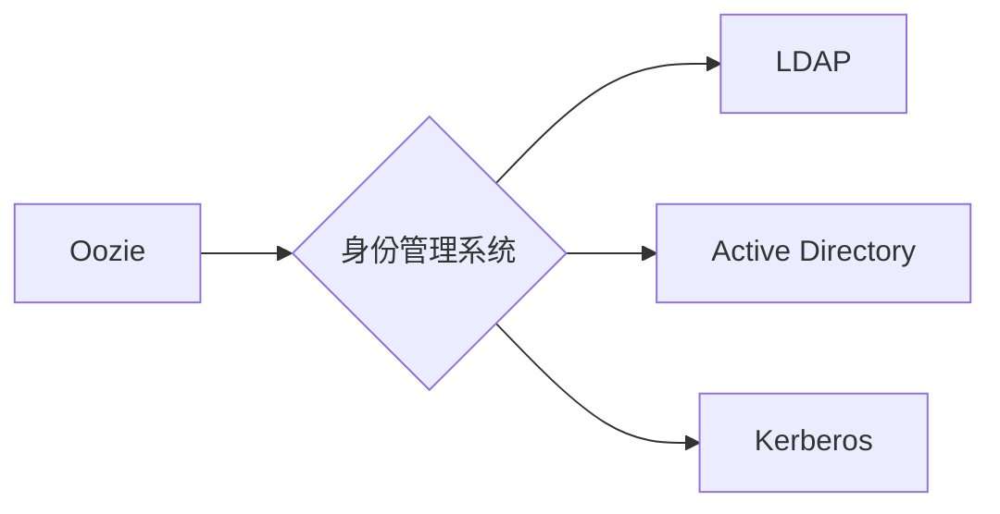

# Oozie与IdentityManagement集成

关键词：Oozie, IdentityManagement, 集成, 身份管理, 工作流调度, Hadoop生态系统

## 1. 背景介绍
### 1.1 问题的由来
随着大数据技术的快速发展，企业需要处理和分析海量的数据。Apache Hadoop作为一个开源的分布式计算平台，提供了可靠、可扩展的大数据存储和处理能力。在Hadoop生态系统中，Oozie作为一个工作流调度系统，用于定义、管理和协调复杂的数据处理工作流。然而，在实际应用中，Oozie需要与企业的身份管理系统进行集成，以确保数据访问的安全性和合规性。

### 1.2 研究现状
目前，已经有一些研究和实践探索了Oozie与身份管理系统的集成方案。常见的身份管理系统包括LDAP、Active Directory、Kerberos等。这些方案主要通过配置Oozie的认证和授权机制，将其与身份管理系统对接，实现用户身份验证和访问控制。然而，不同的身份管理系统和集成方式各有优缺点，在实际应用中还需要根据具体的业务需求和技术环境进行选择和优化。

### 1.3 研究意义
研究Oozie与身份管理系统的集成具有重要的意义。首先，它可以提高Hadoop平台的安全性，防止未经授权的用户访问敏感数据。其次，通过集成身份管理，可以实现对Oozie工作流的细粒度访问控制，满足企业的合规性要求。此外，身份管理集成还可以简化Oozie的用户管理，通过中心化的用户信息同步，减少管理成本。因此，深入研究Oozie与身份管理系统的集成方案，对于构建安全、可靠的大数据平台具有重要价值。

### 1.4 本文结构
本文将从以下几个方面展开讨论Oozie与身份管理系统的集成：

1. 介绍Oozie和身份管理的核心概念和关系
2. 详细阐述Oozie与身份管理集成的核心原理和步骤
3. 构建数学模型，推导相关公式，并给出案例分析
4. 提供Oozie与身份管理集成的代码实例和详细解释
5. 探讨Oozie与身份管理集成的实际应用场景
6. 推荐相关的工具和学习资源
7. 总结Oozie与身份管理集成的未来发展趋势和挑战
8. 附录中给出常见问题与解答

## 2. 核心概念与联系
在探讨Oozie与身份管理系统的集成之前，我们需要了解一些核心概念：

- Oozie：Apache Oozie是一个工作流调度系统，用于管理Hadoop作业。它允许用户定义工作流，其中包含一系列操作，例如Hadoop MapReduce、Pig、Hive查询等。Oozie使用XML文件来定义工作流，并提供了一个基于Web的用户界面和REST API来管理和监控工作流执行。

- 身份管理：身份管理是指在企业IT环境中管理用户身份和访问权限的过程。它涉及用户账户的创建、认证、授权和审计等方面。常见的身份管理系统包括LDAP（轻量级目录访问协议）、Active Directory（活动目录）、Kerberos等。

- 集成：集成是指将不同的系统或组件连接起来，使它们能够协同工作，实现数据和功能的共享。在本文中，集成指的是将Oozie与身份管理系统连接起来，使Oozie能够利用身份管理系统的用户认证和授权功能，实现安全的工作流管理。

下图展示了Oozie与身份管理系统集成的概念关系：

从图中可以看出，Oozie通过与身份管理系统集成，可以连接到不同类型的身份管理系统，如LDAP、Active Directory、Kerberos等，从而实现用户身份验证和访问控制。

## 3. 核心算法原理 & 具体操作步骤
### 3.1 算法原理概述
Oozie与身份管理系统的集成主要涉及以下几个核心算法原理：

1. 身份验证：身份验证是确认用户身份的过程。当用户尝试访问Oozie时，身份管理系统会对用户的身份进行验证，确保用户是合法的。常见的身份验证方法包括用户名/密码、双因素认证、单点登录等。

2. 授权：授权是确定用户对资源的访问权限的过程。一旦用户通过身份验证，身份管理系统会根据预定义的访问控制策略，决定用户对Oozie的访问权限，例如是否允许提交工作流、查看工作流状态等。

3. 用户映射：由于Oozie和身份管理系统可能使用不同的用户标识符，因此需要建立一个用户映射关系，将身份管理系统中的用户映射到Oozie中的用户。这样，Oozie就可以根据身份管理系统的用户信息进行认证和授权。

### 3.2 算法步骤详解
下面我们详细介绍Oozie与身份管理系统集成的具体步骤：

1. 配置身份管理系统：
   - 在身份管理系统中创建Oozie使用的用户和组。
   - 为Oozie用户和组分配适当的权限，如访问HDFS、提交MapReduce作业等。
   - 配置身份管理系统的认证方式，如Kerberos、LDAP等。

2. 配置Oozie服务器：
   - 在Oozie服务器上安装和配置身份管理系统的客户端库，如Kerberos客户端、LDAP客户端等。
   - 修改Oozie的配置文件，指定身份管理系统的认证方式和相关参数，如Kerberos的principal、keytab文件路径等。
   - 重启Oozie服务，使配置生效。

3. 配置Hadoop集群：
   - 在Hadoop集群的节点上安装和配置身份管理系统的客户端库。
   - 修改Hadoop的配置文件，启用身份验证和授权，并指定身份管理系统的相关参数。
   - 重启Hadoop服务，使配置生效。

4. 提交和管理Oozie工作流：
   - 用户使用身份管理系统的凭据（如Kerberos票据）登录Oozie Web界面或使用Oozie客户端。
   - 用户创建和提交Oozie工作流，指定所需的Hadoop资源和作业配置。
   - Oozie根据用户的身份和权限，对工作流进行认证和授权，确保只有授权用户才能提交和管理工作流。

5. 监控和审计：
   - Oozie记录工作流的执行日志和审计信息，包括用户身份、提交时间、作业状态等。
   - 管理员可以通过Oozie Web界面或日志文件查看和分析工作流的执行情况，并进行安全审计。

### 3.3 算法优缺点
Oozie与身份管理系统集成的算法有以下优点：

- 提高了Hadoop平台的安全性，防止未经授权的用户访问敏感数据。
- 实现了对Oozie工作流的细粒度访问控制，满足企业的合规性要求。
- 简化了Oozie的用户管理，通过中心化的用户信息同步，减少了管理成本。

同时，该算法也存在一些缺点：

- 集成过程相对复杂，需要配置多个组件和服务，对管理员的技能要求较高。
- 引入身份管理系统可能会增加系统的复杂性和性能开销。
- 不同的身份管理系统和集成方式可能存在兼容性问题，需要进行充分的测试和验证。

### 3.4 算法应用领域
Oozie与身份管理系统的集成算法主要应用于以下领域：

- 大数据平台：在Hadoop生态系统中，Oozie是常用的工作流调度系统，与身份管理系统集成可以提高平台的安全性和可管理性。
- 企业数据治理：通过集成身份管理，企业可以对Oozie工作流中的数据访问进行严格控制，满足数据治理和合规性要求。
- 多租户环境：在多租户的Hadoop环境中，不同的用户和组可能有不同的数据访问权限，通过身份管理集成可以实现租户之间的隔离和访问控制。

## 4. 数学模型和公式 & 详细讲解 & 举例说明
### 4.1 数学模型构建
为了更好地理解Oozie与身份管理系统的集成，我们可以构建一个简化的数学模型。假设我们有以下集合：

- $U$：用户集合，表示所有的用户。
- $G$：用户组集合，表示用户的分组。
- $P$：权限集合，表示对Oozie工作流的访问权限，如提交、查看、管理等。
- $W$：工作流集合，表示Oozie中的所有工作流。

我们定义以下函数：

- $userGroup: U \rightarrow G$，表示用户到用户组的映射关系。
- $groupPermission: G \rightarrow 2^P$，表示用户组到权限集合的映射关系。
- $workflowPermission: W \rightarrow 2^P$，表示工作流到权限集合的映射关系。

其中，$2^P$表示权限集合$P$的幂集，即$P$的所有子集的集合。

### 4.2 公式推导过程
根据上述数学模型，我们可以推导出以下公式：

1. 用户的权限：给定一个用户$u \in U$，其权限可以表示为：

$userPermission(u) = groupPermission(userGroup(u))$

即，用户的权限等于其所属用户组的权限。

2. 用户对工作流的访问权限：给定一个用户$u \in U$和一个工作流$w \in W$，用户对工作流的访问权限可以表示为：

$userWorkflowPermission(u, w) = userPermission(u) \cap workflowPermission(w)$

即，用户对工作流的访问权限等于用户权限与工作流权限的交集。

### 4.3 案例分析与讲解
下面我们通过一个具体的案例来说明Oozie与身份管理系统集成的数学模型和公式。

假设我们有以下用户、用户组和权限：

- 用户：$U = \{Alice, Bob, Charlie\}$
- 用户组：$G = \{Developers, Analysts, Managers\}$
- 权限：$P = \{Submit, View, Manage\}$

用户到用户组的映射关系为：
- $userGroup(Alice) = Developers$
- $userGroup(Bob) = Analysts$
- $userGroup(Charlie) = Managers$

用户组到权限的映射关系为：
- $groupPermission(Developers) = \{Submit, View\}$
- $groupPermission(Analysts) = \{View\}$
- $groupPermission(Managers) = \{Submit, View, Manage\}$

工作流到权限的映射关系为：
- $workflowPermission(Workflow1) = \{Submit, View\}$
- $workflowPermission(Workflow2) = \{View, Manage\}$

根据公式，我们可以计算出：

1. Alice的权限：
$userPermission(Alice) = groupPermission(userGroup(Alice)) = groupPermission(Developers) = \{Submit, View\}$

2. Bob的权限：
$userPermission(Bob) = groupPermission(userGroup(Bob)) = groupPermission(Analysts) = \{View\}$

3. Charlie的权限：
$userPermission(Charlie) = groupPermission(userGroup(Charlie)) = groupPermission(Managers) = \{Submit, View, Manage\}$

4. Alice对Workflow1的访问权限：
$userWorkflowPermission(Alice, Workflow1) = userPermission(Alice) \cap workflowPermission(Workflow1) = \{Submit, View\} \cap \{Submit, View\} = \{Submit, View\}$

5. Bob对Workflow2的访问权限：
$userWorkflowPermission(Bob, Workflow2) = userPermission(Bob) \cap workflowPermission(Workflow2) = \{View\} \cap \{View, Manage\} = \{View\}$

从上述案例分析可以看出，通过数学模型和公式，我们可以清晰地描述Oozie与身份管理系统集成后，用户对工作流的访问权限控制。

### 4.4 常见问题解答
1. 问：如果一个