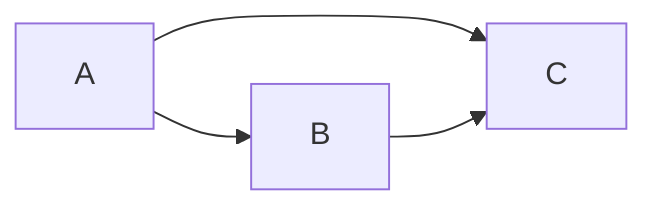
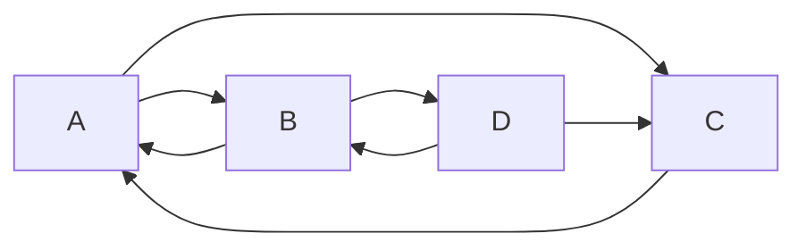

# PageRank算法原理与代码实现

## 1. 背景介绍

### 1.1 问题的由来

在互联网飞速发展的今天,搜索引擎已经成为人们获取信息的主要途径之一。而搜索结果的质量和相关性直接影响着用户的搜索体验。早期的搜索引擎主要依赖于网页内容进行排序,但这种方法存在着很多局限性。比如,一些网站可能通过堆砌关键词等方式来提高自己的排名,而这些网页的实际质量并不高。因此,如何对海量的网页进行合理的质量评估和排序,成为了搜索引擎领域亟待解决的问题。

### 1.2 研究现状

1998年,Google公司的创始人Larry Page和Sergey Brin在斯坦福大学攻读博士学位期间,提出了革命性的PageRank算法。该算法从网页链接结构出发,通过分析网页之间的链接关系,计算每个网页的重要性得分,进而实现对网页的质量评估和排序。PageRank算法的提出,奠定了Google在搜索引擎领域的领先地位,也引发了学术界对链接分析算法的广泛研究。

### 1.3 研究意义

深入理解和掌握PageRank算法,对于从事搜索引擎、推荐系统、社交网络等领域的研究人员和工程师来说都是非常重要的。PageRank思想不仅广泛应用于各种信息检索系统,还被推广到社交网络影响力分析、用户行为挖掘等诸多领域。同时,PageRank也是学习图论、矩阵计算、随机过程等数学知识在计算机领域应用的经典案例。通过对PageRank的学习和实践,我们可以深化对搜索引擎核心技术的认识,提升数学建模和编程实现能力,激发解决实际问题的灵感。

### 1.4 本文结构

本文将从以下几个方面对PageRank算法进行深入探讨：

- 第2部分介绍PageRank涉及的核心概念,并阐述其内在联系。
- 第3部分讲解PageRank的算法原理,给出详细的计算步骤,并分析该算法的优缺点和应用领域。 
- 第4部分建立PageRank的数学模型,推导计算公式,并结合案例进行讲解。
- 第5部分给出PageRank的代码实现,搭建开发环境,详细解读核心代码,展示运行结果。
- 第6部分讨论PageRank在搜索引擎、推荐系统等领域的实际应用场景,并展望其未来发展。
- 第7部分推荐PageRank相关的学习资源、开发工具和研究论文。
- 第8部分对全文进行总结,指出PageRank的研究趋势、面临的挑战和未来的工作方向。
- 第9部分的附录,解答一些关于PageRank的常见问题。

## 2. 核心概念与联系

在正式介绍PageRank算法之前,我们先来了解几个核心概念：

- 网页(Web Page):互联网上的一个HTML文档,通过唯一的URL进行定位和访问。
- 链接(Link):从一个网页指向另一个网页的有向连接,表现为HTML中的<a>标签。
- 入链(Inlink):指向当前网页的链接,即其他网页对当前网页的引用。
- 出链(Outlink):当前网页指向其他网页的链接。
- 网页PR值(PageRank Value):衡量一个网页重要性的数值,由多个因素计算得出,反映网页的质量和权威度。

PageRank算法的核心思想是:一个网页如果被很多其他网页链接到的话说明这个网页比较重要,也就是PageRank值会相对较高。同时,如果一个PageRank值很高的网页链接到一个其他的网页,那么被链接到的网页的PageRank值会相应地因此而提高。一个网页的PageRank值由所有链接到它的其他网页的重要性经过递归计算得到。

这种投票机制可以比较客观地评价网页的重要程度。一个网页从越多的其他网页获得链接,尤其是从那些PageRank值较高的网页获得链接,那么这个网页的PageRank值就会越高。

## 3. 核心算法原理 & 具体操作步骤

### 3.1 算法原理概述

PageRank算法是一种基于网页链接结构的算法,通过网页之间的链接关系计算网页的重要性得分。其基本假设是:如果一个网页被多个其他网页链接到,或者被一些重要的网页链接到,那么这个网页也应当是重要的。

PageRank计算过程可以看作是一个随机游走模型。假设一个用户在网页间随机地进行浏览,如果当前页面有指向其他页面的链接,那么用户有较大概率通过链接访问到其他页面;如果当前页面没有指出链接,那么用户有一定概率随机跳转到任意一个页面。经过多轮浏览后,每个页面被访问的概率收敛到一个稳定值,即为该页面的PageRank值。

### 3.2 算法步骤详解

PageRank的计算步骤可以分为以下四步:

1. 初始化:为每个网页赋予相同的初始PageRank值,一般取1/N,其中N为网页总数。

2. 迭代计算:根据PageRank计算公式,迭代更新每个网页的PageRank值。假设一个由三个网页A、B、C组成的小型网络,链接关系如下图所示:

设网页A的PageRank值为PR(A),利用下面的公式计算网页A的新PageRank值:

$$ PR(A) = \frac{1-d}{N} + d (\frac{PR(B)}{L(B)} + \frac{PR(C)}{L(C)}) $$

其中,d为阻尼系数,一般取值在0.8到0.9之间。N为网页总数,L(A)为网页A的出链数。 

3. 迭代直至收敛:重复第2步,直到所有网页的PageRank值的变化小于一个预先设定的阈值(如0.0001),即认为PageRank值已经收敛。

4. 归一化处理:PageRank值一般经过归一化处理,使得所有网页的PageRank值的总和为1。最后得到的PageRank值即可作为网页重要性的度量。

### 3.3 算法优缺点

PageRank算法的优点主要有:

- 能够较好地反映网页的重要程度,对网页进行合理的权重评估。
- 计算过程简单,容易实现,可以处理大规模的网页数据。
- 对网页内容的变化不敏感,具有一定的稳定性。

但PageRank算法也存在一些局限性:

- 陷阱网页问题:一些恶意网页通过构造指向自己的链接,提高自身的PageRank值。
- 主题漂移问题:如果一个高PageRank值的网页指向大量与搜索主题无关的网页,会导致主题漂移。
- 新网页问题:新发布的高质量网页往往只有很少的入链,其PageRank值会较低,影响搜索结果质量。

### 3.4 算法应用领域 

PageRank作为Google的核心算法之一,在搜索引擎技术中得到了广泛应用。同时,PageRank思想还被应用到其他领域:

- 社交网络影响力分析:根据用户之间的互动关系,如转发、评论等,计算用户的影响力。
- 推荐系统:利用用户之间的相似性和互动关系,对用户进行个性化推荐。
- 论文引用网络分析:通过论文之间的引用关系,评估论文的学术影响力。
- 网络节点重要性排序:在复杂网络中,识别重要的节点,如关键意见领袖。

## 4. 数学模型和公式 & 详细讲解 & 举例说明

### 4.1 数学模型构建

我们可以使用有向图$G(V,E)$来表示网页之间的链接关系。其中,$V$表示由所有网页组成的节点集合,$E$表示网页间的链接关系构成的有向边集合。

对于任意一个网页节点$i$,设其PageRank值为$PR(i)$,出链数为$L(i)$。我们给每个网页节点一个初始的PageRank值$PR_0(i)=\frac{1}{N}$,其中$N$为网页总数。

### 4.2 公式推导过程

考虑阻尼系数$d$,PageRank的计算公式可以表示为:

$$ PR(i) = \frac{1-d}{N} + d \sum_{j \in B(i)} \frac{PR(j)}{L(j)} $$

其中,$B(i)$表示所有链接到网页$i$的网页集合。这个公式表明,一个网页的PageRank值由两部分组成:

- 随机游走部分:$\frac{1-d}{N}$表示用户以$1-d$的概率随机访问到任意网页。
- 投票部分:$d \sum_{j \in B(i)} \frac{PR(j)}{L(j)}$表示网页$i$从所有链接到它的网页获得的投票值。每个网页$j$投票的权重为$\frac{PR(j)}{L(j)}$,即网页$j$的PageRank值除以其出链数。

将所有网页的PageRank值组成向量$\vec{PR} = [PR(1), PR(2), ..., PR(N)]^T$,将随机游走部分组成向量$\vec{u} = [\frac{1-d}{N}, \frac{1-d}{N}, ..., \frac{1-d}{N}]^T$。

定义转移矩阵$M$,其中$M_{ij} = \frac{1}{L(j)}$如果网页$j$链接到网页$i$,否则$M_{ij} = 0$。

于是,PageRank的计算公式可以写成矩阵形式:

$$ \vec{PR} = \vec{u} + dM\vec{PR} $$

进一步变换,得到:

$$ \vec{PR} = (I - dM)^{-1}\vec{u} $$

其中,$I$为单位矩阵。这就是PageRank的矩阵形式,可以通过求解线性方程组得到PageRank向量$\vec{PR}$。

### 4.3 案例分析与讲解

我们以一个简单的网页链接关系为例,演示PageRank值的计算过程。假设有4个网页A、B、C、D,其链接关系如下图所示:

初始时,每个网页的PageRank值为$PR_0(i)=0.25$。取阻尼系数$d=0.85$。根据PageRank计算公式,迭代计算各网页的PageRank值:

- A的PageRank值: $PR(A) = 0.15 + 0.85 × (\frac{PR(B)}{2} + \frac{PR(C)}{1})$
- B的PageRank值: $PR(B) = 0.15 + 0.85 × (\frac{PR(A)}{2} + \frac{PR(D)}{2})$
- C的PageRank值: $PR(C) = 0.15 + 0.85 × (\frac{PR(A)}{2} + \frac{PR(D)}{2})$  
- D的PageRank值: $PR(D) = 0.15 + 0.85 × (\frac{PR(B)}{2})$

经过多轮迭代后,PageRank值会收敛。最终各网页的PageRank值约为:

- A: 0.35
- B: 0.29
- C: 0.24
- D: 0.12

可以看出,网页A的PageRank值最高,其次是网页B,而网页D的PageRank值最低。这与网页之间的链接关系相符合,网页A获得了较多的入链,而网页D只有一个入链。

### 4.4 常见问题解答

- Q:阻尼系数$d$的取值对PageRank计算有何影响?
- A:$d$的取值在0.8到0.9之间。$d$越大,用户通过链接浏览的可能性越大,网页间的链接关系对PageRank值的影响越大;$d$越小,用户随机访问网页的可能性越大,各网页的PageRank值趋于平均。

- Q:计算PageRank值的迭代过程一般需要多少次迭代?
- A:迭代次数取决于网页规模和收敛阈值的设定。一般来说,对于大规模网页,迭