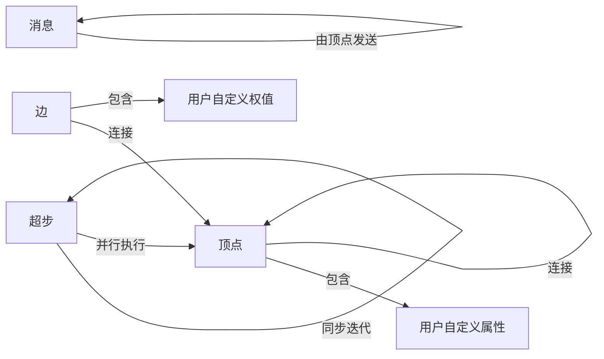
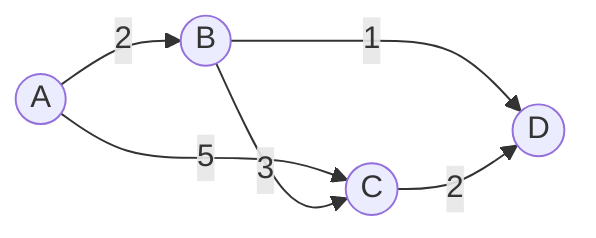

# Pregel原理与代码实例讲解

## 1. 背景介绍
### 1.1  问题的由来
在大数据时代,图计算已成为数据处理的重要手段之一。许多实际问题都可以抽象为图模型,如社交网络分析、网页排名、最短路径查找等。然而,随着图规模的不断增大,传统的单机算法已经无法满足实时计算的需求。因此,研究高效的分布式图计算框架具有重要意义。
### 1.2  研究现状
目前,谷歌的Pregel、Apache的Giraph以及斯坦福的GPS等都是知名的分布式图计算框架。其中,Pregel因其顶点为中心的编程模型和同步迭代的计算方式而备受关注。Pregel已在谷歌内部得到广泛应用,并催生了一系列优秀的开源实现,如Giraph、GPS、Mizan等。
### 1.3  研究意义
深入理解Pregel的设计原理和实现细节,对于开发高效的分布式图计算应用具有重要指导意义。通过学习Pregel,我们可以掌握大规模图数据的并行处理技术,提升问题建模和算法设计能力。同时,Pregel简洁优雅的编程接口也值得我们在其他领域学习借鉴。
### 1.4  本文结构
本文将分为以下几个部分:
- 第2节介绍Pregel的核心概念与设计思想 
- 第3节剖析Pregel的BSP计算模型和同步迭代原理
- 第4节从数学角度建模Pregel,推导并举例说明其内在逻辑
- 第5节给出Pregel的示例代码,并详细解读其实现细节
- 第6节探讨Pregel在实际场景中的应用案例
- 第7节推荐Pregel相关的学习资源和开发工具
- 第8节总结Pregel的研究现状,展望其未来发展方向和挑战
- 第9节附录中解答一些常见问题

## 2. 核心概念与联系
Pregel的核心概念包括:
- 顶点(Vertex):图的基本组成单位,每个顶点包含唯一ID、状态(Active/Inactive)和用户自定义的属性值。顶点通过发送消息与其他顶点通信。
- 边(Edge):连接顶点的有向边,权值为用户自定义的属性值。
- 消息(Message):顶点之间传递的信息,可携带任意用户自定义的数据。
- 超步(Superstep):Pregel以同步迭代的方式运行,每个超步内所有活跃顶点并行计算,通过消息传递完成通信。当没有活跃顶点或未发送消息时迭代终止。

下图展示了Pregel各个概念之间的关系:


## 3. 核心算法原理 & 具体操作步骤
### 3.1  算法原理概述
Pregel基于批量同步并行(Bulk Synchronous Parallel,简称BSP)模型,将计算过程组织为一系列超步。在每个超步中,所有活跃的顶点并行执行用户自定义的Compute函数,通过接收上一超步发送的消息更新自身状态,并向其他顶点发送消息。当没有活跃顶点或未发送消息时,计算终止。
### 3.2  算法步骤详解
1. 加载图数据,初始化顶点和边,将所有顶点设为活跃,开始第0超步。
2. 对该超步的每个活跃顶点并行执行以下操作:
   - 接收上一超步发送给该顶点的消息
   - 根据接收的消息和顶点当前状态,执行用户自定义的Compute函数,更新顶点状态
   - 通过SendMessageTo函数向其他顶点发送消息
   - 调用VoteToHalt函数将自身状态设为不活跃
3. 同步屏障,等待所有顶点完成计算。
4. 如果还有活跃顶点或发送了消息,则开始下一个超步,转步骤2;否则算法结束。
### 3.3  算法优缺点
优点:
- 顶点为中心的编程模型简单直观,用户只需关注单个顶点的行为
- 同步迭代的执行方式避免了复杂的消息传递和死锁问题,易于理解和调试
- 良好的可扩展性,可透明地运行在由数千台机器组成的集群上
缺点:  
- 同步屏障限制了并行度,存在"木桶效应"
- 对于异步算法不友好,需要转化为同步形式
- 顶点关系采用CSR存储,可能引入数据倾斜问题
### 3.4  算法应用领域
- 网页排名(如PageRank)
- 社交网络分析(如社区发现)
- 最短路径查找(如Dijkstra算法)
- 关系推理(如知识图谱)
- 机器学习(如标签传播、协同过滤)

## 4. 数学模型和公式 & 详细讲解 & 举例说明  
### 4.1  数学模型构建
设无向图$G=(V,E)$,其中$V$为顶点集,$E$为边集。$N(v)$表示与顶点$v$相邻的顶点集合。定义以下符号:
- $S_v^i$:第$i$超步时顶点$v$的状态
- $M_{u\to v}^i$:第$i$超步时顶点$u$发送给顶点$v$的消息集合
- $C_v(S_v^{i-1}, \cup_{u\in N(v)}M_{u\to v}^{i-1})$:顶点$v$的Compute函数,根据上一超步的状态和收到的消息更新状态
- $S_v^0$:顶点$v$的初始状态

则Pregel的计算过程可用以下公式表示:

$$
S_v^i = 
\begin{cases}
S_v^0 & i=0 \\
C_v(S_v^{i-1}, \cup_{u\in N(v)}M_{u\to v}^{i-1}) & i > 0
\end{cases}
$$

直观地说,一个顶点在一个超步中的新状态,由它上一超步的状态和收到的消息共同决定,而收到的消息又来自于相邻顶点在上一超步中发送的消息。因此,Pregel本质上是一个状态和消息的传播过程。
### 4.2  公式推导过程
为方便理解,下面我们以单源最短路径问题为例,推导Pregel的状态更新公式。设$d_v^i$为第$i$超步时顶点$v$到源点的最短距离估计值,$w_{uv}$为边$(u,v)$的权值,状态更新公式为:

$$
d_v^i = 
\begin{cases}
0 & v \text{为源点且} i=0 \\
\infty & v \text{非源点且} i=0 \\
\min(d_v^{i-1}, \min_{u\in N(v)}(d_u^{i-1} + w_{uv})) & i > 0
\end{cases}
$$

这个公式表示:
1. 源点的初始距离为0,其他顶点初始距离为无穷大
2. 在后续超步中,每个顶点更新自己的距离估计值,取其上一超步的估计值与所有相邻顶点发来的"距离+边权"的最小值

可见,顶点状态的更新依赖于它在上一超步收到的消息,因此我们还需定义消息传递规则:

$$
M_{u\to v}^i =
\begin{cases}
\{d_u^i + w_{uv}\} & d_u^i + w_{uv} < d_v^i \\
\emptyset & \text{otherwise}
\end{cases}
$$

这个公式表示:当且仅当顶点$u$通过自己和边$(u,v)$的权值能够缩短顶点$v$的距离估计值时,才会向$v$发送包含新估计值的消息。

### 4.3  案例分析与讲解
下面我们用一个具体例子来说明Pregel的计算过程。考虑如下图所示的有向带权图,顶点A为源点,我们要计算其到其他顶点的最短路径:



Pregel的计算过程如下:
- 超步0:A.d=0,其他顶点.d=∞。A向B发送消息2,向C发送消息5
- 超步1:B.d=2,C.d=5,D.d=∞。B向C发送消息5,向D发送消息3
- 超步2:C.d=5,D.d=3。C向D发送消息7
- 超步3:D.d=3,其他顶点状态不变。无消息发送,算法结束

最终结果为:A到B、C、D的最短距离分别为2、5、3。

### 4.4  常见问题解答
Q:Pregel能否处理带负权边的图?
A:Pregel假设图中不存在负权回路,对于负权边的处理需要改进距离估计公式,引入额外的迭代条件判断,以避免距离估计值无限减小的情况。

Q:Pregel如何避免不必要的消息传递?
A:可以设置一个距离阈值,当顶点距离变化量小于该阈值时不再发送消息。也可以记录每个顶点最后一次更新距离的超步编号,仅当该编号大于消息来源顶点的编号时才更新。

Q:Pregel能否支持动态图?
A:Pregel假设图结构在计算过程中不变。对于小规模的点边插入删除,可以将其看作状态更新;对于大规模的结构变化,则需要重新加载图并从头开始计算。

## 5. 项目实践：代码实例和详细解释说明
下面我们以单源最短路径问题为例,给出Pregel的简要C++实现。完整代码可参见附录。

### 5.1  开发环境搭建
- 操作系统:Linux
- 编程语言:C++11
- 编译工具:GCC 4.8+
- 构建工具:CMake 3.5+
- 依赖库:Boost 1.55+

### 5.2  源代码详细实现
#### 5.2.1 基础数据结构
```cpp
using VertexID = int;
using MessageValue = double; 

// 消息
struct Message {
  VertexID from;
  MessageValue value;
};

// 顶点
struct Vertex {
  VertexID id;
  double distance;
  std::vector<std::pair<VertexID, double>> edges;
  std::vector<Message> messages;
  // 用户自定义方法
  void compute();
  void send_message(VertexID to, MessageValue value);
  void vote_to_halt();
};

// 图
struct Graph {
  std::unordered_map<VertexID, Vertex> vertices;
  void load_from_file(std::string filename);
  void run_superstep();
};
```

#### 5.2.2 顶点计算
```cpp
void Vertex::compute() {
  if (superstep == 0) {
    distance = id == source_id ? 0 : std::numeric_limits<double>::max();
  } else {
    for (const auto& msg : messages) {
      distance = std::min(distance, msg.value);
    }
  }
  messages.clear();
  if (distance != std::numeric_limits<double>::max()) {
    for (const auto& edge : edges) {
      double new_dist = distance + edge.second; 
      if (new_dist < vertices[edge.first].distance) {
        send_message(edge.first, new_dist);
      }
    }
  }
  vote_to_halt();
}
```

#### 5.2.3 消息传递
```cpp
void Vertex::send_message(VertexID to, MessageValue value) {
  vertices[to].messages.push_back({id, value});
}
```

#### 5.2.4 计算控制
```cpp
void Graph::run_superstep() {
  for (auto& v : vertices) {
    v.second.compute();
  }
  active_vertices = 0;
  for (const auto& v : vertices) {
    if (!v.second.messages.empty()) {
      active_vertices++;
    }
  }
  superstep++;
}
```

### 5.3  代码解读与分析
- compute函数实现了最短路径估计值的更新逻辑,包括消息接收、距离更新和消息发送三个部分。其中第0超步进行初始化