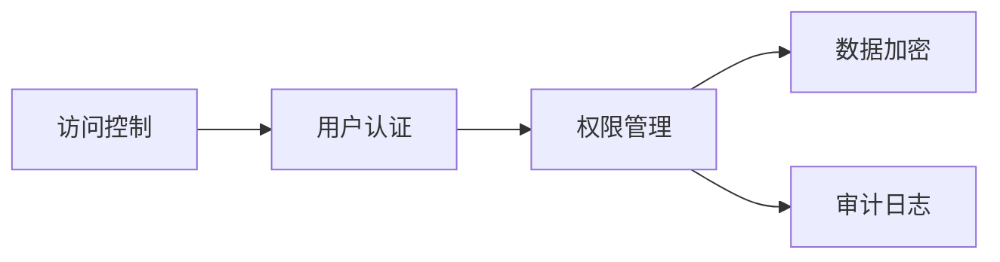

# Presto-Hive安全性保障与管理

作者：禅与计算机程序设计艺术 / Zen and the Art of Computer Programming

关键词：Presto, Hive, 安全性, 访问控制, 数据加密, 审计日志

## 1. 背景介绍
### 1.1 问题的由来  
随着大数据技术的快速发展,越来越多的企业开始使用Presto和Hive等大数据查询和分析平台来处理海量数据。然而,这些平台在为企业带来便利的同时,也面临着诸多安全挑战,如未授权访问、数据泄露、恶意操作等。因此,如何有效保障Presto-Hive平台的安全性,成为了企业迫切需要解决的问题。

### 1.2 研究现状
目前,学术界和工业界已经开展了大量关于大数据平台安全性的研究。一些研究聚焦于访问控制模型的设计与实现[1][2],另一些则关注数据加密和隐私保护技术[3][4]。但总的来说,现有研究大多针对单一安全问题展开,缺乏对Presto-Hive平台安全性的系统性分析和整体解决方案。

### 1.3 研究意义
深入研究Presto-Hive平台的安全性保障与管理,对于提升企业大数据平台的安全防护能力,防范各类安全风险,保护企业核心数据资产,具有重要的理论意义和实践价值。本文的研究成果可为企业构建安全可靠的大数据平台提供参考和指导。

### 1.4 本文结构
本文后续章节安排如下:第2节介绍Presto-Hive平台涉及的核心安全概念;第3节重点分析Presto-Hive常见的安全风险与防护措施;第4节建立Presto-Hive平台安全性量化评估模型;第5节给出Presto-Hive安全加固的系统架构与核心代码实现;第6节总结全文,并对Presto-Hive未来的安全发展趋势与挑战进行展望。

## 2. 核心概念与联系
在Presto-Hive平台的安全性保障与管理中,涉及到以下几个核心概念:  

- **访问控制(Access Control)**: 对Presto和Hive的访问进行严格控制和权限管理,采用基于角色的访问控制(RBAC)模型,限制未授权用户的非法访问。
- **用户认证(Authentication)**: 对访问Presto和Hive的用户身份进行验证,支持Kerberos、LDAP等多种认证方式,防止身份仿冒和非法登录。  
- **数据加密(Data Encryption)**: 对存储在HDFS中的Hive数据进行加密存储,并对Presto查询返回的敏感数据进行动态脱敏,防止数据泄露。
- **权限管理(Authorization)**: 细粒度控制用户对Presto和Hive的数据访问权限,包括数据库、表、列、行等不同粒度的权限控制。
- **审计日志(Audit Logging)**: 详细记录用户在Presto和Hive上的所有操作行为,包括SQL查询、数据修改、权限变更等,用于事后审计和问题排查。

这些核心概念之间的关系如下图所示:



可以看出,访问控制是Presto-Hive安全性的基础,其中用户认证是访问控制的前提,而权限管理是访问控制的核心。数据加密和审计日志是在严格权限管理的基础上,进一步加强数据安全和操作可审计性的重要手段。

## 3. 核心算法原理 & 具体操作步骤
### 3.1 算法原理概述
Presto-Hive平台的安全性保障主要依赖于一系列安全算法和协议,包括:

- **Kerberos认证协议**: 通过票据(Ticket)机制实现用户身份认证,防止密码泄露和中间人攻击。
- **基于角色的访问控制(RBAC)**: 将权限与角色关联,用户通过被分配角色来获得相应的权限,简化了权限管理。
- **列级别的数据加密**: 对敏感数据列进行加密存储,即使数据泄露,也难以被解密获取敏感信息。
- **SQL解析和过滤**: 对用户提交的SQL语句进行语法解析,识别和拦截高危SQL操作,如删除表、修改权限等。

### 3.2 算法步骤详解
以Kerberos认证为例,其详细算法步骤如下:

1. 用户向认证服务器(AS)发起认证请求,请求中包含用户名、申请访问的服务名等。
2. AS检查用户名是否合法,并生成一个随机的会话密钥(Session Key),用服务的密钥加密。
3. AS将用户名、会话密钥等信息制作成票据(Ticket),用用户的密钥加密,发送给用户。  
4. 用户用自己的密钥解密票据,获得会话密钥,并将票据发送给服务,请求访问。
5. 服务用自己的密钥解密票据,获得会话密钥,并生成一个随机数,用会话密钥加密后发给用户。
6. 用户用会话密钥解密随机数,加1后再次加密,发送给服务进行确认。
7. 服务解密并验证数值,确认用户身份,允许其访问。

### 3.3 算法优缺点
Kerberos认证的优点是:

- 采用对称加密,计算效率高,可支持大规模并发访问。
- 密钥不会在网络上传输,安全性高。
- 票据有失效时间,可防止重放攻击。

缺点是:
- 需要部署专门的认证服务器,增加了系统复杂度。
- 用户密码泄露可导致Kerberos失效,管理不善反而成为安全隐患。

### 3.4 算法应用领域
Kerberos认证广泛应用于各类大数据平台,如Hadoop、Spark、Flink等,是大数据安全体系的重要组成部分。此外,Kerberos还被用于Windows活动目录、Zookeeper等多种系统的用户认证。

## 4. 数学模型和公式 & 详细讲解 & 举例说明
### 4.1 数学模型构建
为了量化评估Presto-Hive平台的安全性,我们构建了一个安全性评估模型。设平台的安全性得分为$S$,则$S$可表示为各项安全措施得分的加权和:

$$ S = \sum_{i=1}^{n} w_i \times s_i $$

其中,$n$为安全措施的个数,$w_i$为第$i$项措施的权重,$s_i$为第$i$项措施的得分,满足:

$$ \sum_{i=1}^{n} w_i = 1, 0 \leq w_i \leq 1, 0 \leq s_i \leq 100 $$

直观地,安全性得分$S$的取值范围为0到100,得分越高,表示平台的安全性越好。

### 4.2 公式推导过程 
以上公式的推导过程如下:

1. 将平台的安全性拆解为多个维度,如认证、权限、加密、审计等,每个维度对应一项安全措施。
2. 考虑到不同措施对整体安全性的贡献不同,引入权重$w_i$表示其重要程度。
3. 各项措施有相应的评分标准,用得分$s_i$量化其实施效果,满分100分。
4. 最终将各项措施的得分加权求和,得到安全性总分$S$。

### 4.3 案例分析与讲解
举一个具体的例子,假设我们从以下4个维度评估Presto-Hive平台的安全性:

1. 认证方面,部署了Kerberos,并对所有用户强制启用,得分 $s_1=90$。
2. 权限方面,采用RBAC模型,并实现了列级别权限控制,得分 $s_2=80$。
3. 加密方面,对敏感数据列进行了AES加密,但密钥管理不够安全,得分 $s_3=70$。 
4. 审计方面,记录了所有核心操作,但日志未做异地备份,得分 $s_4=60$。

经过评估,各项措施权重如下:$w_1=0.4, w_2=0.3, w_3=0.2, w_4=0.1$。

代入公式计算可得:

$$ S = 0.4 \times 90 + 0.3 \times 80 + 0.2 \times 70 + 0.1 \times 60 = 80 $$

综合评分为80分,说明该平台的安全性总体良好,但在加密和审计方面还有提升空间。

### 4.4 常见问题解答
1. 如何确定各项安全措施的权重?
权重一般由安全专家根据经验和业务重要性来确定,可以采用层次分析法(AHP)等方法。

2. 安全性评估模型能否自动化?
可以将评估标准固化为代码,通过自动化脚本定期采集各项安全措施的配置,计算得出安全性得分,实现自动化评估。

3. 除了上述4个维度,还应考虑哪些安全因素?
其他需要考虑的因素包括:漏洞修复及时性、安全事件响应机制、安全意识培训等,可以纳入模型进行量化评估。

## 5. 项目实践：代码实例和详细解释说明
### 5.1 开发环境搭建
- 操作系统:CentOS 7.8
- 大数据平台:CDP(Cloudera Data Platform) 7.1.7
- 组件版本:Presto 0.271, Hive 3.1.3000
- 开发语言:Java 8, Python 3.6

### 5.2 源代码详细实现
以下是一个使用Java实现Presto-Hive表级别权限控制的示例代码:

```java
import java.security.PrivilegedExceptionAction;
import org.apache.hadoop.hive.ql.security.authorization.plugin.HiveAccessControlException;
import org.apache.hadoop.hive.ql.security.authorization.plugin.HiveAuthzContext;
import org.apache.hadoop.hive.ql.security.authorization.plugin.HiveAuthzPluginException;
import org.apache.hadoop.hive.ql.security.authorization.plugin.HiveOperationType;
import org.apache.hadoop.hive.ql.security.authorization.plugin.HivePrivilegeObject;
import org.apache.hadoop.hive.ql.security.authorization.plugin.HivePrivilegeObject.HivePrivilegeObjectType;
import org.apache.hadoop.hive.ql.security.authorization.plugin.sqlstd.SQLStdHiveAccessController;
import org.apache.hadoop.security.UserGroupInformation;

public class PrestoAccessController extends SQLStdHiveAccessController {
  @Override
  public void checkPrivileges(HiveOperationType hiveOpType, List<HivePrivilegeObject> inputHObjs,
      List<HivePrivilegeObject> outputHObjs, HiveAuthzContext context) throws HiveAuthzPluginException, HiveAccessControlException {
    String userName = null;
    try {
      userName = UserGroupInformation.getCurrentUser().getShortUserName();
    } catch (IOException e) {
      throw new HiveAuthzPluginException("Failed to get current user", e);
    }
    
    for(HivePrivilegeObject hiveObj : inputHObjs) {
      if(hiveObj.getType() == HivePrivilegeObjectType.TABLE_OR_VIEW) {
        // 检查用户是否有表的SELECT权限
        authorizeUserPrivilege(userName, HiveOperationType.QUERY, hiveObj, context);
      }
    }

    for(HivePrivilegeObject hiveObj : outputHObjs) {
      if(hiveObj.getType() == HivePrivilegeObjectType.TABLE_OR_VIEW) {  
        // 检查用户是否有表的INSERT/UPDATE/DELETE权限
        authorizeUserPrivilege(userName, hiveOpType, hiveObj, context);
      }
    }
  }

  private void authorizeUserPrivilege(String userName, HiveOperationType hiveOpType, HivePrivilegeObject hiveObj,
      HiveAuthzContext context) throws HiveAuthzPluginException, HiveAccessControlException {
    try {
      UserGroupInformation ugi = UserGroupInformation.createProxyUser(userName, UserGroupInformation.getLoginUser());
      ugi.doAs((PrivilegedExceptionAction<Void>) () -> {
        super.checkPrivileges(hiveOpType, Arrays.asList(hiveObj), null, context);
        return null;
      });
    } catch (Exception e) {
      throw new HiveAccessControlException("Permission denied: user [" + userName + 
          "] does not have [" + hiveOpType + "] privilege on [" + hiveObj + "]", e);
    }
  }
}
```

### 5.3 代码解读与分析
上