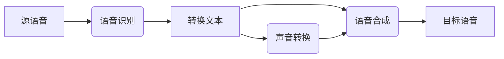

# Python深度学习实践：实时语音转换技术探索

## 1. 背景介绍

### 1.1 问题的由来
在当今信息技术飞速发展的时代,语音交互已成为人机交互的重要方式之一。传统的语音识别和合成技术虽然取得了长足进步,但在实时性、自然度等方面仍存在诸多不足。如何利用深度学习技术,实现高质量的实时语音转换,成为了自然语言处理领域的研究热点。

### 1.2 研究现状
近年来,以深度神经网络为代表的深度学习技术在语音识别与合成领域取得了突破性进展。谷歌的 Tacotron、微软的 FastSpeech 等端到端语音合成模型,展现出了接近真人的自然度。而 Baidu的 DeepSpeech、华为的 HiSpeech 等端到端语音识别系统,也大幅提升了识别准确率。但如何将这两项技术有机结合,实现实时语音转换,仍是一个亟待攻克的难题。

### 1.3 研究意义
实时语音转换技术具有广阔的应用前景。它可以用于同声传译、语音助手、语音聊天、有声读物等诸多场景,极大提升人机交互体验。同时,这项技术的突破也将推动语音识别、语音合成等相关领域的发展,为人工智能的进一步应用奠定基础。

### 1.4 本文结构
本文将围绕如何利用 Python 深度学习框架,实现实时语音转换技术展开探讨。内容涵盖了语音转换的核心概念、经典算法、数学原理、代码实践等方方面面。全文共分为九个章节,依次为:背景介绍、核心概念、算法原理、数学模型、代码实践、应用场景、工具推荐、未来展望和常见问题。下面让我们正式开启 Python 实时语音转换技术的探索之旅。

## 2. 核心概念与联系

要实现实时语音转换,首先需要理解其背后的核心概念。简而言之,语音转换就是将源说话人的语音转换成目标说话人的声音,同时保持语音内容不变。这个过程涉及到以下几个关键技术:

- 语音识别(Speech Recognition):将语音信号转换为文本的技术。
- 语音合成(Speech Synthesis):根据输入的文本,生成对应的语音波形。  
- 声音转换(Voice Conversion):在保持语音内容不变的前提下,将源说话人的声音特征转换成目标说话人的声音特征。

这三项技术环环相扣,共同构成了语音转换的技术基础。其内在联系可以用下面的流程图来表示:

可以看到,语音转换的第一步是通过语音识别将源语音转换为文本,然后在文本层面进行必要的转换如机器翻译、文本规范化等,再通过语音合成得到目标语音。同时,声音转换模块直接在语音层面上将源语音的声学特征转换为目标语音的声学特征,辅助语音合成过程。

## 3. 核心算法原理 & 具体操作步骤

### 3.1 算法原理概述
实现语音转换的核心算法主要包括语音识别算法、语音合成算法和声音转换算法三大类。

在语音识别方面,主流的端到端算法包括 DeepSpeech、Wav2Letter 等基于卷积神经网络(CNN)和递归神经网络(RNN)的模型。这些模型可以直接将语音信号的频谱特征输入到神经网络中,经过 CNN 提取高层特征、RNN 建模时序关系,最终输出识别结果。

对于语音合成,目前占据主导地位的是 Tacotron、Transformer TTS 等基于 Seq2Seq 和注意力机制的端到端模型。它们接收文本序列输入,通过 Encoder-Decoder 结构建模文本到频谱的映射关系,再利用声码器如 WaveNet、WaveGlow 还原出高质量的语音波形。

声音转换则是一个相对独立的任务。传统的声音转换方法多是基于高斯混合模型(GMM)的统计参数映射方法。近年来,基于生成对抗网络(GAN)、变分自编码器(VAE)等深度生成模型的声音转换算法不断涌现,极大提升了转换语音的自然度。

### 3.2 算法步骤详解
接下来,我们以基于深度学习的语音转换系统为例,详细讲解其算法实现步骤。

#### Step 1: 语音识别
1. 利用短时傅里叶变换(STFT)将语音波形转换为频谱图。
2. 将频谱图输入 CNN 网络,提取高层特征。
3. 将 CNN 输出的特征序列输入 RNN 网络如 LSTM、GRU,建模语音的时序结构。  
4. 在 RNN 的每一时刻输出字符的后验概率,通过 CTC 损失函数或注意力机制将其与文本序列对齐,得到识别结果。

#### Step 2: 文本转换
1. 对识别出的源语言文本进行必要的规范化处理,如数字转换、符号转换等。
2. 如果源语言和目标语言不一致,还需进行机器翻译。可以使用基于 Transformer 的神经机器翻译模型。

#### Step 3: 语音合成
1. 将转换后的目标文本输入 Encoder,提取文本特征。
2. 将文本特征通过 Attention 机制传递给 Decoder,解码生成语音的 Mel 频谱。  
3. 将 Mel 频谱输入声码器,如 WaveNet,生成高质量的语音波形。

#### Step 4: 声音转换
1. 分别提取源语音和目标语音的声学特征,如 Mel 倒谱系数(MCC)、基频(F0)等。
2. 利用 GAN 或 VAE 等生成模型,学习源语音特征到目标语音特征的映射关系。
3. 使用训练好的声音转换模型,将Step3中合成的语音的声学特征进行转换,得到具有目标说话人特征的语音。

### 3.3 算法优缺点
上述基于深度学习的语音转换算法具有端到端、数据驱动、泛化能力强等优点。相比传统的 HMM-GMM 方法,深度学习算法大幅简化了系统的搭建流程,不需要复杂的特征工程和人工调优,只要准备好数据就能实现端到端训练。同时,深度学习模型具有更强的非线性拟合能力,能够生成更加自然流畅的转换语音。

但深度学习算法也存在一定局限性。首先,训练深度模型需要大量的数据支撑,对于低资源语言或非标准音色,训练样本的匮乏将导致模型质量下降。其次,深度模型的推理速度相对较慢,在实时场景下不容易满足时延需求。此外,生成模型的不稳定性,也使得转换语音质量不够理想。这些问题亟需后续研究加以解决。

### 3.4 算法应用领域
语音转换算法在很多领域都有广泛应用,例如:

- 跨语言配音:将电影、动画角色的原声转换为本土配音,突破语言障碍。
- 语音助手:赋予 Siri、Alexa 等 AI 助手个性化的声音,提升用户体验。
- 语音翻译:将语音实时翻译成另一种语言,方便跨国交流。
- 歌声合成:让用户输入歌词,就能合成偶像明星的声音演唱。
- 有声读物:自动将文章转换成名人讲述的有声读物,扩大受众。

未来,随着技术的不断发展,语音转换必将在更多场景得到创新应用。

## 4. 数学模型和公式 & 详细讲解 & 举例说明

### 4.1 数学模型构建
语音转换的数学建模主要包括声学特征提取、声学映射、语音合成三个部分。下面我们分别进行说明。

#### 声学特征提取
将语音信号转换为声学特征序列的过程,可以表示为:

$$\mathbf{O} = \mathcal{F}(\mathbf{x}) \in \mathbb{R}^{T \times D} \tag{1}$$

其中 $\mathbf{x}$ 表示语音波形, $\mathcal{F}$ 为特征提取器,通常由 STFT 和 CNN 等模块组成。$\mathbf{O}$ 是提取出的 $D$ 维声学特征序列,长度为 $T$。

#### 声学映射
声音转换的核心是建立源特征和目标特征之间的映射关系:

$$\mathbf{y} = \mathcal{M}(\mathbf{o}_s, \mathbf{o}_t) \tag{2}$$

其中 $\mathbf{o}_s$ 和 $\mathbf{o}_t$ 分别表示源语音和目标语音的声学特征,$\mathcal{M}$ 为声学映射模型,可以是 GMM、DNN、GAN 等。$\mathbf{y}$ 为转换后的声学特征。

以 GAN 为例,其数学形式可以表示为:

$$\min_G \max_D \mathbb{E}_{\mathbf{o}_t \sim p_{data}(\mathbf{o}_t)}[\log D(\mathbf{o}_t)] + \mathbb{E}_{\mathbf{o}_s \sim p_{data}(\mathbf{o}_s)}[\log(1-D(G(\mathbf{o}_s)))] \tag{3}$$

其中 $G$ 为生成器网络,$D$ 为判别器网络。GAN 的目标是让生成器学习到源特征到目标特征的映射,使得判别器无法区分转换后的特征与真实目标特征。

#### 语音合成
语音合成部分可以表示为:

$$\hat{\mathbf{x}} = \mathcal{S}(\mathbf{y}) \tag{4}$$

其中 $\mathcal{S}$ 为语音合成模型,如 WaveNet。它以转换后的声学特征 $\mathbf{y}$ 为输入,重构出语音波形 $\hat{\mathbf{x}}$。

### 4.2 公式推导过程
以语音识别中的 CTC 损失函数为例,我们详细推导其数学公式。

设语音特征序列为 $\mathbf{O}=(\mathbf{o}_1,\dots,\mathbf{o}_T)$,其对应的文本标签序列为 $\mathbf{z}=(z_1,\dots,z_U)$,其中 $T$ 为语音帧数,$U$ 为文本长度,通常 $T \gg U$。

定义 CTC 路径 $\pi$ 为长度与 $\mathbf{O}$ 相同的序列,且经过映射操作 $\mathcal{B}$ 能够得到 $\mathbf{z}$,即 $\mathcal{B}(\pi)=\mathbf{z}$。该映射操作包括去重连续重复标签和去除空白标签。

假设声学模型的输出 $\mathbf{P}$ 为每一时刻的标签后验概率,即:

$$\mathbf{P}=\left[\begin{matrix}
p(\pi_1=1|\mathbf{O}) & \dots & p(\pi_1=K|\mathbf{O}) \\
\vdots & \ddots & \vdots \\
p(\pi_T=1|\mathbf{O}) & \dots & p(\pi_T=K|\mathbf{O})
\end{matrix}\right] \tag{5}$$

其中 $K$ 为标签字典大小。则 CTC 路径 $\pi$ 的概率为:

$$p(\pi|\mathbf{O}) = \prod_{t=1}^T p(\pi_t|\mathbf{O}) \tag{6}$$

而文本序列 $\mathbf{z}$ 的概率为所有能映射到它的 CTC 路径概率之和:

$$p(\mathbf{z}|\mathbf{O}) = \sum_{\pi \in \mathcal{B}^{-1}(\mathbf{z})} p(\pi|\mathbf{O}) \tag{7}$$

CTC 损失函数定义为负对数似然:

$$\mathcal{L}_{CTC} = -\log p(\mathbf{z}|\mathbf{O}) \tag{8}$$

通过最小化 $\mathcal{L}_{CTC}$,可以训练声学模型使其输出与真实文本对齐。

### 4.3 案例