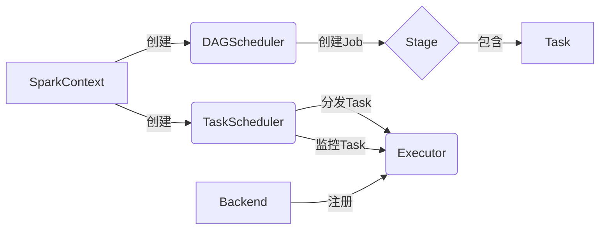
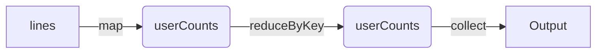

# Spark Driver原理与代码实例讲解

作者：禅与计算机程序设计艺术 / Zen and the Art of Computer Programming

## 1. 背景介绍
### 1.1 问题的由来
在大数据处理领域,Apache Spark已经成为了事实上的标准。Spark的Driver-Executor架构是其能够高效处理海量数据的关键。然而,很多初学者对Spark Driver的工作原理还不够了解,导致在实际开发中遇到各种问题。因此,深入理解Spark Driver的原理对于Spark开发者来说至关重要。

### 1.2 研究现状
目前业界对Spark Driver的研究主要集中在性能优化、容错机制、内存管理等方面。例如,许多研究者提出了各种调优参数和最佳实践,以提高Spark作业的性能。此外,Spark社区也在不断完善Driver的容错恢复机制,确保长时间运行的Spark作业能够从故障中自动恢复。内存管理方面,Spark引入了off-heap内存,大大提升了内存利用效率。

### 1.3 研究意义
深入研究Spark Driver的原理,对于优化Spark作业性能,提高Spark集群稳定性,以及开发复杂的Spark应用程序都有重要意义。通过掌握Driver的工作机制,开发者可以更好地理解Spark的任务调度、Stage划分、容错恢复等关键特性,从而写出高效、健壮的Spark程序。此外,对Driver原理的研究也有助于我们设计新的调度算法和编程模型,进一步提升Spark的性能。

### 1.4 本文结构
本文将从以下几个方面对Spark Driver进行深入讲解:
- 首先介绍Spark Driver的基本概念和在Spark架构中的作用
- 然后重点剖析Driver的关键组件,如DAGScheduler、TaskScheduler等的工作原理  
- 接着通过一个详细的代码实例,演示Driver如何协调各个组件完成一个完整的Spark作业
- 最后总结Driver的特点,展望Spark Driver未来的发展方向

## 2. 核心概念与联系
在详细讲解Spark Driver原理之前,我们先来了解几个核心概念:
- Driver: Spark作业的主控程序,负责作业的调度、任务分发、监控等
- DAGScheduler: 根据RDD的依赖关系构建DAG图,并划分Stage,每个Stage包含一组没有Shuffle依赖的任务
- TaskScheduler: 将DAGScheduler创建的任务分发给Executor运行,并监控任务状态  
- Backend: 负责跟外部通信,接收Executor的注册信息,并维护Executor的状态
- Executor: 运行在工作节点上的进程,负责执行Driver分配的任务

下图描述了Driver内部各个组件的联系:



可以看到,SparkContext是Driver的入口,它会创建DAGScheduler和TaskScheduler。DAGScheduler负责Stage的生成,每个Stage包含一组Task。TaskScheduler将Task分发给注册到Backend的Executor执行。整个过程由Driver统一协调调度。

## 3. 核心算法原理 & 具体操作步骤  
### 3.1 算法原理概述
Spark Driver的核心算法是DAG调度算法和任务调度算法:
- DAG调度算法: 根据RDD的Lineage(血统)关系构建DAG图,将没有Shuffle依赖的RDD划分到同一个Stage中,提交Stage生成最终结果
- 任务调度算法: 尽量将Task分配到存有数据的节点,对于Shuffle类的任务要考虑数据本地性、负载均衡等因素

### 3.2 算法步骤详解
1. 构建DAG图
   - 从结果RDD出发,递归查找其父RDD,直到找到初始的输入RDD
   - 在此过程中,将窄依赖(如map、filter等)的RDD划分到同一个Stage
   - 对于宽依赖(如reduceByKey等),断开Stage,宽依赖两侧的RDD属于不同Stage
   - 考虑RDD的缓存(cache)和检查点(checkpoint)属性,被缓存或检查点的RDD断开Stage

2. 提交Stage
   - 根据Stage的先后依赖关系,从前向后提交Stage
   - Stage提交时会创建一个对应的TaskSet,包含多个Task
   - 每个Task负责计算该Stage的一个Partition
   - Task序列化并被TaskScheduler分发到Executor执行

3. 任务调度
   - TaskScheduler尽量将Task分配到存有Task所需数据的节点 
   - 对于Shuffle读写类Task,要考虑Executor的内存、CPU等资源情况,均匀分配
   - 如果某个Task运行失败,会重试多次,超过重试次数则整个Stage失败
   - Executor运行完Task会将结果返回给Driver,由Driver持有或存储到外部系统
  
### 3.3 算法优缺点
优点:
- DAG调度算法能最大限度地减少不必要的Shuffle操作,提高作业运行效率
- 任务调度考虑数据本地性,尽量避免跨节点的数据传输
- Stage划分后的任务天然支持管道化,一个Stage的输出可以流式地传递给下一个Stage,减少中间结果
  
缺点: 
- 复杂的Spark作业会产生非常大的DAG图,给Spark Driver造成压力
- 任务调度没有考虑不同节点的网络带宽差异,可能将Task分配到网络较差的节点
- Shuffle调度没有考虑不同Executor的负载情况,可能造成数据倾斜

### 3.4 算法应用领域  
DAG调度算法和任务调度算法广泛应用于以下领域:
- 大规模数据处理: 电商、金融、物流等行业每天都要处理海量数据,Spark凭借其DAG调度和任务调度在性能和吞吐量方面具有优势
- 机器学习: Spark MLlib基于Spark的DAG调度实现了一系列分布式机器学习算法,在高维数据和大数据集上表现优异
- 图计算: Spark GraphX将图划分为多个子图,调度系统负责将子图分发到集群节点进行并行计算  
- 流计算: Spark Streaming接收实时数据流,并将数据按批次划分,生成一系列RDD,调度系统负责将RDD的转换和行动操作分发到集群

## 4. 数学模型和公式 & 详细讲解 & 举例说明
### 4.1 数学模型构建
我们可以用有向无环图(DAG)来建模一个Spark作业的计算过程。设DAG中有n个顶点(RDD),m条边(RDD之间的依赖关系),则Spark作业可表示为:

$$G=(V,E)$$

其中,$V=\{v_1,v_2,...,v_n\}$表示RDD集合,$E=\{e_1,e_2,...,e_m\}$表示RDD之间的依赖关系集合。

假设作业由k个Stage组成,则每个Stage $S_i$包含一个RDD子集$V_i$,且满足:

$$V_i \subseteq V, \forall i \in \{1,2,...,k\}$$
$$V_i \cap V_j = \emptyset, \forall i,j \in \{1,2,...,k\}, i \neq j$$
$$\bigcup_{i=1}^k V_i=V$$

直观地说,所有Stage的RDD集合构成了原始DAG的一个划分。

### 4.2 公式推导过程
对于Stage $S_i$,假设其包含$n_i$个RDD,则其内部RDD拓扑排序后可表示为:

$$S_i=\{v_1^i,v_2^i,...,v_{n_i}^i\}$$

其中,如果$v_x^i$是$v_y^i$的父RDD,则有$x<y$。

假设$S_i$包含$m_i$个Task,每个Task负责处理一个RDD分区,则$S_i$的任务集合为:

$$T_i=\{t_1^i,t_2^i,...,t_{m_i}^i\}$$

其中,$t_j^i$表示处理第j个分区的任务。

如果将所有Stage的任务集合相加,可得整个Spark作业的任务集合:

$$T=\bigcup_{i=1}^k T_i$$

Spark Driver的调度问题可以定义为一个最优化问题:在满足Stage依赖约束和任务优先级约束的情况下,找到一种任务调度方案,使得所有任务的总执行时间最短。这可以表示为:

$$\min \sum_{t \in T} f(t)$$

其中,$f(t)$表示任务t的执行时间。

### 4.3 案例分析与讲解
下面我们用一个简单的例子来说明Spark的DAG调度。假设我们要统计一个日志文件中每个用户的访问次数,代码如下:

```scala
val lines = sc.textFile("access.log")
val userCounts = lines
  .map(line => (line.split(" ")(0), 1))
  .reduceByKey(_ + _)
  .collect()
```

这段代码的DAG图如下:



可以看到,该作业包含3个RDD:lines、map后的userCounts、reduceByKey后的userCounts。由于map是窄依赖,reduceByKey是宽依赖,因此该作业会被划分为2个Stage:

Stage 1: lines -> map -> userCounts
Stage 2: userCounts -> reduceByKey -> collect

假设lines有100个分区,则Stage 1会创建100个Task,每个Task读取一个分区并执行map操作。Stage 1的输出结果会按Key哈希到不同的Reducer上,执行reduceByKey得到最终结果。

### 4.4 常见问题解答
1. 问: 如何确定Spark作业的Stage数?
   答: Stage的数量取决于作业的Shuffle次数。窄依赖的RDD划分到同一个Stage,宽依赖会引入新的Stage。因此,Shuffle次数+1就是Stage数。

2. 问: Task如何实现数据本地性?
   答: Spark Driver会尽量将Task分配到存有所需数据的节点。Spark支持多种本地性级别,优先级从高到低依次为:PROCESS_LOCAL、NODE_LOCAL、RACK_LOCAL、ANY。

3. 问: 什么是数据倾斜?如何解决?
   答: 数据倾斜是指某些Key的数据量远大于其他Key,导致该Key的处理速度远慢于其他Key。解决方法包括:调整并行度、自定义Partitioner、过滤少数导致倾斜的Key、将倾斜Key拆分为多条等。

4. 问: Spark作业结果如何保存?
   答: Spark作业的结果可以保存到HDFS、Hive、HBase、Elasticsearch等外部存储系统。也可以直接collect到Driver内存中,但需要注意内存溢出风险。

## 5. 项目实践：代码实例和详细解释说明
### 5.1 开发环境搭建
首先我们搭建Spark开发环境。这里以Intellij IDEA和Maven为例:
1. 安装Intellij IDEA和JDK 1.8
2. 创建一个Maven项目,在pom.xml中添加Spark依赖:
```xml
<dependencies>
    <dependency>
        <groupId>org.apache.spark</groupId>
        <artifactId>spark-core_2.12</artifactId>
        <version>3.0.0</version>
    </dependency>
</dependencies>
```
3. 配置Spark本地运行环境,下载Spark安装包并解压,设置SPARK_HOME环境变量

### 5.2 源代码详细实现
下面我们实现一个Spark WordCount程序,统计文本文件中每个单词的出现次数:

```scala
import org.apache.spark.{SparkConf, SparkContext}

object WordCount {
  def main(args: Array[String]): Unit = {
    // 创建SparkContext
    val conf = new SparkConf().setAppName("WordCount").setMaster("local[2]")
    val sc = new SparkContext(conf)
    
    // 读取文本文件
    val lines = sc.textFile("input.txt")
    
    // 对每一行文本进行切分,转换成(word, 1)的形式
    val words = lines.flatMap(_.split(" "))
    val wordPairs = words.map(word => (word, 1))
    
    // 按单词进行分组求和
    val wordCounts = wordPairs.reduceByKey(_ + _)
    
    // 将结果打印到控制台
    wordCounts.collect().foreach(println)
    
    sc.stop()
  }
}
```

### 5.3 代码解读与分析
1. 