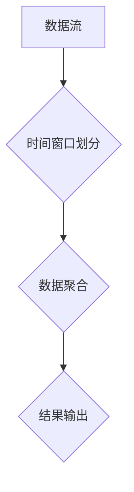

# SparkStreaming与Flume时间窗口实例

作者：禅与计算机程序设计艺术 / Zen and the Art of Computer Programming

## 1. 背景介绍

### 1.1 问题的由来

在大数据时代，实时数据处理已经成为许多企业和组织的核心需求。随着数据量的爆炸式增长，如何高效、准确地处理和分析实时数据，成为了数据工程师和开发者面临的一大挑战。SparkStreaming和Flume都是常见的实时数据流处理框架，它们在不同的应用场景中发挥着重要作用。本文将深入探讨SparkStreaming与Flume在处理时间窗口数据时的实例，分析其原理、方法和优缺点，并展望未来发展趋势。

### 1.2 研究现状

目前，SparkStreaming和Flume在实时数据处理领域已经取得了显著的成果。然而，在处理时间窗口数据时，它们仍存在一些问题，如窗口大小调整困难、性能瓶颈、可扩展性不足等。因此，如何优化时间窗口处理机制，提高实时数据处理的效率和准确性，成为了当前研究的重点。

### 1.3 研究意义

本文旨在分析SparkStreaming与Flume在处理时间窗口数据时的实例，探讨其原理、方法和优缺点，为实际应用提供参考和指导。通过对比和分析这两种框架在时间窗口处理方面的差异，有助于读者更好地选择合适的框架，并优化其性能和效率。

### 1.4 本文结构

本文结构如下：

- 第2章介绍SparkStreaming和Flume的核心概念与联系。
- 第3章阐述时间窗口处理原理，并给出相应的Mermaid流程图。
- 第4章分别介绍SparkStreaming和Flume在时间窗口处理中的应用，并分析其优缺点。
- 第5章通过实例代码展示SparkStreaming和Flume在时间窗口处理中的具体应用。
- 第6章探讨SparkStreaming和Flume在实际应用场景中的表现和未来发展趋势。
- 第7章总结全文，并展望未来研究方向。

## 2. 核心概念与联系

### 2.1 SparkStreaming与Flume概述

#### 2.1.1 SparkStreaming

SparkStreaming是Apache Spark的组件之一，专门用于实时数据流处理。它基于Spark的核心抽象和弹性分布式数据集(Dataset)和弹性分布式数组(Resilient Distributed Dataset, RDD)，能够高效地处理大规模实时数据流。

#### 2.1.2 Flume

Flume是Cloudera公司开发的一个开源分布式系统，用于收集、聚合和移动大量日志数据。它支持多种数据源，如文件、TCP、JMS等，并可将数据传输到多种目的地，如HDFS、HBase、Kafka等。

### 2.2 核心概念与联系

SparkStreaming和Flume在实时数据处理领域有着密切的联系，主要体现在以下几个方面：

1. **数据源**：两者都支持多种数据源，如文件、网络、数据库等。
2. **数据处理**：SparkStreaming和Flume都提供了丰富的数据处理操作，如过滤、聚合、连接等。
3. **数据存储**：两者都可将处理后的数据存储到多种目的地，如HDFS、HBase、Kafka等。

## 3. 时间窗口处理原理

时间窗口处理是指将时间序列数据按照一定的时间间隔进行分组，并对每个分组内的数据进行处理。以下是一个时间窗口处理的Mermaid流程图：



### 3.1 时间窗口划分

时间窗口划分是将数据流按照一定的时间间隔进行分组。常见的时间窗口划分方法包括：

1. **固定时间窗口**：将数据流划分为等长的时间段。
2. **滑动时间窗口**：在固定时间窗口的基础上，每次滑动一定时间间隔。
3. **滚动时间窗口**：实时更新时间窗口，当新数据到来时，移除旧数据，添加新数据。

### 3.2 数据聚合

数据聚合是对每个时间窗口内的数据进行处理，例如求和、计数、最大值、最小值等。

### 3.3 结果输出

处理完每个时间窗口的数据后，将结果输出到目的地，如文件、数据库等。

## 4. SparkStreaming与Flume时间窗口处理应用

### 4.1 SparkStreaming时间窗口处理

SparkStreaming支持固定时间窗口、滑动时间窗口和滚动时间窗口等。以下是一个使用固定时间窗口的SparkStreaming实例：

```python
from pyspark.streaming import StreamingContext
from pyspark.streaming.window import Window

# 创建StreamingContext
ssc = StreamingContext(sc, 1)  # 1秒的批次间隔

# 创建DStream
lines = ssc.socketTextStream("localhost", 9999)

# 定义固定时间窗口为5秒
windowed_lines = lines.window(Window.seconds(5))

# 对窗口内的数据进行处理
windowed_lines.map(lambda line: line.split(" ")[0]) \
    .map(lambda word: (word, 1)) \
    .reduceByKey(lambda a, b: a + b) \
    .print()

# 启动StreamingContext
ssc.start()
ssc.awaitTermination()
```

### 4.2 Flume时间窗口处理

Flume提供了Flume Taildir Source和Flume SequenceFileSink，可以用于处理时间窗口数据。以下是一个使用Flume Taildir Source和Flume SequenceFileSink的实例：

```java
# 定义Flume配置文件
# agent.sources = r1
# agent.sinks = k1
# agent.channels = c1

# 定义Taildir Source
agent.sources.r1.type = TaildirSource
agent.sources.r1.channels = c1
agent.sources.r1.fileSuffix = .txt
agent.sources.r1.filePattern = /path/to/your/logs/*.txt

# 定义Channel
agent.channels.c1.type = MemoryChannel
agent.channels.c1.capacity = 1000
agent.channels.c1.transactionCapacity = 100

# 定义Sink
agent.sinks.k1.type = SequenceFileSink
agent.sinks.k1.channel = c1
agent.sinks.k1.sink.directory = /path/to/your/output
agent.sinks.k1.filePrefix = windowed_
agent.sinks.k1.timeFormat = HH:mm:ss
agent.sinks.k1.roundValue = 60

# 启动Agent
agent.sources.r1.start()
agent.sinks.k1.start()
agent.channels.c1.start()
```

## 5. 项目实践：代码实例和详细解释说明

### 5.1 开发环境搭建

#### 5.1.1 SparkStreaming

1. 下载Spark Streaming的安装包，并将其解压到本地。
2. 配置环境变量，将SparkStreaming的bin目录添加到PATH环境变量中。
3. 启动SparkMaster和SparkWorker。

#### 5.1.2 Flume

1. 下载Flume的安装包，并将其解压到本地。
2. 配置环境变量，将Flume的bin目录添加到PATH环境变量中。
3. 启动FlumeAgent。

### 5.2 源代码详细实现

#### 5.2.1 SparkStreaming时间窗口处理

```python
from pyspark.streaming import StreamingContext
from pyspark.streaming.window import Window

# 创建StreamingContext
ssc = StreamingContext(sc, 1)  # 1秒的批次间隔

# 创建DStream
lines = ssc.socketTextStream("localhost", 9999)

# 定义固定时间窗口为5秒
windowed_lines = lines.window(Window.seconds(5))

# 对窗口内的数据进行处理
windowed_lines.map(lambda line: line.split(" ")[0]) \
    .map(lambda word: (word, 1)) \
    .reduceByKey(lambda a, b: a + b) \
    .print()

# 启动StreamingContext
ssc.start()
ssc.awaitTermination()
```

#### 5.2.2 Flume时间窗口处理

```java
# 定义Flume配置文件
# agent.sources = r1
# agent.sinks = k1
# agent.channels = c1

# 定义Taildir Source
agent.sources.r1.type = TaildirSource
agent.sources.r1.channels = c1
agent.sources.r1.fileSuffix = .txt
agent.sources.r1.filePattern = /path/to/your/logs/*.txt

# 定义Channel
agent.channels.c1.type = MemoryChannel
agent.channels.c1.capacity = 1000
agent.channels.c1.transactionCapacity = 100

# 定义Sink
agent.sinks.k1.type = SequenceFileSink
agent.sinks.k1.channel = c1
agent.sinks.k1.sink.directory = /path/to/your/output
agent.sinks.k1.filePrefix = windowed_
agent.sinks.k1.timeFormat = HH:mm:ss
agent.sinks.k1.roundValue = 60

# 启动Agent
agent.sources.r1.start()
agent.sinks.k1.start()
agent.channels.c1.start()
```

### 5.3 代码解读与分析

#### 5.3.1 SparkStreaming时间窗口处理

- `ssc.socketTextStream("localhost", 9999)` 创建了一个从本地主机9999端口读取文本流的DStream。
- `lines.window(Window.seconds(5))` 对DStream应用了一个固定时间窗口，窗口大小为5秒。
- `lines.map(lambda line: line.split(" ")[0])` 将每行数据按照空格分割，并提取第一个单词。
- `map(lambda word: (word, 1))` 将每个单词映射为一个键值对，键为单词，值为1。
- `reduceByKey(lambda a, b: a + b)` 对键值对进行聚合，即对相同的单词进行计数。
- `.print()` 打印每个窗口内的单词计数。

#### 5.3.2 Flume时间窗口处理

- `agent.sources.r1.type = TaildirSource` 指定使用Taildir Source。
- `agent.sources.r1.channels = c1` 设置Taildir Source绑定的Channel。
- `agent.sources.r1.fileSuffix = .txt` 设置文件后缀为.txt。
- `agent.sources.r1.filePattern = /path/to/your/logs/*.txt` 设置日志文件模式。
- `agent.channels.c1.type = MemoryChannel` 设置Channel类型为MemoryChannel。
- `agent.channels.c1.capacity = 1000` 设置Channel容量为1000。
- `agent.channels.c1.transactionCapacity = 100` 设置Channel事务容量为100。
- `agent.sinks.k1.type = SequenceFileSink` 设置Sink类型为SequenceFileSink。
- `agent.sinks.k1.channel = c1` 设置Sink绑定的Channel。
- `agent.sinks.k1.sink.directory = /path/to/your/output` 设置输出目录。
- `agent.sinks.k1.filePrefix = windowed_` 设置文件前缀为windowed_。
- `agent.sinks.k1.timeFormat = HH:mm:ss` 设置时间格式为HH:mm:ss。
- `agent.sinks.k1.roundValue = 60` 设置时间窗口滚动间隔为60秒。

### 5.4 运行结果展示

在本地主机上运行SparkStreaming程序和Flume Agent，并生成一些日志数据。程序运行一段时间后，可以在输出目录中找到生成的SequenceFile文件，其中包含了每个时间窗口内的单词计数。

## 6. 实际应用场景

### 6.1 SparkStreaming应用场景

- 实时日志分析：对日志数据进行实时监控和分析，发现异常和潜在问题。
- 实时推荐系统：根据用户行为数据，实时推荐商品或内容。
- 实时广告系统：根据用户点击行为，实时投放广告。

### 6.2 Flume应用场景

- 日志收集：收集来自多个源的数据，如文件、网络等，并存储到HDFS、HBase等存储系统。
- 数据聚合：对实时数据流进行聚合和转换，生成新的数据流。
- 数据清洗：对数据进行清洗和预处理，提高数据质量。

## 7. 工具和资源推荐

### 7.1 学习资源推荐

- 《Spark Streaming编程指南》
- 《Flume User Guide》
- 《Apache Spark实战》

### 7.2 开发工具推荐

- IntelliJ IDEA
- PyCharm
- Sublime Text

### 7.3 相关论文推荐

- 《A Scalable and Flexible Stream Processing System》
- 《Flume: A Distributed Log Collection Service》

### 7.4 其他资源推荐

- Apache Spark官网：[https://spark.apache.org/](https://spark.apache.org/)
- Apache Flume官网：[https://flume.apache.org/](https://flume.apache.org/)

## 8. 总结：未来发展趋势与挑战

### 8.1 研究成果总结

本文深入探讨了SparkStreaming与Flume在时间窗口处理中的应用，分析了其原理、方法和优缺点，并通过实例代码展示了其具体实现。研究发现，SparkStreaming和Flume在处理时间窗口数据时各有优势，可以根据实际需求选择合适的框架。

### 8.2 未来发展趋势

- **性能优化**：随着硬件和软件技术的不断发展，未来SparkStreaming和Flume的性能将得到进一步提升。
- **功能扩展**：未来SparkStreaming和Flume将支持更多数据处理操作和功能，如机器学习、自然语言处理等。
- **跨平台兼容性**：未来SparkStreaming和Flume将更加注重跨平台兼容性，支持更多操作系统和硬件平台。

### 8.3 面临的挑战

- **计算资源**：随着数据量的不断增长，对计算资源的需求也越来越大，如何在有限的资源下实现高效处理是一个挑战。
- **数据安全**：实时数据处理涉及大量敏感数据，如何保障数据安全和隐私是一个重要挑战。
- **可扩展性**：在处理大规模数据流时，如何保证系统的可扩展性和高可用性是一个挑战。

### 8.4 研究展望

未来，SparkStreaming和Flume在时间窗口处理领域的研究可以从以下几个方面展开：

- 优化算法和模型，提高处理效率和准确性。
- 探索新的数据处理技术，如深度学习、联邦学习等。
- 研究跨平台兼容性和性能优化策略。
- 保障数据安全和隐私，提高系统的可靠性和安全性。

通过不断的研究和创新，SparkStreaming和Flume将在实时数据处理领域发挥更大的作用，为企业和组织提供高效、准确的数据处理解决方案。

## 9. 附录：常见问题与解答

### 9.1 什么是时间窗口处理？

时间窗口处理是指将时间序列数据按照一定的时间间隔进行分组，并对每个分组内的数据进行处理。常见的时间窗口划分方法包括固定时间窗口、滑动时间窗口和滚动时间窗口等。

### 9.2 SparkStreaming和Flume有什么区别？

SparkStreaming和Flume都是实时数据流处理框架，但它们在架构、功能和应用场景等方面存在一些差异。SparkStreaming基于Spark的核心抽象，支持复杂的数据处理操作和大规模数据处理，适用于需要实时处理和分析大数据的场景。Flume专注于日志数据的收集和传输，支持多种数据源和目的地，适用于日志收集和聚合场景。

### 9.3 如何选择SparkStreaming和Flume？

选择SparkStreaming和Flume需要根据实际需求进行评估。如果需要复杂的数据处理和大规模数据处理，建议使用SparkStreaming；如果需要日志收集和聚合，建议使用Flume。

### 9.4 时间窗口处理有什么优势？

时间窗口处理能够将时间序列数据按照一定的时间间隔进行分组，便于分析和理解数据的趋势和特征。此外，时间窗口处理还可以提高数据处理效率和准确性，并支持实时数据分析和可视化。