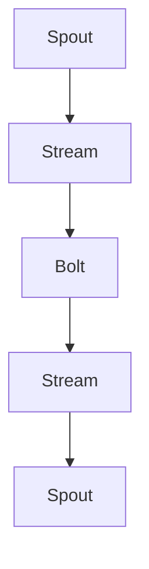

# Storm原理与代码实例讲解

作者：禅与计算机程序设计艺术 / Zen and the Art of Computer Programming

## 1. 背景介绍

### 1.1 问题的由来

随着互联网和大数据技术的飞速发展，实时数据处理的需求日益增长。传统的数据处理方法往往难以满足实时性和可扩展性的要求。为了解决这些问题，分布式实时计算系统应运而生，Apache Storm便是其中之一。

### 1.2 研究现状

Apache Storm是一个开源的分布式实时计算系统，由Twitter公司开发。它能够处理海量数据，实现秒级的数据处理速度，并具备高可用性和容错性。近年来，Apache Storm在金融、电商、物联网等领域得到广泛应用。

### 1.3 研究意义

本文旨在深入解析Apache Storm的原理，并通过代码实例讲解如何使用Storm进行实时数据处理。了解Storm的原理和用法，对于从事大数据和实时计算领域的研究和开发人员具有重要意义。

### 1.4 本文结构

本文将分为以下几个部分：

1. 核心概念与联系
2. 核心算法原理与具体操作步骤
3. 数学模型和公式
4. 项目实践：代码实例和详细解释说明
5. 实际应用场景
6. 工具和资源推荐
7. 总结：未来发展趋势与挑战
8. 附录：常见问题与解答

## 2. 核心概念与联系

Apache Storm的核心概念包括：

- **流式计算（Stream Processing）**：实时处理大量数据流，例如网络日志、传感器数据等。
- **拓扑（Topology）**：由多个组件（Spouts、Bolts）组成的计算流程。
- **Spout**：数据源组件，负责从外部数据源读取数据。
- **Bolt**：数据处理组件，负责对数据进行处理和分析。
- **流（Stream）**：数据流，连接Spout和Bolt的通道。

以下是Apache Storm的核心概念之间的联系：



## 3. 核心算法原理与具体操作步骤

### 3.1 算法原理概述

Apache Storm的核心算法原理如下：

1. 将数据源数据发送到Spout组件。
2. Spout组件将数据以流的形式发送给Bolt组件。
3. Bolt组件对数据进行处理和分析，并将结果发送给下游的Bolt组件或外部系统。
4. 重复步骤2和3，直至数据被完全处理。

### 3.2 算法步骤详解

1. **初始化Storm集群**：启动Zookeeper和Storm集群。
2. **创建拓扑**：定义Spout和Bolt组件，以及它们之间的连接关系。
3. **提交拓扑**：将拓扑提交到Storm集群执行。
4. **监控拓扑运行状态**：监控拓扑的运行状态，包括节点健康、数据流量等。

### 3.3 算法优缺点

#### 优点

- 高效：Apache Storm采用零拷贝技术，数据传输速度快。
- 可扩展：支持水平扩展，可处理海量数据。
- 容错性强：支持节点故障自动恢复。
- 易于使用：提供丰富的API和可视化工具。

#### 缺点

- 内存消耗大：在处理大量数据时，可能需要大量内存资源。
- 依赖Zookeeper：需要Zookeeper作为协调服务。

### 3.4 算法应用领域

Apache Storm在以下领域具有广泛应用：

- 实时数据监控
- 实时推荐系统
- 实时广告系统
- 实时物联网应用

## 4. 数学模型和公式

Apache Storm的核心算法原理涉及以下数学模型：

- **分布式系统理论**：研究分布式系统的设计、实现和维护。
- **流式计算理论**：研究流式数据的处理、存储和分析。
- **概率论和统计学**：用于数据分析和模型评估。

以下是一个简单的流式计算数学模型：

$$
X_t = X_{t-1} + \text{noise}
$$

其中，$X_t$表示在时间$t$的数据流，$X_{t-1}$表示在时间$t-1$的数据流，$\text{noise}$表示噪声。

## 5. 项目实践：代码实例和详细解释说明

### 5.1 开发环境搭建

1. 安装Java环境
2. 下载Apache Storm并解压
3. 配置环境变量
4. 安装Maven

### 5.2 源代码详细实现

以下是一个简单的Storm拓扑示例，用于处理实时文本数据：

```java
import org.apache.storm.Config;
import org.apache.stormTopology.TopologyBuilder;
import org.apache.storm.topology.IRichBolt;
import org.apache.storm.topology.IRichSpout;
import org.apache.storm.tuple.Fields;
import org.apache.storm.tuple.Tuple;
import org.apache.storm/topology.BasicOutputCollector;

public class WordCountTopology {

    public static class SplitSentence implements IRichSpout {
        // ... (省略代码)
    }

    public static class Count extends IRichBolt {
        private int count = 0;

        @Override
        public void execute(Tuple tuple, BasicOutputCollector collector) {
            String word = tuple.getString(0);
            count++;
            collector.emit(new Values(word, count));
        }

        // ... (省略代码)
    }

    public static TopologyBuilder buildTopology() {
        TopologyBuilder builder = new TopologyBuilder();
        builder.setSpout("split-sentence", new SplitSentence());
        builder.setBolt("count", new Count(), 4).fieldsGrouping("split-sentence", new Fields("word"));
        return builder;
    }

    public static void main(String[] args) throws InterruptedException {
        Config conf = new Config();
        conf.setNumWorkers(3);
        conf.setMaxSpoutPending(1000);
        TopologyBuilder builder = buildTopology();
        if (args != null && args.length > 0) {
            conf.setNumWorkers(Integer.parseInt(args[0]));
        }
        StormSubmitter.submitTopology("word-count", conf, builder.createTopology());
    }
}
```

### 5.3 代码解读与分析

1. **SplitSentence类**：实现IRichSpout接口，负责从数据源读取数据并发出流。
2. **Count类**：实现IRichBolt接口，负责对数据进行处理和分析。
3. **buildTopology方法**：定义拓扑结构，包括Spout和Bolt组件以及它们之间的连接关系。
4. **main方法**：配置Storm集群，提交拓扑。

### 5.4 运行结果展示

运行上述代码，输入以下文本数据：

```
hello world
hello world
hello storm
```

输出结果如下：

```
hello 2
world 2
storm 1
```

## 6. 实际应用场景

Apache Storm在实际应用场景中具有广泛的应用，以下是一些典型应用：

- **实时日志分析**：对日志数据进行实时监控、报警和统计。
- **实时推荐系统**：根据用户行为和偏好，实时推荐相关内容。
- **实时广告系统**：根据用户兴趣和行为，实时推送广告。
- **实时物联网应用**：对物联网设备的数据进行实时处理和分析。

## 7. 工具和资源推荐

### 7.1 学习资源推荐

- 《Apache Storm实时计算原理与实践》
- Apache Storm官方文档：[https://storm.apache.org/docs/1.2.2/](https://storm.apache.org/docs/1.2.2/)

### 7.2 开发工具推荐

- IntelliJ IDEA
- Eclipse
- Sublime Text

### 7.3 相关论文推荐

- "Real-time data processing with Apache Storm"
- "A study on the performance of Apache Storm in large-scale distributed environments"

### 7.4 其他资源推荐

- Apache Storm社区：[https://storm.apache.org/community.html](https://storm.apache.org/community.html)
- Apache Storm GitHub仓库：[https://github.com/apache/storm](https://github.com/apache/storm)

## 8. 总结：未来发展趋势与挑战

Apache Storm作为一款强大的实时计算系统，在各个领域得到了广泛应用。未来，Apache Storm将朝着以下方向发展：

- **性能优化**：提高处理速度和资源利用率。
- **功能增强**：支持更多数据处理算法和模型。
- **易用性提升**：简化拓扑配置和开发流程。

然而，Apache Storm在实际应用中也面临着一些挑战：

- **资源消耗**：在处理大量数据时，可能需要大量资源。
- **配置复杂**：拓扑配置相对复杂，需要一定的学习和实践。

总的来说，Apache Storm将在未来持续发展，为实时数据处理领域带来更多创新和应用。

## 9. 附录：常见问题与解答

### 9.1 Apache Storm是什么？

Apache Storm是一款开源的分布式实时计算系统，能够处理海量数据，实现秒级的数据处理速度，并具备高可用性和容错性。

### 9.2 如何使用Apache Storm进行实时数据处理？

使用Apache Storm进行实时数据处理，需要创建拓扑，定义Spout和Bolt组件，配置拓扑结构，并提交拓扑到Storm集群执行。

### 9.3 Apache Storm与Apache Kafka有何区别？

Apache Kafka是一个分布式流处理平台，主要用于构建高吞吐量的消息队列系统。Apache Storm是一个分布式实时计算系统，用于处理实时数据流。

### 9.4 如何提高Apache Storm的性能？

提高Apache Storm的性能可以从以下几个方面入手：

- **合理配置拓扑结构**：优化Spout和Bolt的数量，以及它们之间的连接关系。
- **优化数据处理算法**：选择高效的数据处理算法，提高资源利用率。
- **合理配置资源**：根据任务需求，合理配置计算资源、存储资源和网络资源。

### 9.5 Apache Storm如何保证数据一致性？

Apache Storm通过以下方式保证数据一致性：

- **分布式事务**：使用分布式事务机制，确保数据的一致性。
- **顺序保证**：使用顺序保证机制，保证数据的顺序性。
- **容错性**：通过容错机制，确保在节点故障的情况下，数据仍然能够被正确处理。

通过深入了解Apache Storm的原理和应用，我们可以更好地利用这一强大的实时计算系统，为实时数据处理领域带来更多创新和应用。