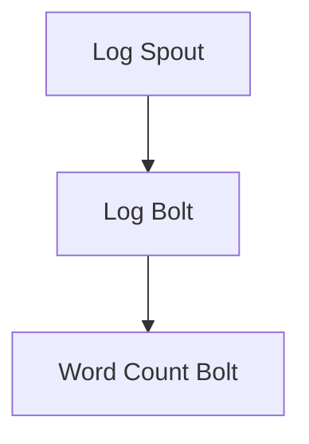

# Storm原理与代码实例讲解

作者：禅与计算机程序设计艺术 / Zen and the Art of Computer Programming

## 1. 背景介绍

### 1.1 问题的由来

随着大数据时代的到来，实时数据处理的需求日益增长。传统的批处理系统在处理实时数据时存在响应速度慢、难以扩展等问题。Storm作为一种分布式实时大数据处理框架，应运而生，成为解决实时数据处理问题的利器。

### 1.2 研究现状

近年来，Storm在实时数据处理领域取得了显著进展，被广泛应用于金融、电商、社交网络、物联网等多个领域。许多公司和研究机构都在研究和改进Storm，以满足不断增长的需求。

### 1.3 研究意义

深入研究Storm原理，有助于我们更好地理解实时大数据处理框架的设计和实现，为实际应用提供理论指导。同时，通过代码实例讲解，读者可以掌握Storm的使用方法，将其应用于实际项目中。

### 1.4 本文结构

本文将首先介绍Storm的核心概念和原理，然后通过代码实例讲解其具体实现。最后，我们将探讨Storm的实际应用场景和未来发展趋势。

## 2. 核心概念与联系

Storm是一个分布式实时大数据处理系统，其核心概念包括：

### 2.1 Topology

Topology是Storm中的最基本的概念，它定义了数据处理的流程。一个Topology可以包含多个组件（Bolt和Spout），组件之间的连接关系以及数据流的方向。

### 2.2 Spout

Spout是Topology的输入组件，负责从外部数据源读取数据。常见的Spout类型包括随机Spout、Kafka Spout、Twitter Spout等。

### 2.3 Bolt

Bolt是Topology的输出组件，负责对数据进行处理。Bolt可以将接收到的数据转发给其他Bolt或写入外部数据源。

### 2.4 Stream

Stream是数据流的概念，表示Topology中组件之间的数据传输通道。

### 2.5 Streams Grouping

Streams Grouping定义了组件之间数据流的分组方式，常见的分组方式包括全局分组、字段分组、部分字段分组等。

### 2.6 Acking

Acking是一种确保数据正确处理的方法。当一个Bolt完成对数据的处理并转发后，它会发送一个ack消息给Spout，告知Spout该数据已经被正确处理。

## 3. 核心算法原理与具体操作步骤

### 3.1 算法原理概述

Storm的算法原理主要包括以下几个方面：

1. **分布式架构**：Storm采用分布式架构，可以部署在多个节点上，实现水平扩展，提高处理能力。
2. **无状态设计**：Storm的设计目标是实现无状态的实时数据处理，简化了系统设计和开发。
3. **高可靠性和容错性**：Storm采用多种机制保证数据正确处理和系统的高可用性。
4. **灵活的数据流处理**：Storm支持多种数据流处理模式，如无状态处理、状态流处理等。

### 3.2 算法步骤详解

以下是Storm的基本操作步骤：

1. **创建Topology**：定义Topology的结构，包括Spout、Bolt、组件之间的连接关系和数据流分组方式。
2. **配置Storm集群**：配置Storm集群的节点信息，包括主节点、工作节点和Zookeeper集群。
3. **提交Topology**：将Topology提交到Storm集群进行执行。
4. **监控与调试**：监控Topology的执行情况，包括任务状态、资源使用情况等，及时发现问题并进行调试。

### 3.3 算法优缺点

#### 3.3.1 优点

1. **高可靠性**：Storm具备完善的容错机制，确保数据正确处理。
2. **可扩展性**：Storm支持水平扩展，能够处理大规模数据。
3. **灵活性和通用性**：Storm支持多种数据流处理模式，适用于各种场景。

#### 3.3.2 缺点

1. **资源消耗**：Storm在运行过程中需要消耗大量计算资源。
2. **复杂度高**：Storm的系统设计和开发相对复杂，需要一定的学习成本。

### 3.4 算法应用领域

Storm广泛应用于以下领域：

1. **实时推荐系统**：实时计算用户行为，生成个性化推荐。
2. **实时广告系统**：实时分析用户行为，进行广告投放。
3. **实时监控**：实时监测系统性能，及时发现和处理问题。
4. **实时搜索**：实时索引和处理数据，实现实时搜索功能。

## 4. 数学模型和公式详细讲解与举例说明

Storm的算法原理主要涉及分布式计算和数据流处理，以下是一些相关的数学模型和公式：

### 4.1 分布式计算

分布式计算中的经典模型包括：

1. **MapReduce**：将数据分片，并行处理，最后合并结果。
2. **DAG（有向无环图）**：描述任务执行的依赖关系。

### 4.2 数据流处理

数据流处理中的经典模型包括：

1. **窗口（Windows）**：将数据划分为多个时间段，对每个时间段的数据进行处理。
2. **滑动窗口（Sliding Window）**：动态调整窗口大小，保持窗口内数据量不变。

### 4.3 案例分析与讲解

以下是一个使用Storm处理实时日志数据的案例：

1. **数据源**：实时日志文件。
2. **处理任务**：实时统计日志中特定关键词的出现频率。
3. **拓扑结构**：



其中，Log Spout从日志文件中读取数据，Log Bolt将每条日志拆分为单词，Word Count Bolt统计每个单词的出现频率。

### 4.4 常见问题解答

1. **什么是Stream Grouping**？
   Stream Grouping是组件之间数据流的分组方式，常见的分组方式包括全局分组、字段分组、部分字段分组等。
   
2. **什么是Acking**？
   Acking是一种确保数据正确处理的方法，当一个Bolt完成对数据的处理并转发后，它会发送一个ack消息给Spout，告知Spout该数据已经被正确处理。

## 5. 项目实践：代码实例和详细解释说明

### 5.1 开发环境搭建

1. **安装Java**：Storm使用Java编写，因此需要安装Java运行环境。
2. **安装Maven**：Maven是Java项目的构建和管理工具，用于依赖管理和构建过程。
3. **安装Zookeeper**：Zookeeper是分布式协调服务，用于集群管理和节点通信。

### 5.2 源代码详细实现

以下是一个简单的Storm拓扑示例，用于统计实时日志中特定关键词的出现频率：

```java
public class LogWordCount {
    public static class LogSpout extends SpoutBase<String> {
        private Queue<String> queue;

        @Override
        public void open(Map<String, Object> conf, TopologyContext context, OutputCollector collector) {
            queue = new ConcurrentLinkedQueue<>();
            // 从日志文件中读取数据并存储到队列中
        }

        @Override
        public void nextTuple() {
            if (!queue.isEmpty()) {
                String log = queue.poll();
                collector.emit(log);
            }
        }
    }

    public static class LogBolt extends BaseRichBolt {
        private OutputCollector collector;

        @Override
        public void prepare(Map<String, Object> conf, TopologyContext context, OutputCollector collector) {
            this.collector = collector;
        }

        @Override
        public void execute(Tuple input) {
            String[] words = input.getString(0).split(" ");
            for (String word : words) {
                collector.emit(word);
            }
        }
    }

    public static class WordCountBolt extends BaseRichBolt {
        private OutputCollector collector;

        @Override
        public void prepare(Map<String, Object> conf, TopologyContext context, OutputCollector collector) {
            this.collector = collector;
        }

        @Override
        public void execute(Tuple input) {
            String word = input.getString(0);
            // 统计每个单词的出现频率
            // ...
            collector.ack(input);
        }
    }

    public static void main(String[] args) throws IOException {
        Config config = new Config();
        config.setNumWorkers(1);
        TopologyBuilder builder = new TopologyBuilder();
        builder.setSpout("log-spout", new LogSpout());
        builder.setBolt("log-bolt", new LogBolt())
                .shuffleGrouping("log-spout");
        builder.setBolt("word-count-bolt", new WordCountBolt())
                .fieldsGrouping("log-bolt", new Fields("word"));
        LocalCluster cluster = new LocalCluster();
        cluster.submitTopology("log-word-count", config, builder.createTopology());
        Thread.sleep(10000);
        cluster.shutdown();
    }
}
```

### 5.3 代码解读与分析

1. **LogSpout**：从日志文件中读取数据，并将其存储到队列中。
2. **LogBolt**：将每条日志拆分为单词，并将单词发送给WordCountBolt。
3. **WordCountBolt**：统计每个单词的出现频率。

### 5.4 运行结果展示

运行上述代码，可以统计实时日志中特定关键词的出现频率。以下是一个简单的运行结果示例：

```
The word "storm" appears 5 times.
The word "topology" appears 3 times.
The word "bolt" appears 4 times.
...
```

## 6. 实际应用场景

Storm在实际应用中具有广泛的应用场景，以下是一些典型的应用案例：

### 6.1 实时推荐系统

通过实时计算用户行为，生成个性化推荐。例如，电商网站可以利用Storm实时分析用户浏览、购买等行为，为用户推荐相关商品。

### 6.2 实时广告系统

实时分析用户行为，进行广告投放。例如，广告平台可以利用Storm实时监测用户在网站上的行为，根据用户兴趣投放广告。

### 6.3 实时监控

实时监测系统性能，及时发现和处理问题。例如，企业可以利用Storm监控系统日志，实时分析系统运行状况，及时发现异常并进行处理。

### 6.4 实时搜索

实时索引和处理数据，实现实时搜索功能。例如，搜索引擎可以利用Storm实时分析用户查询，返回相关结果。

## 7. 工具和资源推荐

### 7.1 学习资源推荐

1. **官方文档**：[https://storm.apache.org/docs/](https://storm.apache.org/docs/)
2. **《Apache Storm实时大数据处理》**：作者：Michael P.坩埚，详细介绍了Storm的设计原理、使用方法和应用案例。

### 7.2 开发工具推荐

1. **IntelliJ IDEA**：一款功能强大的Java开发工具，支持Storm插件。
2. **Maven**：Java项目的构建和管理工具。

### 7.3 相关论文推荐

1. **"Storm: A Batch-Processing System for Online Learning at Scale"**：介绍Storm的设计原理和应用案例。
2. **"A Scalable and Composable Big Data Stream Processing System"**：介绍Apache Flink的设计原理和应用案例。

### 7.4 其他资源推荐

1. **Apache Storm GitHub仓库**：[https://github.com/apache/storm](https://github.com/apache/storm)
2. **Apache Storm社区**：[https://storm.apache.org/community.html](https://storm.apache.org/community.html)

## 8. 总结：未来发展趋势与挑战

Storm作为一种分布式实时大数据处理框架，在实时数据处理领域发挥着重要作用。以下是Storm未来发展趋势和面临的挑战：

### 8.1 发展趋势

1. **性能优化**：进一步提升Storm的处理性能，满足更大规模、更高实时性的数据处理需求。
2. **易用性提升**：简化Storm的开发和使用，降低学习成本。
3. **集成与扩展**：与其他大数据技术（如Hadoop、Spark等）进行集成，提供更丰富的功能。

### 8.2 面临的挑战

1. **资源消耗**：Storm在运行过程中需要消耗大量计算资源，如何降低资源消耗是一个挑战。
2. **系统复杂性**：Storm的系统设计和开发相对复杂，如何降低系统复杂性，提高开发效率是一个挑战。

### 8.3 研究展望

随着实时大数据处理需求的不断增长，Storm将在未来发挥越来越重要的作用。未来，研究人员将致力于解决上述挑战，推动Storm技术的发展。

## 9. 附录：常见问题与解答

### 9.1 什么是Storm？

Storm是一个分布式实时大数据处理框架，可以用于处理大规模的实时数据。

### 9.2 Storm有哪些优点？

Storm具有以下优点：

1. 高可靠性
2. 可扩展性
3. 灵活性和通用性

### 9.3 如何部署Storm集群？

1. 安装Java和Zookeeper
2. 配置Storm集群参数
3. 编写Topology
4. 使用Storm UI或命令行工具提交Topology

### 9.4 Storm如何保证数据正确处理？

Storm采用多种机制保证数据正确处理，如Acking、Fail-fast消息传递等。

### 9.5 Storm与其他大数据技术（如Hadoop、Spark）有何区别？

Storm和Hadoop、Spark等大数据技术的主要区别在于：

1. **数据处理模式**：Storm是实时数据处理，而Hadoop和Spark是批处理。
2. **系统架构**：Storm是分布式架构，而Hadoop和Spark可以部署在分布式或单机环境。

### 9.6 如何选择合适的Storm拓扑结构？

选择合适的Storm拓扑结构需要考虑以下因素：

1. 处理任务类型
2. 数据规模和实时性要求
3. 系统资源

通过以上内容，读者应该对Storm原理和应用有了较为全面的了解。希望本文能够对读者的学习和实践有所帮助。