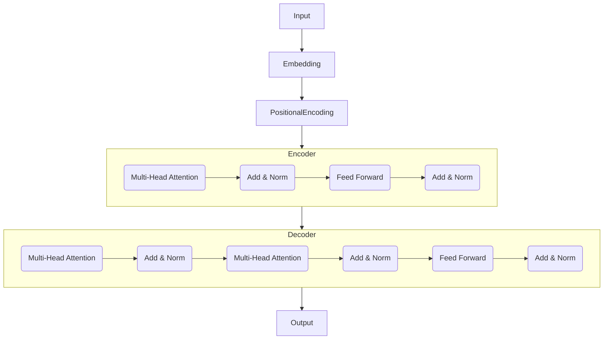

# Transformer大模型实战 Hugging Face的Transformers 库

## 1. 背景介绍
### 1.1  问题的由来
近年来，随着深度学习技术的快速发展，自然语言处理(NLP)领域取得了巨大的突破。Transformer模型的出现，更是将NLP推向了一个新的高度。Transformer模型以其强大的特征提取和序列建模能力，在机器翻译、文本分类、问答系统等诸多NLP任务上取得了state-of-the-art的表现。

然而，对于广大NLP研究者和从业者来说，要真正掌握并应用Transformer模型，仍面临不小的挑战。搭建Transformer需要大量的数据和计算资源，模型结构复杂，训练过程繁琐。如何快速上手并实践Transformer模型，成为了亟待解决的问题。

### 1.2  研究现状
为了让更多开发者能够方便地使用Transformer模型，一些优秀的开源项目应运而生。其中，由Hugging Face团队开发的Transformers库尤为瞩目。Transformers是一个基于PyTorch和TensorFlow的先进NLP库，提供了大量预训练的Transformer模型，使得开发者能够轻松地在各种NLP任务上微调和应用这些模型。

Transformers库自2019年发布以来，凭借其简洁的接口设计、丰富的预训练模型和优秀的文档，迅速成为了NLP领域最流行的开源项目之一。截至目前，Transformers已经集成了100多个预训练模型，覆盖了文本分类、命名实体识别、问答、摘要等主流NLP任务，并支持100多种语言。众多研究者和企业都在利用Transformers进行NLP研究和应用开发。

### 1.3  研究意义
Transformers库极大地降低了NLP开发的门槛，让更多人能够参与到NLP的研究和应用中来。通过学习和实践Transformers，我们不仅可以快速构建先进的NLP系统，还能深入理解Transformer的内部原理，有助于我们进一步优化模型性能。

同时，Transformers汇集了NLP领域最新的研究成果，代表了该领域的发展方向。深入研究Transformers，有助于我们把握NLP技术的前沿动态，洞察未来发展趋势。

### 1.4  本文结构
本文将全面介绍Hugging Face的Transformers库，帮助读者快速入门并实践Transformer模型。内容安排如下：

- 第2部分介绍Transformer的核心概念和Transformers库的整体架构。  
- 第3部分深入讲解Transformer的工作原理和关键技术细节。
- 第4部分以数学角度剖析Transformer的核心公式和原理。  
- 第5部分通过代码实例，演示如何用Transformers进行NLP任务开发。
- 第6部分总结Transformers在实际场景中的应用情况。
- 第7部分推荐Transformers相关的学习资源和开发工具。
- 第8部分讨论Transformer的未来发展趋势和面临的挑战。
- 第9部分为常见问题解答。

## 2. 核心概念与联系

在正式介绍Transformers库之前，我们先来了解一下Transformer模型的核心概念：

- Transformer：一种基于Self-Attention机制的Seq2Seq模型，摒弃了传统RNN模型，通过Attention实现并行计算，大幅提升了训练效率和精度。最早由Google于2017年提出。

- Self-Attention：Transformer的核心组件，用于捕捉输入序列中词与词之间的关系。具体来说，它通过计算Query、Key、Value三个矩阵，得到每个词对其他所有词的注意力权重，从而实现捕捉长距离依赖。

- Encoder-Decoder：Transformer沿用了传统Seq2Seq模型的编码器-解码器结构。Encoder用于对输入序列进行特征提取，Decoder根据Encoder的输出和之前的预测结果，逐步生成目标序列。

- Positional Encoding：由于Transformer不再使用RNN，为了引入序列的位置信息，它在Embedding后加入了基于Sin-Cos函数的位置编码。

- Multi-Head Attention：通过多个并行的Attention层，从不同的子空间捕捉序列的语义信息，增强模型的特征提取能力。

下图展示了Transformer模型的整体架构：

基于Transformer结构，Hugging Face的Transformers库实现了大量预训练模型，包括：

- BERT：用于文本分类、命名实体识别等任务的双向Transformer Encoder模型。
- GPT：用于文本生成的单向Transformer Decoder模型。
- RoBERTa：BERT的改进版，通过更多数据和更大batch size训练得到。
- XLNet：融合了BERT和Transformer-XL的自回归语言模型。
- T5：基于Transformer的文本到文本迁移学习框架。
- BART：结合了BERT和GPT的Seq2Seq预训练模型。
- ...

这些预训练模型涵盖了几乎所有主流NLP任务，极大提升了Transformer在工业界的应用效率。Transformers库让开发者能够便捷地调用和微调这些模型，是NLP从业者必备的工具之一。

## 3. 核心算法原理 & 具体操作步骤
### 3.1  算法原理概述
Transformer的核心是Self-Attention机制和Encoder-Decoder结构。

在Encoder中，每个输入词先通过Embedding层和Positional Encoding层，得到词向量表示。然后通过若干个相同的Layer，每个Layer包含一个Multi-Head Attention子层和一个Feed Forward子层，用于提取词与词之间的关系特征。

在Decoder中，除了两个与Encoder类似的子层外，还有一个Encoder-Decoder Attention子层，用于捕捉Decoder和Encoder之间的交互信息。Decoder根据Encoder的输出和之前的预测词，逐步生成目标序列。

### 3.2  算法步骤详解
1. Embedding层将输入序列中的每个词映射为dense vector：
$$
\mathbf{E} = \text{Embedding}(\mathbf{x})
$$

2. Positional Encoding层将位置信息加入到Embedding中：
$$
\mathbf{P} = \text{PositionalEncoding}(\mathbf{E})
$$

3. 对于Encoder的每个Layer：
   1) Multi-Head Attention子层：
      - 将输入$\mathbf{P}$乘以三个权重矩阵，得到Query、Key、Value：
      $$
      \mathbf{Q} = \mathbf{P} \mathbf{W}^Q \\
      \mathbf{K} = \mathbf{P} \mathbf{W}^K \\ 
      \mathbf{V} = \mathbf{P} \mathbf{W}^V
      $$
      - 计算Attention权重矩阵，并乘以Value得到输出：
      $$
      \text{Attention}(\mathbf{Q}, \mathbf{K}, \mathbf{V}) = \text{softmax}(\frac{\mathbf{Q}\mathbf{K}^T}{\sqrt{d_k}})\mathbf{V}
      $$
      - 将多个Head的输出拼接，并乘以权重矩阵$\mathbf{W}^O$得到最终输出。

   2) Feed Forward子层：
      - 使用两个全连接层对Multi-Head Attention的输出进行非线性变换：
      $$
      \text{FFN}(\mathbf{x}) = \text{ReLU}(\mathbf{x}\mathbf{W}_1 + \mathbf{b}_1)\mathbf{W}_2 + \mathbf{b}_2
      $$

   3) 每个子层之后都接一个Add & Norm层，用于残差连接和Layer Normalization。

4. Decoder与Encoder类似，但在Encoder-Decoder Attention中，Query来自Decoder Layer的输出，Key和Value来自Encoder的输出。

5. Decoder最后使用一个全连接层和Softmax层，将特征映射为目标词的概率分布，选择概率最大的词作为输出。

### 3.3  算法优缺点
优点：
- 并行计算能力强，训练速度快。
- 能够捕捉长距离依赖关系。
- 模型容量大，特征提取能力强。
- 适用于各种NLP任务。

缺点：
- 计算复杂度高，推理速度慢。
- 需要大量数据和算力进行预训练。
- 解释性差，模型内部工作机制仍不够清晰。

### 3.4  算法应用领域
Transformer已成为NLP领域的主流模型，广泛应用于以下任务：

- 机器翻译：如Google的BERT、Facebook的M2M-100等。
- 文本分类：如情感分析、新闻分类、垃圾邮件识别等。 
- 命名实体识别：如识别文本中的人名、地名、机构名等。
- 问答系统：如基于Wikipedia的问答、对话系统等。
- 文本摘要：自动生成文章摘要。
- 文本生成：如写作助手、对联生成、诗歌创作等。

除了NLP，Transformer还被引入到语音识别、图像分类等领域，展现出了广阔的应用前景。

## 4. 数学模型和公式 & 详细讲解 & 举例说明
### 4.1  数学模型构建
Transformer的核心是Self-Attention，其数学模型可表示为：

1. 输入序列$\mathbf{x} = (x_1, \ldots, x_n)$通过Embedding层和Positional Encoding层，得到隐藏状态$\mathbf{H}^0 = (\mathbf{h}_1^0, \ldots, \mathbf{h}_n^0)$。

2. 对于第$l$个Encoder Layer，首先通过Self-Attention计算隐藏状态$\mathbf{H}^{l}$：
$$
\mathbf{Q}^l = \mathbf{H}^{l-1} \mathbf{W}_q^l \\
\mathbf{K}^l = \mathbf{H}^{l-1} \mathbf{W}_k^l \\
\mathbf{V}^l = \mathbf{H}^{l-1} \mathbf{W}_v^l \\
\mathbf{H}^l = \text{Attention}(\mathbf{Q}^l, \mathbf{K}^l, \mathbf{V}^l)
$$

3. 然后通过Feed Forward层得到最终隐藏状态$\mathbf{H}^l$：
$$
\mathbf{F}^l = \text{ReLU}(\mathbf{H}^l\mathbf{W}_1^l + \mathbf{b}_1^l)\mathbf{W}_2^l + \mathbf{b}_2^l \\
\mathbf{H}^l = \text{LayerNorm}(\mathbf{H}^l + \mathbf{F}^l)
$$

4. Decoder的计算与Encoder类似，但多了一个Encoder-Decoder Attention层：
$$
\mathbf{Q}^l = \mathbf{H}_{dec}^{l-1} \mathbf{W}_q^l \\
\mathbf{K}^l = \mathbf{H}_{enc} \mathbf{W}_k^l \\
\mathbf{V}^l = \mathbf{H}_{enc} \mathbf{W}_v^l \\
\mathbf{A}^l = \text{Attention}(\mathbf{Q}^l, \mathbf{K}^l, \mathbf{V}^l) \\
\mathbf{H}_{dec}^l = \text{LayerNorm}(\mathbf{H}_{dec}^{l-1} + \mathbf{A}^l)
$$

### 4.2  公式推导过程
以下我们详细推导Self-Attention的计算公式。

对于第$l$个Encoder Layer的第$i$个词，其Query向量为：

$$
\mathbf{q}_i^l = \mathbf{h}_i^{l-1} \mathbf{W}_q^l
$$

其中$