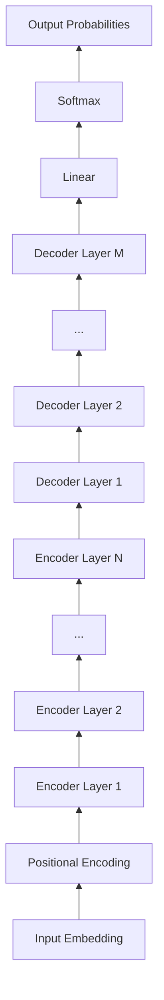

# Transformer大模型实战 加载自定义模型

作者：禅与计算机程序设计艺术 / Zen and the Art of Computer Programming

## 1. 背景介绍

### 1.1 问题的由来

随着人工智能技术的飞速发展,特别是自然语言处理(NLP)领域的突破,Transformer模型已经成为NLP任务的主流模型。Transformer模型以其强大的特征提取和上下文建模能力,在机器翻译、文本分类、问答系统等多个任务上取得了显著的效果提升。然而,对于很多实际应用场景,我们往往需要在特定领域的数据上微调Transformer模型,以获得更好的性能。这就需要我们掌握如何加载自定义的Transformer模型。

### 1.2 研究现状

目前,主流的深度学习框架如PyTorch、TensorFlow都提供了加载预训练Transformer模型的接口,使得我们可以方便地在这些框架下进行模型微调。同时,也有一些开源的Transformer实现,如Hugging Face的Transformers库,进一步降低了使用Transformer模型的门槛。不过,对于如何加载自定义的Transformer模型,现有的教程和文档还比较少,这给一些初学者带来了困惑。

### 1.3 研究意义

掌握加载自定义Transformer模型的方法,对于将Transformer应用到实际任务中至关重要。通过在特定领域数据上微调Transformer,我们可以充分利用其强大的特征提取能力,构建性能卓越的NLP应用。同时,这也有助于我们更好地理解Transformer的内部机制,为进一步改进Transformer模型提供思路。

### 1.4 本文结构

本文将详细介绍如何使用PyTorch和Hugging Face的Transformers库加载自定义的Transformer模型。我们首先回顾Transformer模型的核心概念,然后介绍加载自定义模型的一般流程。接下来,我们通过具体的代码实例,演示如何加载不同类型的自定义Transformer模型。同时,我们还将讨论一些常见的问题和注意事项。最后,我们总结Transformer模型的发展趋势和面临的挑战。

## 2. 核心概念与联系

Transformer模型的核心是自注意力机制(Self-Attention)和前馈神经网络(Feed-Forward Network)。自注意力机制允许模型的每个位置都能与其他所有位置进行交互,捕捉输入序列中的长距离依赖关系。多头自注意力(Multi-Head Attention)进一步增强了模型的表达能力。前馈神经网络则负责对自注意力的输出进行非线性变换。

Transformer模型通过堆叠多个编码器(Encoder)和解码器(Decoder)层来构建。每个编码器层包含一个自注意力子层和一个前馈子层,而解码器层在此基础上还引入了编码-解码注意力(Encoder-Decoder Attention)子层。残差连接(Residual Connection)和层归一化(Layer Normalization)被用于连接各个子层,使得模型更容易训练。

下图展示了Transformer模型的总体架构:

## 3. 核心算法原理 & 具体操作步骤

### 3.1 算法原理概述

Transformer模型的训练过程可以分为两个阶段:预训练(Pre-training)和微调(Fine-tuning)。在预训练阶段,我们在大规模无标注语料上训练Transformer模型,使其学习到语言的一般表示。在微调阶段,我们在特定任务的标注数据上微调预训练的模型,使其适应具体任务。

加载自定义Transformer模型,实际上就是加载预训练阶段得到的模型参数,然后在此基础上进行微调。PyTorch和Transformers库提供了一些辅助函数,使得这个过程变得简单易行。

### 3.2 算法步骤详解

加载自定义Transformer模型的一般步骤如下:

1. 定义模型配置(Model Configuration):指定模型的超参数,如隐藏层大小、注意力头数、层数等。
2. 实例化模型(Model Instantiation):根据模型配置实例化Transformer模型。
3. 加载模型参数(Load Model Weights):从本地文件或在线仓库加载预训练的模型参数。
4. 配置优化器和学习率调度器(Configure Optimizer and Scheduler):配置用于微调的优化算法和学习率策略。
5. 微调模型(Fine-tune Model):在下游任务的数据上微调预训练模型。
6. 评估和部署(Evaluate and Deploy):在测试集上评估微调后的模型性能,并将其部署到实际应用中。

### 3.3 算法优缺点

使用预训练的Transformer模型进行微调,相比从头开始训练有以下优点:

- 缩短训练时间:预训练模型已经学习到了语言的一般表示,微调时只需要少量的训练步骤。
- 提高模型性能:预训练模型可以更好地应对下游任务中的数据稀疏问题,提高泛化能力。
- 降低资源需求:微调所需的计算资源和标注数据通常远少于预训练。

但是,这种方法也有一些局限性:

- 依赖预训练模型的质量:如果预训练模型的质量不高,微调的效果也会受到影响。
- 迁移能力有限:如果下游任务与预训练任务差异较大,微调的效果可能不够理想。
- 参数量庞大:预训练的Transformer模型通常参数量很大,给部署带来挑战。

### 3.4 算法应用领域

基于Transformer的预训练模型已经在多个NLP任务上取得了state-of-the-art的结果,包括:

- 机器翻译:如BERT、GPT等模型在神经机器翻译上的应用。
- 文本分类:如基于BERT的文本分类模型在情感分析、新闻分类等任务上的表现。
- 问答系统:如基于ALBERT的问答模型在SQuAD数据集上的突出表现。
- 命名实体识别:如BERT在NER任务上的应用。
- 文本摘要:如BART、T5等模型在抽象式文本摘要任务上的应用。

此外,Transformer模型还被应用到了一些跨模态任务中,如图像字幕生成、视觉问答等。

## 4. 数学模型和公式 & 详细讲解 & 举例说明

### 4.1 数学模型构建

Transformer模型中的主要组件可以用数学公式表示如下:

1. 自注意力机制(Self-Attention):

$$
\text{Attention}(Q,K,V) = \text{softmax}(\frac{QK^T}{\sqrt{d_k}})V
$$

其中,$Q$,$K$,$V$分别表示查询(Query)、键(Key)、值(Value)矩阵,$d_k$为键向量的维度。

2. 多头自注意力(Multi-Head Attention):

$$
\begin{aligned}
\text{MultiHead}(Q,K,V) &= \text{Concat}(\text{head}_1, ..., \text{head}_h)W^O \\
\text{where head}_i &= \text{Attention}(QW_i^Q, KW_i^K, VW_i^V)
\end{aligned}
$$

其中,$W_i^Q$,$W_i^K$,$W_i^V$,$W^O$为可学习的权重矩阵,$h$为注意力头数。

3. 前馈神经网络(Feed-Forward Network):

$$
\text{FFN}(x) = \max(0, xW_1 + b_1)W_2 + b_2
$$

其中,$W_1$,$W_2$,$b_1$,$b_2$为可学习的权重矩阵和偏置向量。

4. 残差连接(Residual Connection)和层归一化(Layer Normalization):

$$
\begin{aligned}
x &= \text{LayerNorm}(x + \text{Sublayer}(x)) \\
\text{Sublayer}(x) &= \begin{cases}
\text{MultiHead}(x, x, x) & \text{(Encoder)} \\
\text{MultiHead}(x, \text{memory}, \text{memory}) & \text{(Decoder)}
\end{cases}
\end{aligned}
$$

其中,Sublayer表示自注意力子层或前馈子层。

### 4.2 公式推导过程

以上公式的推导过程如下:

1. 自注意力机制:
   - 将输入序列转化为查询、键、值矩阵$Q$,$K$,$V$。
   - 计算查询和键的点积并除以$\sqrt{d_k}$,得到注意力分数。
   - 对注意力分数应用softmax函数,得到注意力权重。
   - 将注意力权重与值矩阵相乘,得到自注意力的输出。

2. 多头自注意力:
   - 使用不同的权重矩阵将$Q$,$K$,$V$映射到$h$个子空间。
   - 在每个子空间中并行执行自注意力机制。
   - 将所有头的输出拼接,并通过线性变换得到最终输出。

3. 前馈神经网络:
   - 对输入进行两次线性变换,中间应用ReLU激活函数。

4. 残差连接和层归一化:
   - 将子层的输出与输入相加,然后应用层归一化。
   - 残差连接有助于梯度传播,层归一化则有助于稳定训练。

### 4.3 案例分析与讲解

下面以一个简单的例子来说明Transformer模型的计算过程:

假设我们有一个输入序列$x=\{x_1, x_2, x_3\}$,每个元素是一个$d$维向量。我们使用一个2层的Transformer编码器对其进行编码。

1. 输入嵌入:将输入序列$x$映射为嵌入向量$E=\{E_1, E_2, E_3\}$。

2. 位置编码:将位置编码$P$与嵌入向量$E$相加,得到$H^0 = E + P$。

3. 第一层编码器:
   - 自注意力子层:$A^1 = \text{MultiHead}(H^0, H^0, H^0)$
   - 残差连接和层归一化:$H^1 = \text{LayerNorm}(A^1 + H^0)$
   - 前馈子层:$F^1 = \text{FFN}(H^1)$
   - 残差连接和层归一化:$H^1 = \text{LayerNorm}(F^1 + H^1)$

4. 第二层编码器:
   - 自注意力子层:$A^2 = \text{MultiHead}(H^1, H^1, H^1)$
   - 残差连接和层归一化:$H^2 = \text{LayerNorm}(A^2 + H^1)$
   - 前馈子层:$F^2 = \text{FFN}(H^2)$
   - 残差连接和层归一化:$H^2 = \text{LayerNorm}(F^2 + H^2)$

最终,我们得到了输入序列$x$的Transformer编码$H^2=\{H^2_1, H^2_2, H^2_3\}$。

### 4.4 常见问题解答

1. Q:Transformer模型中的位置编码有什么作用?
   A:位置编码用于向模型引入序列中元素的位置信息。由于Transformer不包含循环和卷积操作,位置编码是让模型感知序列顺序的重要机制。

2. Q:为什么要在点积注意力中引入$\frac{1}{\sqrt{d_k}}$项?
   A:点积注意力中的$\frac{1}{\sqrt{d_k}}$项起到调节作用,使得点积不会因为$d_k$过大而变得过大。这有助于梯度的稳定传播。

3. Q:残差连接和层归一化是如何帮助Transformer训练的?
   A:残差连接通过将输入直接传递到输出,构成了一条捷径,使得梯度可以更容易地传播到底层。层归一化通过规范化每一层的激活,有助于稳定训练过程。

4. Q:Transformer中的自注意力机制与RNN、CNN相比有什么优势?
   A:与RNN相比,自注意力机制可以直接建模任意两个位置之间的依赖关系,而不受序列距离的限制。与CNN相比,自注意力机制可以捕捉更加全局的上下文信息。

## 