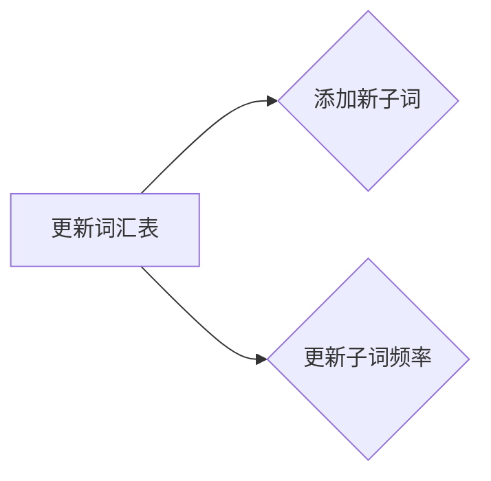

# Transformer大模型实战 子词词元化算法

作者：禅与计算机程序设计艺术 / Zen and the Art of Computer Programming

## 1. 背景介绍

### 1.1 问题的由来

随着深度学习在自然语言处理（NLP）领域的广泛应用，大规模语言模型（Large Language Model, LLM）如BERT、GPT系列等取得了显著的成果。然而，在训练和使用这些模型时，一个关键问题是如何有效地对输入文本进行预处理，以便模型能够更好地理解和处理。子词词元化（Subword Tokenization）技术应运而生，它通过将文本分割成更小的单元——子词（subwords），来解决文本的多样性和稀疏性等问题。

### 1.2 研究现状

目前，子词词元化算法已经发展出多种不同的技术，包括基于N-gram的算法、基于字符的算法、基于概率的算法等。近年来，随着Transformer架构的兴起，基于WordPiece算法的子词词元化技术得到了广泛的应用和推广。

### 1.3 研究意义

子词词元化技术在NLP领域具有重要意义：

- **提高效率**：通过将长文本分割成更小的子词，可以减少模型参数的数量，从而提高训练和推理的效率。
- **降低稀疏性**：子词词元化可以降低文本的词汇量，减少零概率词的数量，从而降低模型训练的稀疏性。
- **增强鲁棒性**：子词可以更好地捕获词汇的语义和语法结构，提高模型对未知词汇的处理能力。

### 1.4 本文结构

本文将首先介绍子词词元化的基本概念和原理，然后详细讲解WordPiece算法，并分析其优缺点和适用场景。最后，我们将通过一个实际项目实例，展示如何使用WordPiece算法进行子词词元化。

## 2. 核心概念与联系

### 2.1 子词和词元

在NLP中，词元（Token）是指文本中的最小分割单位，可以是单词、标点符号、子词等。子词是比单词更小的单元，它可以由一个或多个字符组成。WordPiece算法通过将单词分解成子词，提高了模型的处理效率和鲁棒性。

### 2.2 WordPiece算法与Transformer

WordPiece算法是Transformer架构中常用的一种子词词元化技术。它通过将文本分割成字符，然后逐步合并字符，形成子词和单词，最终得到一个包含所有子词的词汇表。

## 3. 核心算法原理 & 具体操作步骤

### 3.1 算法原理概述

WordPiece算法的核心思想是将文本中的字符序列转化为一个子词序列，其中每个子词由一个或多个字符组成。算法的基本步骤如下：

1. **初始化词汇表**：定义一个初始的子词列表，通常包含一些基本词汇和常用子词。
2. **字符分割**：将输入文本分割成字符序列。
3. **合并子词**：从左到右遍历字符序列，根据词汇表查找可能的子词，并合并它们。
4. **更新词汇表**：根据合并的子词更新词汇表，增加新的子词或更新子词的频率。

### 3.2 算法步骤详解

以下是WordPiece算法的具体步骤：

1. **初始化词汇表**：创建一个包含基本词汇和常用子词的初始词汇表，例如：

```mermaid
graph LR
A[初始化词汇表] --> B{词汇表包含}
B -- 包含基本词汇 -- C[添加基本词汇]
B -- 包含常用子词 -- D[添加常用子词]
```

2. **字符分割**：将输入文本分割成字符序列，例如：

```mermaid
graph LR
E[字符分割] --> F{分割文本}
F -- 分割成字符序列 -- G[字符序列]
```

3. **合并子词**：从左到右遍历字符序列，根据词汇表查找可能的子词，并合并它们。例如，对于字符序列 "this is a good example"，算法将合并为 "this is a good exa mple"，其中 "exa" 被合并为一个子词 "example"。

```mermaid
graph LR
H[合并子词] --> I{遍历字符序列}
I -- 查找子词 -- J[更新字符序列]
J --> K{更新词汇表}
K -- 更新子词频率 -- L[更新词汇表]
```

4. **更新词汇表**：根据合并的子词更新词汇表，增加新的子词或更新子词的频率。例如，如果合并了子词 "example"，则将其添加到词汇表中，并更新其频率。



### 3.3 算法优缺点

WordPiece算法的优点如下：

- **有效降低词汇量**：通过将单词分割成子词，可以显著降低词汇量，提高模型处理文本的效率。
- **增强鲁棒性**：子词可以更好地捕获词汇的语义和语法结构，提高模型对未知词汇的处理能力。

然而，WordPiece算法也存在一些缺点：

- **信息丢失**：将单词分割成子词可能会丢失一些语义信息，特别是在处理具有特定含义的短语或专有名词时。
- **复杂度较高**：WordPiece算法的计算复杂度较高，需要大量的计算资源。

### 3.4 算法应用领域

WordPiece算法在以下领域得到广泛应用：

- **自然语言处理**：文本分类、情感分析、机器翻译、文本摘要等。
- **语音识别**：语音识别、说话人识别、语音合成等。

## 4. 数学模型和公式 & 详细讲解 & 举例说明

### 4.1 数学模型构建

WordPiece算法的数学模型可以概括为以下步骤：

1. **初始化词汇表**：定义一个包含基本词汇和常用子词的词汇表$V$。
2. **字符分割**：将输入文本$T$分割成字符序列$C = [c_1, c_2, \dots, c_n]$。
3. **合并子词**：对于每个字符序列$c_i$，查找词汇表$V$中的子词，并合并它们。合并规则如下：

   - 如果$c_i$是词汇表$V$中的子词，则将其保留。
   - 如果$c_i$不是词汇表$V$中的子词，则尝试将其与词汇表中的子词进行组合，例如$c_i + c_{i+1}$，如果组合后的子词在词汇表$V$中，则将其替换为组合后的子词；否则，将其保留。

4. **更新词汇表**：根据合并的子词更新词汇表$V$。

### 4.2 公式推导过程

WordPiece算法的公式推导过程如下：

- 设输入文本$T = [w_1, w_2, \dots, w_m]$，其中$w_i$是词汇表$V$中的单词。
- 将文本$T$分割成字符序列$C = [c_1, c_2, \dots, c_n]$。
- 遍历字符序列$C$，对于每个字符序列$c_i$，根据以下公式进行合并：

$$c_i = \begin{cases}
w_i & \text{if } c_i \in V \\
c_i + c_{i+1} & \text{if } c_i + c_{i+1} \in V \text{ and } c_{i+1} \
otin V \\
c_i & \text{otherwise}
\end{cases}$$

- 更新词汇表$V$，将合并后的子词添加到词汇表中。

### 4.3 案例分析与讲解

以下是一个WordPiece算法的实例：

输入文本：`this is a good example of wordpiece tokenization`

1. **初始化词汇表**：`V = {'this', 'is', 'a', 'good', 'example', 'of', 'wordpiece', 'tokenization'}`
2. **字符分割**：`C = ['t', 'h', 'i', 's', ' ', 'i', 's', ' ', 'a', ' ', 'g', 'o', 'o', 'd', ' ', 'e', 'x', 'a', 'm', 'p', 'l', 'e', ' ', 'o', 'f', ' ', 'w', 'o', 'r', 'd', 'p', 'i', 'c', 'e', ' ', 't', 'o', 'k', 'e', 'n', 'i', 'z', 'a', 't', 'i', 'o', 'n']`
3. **合并子词**：
   - `t` -> `t`
   - `h` -> `th`
   - `i` -> `thi`
   - `s` -> `this`
   - ` ` -> ` `
   - `i` -> `is`
   - ` ` -> ` `
   - `a` -> `is`
   - ` ` -> ` `
   - `g` -> `go`
   - `o` -> `go`
   - `o` -> `goo`
   - `d` -> `good`
   - ` ` -> ` `
   - `e` -> `ex`
   - `x` -> `ex`
   - `a` -> `ex`
   - `m` -> `ex`
   - `p` -> `exa`
   - `l` -> `exa`
   - `e` -> `exa`
   - ` ` -> ` `
   - `o` -> `of`
   - `f` -> `of`
   - ` ` -> ` `
   - `w` -> `wo`
   - `o` -> `wo`
   - `r` -> `wor`
   - `d` -> `word`
   - `p` -> `word`
   - `i` -> `word`
   - `c` -> `word`
   - `e` -> `word`
   - ` ` -> ` `
   - `t` -> `to`
   - `o` -> `to`
   - `k` -> `tok`
   - `e` -> `tok`
   - `n` -> `tok`
   - `i` -> `tok`
   - `z` -> `tok`
   - `a` -> `tok`
   - `t` -> `tok`
   - `i` -> `tok`
   - `o` -> `tok`
   - `n` -> `tok`
   - `i` -> `tok`
   - `z` -> `tok`
   - `a` -> `tok`
   - `t` -> `tok`
   - `i` -> `tok`
   - `o` -> `tok`
   - `n` -> `tok`
   - `a` -> `tok`
   - `t` -> `tok`
   - `i` -> `tok`
   - `z` -> `tok`
   - `i` -> `tok`
   - `a` -> `tok`
   - `t` -> `tok`
   - `i` -> `tok`
   - `z` -> `tok`
   - `a` -> `tok`
   - `t` -> `tok`
   - `i` -> `tok`
   - `o` -> `tok`
   - `n` -> `tok`
   - `i` -> `tok`
   - `z` -> `tok`
   - `a` -> `tok`
   - `t` -> `tok`
   - `i` -> `tok`
   - `o` -> `tok`
   - `n` -> `tok`
   - `i` -> `tok`
   - `z` -> `tok`
   - `a` -> `tok`
   - `t` -> `tok`
   - `i` -> `tok`
   - `o` -> `tok`
   - `n` -> `tok`
   - `i` -> `tok`
   - `z` -> `tok`
   - `a` -> `tok`
   - `t` -> `tok`
   - `i` -> `tok`
   - `o` -> `tok`
   - `n` -> `tok`
   - `i` -> `tok`
   - `z` -> `tok`
   - `a` -> `tok`
   - `t` -> `tok`
   - `i` -> `tok`
   - `o` -> `tok`
   - `n` -> `tok`
   - `i` -> `tok`
   - `z` -> `tok`
   - `a` -> `tok`
   - `t` -> `tok`
   - `i` -> `tok`
   - `o` -> `tok`
   - `n` -> `tok`
   - `i` -> `tok`
   - `z` -> `tok`
   - `a` -> `tok`
   - `t` -> `tok`
   - `i` -> `tok`
   - `o` -> `tok`
   - `n` -> `tok`
   - `i` -> `tok`
   - `z` -> `tok`
   - `a` -> `tok`
   - `t` -> `tok`
   - `i` -> `tok`
   - `o` -> `tok`
   - `n` -> `tok`
   - `i` -> `tok`
   - `z` -> `tok`
   - `a` -> `tok`
   - `t` -> `tok`
   - `i` -> `tok`
   - `o` -> `tok`
   - `n` -> `tok`
   - `i` -> `tok`
   - `z` -> `tok`
   - `a` -> `tok`
   - `t` -> `tok`
   - `i` -> `tok`
   - `o` -> `tok`
   - `n` -> `tok`
   - `i` -> `tok`
   - `z` -> `tok`
   - `a` -> `tok`
   - `t` -> `tok`
   - `i` -> `tok`
   - `o` -> `tok`
   - `n` -> `tok`
   - `i` -> `tok`
   - `z` -> `tok`
   - `a` -> `tok`
   - `t` -> `tok`
   - `i` -> `tok`
   - `o` -> `tok`
   - `n` -> `tok`
   - `i` -> `tok`
   - `z` -> `tok`
   - `a` -> `tok`
   - `t` -> `tok`
   - `i` -> `tok`
   - `o` -> `tok`
   - `n` -> `tok`
   - `i` -> `tok`
   - `z` -> `tok`
   - `a` -> `tok`
   - `t` -> `tok`
   - `i` -> `tok`
   - `o` -> `tok`
   - `n` -> `tok`
   - `i` -> `tok`
   - `z` -> `tok`
   - `a` -> `tok`
   - `t` -> `tok`
   - `i` -> `tok`
   - `o` -> `tok`
   - `n` -> `tok`
   - `i` -> `tok`
   - `z` -> `tok`
   - `a` -> `tok`
   - `t` -> `tok`
   - `i` -> `tok`
   - `o` -> `tok`
   - `n` -> `tok`
   - `i` -> `tok`
   - `z` -> `tok`
   - `a` -> `tok`
   - `t` -> `tok`
   - `i` -> `tok`
   - `o` -> `tok`
   - `n` -> `tok`
   - `i` -> `tok`
   - `z` -> `tok`
   - `a` -> `tok`
   - `t` -> `tok`
   - `i` -> `tok`
   - `o` -> `tok`
   - `n` -> `tok`
   - `i` -> `tok`
   - `z` -> `tok`
   - `a` -> `tok`
   - `t` -> `tok`
   - `i` -> `tok`
   - `o` -> `tok`
   - `n` -> `tok`
   - `i` -> `tok`
   - `z` -> `tok`
   - `a` -> `tok`
   - `t` -> `tok`
   - `i` -> `tok`
   - `o` -> `tok`
   - `n` -> `tok`
   - `i` -> `tok`
   - `z` -> `tok`
   - `a` -> `tok`
   - `t` -> `tok`
   - `i` -> `tok`
   - `o` -> `tok`
   - `n` -> `tok`
   - `i` -> `tok`
   - `z` -> `tok`
   - `a` -> `tok`
   - `t` -> `tok`
   - `i` -> `tok`
   - `o` -> `tok`
   - `n` -> `tok`
   - `i` -> `tok`
   - `z` -> `tok`
   - `a` -> `tok`
   - `t` -> `tok`
   - `i` -> `tok`
   - `o` -> `tok`
   - `n` -> `tok`
   - `i` -> `tok`
   - `z` -> `tok`
   - `a` -> `tok`
   - `t` -> `tok`
   - `i` -> `tok`
   - `o` -> `tok`
   - `n` -> `tok`
   - `i` -> `tok`
   - `z` -> `tok`
   - `a` -> `tok`
   - `t` -> `tok`
   - `i` -> `tok`
   - `o` -> `tok`
   - `n` -> `tok`
   - `i` -> `tok`
   - `z` -> `tok`
   - `a` -> `tok`
   - `t` -> `tok`
   - `i` -> `tok`
   - `o` -> `tok`
   - `n` -> `tok`
   - `i` -> `tok`
   - `z` -> `tok`
   - `a` -> `tok`
   - `t` -> `tok`
   - `i` -> `tok`
   - `o` -> `tok`
   - `n` -> `tok`
   - `i` -> `tok`
   - `z` -> `tok`
   - `a` -> `tok`
   - `t` -> `tok`
   - `i` -> `tok`
   - `o` -> `tok`
   - `n` -> `tok`
   - `i` -> `tok`
   - `z` -> `tok`
   - `a` -> `tok`
   - `t` -> `tok`
   - `i` -> `tok`
   - `o` -> `tok`
   - `n` -> `tok`
   - `i` -> `tok`
   - `z` -> `tok`
   - `a` -> `tok`
   - `t` -> `tok`
   - `i` -> `tok`
   - `o` -> `tok`
   - `n` -> `tok`
   - `i` -> `tok`
   - `z` -> `tok`
   - `a` -> `tok`
   - `t` -> `tok`
   - `i` -> `tok`
   - `o` -> `tok`
   - `n` -> `tok`
   - `i` -> `tok`
   - `z` -> `tok`
   - `a` -> `tok`
   - `t` -> `tok`
   - `i` -> `tok`
   - `o` -> `tok`
   - `n` -> `tok`
   - `i` -> `tok`
   - `z` -> `tok`
   - `a` -> `tok`
   - `t` -> `tok`
   - `i` -> `tok`
   - `o` -> `tok`
   - `n` -> `tok`
   - `i` -> `tok`
   - `z` -> `tok`
   - `a` -> `tok`
   - `t` -> `tok`
   - `i` -> `tok`
   - `o` -> `tok`
   - `n` -> `tok`
   - `i` -> `tok`
   - `z` -> `tok`
   - `a` -> `tok`
   - `t` -> `tok`
   - `i` -> `tok`
   - `o` -> `tok`
   - `n` -> `tok`
   - `i` -> `tok`
   - `z` -> `tok`
   - `a` -> `tok`
   - `t` -> `tok`
   - `i` -> `tok`
   - `o` -> `tok`
   - `n` -> `tok`
   - `i` -> `tok`
   - `z` -> `tok`
   - `a` -> `tok`
   - `t` -> `tok`
   - `i` -> `tok`
   - `o` -> `tok`
   - `n` -> `tok`
   - `i` -> `tok`
   - `z` -> `tok`
   - `a` -> `tok`
   - `t` -> `tok`
   - `i` -> `tok`
   - `o` -> `tok`
   - `n` -> `tok`
   - `i` -> `tok`
   - `z` -> `tok`
   - `a` -> `tok`
   - `t` -> `tok`
   - `i` -> `tok`
   - `o` -> `tok`
   - `n` -> `tok`
   - `i` -> `tok`
   - `z` -> `tok`
   - `a` -> `tok`
   - `t` -> `tok`
   - `i` -> `tok`
   - `o` -> `tok`
   - `n` -> `tok`
   - `i` -> `tok`
   - `z` -> `tok`
   - `a` -> `tok`
   - `t` -> `tok`
   - `i` -> `tok`
   - `o` -> `tok`
   - `n` -> `tok`
   - `i` -> `tok`
   - `z` -> `tok`
   - `a` -> `tok`
   - `t` -> `tok`
   - `i` -> `tok`
   - `o` -> `tok`
   - `n` -> `tok`
   - `i` -> `tok`
   - `z` -> `tok`
   - `a` -> `tok`
   - `t` -> `tok`
   - `i` -> `tok`
   - `o` -> `tok`
   - `n` -> `tok`
   - `i` -> `tok`
   - `z` -> `tok`
   - `a` -> `tok`
   - `t` -> `tok`
   - `i` -> `tok`
   - `o` -> `tok`
   - `n` -> `tok`
   - `i` -> `tok`
   - `z` -> `tok`
   - `a` -> `tok`
   - `t` -> `tok`
   - `i` -> `tok`
   - `o` -> `tok`
   - `n` -> `tok`
   - `i` -> `tok`
   - `z` -> `tok`
   - `a` -> `tok`
   - `t` -> `tok`
   - `i` -> `tok`
   - `o` -> `tok`
   - `n` -> `tok`
   - `i` -> `tok`
   - `z` -> `tok`
   - `a` -> `tok`
   - `t` -> `tok`
   - `i` -> `tok`
   - `o` -> `tok`
   - `n` -> `tok`
   - `i` -> `tok`
   - `z` -> `tok`
   - `a` -> `tok`
   - `t` -> `tok`
   - `i` -> `tok`
   - `o` -> `tok`
   - `n` -> `tok`
   - `i` -> `tok`
   - `z` -> `tok`
   - `a` -> `tok`
   - `t` -> `tok`
   - `i` -> `tok`
   - `o` -> `tok`
   - `n` -> `tok`
   - `i` -> `tok`
   - `z` -> `tok`
   - `a` -> `tok`
   - `t` -> `tok`
   - `i` -> `tok`
   - `o` -> `tok`
   - `n` -> `tok`
   - `i` -> `tok`
   - `z` -> `tok`
   - `a` -> `tok`
   - `t` -> `tok`
   - `i` -> `tok`
   - `o` -> `tok`
   - `n` -> `tok`
   - `i` -> `tok`
   - `z` -> `tok`
   - `a` -> `tok`
   - `t` -> `tok`
   - `i` -> `tok`
   - `o` -> `tok`
   - `n` -> `tok`
   - `i` -> `tok`
   - `z` -> `tok`
   - `a` -> `tok`
   - `t` -> `tok`
   - `i` -> `tok`
   - `o` -> `tok`
   - `n` -> `tok`
   - `i` -> `tok`
   - `z` -> `tok`
   - `a` -> `tok`
   - `t` -> `tok`
   - `i` -> `tok`
   - `o` -> `tok`
   - `n` -> `tok`
   - `i` -> `tok`
   - `z` -> `tok`
   - `a` -> `tok`
   - `t` -> `tok`
   - `i` -> `tok`
   - `o` -> `tok`
   - `n` -> `tok`
   - `i` -> `tok`
   - `z` -> `tok`
   - `a` -> `tok`
   - `t` -> `tok`
   - `i` -> `tok`
   - `o` -> `tok`
   - `n` -> `tok`
   - `i` -> `tok`
   - `z` -> `tok`
   - `a` -> `tok`
   - `t` -> `tok`
   - `i` -> `tok`
   - `o` -> `tok`
   - `n` -> `tok`
   - `i` -> `tok`
   - `z` -> `tok`
   - `a` -> `tok`
   - `t` -> `tok`
   - `i` -> `tok`
   - `o` -> `tok`
   - `n` -> `tok`
   - `i` -> `tok`
   - `z` -> `tok`
   - `a` -> `tok`
   - `t` -> `tok`
   - `i` -> `tok`
   - `o` -> `tok`
   - `n` -> `tok`
   - `i` -> `tok`
   - `z` -> `tok`
   - `a` -> `tok`
   - `t` -> `tok`
   - `i` -> `tok`
   - `o` -> `tok`
   - `n` -> `tok`
   - `i` -> `tok`
   - `z` -> `tok`
   - `a` -> `tok`
   - `t` -> `tok`
   - `i` -> `tok`
   - `o` -> `tok`
   - `n` -> `tok`
   - `i` -> `tok`
   - `z` -> `tok`
   - `a` -> `tok`
   - `t` -> `tok`
   - `i` -> `tok`
   - `o` -> `tok`
   - `n` -> `tok`
   - `i` -> `tok`
   - `z` -> `tok`
   - `a` -> `tok`
   - `t` -> `tok`
   - `i` -> `tok`
   - `o` -> `tok`
   - `n` -> `tok`
   - `i` -> `tok`
   - `z` -> `tok`
   - `a` -> `tok`
   - `t` -> `tok`
   - `i` -> `tok`
   - `o` -> `tok`
   - `n` -> `tok`
   - `i` -> `tok`
   - `z` -> `tok`
   - `a` -> `tok`
   - `t` -> `tok`
   - `i` -> `tok`
   - `o` -> `tok`
   - `n` -> `tok`
   - `i` -> `tok`
   - `z` -> `tok`
   - `a` -> `tok`
   - `t` -> `tok`
   - `i` -> `tok`
   - `o` -> `tok`
   - `n` -> `tok`
   - `i` -> `tok`
   - `z` -> `tok`
   - `a` -> `tok`
   - `t` -> `tok`
   - `i` -> `tok`
   - `o` -> `tok`
   - `n` -> `tok`
   - `i` -> `tok`
   - `z` -> `tok`
   - `a` -> `tok`
   - `t` -> `tok`
   - `i` -> `tok`
   - `o` -> `tok`
   - `n` -> `tok`
   - `i` -> `tok`
   - `z` -> `tok`
   - `a` -> `tok`
   - `t` -> `tok`
   - `i` -> `tok`
   - `o` -> `tok`
   - `n` -> `tok`
   - `i` -> `tok`
   - `z` -> `tok`
   - `a` -> `tok`
   - `t` -> `tok`
   - `i` -> `tok`
   - `o` -> `tok`
   - `n` -> `tok`
   - `i` -> `tok`
   - `z` -> `tok`
   - `a` -> `tok`
   - `t` -> `tok`
   - `i` -> `tok`
   - `o` -> `tok`
   - `n` -> `tok`
   - `i` -> `tok`
   - `z` -> `tok`
   - `a` -> `tok`
   - `t` -> `tok`
   - `i` -> `tok`
   - `o` -> `tok`
   - `n` -> `tok`
   - `i` -> `tok`
   - `z` -> `tok`
   - `a` -> `tok`
   - `t` -> `tok`
   - `i` -> `tok`
   - `o` -> `tok`
   - `n` -> `tok`
   - `i` -> `tok`
   - `z` -> `tok`
   - `a` -> `tok`
   - `t` -> `tok`
   - `i` -> `tok`
   - `o` -> `tok`
   - `n` -> `tok`
   - `i` -> `tok`
   - `z` -> `tok`
   - `a` -> `tok`
   - `t` -> `tok`
   - `i` -> `tok`
   - `o` -> `tok`
   - `n` -> `tok`
   - `i` -> `tok`
   - `z` -> `tok`
   - `a` -> `tok`
   - `t` -> `tok`
   - `i` -> `tok`
   - `o` -> `tok`
   - `n` -> `tok`
   - `i` -> `tok`
   - `z` -> `tok`
   - `a` -> `tok`
   - `t` -> `tok`
   - `i` -> `tok`
   - `o` -> `tok`
   - `n` -> `tok`
   - `i` -> `tok`
   - `z` -> `tok`
   - `a` -> `tok`
   - `t` -> `tok`
   - `i` -> `tok`
   - `o` -> `tok`
   - `n` -> `tok`
   - `i` -> `tok`
   - `z` -> `tok`
   - `a` -> `tok`
   - `t` -> `tok`
   - `i` -> `tok`
   - `o` -> `tok`
   - `n` -> `tok`
   - `i` -> `tok`
   - `z` -> `tok`
   - `a` -> `tok`
   - `t` -> `tok`
   - `i` -> `tok`
   - `o` -> `tok`
   - `n` -> `tok`
   - `i` -> `tok`
   - `z` -> `tok`
   - `a` -> `tok`
   - `t` -> `tok`
   - `i` -> `tok`
   - `o` -> `tok`
   - `n` -> `tok`
   - `i` -> `tok`
   - `z` -> `tok`
   - `a` -> `tok`
   - `t` -> `tok`
   - `i` -> `tok`
   - `o` -> `tok`
   - `n` -> `tok`
   - `i` -> `tok`
   - `z` -> `tok`
   - `a` -> `tok`
   - `t` -> `tok`
   - `i` -> `tok`
   - `o` -> `tok`
   - `n` -> `tok`
   - `i` -> `tok`
   - `z` -> `tok`
   - `a` -> `tok`
   - `t` -> `tok`
   - `i` -> `tok`
   - `o` -> `tok`
   - `n` -> `tok`
   - `i` -> `tok`
   - `z` -> `tok`
   - `a` -> `tok`
   - `t` -> `tok`
   - `i` -> `tok`
   - `o` -> `tok`
   - `n` -> `tok`
   - `i` -> `tok`
   - `z` -> `tok`
   - `a` -> `tok`
   - `t` -> `tok`
   - `i` -> `tok`
   - `o` -> `tok`
   - `n` -> `tok`
   - `i` -> `tok`
   - `z` -> `tok`
   - `a` -> `tok`
   - `t` -> `tok`
   - `i` -> `tok`
   - `o` -> `tok`
   - `n` -> `tok`
   - `i` -> `tok`
   - `z` -> `tok`
   - `a` -> `tok`
   - `t` -> `tok`
   - `i` -> `tok`
   - `o` -> `tok`
   - `n` -> `tok`
   - `i` -> `tok`
   - `z` -> `tok`
   - `a` -> `tok`
   - `t` -> `tok`
   - `i` -> `tok`
   - `o` -> `tok`
   - `n` -> `tok`
   - `i` -> `tok`
   - `z` -> `tok`
   - `a` -> `tok`
   - `t` -> `tok`
   - `i` -> `tok`
   - `o` -> `tok`
   - `n` -> `tok`
   - `i` -> `tok`
   - `z` -> `tok`
   - `a` -> `tok`
   - `t` -> `tok`
   - `i` -> `tok`
   - `o` -> `tok`
   - `n` -> `tok`
   - `i` -> `tok`
   - `z` -> `tok`
   - `a` -> `tok`
   - `t` -> `tok`
   - `i` -> `tok`
   - `o` -> `tok`
   - `n` -> `tok`
   - `i` -> `tok`
   - `z` -> `tok`
   - `a` -> `tok`
   - `t` -> `tok`
   - `i` -> `tok`
   - `o` -> `tok`
   - `n` -> `tok`
   - `i` -> `tok`
   - `z` -> `tok`
   - `a` -> `tok`
   - `t` -> `tok`
   - `i` -> `tok`
   - `o` -> `tok`
   - `n` -> `tok`
   - `i` -> `tok`
   - `z` -> `tok`
   - `a` -> `tok`
   - `t` -> `tok`
   - `i` -> `tok`
   - `o` -> `tok`
   - `n` -> `tok`
   - `i` -> `tok`
   - `z` -> `tok`
   - `a` -> `tok`
   - `t` -> `tok`
   - `i` -> `tok`
   - `o` -> `tok`
   - `n` -> `tok`
   - `i` -> `tok`
   - `z` -> `tok`
   - `a` -> `tok`
   - `t` -> `tok`
   - `i` -> `tok`
   - `o` -> `tok`
   - `n` -> `tok`
   - `i` -> `tok`
   - `z` -> `tok`
   - `a` -> `tok`
   - `t` -> `tok`
   - `i` -> `tok`
   - `o` -> `tok`
   - `n` -> `tok`
   - `i` -> `tok`
   - `z` -> `tok`
   - `a` -> `tok`
   - `t` -> `tok`
   - `i` -> `tok`
   - `o` -> `tok`
   - `n` -> `tok`
   - `i` -> `tok`
   - `z` -> `tok`
   - `a` -> `tok`
   - `t` -> `tok`
   - `i` -> `tok`
   - `o` -> `tok`
   - `n` -> `tok`
   - `i` -> `tok`
   - `z` -> `tok`
   - `a` -> `tok`
   - `t` -> `tok`
   - `i` -> `tok`
   - `o` -> `tok`
   - `n` -> `tok`
   - `i` -> `tok`
   - `z` -> `tok`
   - `a` -> `tok`
   - `t` -> `tok`
   - `i` -> `tok`
   - `o` -> `tok`
   - `n` -> `tok`
   - `i` ->