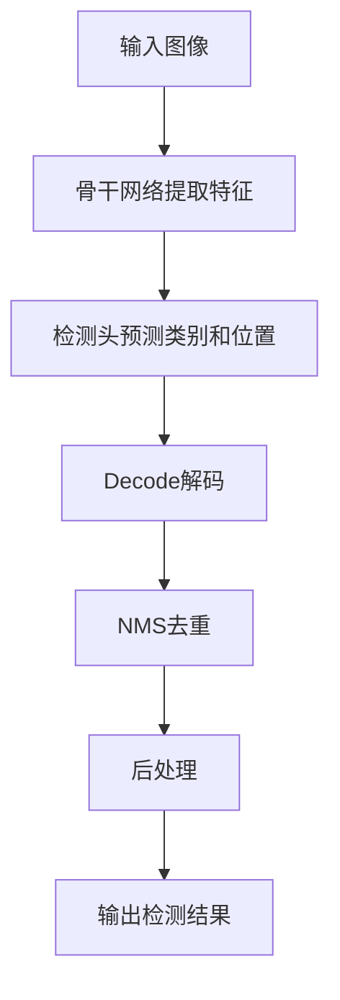

# YOLOv8原理与代码实例讲解

作者：禅与计算机程序设计艺术 / Zen and the Art of Computer Programming 

## 1. 背景介绍

### 1.1  问题的由来

目标检测是计算机视觉领域的一个基础性问题,旨在从图像或视频中识别和定位感兴趣的目标对象。它在智能监控、无人驾驶、机器人感知等诸多领域有着广泛的应用前景。传统的目标检测方法主要基于手工设计特征,如 HOG、SIFT 等,再结合机器学习分类器进行检测,存在特征表达能力不足、检测精度低、实时性差等缺陷。

### 1.2  研究现状

近年来,以卷积神经网络(CNN)为代表的深度学习技术的兴起,极大地推动了目标检测的发展。其中,YOLO(You Only Look Once)系列算法以其检测速度快、检测精度高、易于训练等优势脱颖而出,成为业界广泛使用的目标检测框架。YOLO算法最早由 Joseph Redmon 等人于2015年提出,此后经历了 v2~v7 多个版本的迭代优化,不断刷新目标检测任务的性能指标。

2023年4月,Ultralytics 团队开源发布了 YOLO 系列的最新版本 YOLOv8,在原有版本基础上进一步改进模型结构和训练策略,实现了更快的推理速度和更高的检测精度,引起了学术界和工业界的广泛关注。

### 1.3  研究意义

YOLOv8 作为目标检测领域的 state-of-the-art 方法,对于推动相关技术的进步和落地应用具有重要意义:

1. 技术创新: YOLOv8 在骨干网络、检测头、损失函数等方面进行了诸多改进,为目标检测算法的设计提供了新的思路和参考。深入剖析其内在原理,有助于研究人员探索更优的检测模型。

2. 工程实践: YOLOv8 开源了训练和部署的完整代码,使工程师能够方便地应用到实际项目中。系统学习其代码实现,可以帮助掌握目标检测系统开发的核心技能。

3. 应用拓展: YOLOv8 强大的性能为众多视觉应用提供了基础支撑,结合具体场景进行优化和适配,有望进一步提升相关行业的自动化和智能化水平。

### 1.4  本文结构

本文将全面介绍 YOLOv8 目标检测算法的原理和实现。第2部分阐述 YOLOv8 中的核心概念;第3部分详细讲解其算法原理;第4部分给出相关数学模型和公式推导;第5部分以代码实例演示 YOLOv8 的使用方法;第6部分讨论其典型应用场景;第7部分推荐学习 YOLOv8 的资源;第8部分总结全文并展望其未来发展方向。

## 2. 核心概念与联系

在正式介绍 YOLOv8 之前,有必要先明确几个核心概念:

- 目标检测(Object Detection): 给定一张图片,识别出图像中感兴趣的目标(如汽车、行人等),并给出其类别标签和位置坐标。属于计算机视觉的基本任务之一。

- 边界框(Bounding Box): 用于表示目标位置的矩形框,通常由左上角和右下角坐标(x1, y1, x2, y2)或中心点坐标和宽高(cx, cy, w, h)表示。

- 锚框(Anchor Box): 预先设置的一组不同尺度和宽高比的候选框,在检测过程中与真实边界框进行匹配,用于加速目标定位。

- 骨干网络(Backbone): 用于提取图像特征的卷积神经网络,通常采用预训练的分类网络(如 ResNet、CSPNet 等)。

- 检测头(Detection Head): 接收骨干网络提取的特征图,经过卷积和上采样等操作,输出目标类别、位置等预测信息。

- 损失函数(Loss Function): 衡量预测结果与真实标注之间差异的函数,用于指导模型训练。常见的有分类损失(如交叉熵)、回归损失(如 IoU Loss)等。

理解这些概念之间的联系,有助于更好地掌握 YOLOv8 的工作原理:
- YOLOv8 使用 CSPNet 作为骨干网络提取图像特征,再通过 PANet 等结构融合多尺度信息。
- 检测头基于特征图预测目标的类别概率和相对锚框的位置偏移量。
- 训练过程中,根据预测框与真实框的匹配质量,计算分类和回归损失,并利用梯度下降算法优化模型参数。
- 推理时,根据预测结果得到目标的类别标签和边界框坐标,绘制在原图上作为检测输出。

## 3. 核心算法原理 & 具体操作步骤

### 3.1  算法原理概述

YOLOv8 沿袭了 YOLO 系列"一次预测端到端检测"的核心思想,通过单个神经网络直接回归目标的类别和位置信息。相比前几代,它在以下几个方面进行了改进和优化:

1. 骨干网络: 采用 ELAN(Efficient Layer Aggregation Network)结构,引入 C2f 层和 CSP v2 模块,增强特征提取和融合能力。

2. 检测头: 使用 TAL(Task Alignment Learning)对齐各检测层的学习目标,同时利用 DFL(Distribution Focal Loss)和 VFL(Varifocal Loss)平衡难易样本。

3. 标签分配: 改进 TOOD 标签分配策略,根据 GT 和锚框的形状与尺度进行正负样本匹配,提高回归精度。

4. 其他改进: 包括 Focal Loss 替代二元交叉熵、SimOTA 动态 K 值、多尺度训练、自适应锚框等。

总的来说,YOLOv8 在保持原有 YOLO 系列简洁高效的同时,汲取了目标检测领域的最新研究成果,达到了更高的检测性能。

### 3.2  算法步骤详解

下面结合流程图,详细讲解 YOLOv8 的检测步骤:

1. 输入图像: 将待检测的图片缩放到指定尺寸(如640x640),归一化后输入网络。

2. 骨干网络提取特征: 图像依次经过 Focus、Conv、C2f、CSP 等层,得到 1/8、1/16、1/32 尺度的特征图。

3. 检测头预测类别和位置: 在三个尺度的特征图上,通过卷积层分别预测每个位置的目标概率和相对锚框的偏移量。

4. Decode解码: 根据锚框和预测的偏移量计算目标的真实边界框坐标,并用 Sigmoid 函数将类别概率映射到 [0,1] 区间。

5. NMS去重: 对于同一目标的多个预测框,根据置信度和 IoU 阈值进行非极大值抑制,保留得分最高的检测结果。

6. 后处理: 根据预设的检测阈值,过滤掉低置信度的预测框,将坐标从归一化尺度还原到原图尺度。

7. 输出检测结果: 返回每个目标的类别标签、置信度得分和边界框坐标,可视化绘制在原图上。

### 3.3  算法优缺点

YOLOv8 具有如下优点:

- 速度快: 单阶段端到端设计,推理速度可达 150 FPS,满足实时检测需求。
- 精度高: 在 COCO 数据集上 mAP 达到 52.9% ,超越同类 SOTA 方法。  
- 易用性强: 提供了从训练到部署的完整工具链,文档丰富,社区活跃。
- 通用性好: 预训练模型可直接迁移到新的数据集,支持多种下游任务扩展。

同时也存在一定局限:

- 小目标检测效果不佳,容易漏检。
- 对遮挡、模糊等复杂场景的鲁棒性有待提高。
- 需要大量标注数据进行训练,数据准备成本高。

### 3.4  算法应用领域

凭借优异的性能,YOLOv8 在众多领域得到应用,如:

- 智慧安防: 人脸识别、行为分析、异常检测等
- 智能交通: 车辆检测、车牌识别、交通事件检测等  
- 无人驾驶: 行人、车辆、路标等关键目标的实时检测
- 工业质检: 产品缺陷检测、字符识别等
- 医学影像: 器官、病变、医疗器械等目标的识别与定位
- 农业监测: 作物病虫害检测、农产品分拣等
- 零售场景: 商品识别、货架陈列分析等

随着算法的不断演进和计算设备的升级,YOLOv8 有望在更广阔的应用场景发挥作用。

## 4. 数学模型和公式 & 详细讲解 & 举例说明

### 4.1  数学模型构建

YOLOv8 可以看作由以下几个模块组成的数学模型:

1. 骨干网络 $f_b$: 将输入图像 $I$ 映射到特征图 $F$,即 $F=f_b(I)$。

2. 检测头 $f_h$: 在特征图 $F$ 上预测目标概率 $P$ 和边界框偏移量 $\Delta$,即 $(P, \Delta)=f_h(F)$。

3. 损失函数 $L$: 衡量预测结果 $(P, \Delta)$ 与真实标签 $(Y, B)$ 的差异,即 $L=L_{cls}(P,Y)+\lambda \cdot L_{reg}(\Delta,B)$。其中 $L_{cls}$ 为分类损失, $L_{reg}$ 为回归损失, $\lambda$ 为平衡系数。

整个模型可表示为:

$$
\begin{aligned}
\hat{Y}, \hat{B} &= f_h(f_b(I)) \\
L &= L_{cls}(\hat{Y},Y)+\lambda \cdot L_{reg}(\hat{B},B)
\end{aligned}
$$

其中 $\hat{Y}$, $\hat{B}$ 分别表示预测的类别概率和边界框坐标。

### 4.2  公式推导过程

以下详细推导 YOLOv8 中的几个关键公式。

1. 边界框编码:

设真实框坐标为 $(x, y, w, h)$,锚框坐标为 $(x_a, y_a, w_a, h_a)$,YOLOv8 采用以下公式进行边界框编码:

$$
\begin{aligned}
t_x &= (x - x_a) / w_a \\
t_y &= (y - y_a) / h_a \\
t_w &= \log(w / w_a) \\
t_h &= \log(h / h_a)
\end{aligned}
$$

其中 $(t_x, t_y, t_w, t_h)$ 为边界框的偏移量,模型回归的目标就是预测这个偏移量。

2. 分类损失:

YOLOv8 使用二元交叉熵(BCE)作为分类损失,对于第 $i$ 个样本的第 $c$ 类,其损失定义为:

$$
L_{cls}^{(i,c)} = -[y_c^{(i)}\log(\hat{y}_c^{(i)}) + (1-y_c^{(i)})\log(1-\hat{y}_c^{(i)})]
$$

其中 $y_c^{(i)}$ 为真实类别标签(0或1), $\hat{y}_c^{(i)}$ 为预测的类别概率。

3. 回归损失:

YOLOv8 使用 CIoU Loss 作为回归损失,对于第 $i$ 个样本的预测框和真实框,其损失定义为:

$$
L_{reg}^{(i)} = 1 - IoU