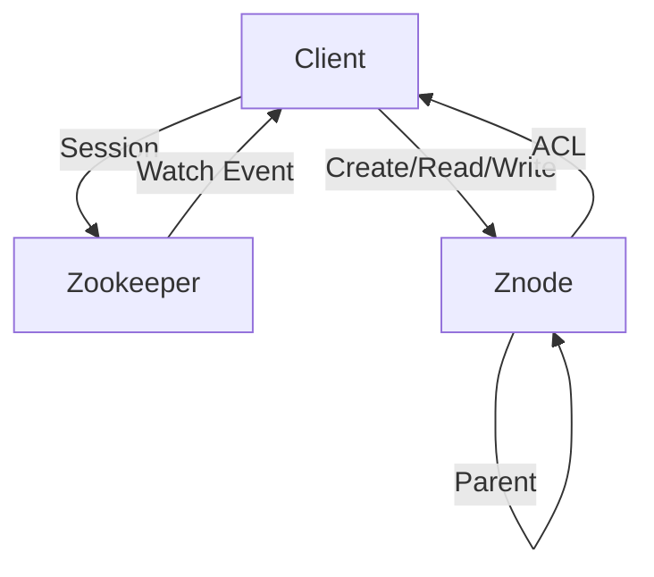
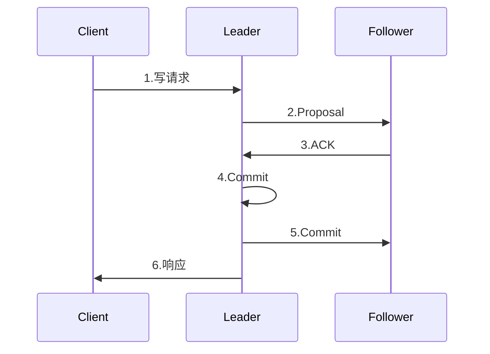
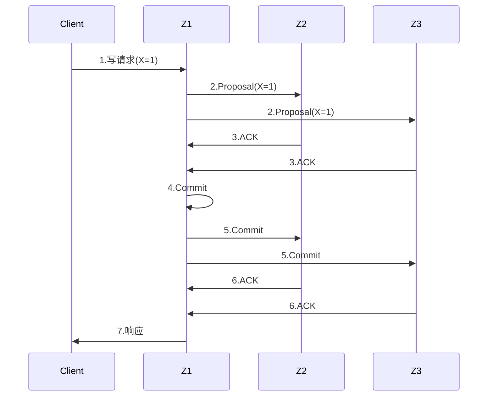

# Zookeeper原理与代码实例讲解

## 1. 背景介绍
### 1.1 问题的由来
在分布式系统中,如何有效地进行分布式协调与同步,是一个亟待解决的问题。节点之间如何达成一致性,如何避免单点故障,如何提高系统的可用性和可靠性,都需要一个高效的分布式协调框架来支撑。而Zookeeper就是为了解决这些问题应运而生的。

### 1.2 研究现状
目前,Zookeeper已经被广泛应用于各种分布式系统中,如Hadoop、Kafka、Hbase等。众多互联网公司也都构建了自己的分布式协调服务,如阿里的Tair、京东的Jodis等。可以说Zookeeper已经成为分布式领域的事实标准。

### 1.3 研究意义
深入研究Zookeeper的原理和应用,对于构建高可用、高性能的分布式系统具有重要意义。通过学习Zookeeper,可以掌握分布式协调的核心算法,了解分布式锁、Master选举、配置管理等经典应用场景的最佳实践。这将有助于我们设计出更加优秀的分布式方案。

### 1.4 本文结构
本文将从以下几个方面对Zookeeper展开深入探讨:

1. Zookeeper的核心概念与基本原理
2. Zookeeper的Zab协议与Paxos算法
3. Zookeeper的几种经典应用场景
4. 基于Zookeeper实现分布式锁的代码实例
5. Zookeeper的部署与运维实践
6. Zookeeper的未来发展趋势与挑战

## 2. 核心概念与联系
要理解Zookeeper,首先需要了解其几个核心概念:

- 数据模型:Zookeeper的数据模型是一个类似于Linux文件系统的树形结构。每个节点称为znode,可以拥有子节点,同时也可以存储少量数据。
- 会话:客户端与Zookeeper服务端之间的一个TCP长连接,通过心跳检测机制维持。
- Watcher:事件监听器,客户端可以在指定节点上注册Watcher,当节点发生变化时,会触发事件通知。
- ACL:访问控制,Zookeeper提供了基于scheme:id:permissions的权限控制方式。

这几个概念之间的关系如下图所示:



## 3. 核心算法原理&具体操作步骤
### 3.1 算法原理概述
Zookeeper采用Zab(Zookeeper Atomic Broadcast)协议来保证分布式事务的最终一致性。Zab协议是Paxos算法的一种变种,基于主备模式(Leader/Follower)架构,通过Proposal和Commit两个阶段来达成数据一致性。

### 3.2 算法步骤详解
具体而言,Zab协议主要分为4个阶段:

1. Leader election:从Follower服务器中选举出一个Leader。
2. Discovery:Follower发现当前Leader,建立与其连接,并进行数据同步。 
3. Synchronization:Leader接收客户端的写请求,并将事务Proposal分发给所有Follower。
4. Broadcast:Follower反馈ACK给Leader,Leader得到半数以上ACK后,提交事务,并通知所有Follower。

整个流程可以用下面的时序图来表示:



### 3.3 算法优缺点
Zab协议的优点在于:

1. 基于主备模式,避免了Paxos算法的复杂性。
2. Semi-Sync复制,不完全依赖Sync复制,提高了可用性。
3. 全局递增的事务ID,保证了事务的顺序性。

但Zab协议也存在一些局限性:

1. 主备模式存在单点风险,Leader宕机时,可用性会受到影响。
2. 强Leader,读写请求都需要经过Leader,可能会成为性能瓶颈。
3. 复杂网络环境下,Failover时间较长,影响服务可用性。

### 3.4 算法应用领域
Zab协议在Zookeeper中得到了充分运用,使其成为高可靠、高性能的分布式协调服务。而Zookeeper又被广泛应用于各种分布式场景中,如：

- 分布式锁
- 集群管理与Master选举
- 分布式队列
- 配置管理
- 命名服务
- 分布式通知/协调

可以说,Zab协议奠定了Zookeeper在分布式领域不可或缺的地位。

## 4. 数学模型和公式&详细讲解&举例说明
### 4.1 数学模型构建
CAP定理告诉我们,一个分布式系统无法同时满足一致性(Consistency)、可用性(Availability)和分区容错性(Partition tolerance)。Zookeeper在设计时,选择了CP,即保证强一致性和分区容错性。

我们可以用下面的公式来描述Zookeeper追求的一致性模型:

$Consistency=\sum\limits_{i=1}^{n}{Proposal_i}\to{Commit}$

其中,n表示所有事务Proposal的个数,Commit表示事务最终被提交。这个公式表明,Zookeeper需要保证每一个事务Proposal最终都能Commit,从而达到强一致性。

### 4.2 公式推导过程
为了实现上述一致性模型,Zookeeper采用了多数派协议(Quorum),即超过半数的Follower同意即可Commit。设Zookeeper集群有N个节点,则Quorum大小Q可以表示为:

$Q=\lfloor\frac{N}{2}\rfloor+1$

例如,一个3节点的Zookeeper集群,Quorum大小就是2。只要有2个节点同意Commit,就可以通过事务提交,保证了强一致性。

### 4.3 案例分析与讲解
我们以一个3节点Zookeeper集群为例,演示Zab协议是如何达成一致性的。假设3个节点为Z1、Z2和Z3,Z1为Leader,Z2和Z3为Follower。

1. Client向Z1发起一个写请求,将数据X设置为1。
2. Z1生成一个Proposal(X=1),并发送给Z2和Z3。
3. Z2和Z3收到Proposal后,写入本地事务日志,并反馈ACK给Z1。
4. Z1收到两个ACK,确认已经达到Quorum,则Commit事务,并通知Z2和Z3。
5. Z2和Z3收到Commit消息后,应用事务,并反馈ACK给Z1。
6. Z1收到所有ACK后,返回响应给Client,表示写入成功。

整个过程如下图所示:



可以看到,只有当Leader和至少一个Follower同意Commit,写请求才能最终生效。即使Leader宕机,整个集群仍然能够保持数据一致性。

### 4.4 常见问题解答
1. Zookeeper的Quorum机制如何避免脑裂?
通过过半机制,只有超过半数的节点同意,才能形成多数派,进行事务提交。即使网络分区,也无法在两个分区同时形成多数派,从而避免了脑裂。

2. 如果Leader宕机,Zookeeper如何选举新的Leader?
Zookeeper使用Fast Paxos算法进行Leader选举。所有Follower节点根据自身的事务ID(ZXID)来投票,ZXID最大者成为Leader。选举过程中,只要有超过半数节点的选票,就可以产生新的Leader。

3. Zookeeper的Semi-Sync复制策略具体是什么?
所谓Semi-Sync是指,Leader只需要等待半数Follower的ACK,而不必等到所有Follower的ACK。这样做的好处是提高了写操作的响应速度,但同时也带来了数据不一致的风险。不过Zookeeper通过事务ID和Commit顺序保证了最终一致性。

## 5. 项目实践：代码实例和详细解释说明
接下来我们通过一个具体的代码实例,来演示如何使用Zookeeper实现分布式锁。分布式锁是Zookeeper的一个经典应用场景,利用其临时顺序节点和Watcher机制,可以方便地实现互斥锁。

### 5.1 开发环境搭建
首先我们需要搭建Zookeeper和Java开发环境:

1. 安装Zookeeper:从官网下载Zookeeper安装包,解压并配置环境变量。
2. 启动Zookeeper:执行`bin/zkServer.sh start`命令启动单机Zookeeper。
3. 安装Java和Maven:从官网下载JDK和Maven,并配置环境变量。
4. 创建Maven项目:使用IDE或命令行创建一个Maven项目,并引入Zookeeper依赖。

```xml
<dependency>
  <groupId>org.apache.zookeeper</groupId>
  <artifactId>zookeeper</artifactId>
  <version>3.6.2</version>
</dependency>
```

### 5.2 源代码详细实现
下面是使用Zookeeper实现分布式锁的完整代码:

```java
public class ZkLock implements AutoCloseable {

    private ZooKeeper zk;
    private String lockPath;
    private String currentPath;

    public ZkLock(String address, String lockPath) throws IOException, InterruptedException {
        this.zk = new ZooKeeper(address, 10000, null);
        this.lockPath = lockPath;
    }

    public void lock() throws KeeperException, InterruptedException {
        // 创建临时顺序节点
        currentPath = zk.create(lockPath + "/lock_", null, ZooDefs.Ids.OPEN_ACL_UNSAFE, CreateMode.EPHEMERAL_SEQUENTIAL);
        // 获取所有子节点
        List<String> children = zk.getChildren(lockPath, false);
        // 对节点按序号排序
        Collections.sort(children);
        // 如果当前节点是最小节点,则获得锁
        if (currentPath.equals(lockPath + "/" + children.get(0))) {
            return;
        }
        // 否则监听前一个节点
        String prevPath = lockPath + "/" + children.get(Collections.binarySearch(children, currentPath.substring(lockPath.length() + 1)) - 1);
        zk.exists(prevPath, event -> {
            if (event.getType() == Watcher.Event.EventType.NodeDeleted) {
                // 前一个节点删除,则当前节点获得锁
                synchronized (this) {
                    notifyAll();
                }
            }
        });
        // 等待锁释放
        synchronized (this) {
            wait();
        }
    }

    public void unlock() throws KeeperException, InterruptedException {
        // 删除当前节点,释放锁
        zk.delete(currentPath, -1);
    }

    @Override
    public void close() throws Exception {
        zk.close();
    }
}
```

使用示例:

```java
try (ZkLock zkLock = new ZkLock("localhost:2181", "/locks")) {
    zkLock.lock();
    // 临界区代码
    zkLock.unlock();
}
```

### 5.3 代码解读与分析
这段代码的核心逻辑如下:

1. 在Zookeeper中创建一个临时顺序节点,作为当前锁的唯一标识。
2. 获取锁目录下所有子节点,并按序号排序。
3. 如果当前节点是最小节点,则表示获得锁,直接返回。
4. 如果当前节点不是最小节点,则找到前一个节点,并在其上注册一个Watcher。
5. 等待Watcher触发,即前一个节点被删除,则当前节点获得锁。
6. 执行临界区代码,完成后删除当前节点,释放锁。

可以看到,利用Zookeeper的临时顺序节点和Watcher机制,可以非常简洁地实现一个分布式锁。临时节点保证了锁的自动释放,顺序节点保证了锁的公平性,Watcher保证了锁的可重入性。

### 5.4 运行结果展示
我们编写一个简单的测试代