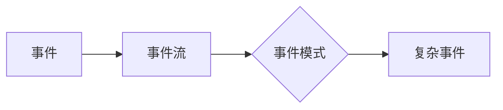
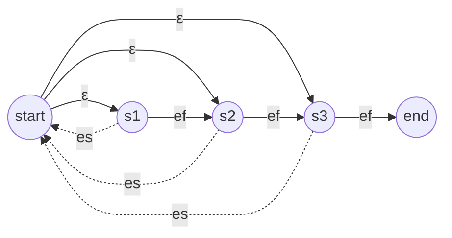

# 【AI大数据计算原理与代码实例讲解】CEP

关键词：复杂事件处理、事件流处理、实时计算、大数据分析、Flink

## 1. 背景介绍
### 1.1 问题的由来
在当今大数据时代，海量数据正以前所未有的速度和规模持续产生。如何从这些实时、高速、海量的数据流中及时发现有价值的信息，并迅速做出响应，已成为众多行业和领域亟待解决的问题。传统的数据处理架构难以满足实时性和海量数据处理的要求，亟需一种新的计算模型来应对挑战。
### 1.2 研究现状
复杂事件处理(Complex Event Processing, CEP)作为一种新兴的事件驱动的实时计算模型，受到学术界和工业界的广泛关注。国内外已有不少学者对CEP的概念、架构、算法等展开研究，并取得了一定成果。一些著名的开源流处理框架如Flink、Spark Streaming等也提供了CEP模块，使得CEP在实际应用中得到普及。
### 1.3 研究意义
深入研究CEP的原理和应用，对于解决大数据实时处理与分析面临的技术挑战具有重要意义。一方面，CEP为从海量数据流中实时发现复杂事件模式提供了新的思路和方法；另一方面，CEP在智慧城市、智能交通、物联网等诸多领域具有广阔的应用前景，研究成果可以服务于这些领域的技术创新。
### 1.4 本文结构
本文将重点介绍CEP的核心概念、原理和代码实现。第2节阐述CEP的核心概念；第3节讲解CEP的核心算法原理和步骤；第4节介绍CEP涉及的数学模型和公式；第5节给出CEP的代码实例；第6节分析CEP的应用场景；第7节推荐CEP相关工具和资源；第8节总结全文并展望CEP未来发展趋势与挑战。

## 2. 核心概念与联系
CEP的核心是检测事件流中有意义的事件模式。这里的几个关键概念包括：
- 事件(Event)：事件是发生的事情，通常带有时间戳等属性信息。如用户点击、设备报警等。
- 事件流(Event Stream)：事件按时间顺序形成的序列。
- 事件模式(Event Pattern)：多个原子事件以一定的时序关系组成的组合事件。如"连续3次登录失败"。
- 复杂事件(Complex Event)：匹配事件模式的事件组合，代表更高层次的概念。

它们的关系可以用下面的Mermaid图来表示：



CEP的任务就是在事件流中实时检测出复杂事件，并触发后续的操作。这需要预先定义好感兴趣的事件模式，然后设计高效的算法来匹配事件。

## 3. 核心算法原理 & 具体操作步骤
### 3.1 算法原理概述
CEP的核心是复杂事件检测算法。目前主要有两大类方法：
1. 基于规则的方法：用户用特定的规则语言(如SQL)来描述事件模式，系统根据规则来检测匹配的事件。
2. 基于自动机的方法：将事件模式转换为一个状态自动机，通过状态转移来进行事件匹配。

这两类方法各有优劣，可以根据具体需求选择。本文主要介绍基于非确定有限自动机(NFA)的CEP算法。
### 3.2 算法步骤详解
基于NFA的CEP算法主要分为两个阶段：
1. 定义阶段：
   - 用户定义事件模式，如`SEQ(A, B, C)`表示事件A、B、C依次出现。
   - 将事件模式转换为NFA。每个事件对应一个状态，事件间的关系对应状态转移。
2. 检测阶段：
   - 创建NFA实例，初始化当前状态。
   - 顺序读取事件流中的事件。
   - 每读入一个事件，判断是否可以引起状态转移。
     - 若可以，更新当前状态，并记录中间结果。
     - 若到达终止状态，输出匹配的复杂事件。
   - 处理完事件后，删除过期的中间结果。
   - 循环读取事件，直到事件流结束。

可以看出，该算法只需要一次遍历事件流，且中间状态可以及时清理，因此时间和空间复杂度都较优。
### 3.3 算法优缺点
NFA算法的主要优点有：
- 表达能力强，可以定义复杂的事件模式。
- 检测效率高，只需一次遍历事件流。
- 可扩展性好，可以灵活应对模式的变更。

但它也有一些局限性：
- 模式的定义需要一定的专业知识，上手有一定门槛。
- 模式过于复杂时，NFA的状态数可能会急剧增加。

因此在实践中，需要根据实际场景，权衡算法的适用性。
### 3.4 算法应用领域 
CEP中的NFA算法可以应用于多个领域，如：
- 实时风控：识别异常交易模式，预防金融欺诈。
- 设备监控：发现异常的设备状态序列，预警故障。
- 用户行为分析：挖掘用户行为事件中的关联规则。

总之，只要应用场景中存在实时事件流数据，且需要分析事件之间的复杂关系，都可以考虑使用CEP方法。

## 4. 数学模型和公式 & 详细讲解 & 举例说明
### 4.1 数学模型构建
CEP涉及的核心数学模型是非确定有限状态自动机(Nondeterministic Finite Automaton, NFA)。形式化定义如下：

一个NFA定义为一个五元组 $M=(S,\Sigma,\delta,s_0,F)$，其中：
- $S$ 是有限状态集合。
- $\Sigma$ 是有限字母表，即输入事件类型集合。
- $\delta$ 是状态转移函数：$\delta: S \times \Sigma \to 2^S$。
- $s_0 \in S$ 是初始状态。 
- $F \subseteq S$ 是最终状态集合。

直观地说，NFA就是一个状态机，可以从一个状态通过接收事件转移到另一个状态。与DFA不同，NFA允许一个状态通过同一事件转移到多个状态，因此更适合用于事件模式的检测。
### 4.2 公式推导过程
对于给定的事件模式，可以通过以下步骤构建对应的NFA：
1. 每个独立的事件 $e_i$ 视为一个状态 $s_i$。
2. 在开始添加一个初始状态 $s_0$，在结尾添加一个终止状态 $s_f$。
3. 根据事件之间的关系，添加状态之间的转移边，边上的标签为触发转移的事件类型。
   - 如 $e_1$ 后接 $e_2$，则添加一条 $s_1$ 到 $s_2$ 的有向边，标签为 $e_2$。
   - 如 $e_1$ 和 $e_2$ 可以任意顺序出现，则添加两条双向边。
4. 从初始状态 $s_0$ 向每个事件状态添加一条 $\epsilon$ 转移边。
5. 从每个事件状态向终止状态 $s_f$ 添加一条 $\epsilon$ 转移边。

这样，就构建出了与事件模式对应的NFA。在此基础上，可以使用前面介绍的算法进行事件检测。
### 4.3 案例分析与讲解
下面以一个具体例子来说明，假设要检测用户"连续登录失败3次"的事件模式。

首先，定义登录失败事件为 $e_f$，登录成功事件为 $e_s$。则事件模式可以表示为：
$$
p = SEQ(e_f, e_f, e_f)
$$

根据上述NFA构建步骤，可以得到如下的状态转移图：



该NFA表示：
- 初始时，状态机处于 $s_0$ 状态。
- 若接收到 $e_f$ 事件，状态依次转移到 $s_1$, $s_2$, $s_3$。
- 若在任一状态接收到 $e_s$ 事件，则状态回到 $s_0$。
- 只有在 $s_3$ 状态接收到 $e_f$ 事件，才会转移到终止状态 $s_f$，输出复杂事件。

这样，通过NFA就可以准确地检测出符合条件的复杂事件。
### 4.4 常见问题解答
Q: NFA能检测所有类型的事件模式吗？
A: NFA可以表达绝大部分常用的事件模式，如序列、选择、循环等。但对于一些更复杂的逻辑，如否定、事件时间窗口等，可能需要扩展NFA模型。

Q: NFA的状态数是否会无限增长？
A: 虽然NFA状态转移图中可能存在环，但由于事件流是有限的，且旧的状态可以及时删除，因此运行时的状态数是有限的。

Q: NFA的检测效率如何？
A: NFA算法只需一次遍历事件流，且状态转移可以通过哈希表等数据结构进行优化，因此总体效率较高，可以满足大多数实时计算场景的需求。

## 5. 项目实践：代码实例和详细解释说明
下面我们使用Java语言和Apache Flink框架，来实现一个简单的CEP引擎。
### 5.1 开发环境搭建
首先需要搭建Flink开发环境。这里假设你已经安装了Java 8和Maven 3。

在命令行中创建一个Maven项目：

```bash
mvn archetype:generate \
    -DarchetypeGroupId=org.apache.flink \
    -DarchetypeArtifactId=flink-quickstart-java \
    -DarchetypeVersion=1.12.0 \
    -DgroupId=org.myorg.quickstart \
    -DartifactId=quickstart \
    -Dversion=0.1 \
    -Dpackage=org.myorg.quickstart \
    -DinteractiveMode=false
```

在生成的`pom.xml`中添加Flink CEP的依赖：

```xml
<dependency>
  <groupId>org.apache.flink</groupId>
  <artifactId>flink-cep_2.12</artifactId>
  <version>1.12.0</version>
</dependency>
```

### 5.2 源代码详细实现
在`src/main/java`目录下创建`LoginEvent`类，表示登录事件：

```java
public class LoginEvent {
  private String userId;
  private String ipAddr;
  private boolean success;
  private Long timestamp;
  
  public LoginEvent() {}
  
  public LoginEvent(String userId, String ipAddr, boolean success, Long timestamp) {
    this.userId = userId;
    this.ipAddr = ipAddr;
    this.success = success;
    this.timestamp = timestamp;
  }
  
  // 省略getter和setter
}
```

然后创建`LoginFailDetect`类，实现登录失败事件检测：

```java
public class LoginFailDetect {
  public static void main(String[] args) throws Exception {
    StreamExecutionEnvironment env = StreamExecutionEnvironment.getExecutionEnvironment();
    env.setParallelism(1);

    // 创建登录事件流
    DataStream<LoginEvent> loginEventStream = env.fromElements(
      new LoginEvent("user_1", "192.168.0.1", false, 1000L),
      new LoginEvent("user_1", "192.168.0.2", false, 2000L),
      new LoginEvent("user_1", "192.168.0.3", false, 3000L),
      new LoginEvent("user_2", "192.168.10.10", true, 4000L)
    );
    
    // 定义匹配模式
    Pattern<LoginEvent, ?> loginFailPattern = Pattern.<LoginEvent>begin("first") 
      .where(new SimpleCondition<LoginEvent>() {
        @Override
        public boolean filter(LoginEvent event) {
          return !event.isSuccess();
        }
      })
      .next("second")
      .where(new Simple