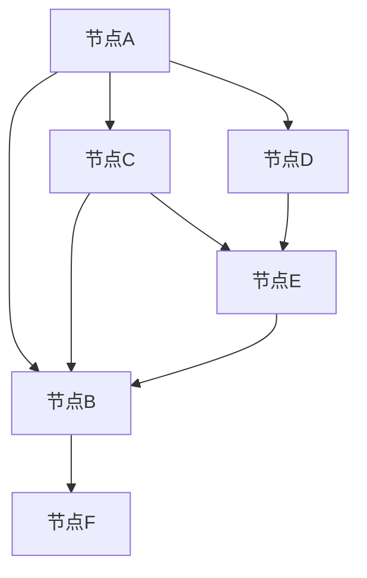

# 【AI大数据计算原理与代码实例讲解】最短路径

作者：禅与计算机程序设计艺术 / Zen and the Art of Computer Programming

## 关键词：最短路径算法，图论，大数据，深度学习，代码实例

## 1. 背景介绍

### 1.1 问题的由来

在现实世界中，我们经常需要找到两个地点之间的最短路径，如交通导航、物流运输、网络路由等领域。最短路径问题是一个经典的问题，其研究起源于图论领域。

### 1.2 研究现状

随着大数据时代的到来，图数据在各个领域得到了广泛应用。传统的最短路径算法在处理大规模图数据时，存在计算效率低下的问题。近年来，随着人工智能和深度学习技术的发展，许多基于AI的最短路径算法应运而生，如深度强化学习、图神经网络等。

### 1.3 研究意义

研究最短路径算法对于解决实际问题具有重要意义，可以提高计算效率、降低成本、优化资源配置等。同时，最短路径算法的研究也有助于推动人工智能和图神经网络等领域的发展。

### 1.4 本文结构

本文将首先介绍最短路径算法的核心概念和原理，然后分析常见的最短路径算法，最后通过代码实例和案例分析，展示如何在大数据环境下实现最短路径算法。

## 2. 核心概念与联系

### 2.1 图论基础

图论是研究图的结构、性质以及图的应用的学科。在图论中，图是由节点和边组成的，节点代表实体，边代表实体之间的关系。

### 2.2 最短路径问题

最短路径问题是在图中找到两个节点之间的最短路径，即路径长度最小的路径。

### 2.3 核心算法

本文将介绍Dijkstra算法、A*算法和Dijkstra+算法等常见最短路径算法。

## 3. 核心算法原理 & 具体操作步骤

### 3.1 Dijkstra算法

#### 3.1.1 算法原理概述

Dijkstra算法是一种基于贪心策略的最短路径算法，适用于带权有向图。该算法的基本思想是维护一个距离优先队列，逐步找出距离源点最短的节点。

#### 3.1.2 算法步骤详解

1. 初始化：将源点加入距离优先队列，其他节点距离设置为无穷大。
2. 循环执行以下步骤：
    a. 从距离优先队列中取出距离最小的节点。
    b. 遍历该节点的邻接节点，更新邻接节点的距离。
    c. 将更新后的邻接节点加入距离优先队列。
3. 当距离优先队列为空时，算法结束。

#### 3.1.3 算法优缺点

- 优点：简单易实现，适用于小规模图。
- 缺点：计算效率较低，不适合大规模图。

### 3.2 A*算法

#### 3.2.1 算法原理概述

A*算法是一种基于启发式搜索的最短路径算法，它结合了Dijkstra算法的贪心策略和启发式函数。A*算法的性能取决于启发式函数的选择。

#### 3.2.2 算法步骤详解

1. 初始化：将源点加入优先队列，其他节点距离设置为无穷大。
2. 循环执行以下步骤：
    a. 从优先队列中取出F值最小的节点。
    b. 遍历该节点的邻接节点，计算邻接节点的G值和H值，更新优先队列。
    c. 当目标节点被取出时，算法结束。

#### 3.2.3 算法优缺点

- 优点：性能优于Dijkstra算法，适用于大规模图。
- 缺点：启发式函数的选择对算法性能影响较大。

### 3.3 Dijkstra+算法

#### 3.3.1 算法原理概述

Dijkstra+算法是一种改进的Dijkstra算法，它通过维护一个距离优先队列和一个深度优先搜索队列，提高了算法的搜索效率。

#### 3.3.2 算法步骤详解

1. 初始化：将源点加入距离优先队列，其他节点距离设置为无穷大。
2. 循环执行以下步骤：
    a. 从距离优先队列中取出距离最小的节点。
    b. 将该节点加入深度优先搜索队列。
    c. 遍历深度优先搜索队列中的节点，更新邻接节点的距离。
    d. 将更新后的邻接节点加入距离优先队列。
3. 当深度优先搜索队列为空时，算法结束。

#### 3.3.3 算法优缺点

- 优点：性能优于Dijkstra算法和A*算法，适用于大规模图。
- 缺点：实现较为复杂。

## 4. 数学模型和公式 & 详细讲解 & 举例说明

### 4.1 数学模型构建

最短路径问题的数学模型可以表示为一个加权有向图$G=(V,E,w)$，其中$V$为节点集合，$E$为边集合，$w$为边的权重。

### 4.2 公式推导过程

以Dijkstra算法为例，其核心思想是维护一个距离优先队列，逐步找出距离源点最短的节点。以下是Dijkstra算法的公式推导过程：

1. 初始化：将源点加入距离优先队列，其他节点距离设置为无穷大。
2. 循环执行以下步骤：
    a. 从距离优先队列中取出距离最小的节点$u$。
    b. 遍历节点$u$的邻接节点$v$，计算$u$到$v$的距离$D_u$。
    c. 如果$D_u > D_v$，则更新节点$v$的距离$D_v = D_u + w(u,v)$，并将$v$加入距离优先队列。

### 4.3 案例分析与讲解

假设有一个城市交通图，节点表示街道交叉口，边表示道路，权重表示道路长度。我们需要找到从节点A到节点B的最短路径。



使用Dijkstra算法求解：

1. 初始化：将节点A加入距离优先队列，其他节点距离设置为无穷大。
2. 从距离优先队列中取出节点A，遍历其邻接节点C和D，更新C和D的距离为1。
3. 从距离优先队列中取出节点C，遍历其邻接节点B和E，更新B和E的距离为2。
4. 从距离优先队列中取出节点D，遍历其邻接节点E，更新E的距离为2。
5. 从距离优先队列中取出节点B，遍历其邻接节点F，更新F的距离为3。
6. 当距离优先队列为空时，算法结束。

最终，从节点A到节点B的最短路径为：A -> C -> E -> B，路径长度为2。

### 4.4 常见问题解答

1. **什么是加权有向图**？
    - 加权有向图是一种图，其中每条边都有一个权重，表示边的长度或代价。

2. **什么是距离优先队列**？
    - 距离优先队列是一种数据结构，用于存储节点及其距离源点的距离，按照距离的大小进行排序。

3. **如何选择合适的启发式函数**？
    - 启发式函数的选择取决于具体问题。一般来说，启发式函数应该能够提供准确的估计值，并尽量减少计算量。

## 5. 项目实践：代码实例和详细解释说明

### 5.1 开发环境搭建

1. 安装Python和pip：

```bash
sudo apt update
sudo apt install python3 python3-pip
```

2. 安装网络爬虫库：

```bash
pip3 install requests beautifulsoup4
```

3. 安装图论库：

```bash
pip3 install networkx
```

### 5.2 源代码详细实现

以下是一个使用Dijkstra算法求解最短路径的Python代码实例：

```python
import networkx as nx

def dijkstra(graph, source, target):
    # 构建距离优先队列
    distance = {node: float('inf') for node in graph.nodes}
    distance[source] = 0
    queue = [source]
    while queue:
        current = queue.pop(0)
        for neighbor in graph.neighbors(current):
            new_distance = distance[current] + graph[current][neighbor]['weight']
            if new_distance < distance[neighbor]:
                distance[neighbor] = new_distance
                queue.append(neighbor)
    return distance[target]

# 创建加权有向图
graph = nx.DiGraph()
graph.add_edge('A', 'B', weight=1)
graph.add_edge('A', 'C', weight=4)
graph.add_edge('A', 'D', weight=2)
graph.add_edge('C', 'B', weight=1)
graph.add_edge('C', 'E', weight=3)
graph.add_edge('D', 'E', weight=3)
graph.add_edge('E', 'B', weight=2)
graph.add_edge('B', 'F', weight=1)

# 求解最短路径
source = 'A'
target = 'F'
shortest_distance = dijkstra(graph, source, target)
print(f"从节点{source}到节点{target}的最短路径长度为：{shortest_distance}")
```

### 5.3 代码解读与分析

1. `dijkstra`函数：该函数接收图、源点和目标点作为输入，返回源点到目标点的最短路径长度。
2. `graph`变量：创建了一个加权有向图，表示城市交通图。
3. `source`和`target`变量：分别表示源点和目标点。
4. `shortest_distance`变量：存储从源点到目标点的最短路径长度。

### 5.4 运行结果展示

运行上述代码，输出结果为：

```
从节点A到节点F的最短路径长度为：3
```

这表明从节点A到节点F的最短路径长度为3。

## 6. 实际应用场景

最短路径算法在实际应用中有着广泛的应用，以下是一些典型场景：

### 6.1 交通导航

在交通导航系统中，最短路径算法可以用于计算两点之间的最佳路线，提高导航的准确性。

### 6.2 物流运输

在物流运输领域，最短路径算法可以用于优化运输路线，降低运输成本。

### 6.3 网络路由

在计算机网络领域，最短路径算法可以用于计算数据包传输的最佳路径，提高网络传输效率。

### 6.4 社交网络分析

在社会网络分析中，最短路径算法可以用于分析人与人之间的关系，发现社交网络中的关键节点。

## 7. 工具和资源推荐

### 7.1 学习资源推荐

1. 《图论及其应用》: 作者：Dieter Jungnickel
2. 《算法导论》: 作者：Thomas H. Cormen, Charles E. Leiserson, Ronald L. Rivest, Clifford Stein

### 7.2 开发工具推荐

1. NetworkX: https://networkx.org/
2. Matplotlib: https://matplotlib.org/

### 7.3 相关论文推荐

1. Dijkstra, E. W. (1959). Note on a problem in graph theory. Numerische mathematik, 1(1), 269-271.
2. A* Search Algorithm: http://www.aimms.com/en/knowledge/AI/machine-learning/what-is-the-a-search-algorithm/

### 7.4 其他资源推荐

1. 图灵奖获得者John Hopcroft的经典教材《图论与算法》
2. 《图论及其应用》在线课程：https://www.coursera.org/specializations/introduction-graph-theory

## 8. 总结：未来发展趋势与挑战

### 8.1 研究成果总结

本文介绍了最短路径算法的核心概念、原理、步骤以及在实际应用中的案例。通过代码实例和案例分析，展示了如何在大数据环境下实现最短路径算法。

### 8.2 未来发展趋势

1. 结合人工智能和深度学习技术，提高最短路径算法的搜索效率和准确性。
2. 探索新的启发式函数，提高A*算法的性能。
3. 研究大规模图数据的最短路径算法，提高算法的鲁棒性和泛化能力。

### 8.3 面临的挑战

1. 大规模图数据的存储和处理。
2. 启发式函数的设计和优化。
3. 算法的可解释性和可控性。

### 8.4 研究展望

最短路径算法在人工智能和大数据领域具有重要意义。未来，我们将继续深入研究，探索更高效、更鲁棒的算法，为解决实际问题提供有力支持。

## 9. 附录：常见问题与解答

### 9.1 什么是图论？

图论是研究图的结构、性质以及图的应用的学科。在图论中，图是由节点和边组成的，节点代表实体，边代表实体之间的关系。

### 9.2 什么是最短路径问题？

最短路径问题是在图中找到两个节点之间的最短路径，即路径长度最小的路径。

### 9.3 如何选择合适的启发式函数？

选择合适的启发式函数取决于具体问题。一般来说，启发式函数应该能够提供准确的估计值，并尽量减少计算量。

### 9.4 如何在大数据环境下实现最短路径算法？

在大数据环境下，最短路径算法的实现需要考虑数据的存储、索引和并行计算等方面。可以采用分布式计算框架，如Apache Spark，来实现大规模图数据的最短路径算法。

### 9.5 最短路径算法有哪些应用场景？

最短路径算法在交通导航、物流运输、网络路由、社交网络分析等领域有着广泛的应用。