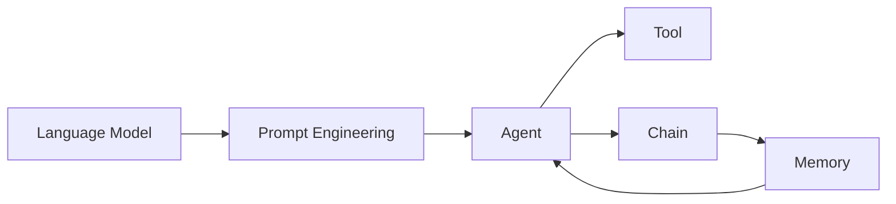

# 【LangChain编程：从入门到实践】对话场景

作者：禅与计算机程序设计艺术 / Zen and the Art of Computer Programming

## 1. 背景介绍

### 1.1 问题的由来

随着人工智能技术的飞速发展，特别是大语言模型的出现，人机对话已经成为一个热门的研究领域。传统的对话系统通常基于预定义的规则和模板，难以应对复杂多变的对话场景。而基于大语言模型的对话系统，如ChatGPT，展现出了强大的自然语言理解和生成能力，为构建更加智能、灵活的对话系统提供了新的思路。

然而，如何将大语言模型与传统的对话系统相结合，构建一个功能完备、易于扩展的对话应用，仍然是一个具有挑战性的问题。LangChain作为一个连接大语言模型与应用程序的编程框架，为解决这一问题提供了有力的工具支持。

### 1.2 研究现状

目前，基于大语言模型的对话系统研究主要集中在以下几个方面：

1. 对话理解：利用大语言模型的强大语义理解能力，实现对用户意图的准确识别和理解。
2. 对话生成：基于大语言模型的文本生成能力，生成流畅、自然、符合上下文的对话回复。
3. 知识融合：将外部知识库与大语言模型相结合，增强对话系统的知识覆盖面和回答质量。
4. 对话策略：研究如何根据对话历史和用户意图，动态调整对话策略，实现更加个性化、智能化的交互。

LangChain作为一个新兴的编程框架，为上述研究提供了强大的工具支持。它提供了一系列组件和接口，用于连接大语言模型、知识库、向量存储等不同模块，使得开发者可以快速构建功能丰富的对话应用。

### 1.3 研究意义

研究基于LangChain的对话场景构建，具有以下重要意义：

1. 推动对话系统的智能化发展：通过将大语言模型与传统对话系统相结合，可以显著提升对话系统的自然语言理解和生成能力，实现更加智能、人性化的人机交互。
2. 降低对话应用开发门槛：LangChain提供了一套简洁、灵活的编程接口，使得开发者无需深入了解大语言模型的内部原理，就可以快速构建功能强大的对话应用。
3. 促进知识的集成与应用：LangChain支持将外部知识库与大语言模型无缝集成，使得对话系统可以利用海量的结构化和非结构化知识，提供更加准确、全面的回答。
4. 探索对话场景的多样性：基于LangChain，可以方便地构建各种不同类型的对话场景，如问答、任务型对话、开放域对话等，促进对话技术在不同领域的应用和创新。

### 1.4 本文结构

本文将围绕基于LangChain构建对话场景展开深入探讨，主要内容包括：

1. LangChain的核心概念与组件介绍
2. 基于LangChain的对话场景构建流程与算法原理
3. LangChain中的数学模型与公式解析
4. 项目实践：使用LangChain构建一个问答对话应用
5. LangChain在实际对话场景中的应用案例
6. LangChain相关的工具和学习资源推荐
7. 总结LangChain的未来发展趋势与面临的挑战
8. 附录：常见问题与解答

## 2. 核心概念与联系

在深入探讨如何使用LangChain构建对话场景之前，我们需要了解LangChain的一些核心概念和组件，以及它们之间的关联关系。

- **语言模型（Language Model）**：LangChain的核心是大语言模型，如GPT-3、BERT等。这些模型经过海量文本数据的预训练，具有强大的自然语言理解和生成能力，是构建智能对话系统的基础。
- **提示工程（Prompt Engineering）**：为了更好地利用语言模型的能力，需要精心设计输入的提示（Prompt）。提示工程是一门关于如何设计有效提示的艺术，可以引导模型生成符合特定需求的输出。
- **代理（Agent）**：代理是LangChain中的一个核心概念，它封装了语言模型与外部工具的交互逻辑。通过定义代理的行为和接口，可以实现更加复杂、多样化的对话功能。
- **工具（Tool）**：工具是代理可以调用的外部函数或API，用于执行特定的任务，如数据库查询、网页搜索、数学计算等。通过将语言模型与工具相结合，可以大大扩展对话系统的能力边界。
- **链（Chain）**：链是一种将多个组件（如语言模型、代理、工具等）组合在一起的方式，用于构建复杂的对话流程。通过定义链的结构和数据流向，可以实现灵活、可扩展的对话场景。
- **内存（Memory）**：内存是用于存储对话历史和上下文信息的组件，可以帮助语言模型根据先前的对话内容生成更加连贯、一致的回复。LangChain提供了多种内存实现，如ConversationBufferMemory、ConversationSummaryMemory等。

下图展示了LangChain中这些核心概念之间的关联关系：



从图中可以看出，语言模型是整个系统的核心，提示工程用于优化语言模型的输入和输出。代理封装了语言模型与外部工具的交互逻辑，可以调用不同的工具执行任务。链将多个组件组合在一起，构建复杂的对话流程。内存用于存储对话历史，帮助语言模型生成更加连贯的回复。

理解这些核心概念之间的关系，对于使用LangChain构建智能对话场景至关重要。在后续章节中，我们将详细探讨如何利用这些组件，设计和实现各种类型的对话应用。

## 3. 核心算法原理 & 具体操作步骤

### 3.1 算法原理概述

LangChain的核心算法主要基于大语言模型和提示工程。大语言模型通过海量文本数据的预训练，学习到了丰富的语言知识和生成能力。而提示工程则是一种优化模型输入和输出的技术，通过精心设计提示，引导模型生成符合特定需求的文本。

在LangChain中，构建对话场景的一般流程如下：

1. 定义提示模板：根据对话场景的需求，设计合适的提示模板，包括输入的格式、内容、上下文等。
2. 创建语言模型实例：选择合适的大语言模型（如GPT-3），并根据需要进行微调或适配。
3. 定义代理和工具：根据对话场景的功能需求，定义代理的行为和可调用的外部工具。
4. 组合链结构：将语言模型、提示模板、代理、工具等组件组合成一个完整的对话流程链。
5. 实现内存管理：选择合适的内存组件，用于存储和管理对话历史，提供上下文信息。
6. 执行对话流程：输入用户的对话文本，经过提示模板填充、语言模型推理、代理和工具调用等一系列步骤，生成最终的对话回复。

### 3.2 算法步骤详解

下面我们以一个简单的问答对话场景为例，详细说明LangChain的核心算法步骤。

1. 定义提示模板：

```python
from langchain import PromptTemplate

template = """
You are an AI assistant named Claude. Given the following extracted parts of a long document and a question, create a final answer with references ("SOURCES").

QUESTION: {question}
=========
{context}
=========

FINAL ANSWER:"""

PROMPT = PromptTemplate(template=template, input_variables=["question", "context"])
```

在这个例子中，我们定义了一个提示模板，包含了问题（question）和上下文信息（context）两个输入变量。模板中的内容告诉语言模型，它需要根据给定的问题和上下文，生成一个包含参考来源的最终答案。

2. 创建语言模型实例：

```python
from langchain.llms import OpenAI

llm = OpenAI(openai_api_key="YOUR_API_KEY", model_name="text-davinci-002")
```

这里我们选择了OpenAI的text-davinci-002模型作为语言模型，并提供了API密钥进行初始化。

3. 定义代理和工具：

```python
from langchain.agents import load_tools

tools = load_tools(["serpapi", "llm-math"], llm=llm)
```

在这个例子中，我们加载了两个预定义的工具：serpapi用于网络搜索，llm-math用于数学计算。这些工具可以被代理调用，扩展对话系统的功能。

4. 组合链结构：

```python
from langchain.chains import LLMChain

chain = LLMChain(prompt=PROMPT, llm=llm)
```

我们使用LLMChain将提示模板和语言模型组合在一起，形成一个完整的推理链。

5. 实现内存管理：

```python
from langchain.chains import ConversationChain
from langchain.memory import ConversationBufferMemory

memory = ConversationBufferMemory()
conversation = ConversationChain(llm=llm, memory=memory)
```

这里我们选择了ConversationBufferMemory作为内存组件，用于存储对话历史。ConversationChain会自动管理内存，将历史对话信息注入到提示中。

6. 执行对话流程：

```python
question = "What is the capital of France?"
context = "Paris is the capital and most populous city of France, with an estimated population of 2,165,423 residents in 2019 in an area of more than 105 square kilometres (41 square miles)."

result = chain.run(question=question, context=context)
print(result)
```

最后，我们输入一个问题和相关的上下文信息，调用chain.run方法执行对话流程。语言模型会根据提示模板和输入信息进行推理，生成最终的答案并返回。

以上就是使用LangChain构建问答对话场景的核心算法步骤。通过灵活组合不同的组件和工具，我们可以实现各种不同类型的对话应用。

### 3.3 算法优缺点

LangChain的核心算法具有以下优点：

1. 灵活性强：LangChain提供了丰富的组件和接口，可以灵活组合和扩展，适应不同的对话场景需求。
2. 易于集成：LangChain可以方便地与各种外部工具和数据源集成，如搜索引擎、知识库、API等，扩展对话系统的功能。
3. 提升对话质量：通过使用大语言模型和提示工程技术，LangChain可以生成更加自然、流畅、符合上下文的对话回复。
4. 降低开发门槛：LangChain提供了高层次的抽象和封装，使得开发者无需深入了解底层细节，即可快速构建功能强大的对话应用。

同时，LangChain的算法也存在一些局限性：

1. 依赖语言模型：LangChain的核心能力来自于大语言模型，因此受限于语言模型的性能和偏差。某些场景下，语言模型可能生成不准确、不一致或有偏见的回复。
2. 计算资源需求高：大语言模型通常需要大量的计算资源和时间来进行推理，对系统的性能和响应速度提出了挑战。
3. 可解释性不足：语言模型的内部工作原理通常是黑盒的，难以解释其推理过程和决策依据，这在某些应用场景下可能会受到质疑。

### 3.4 算法应用领域

LangChain的核心算法可以应用于各种不同类型的对话场景，包括但不限于：

1. 问答系统：根据用户的问题和相关上下文，生成准确、全面的答案。
2. 任务型对话：通过与用户的多轮交互，完成特定的任务，如订餐、购物、旅游规划等。
3. 客服聊天：提供智能化的客户服务，解答用户的疑问，处理投诉和反馈。
4. 智能助手：提供个性化的信息和服务，如日程管理、邮件处理、新闻推送等。
5. 教育培训：通过互动