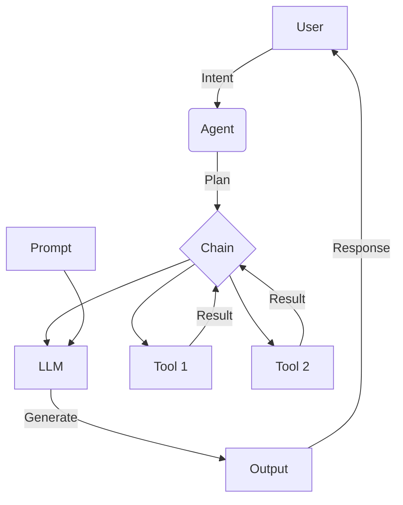
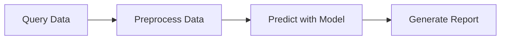

# 【LangChain编程：从入门到实践】快速开始

## 1. 背景介绍
### 1.1 问题的由来
随着人工智能技术的飞速发展，特别是大语言模型(LLM)的出现，AI正在以前所未有的速度改变着我们的生活和工作方式。然而，对于许多开发者来说，如何有效地利用LLM的强大能力来构建实用的AI应用，仍然是一个巨大的挑战。传统的AI开发方式需要大量的数据标注、模型训练和部署，门槛较高。而LangChain的出现，为LLM应用开发带来了新的曙光。

### 1.2 研究现状
LangChain是一个快速发展的AI应用开发框架，它提供了一套简洁灵活的工具集，帮助开发者轻松地将LLM与其他组件(如知识库、API等)集成，快速构建端到端的AI应用。目前已有越来越多的开发者和企业开始使用LangChain进行应用开发，涌现出了一批优秀的开源项目和商业案例，如ChatPDF、AutoGPT等。LangChain正在成为LLM应用开发的重要工具和生态。

### 1.3 研究意义
LangChain的研究对于推动LLM技术的应用落地具有重要意义：

1. 降低AI应用开发门槛，让更多开发者参与进来，加速AI普及
2. 提高AI应用开发效率，缩短开发周期，加快产品迭代
3. 丰富LLM应用场景，催生更多创新应用，为各行各业赋能
4. 完善LLM应用开发生态，形成标准和最佳实践，推动产业健康发展

### 1.4 本文结构
本文将全面介绍LangChain框架及其应用开发实践，内容涵盖：

- LangChain的核心概念与组件
- LangChain的工作原理与架构设计
- 基于LangChain的应用开发步骤与最佳实践 
- LangChain的典型应用场景与案例解析
- LangChain的开发工具与学习资源推荐

通过本文的学习，读者可以快速掌握LangChain的基本用法，并能够基于LangChain构建实用的LLM应用。

## 2. 核心概念与联系

在正式开始介绍LangChain之前，我们先来了解几个核心概念：

- LLM：大语言模型(Large Language Model)，指经过海量语料训练的大规模语言模型，如GPT系列。LLM具有惊人的语言理解和生成能力，是当前AI技术的核心驱动力。

- Chain：指将LLM与其他组件按照特定逻辑连接形成的任务执行链。Chain将复杂任务分解为多个步骤，每个步骤由不同的组件负责，如LLM负责通过提示词生成文本，工具负责访问外部信息或执行特定动作。

- Agent：指具备自主执行能力的AI代理，它可以根据用户意图自动规划执行步骤，动态调用LLM和工具组件进行任务求解，是LangChain的核心抽象。

- Tool：指为LLM提供外部知识访问和动作执行能力的工具组件，如搜索引擎、知识库、API等。

- Prompt：指为LLM提供任务指令的输入文本，它描述了任务目标和上下文，引导LLM进行文本生成。优质的Prompt设计是构建高质量LLM应用的关键。

下图展示了这些核心概念之间的关系：

可以看到，用户提出任务意图后，Agent会规划出一个由LLM和Tool组成的Chain，LLM根据Prompt生成对Tool的调用指令，Tool执行动作并返回结果，多个步骤迭代执行，最终Chain输出任务结果给用户。这就是LangChain的基本工作流程。

## 3. 核心算法原理 & 具体操作步骤
### 3.1 算法原理概述
LangChain的核心算法可以概括为：基于LLM的动态任务规划与链式调用。具体来说：

1. 将端到端任务分解为多个原子步骤，每个步骤为LLM提示或工具调用
2. Agent根据用户意图和任务上下文，动态生成步骤执行计划
3. 按照执行计划，以Chain的形式串行调用LLM和Tool
4. LLM根据Prompt生成自然语言指令，调用Tool执行并获取结果
5. 将每个步骤的输出结果作为下一步的输入，迭代执行直到任务完成
6. 将Chain的最终输出返回给用户，完成整个任务闭环

可以看到，LangChain的算法本质是一个语言驱动的任务规划与执行过程，通过LLM将自然语言指令转化为可执行的程序流，实现端到端的任务自动化。这种范式避免了复杂的人工编程，而是让AI根据需求自主编排，大大提高了应用开发的灵活性和效率。

### 3.2 算法步骤详解
接下来，我们对LangChain的算法步骤进行详细拆解：

**步骤1：任务分解**
首先需要将端到端的任务目标分解为多个可以被LLM或Tool单独完成的原子步骤。这需要对任务有清晰的认知和合理的拆分。每个原子步骤可以是一次LLM提问或一次Tool调用。步骤的颗粒度要合适，太粗可能超出LLM或Tool的能力范围，太细会导致Chain过长，影响执行效率。

**步骤2：任务规划**
根据用户输入的任务描述和上下文，Agent会自动规划出一个步骤执行方案，即Chain。这个过程可以通过预定义的规则或者Few-shot的方式让LLM自主决策。规划时需要权衡每个步骤的必要性、有效性和执行成本，尽量以最优的步骤组合来高效完成任务。

**步骤3：链式调用**
确定了执行方案后，就可以开始链式调用了。Chain会按照规划的步骤顺序，依次执行LLM生成和Tool调用。每个步骤会将上一步的输出结果作为输入，基于此生成下一步的执行指令。Chain的执行就像一个流水线，LLM负责任务编排，Tool负责任务执行，两者交替进行，推动任务不断前进。

**步骤4：提示生成**
每次调用LLM时，都需要给定一个Prompt作为输入。Prompt的内容包括任务目标、已执行步骤、当前结果等上下文信息，引导LLM进行下一步决策。LLM会根据Prompt分析任务进度和剩余目标，生成对Tool的调用指令或对用户的反馈。Prompt的设计直接影响了LLM的生成质量，需要精心优化。

**步骤5：工具调用**
当LLM生成的指令为工具调用时，Chain会将指令发送给对应的Tool执行。Tool可以提供多种能力，如信息检索、数据计算、API访问等。Tool执行完毕后，会将结果返回给Chain，作为下一步LLM生成的输入。工具的选择和实现也是LangChain应用开发的重要环节。

**步骤6：结果输出**
当Chain中所有步骤执行完毕后，会将最终结果返回给用户，完成整个任务闭环。结果可以是一段文本总结、一个数据分析报告、一次API调用的返回值等，形式多样。Agent会对Chain的执行过程进行整体优化，力求以最少的步骤、最优的策略达成任务目标。

以上就是LangChain的核心算法步骤，通过任务分解、动态规划、链式调用等技术，实现了灵活高效的LLM应用开发。

### 3.3 算法优缺点
LangChain的算法设计有以下优点：

1. 简化了LLM应用开发流程，降低了开发门槛
2. 提高了任务执行的灵活性和适应性，可以应对复杂多变的需求
3. 结合了LLM和外部工具的优势，扩展了LLM的应用范围
4. 实现了任务执行的自动化，减少了人工干预和重复劳动

同时也存在一些局限性：

1. Chain的执行效率依赖于LLM和Tool的响应速度，延迟可能较高
2. Chain的执行质量依赖于Prompt设计和工具选择，需要不断优化
3. 对于一些需要深度推理和领域知识的任务，LLM可能难以胜任
4. 缺乏对LLM生成内容的可控性，可能产生偏差或错误

### 3.4 算法应用领域
LangChain的算法可以应用于多个领域，包括：

- 智能客服：自动解答用户问题、提供个性化服务
- 数据分析：自动执行数据处理、分析、可视化等任务
- 文本处理：自动完成文本生成、摘要、翻译、情感分析等任务
- 知识库问答：自动从海量知识库中检索信息，回答用户问题
- 工作流自动化：自动执行一系列任务步骤，提高工作效率
- 智能助手：为用户提供个性化的信息获取和任务执行服务

LangChain正在不断拓展新的应用场景，为更多领域带来AI赋能。

## 4. 数学模型和公式 & 详细讲解 & 举例说明
### 4.1 数学模型构建
LangChain的数学模型可以用一个有向无环图(DAG)来表示，每个节点代表一个步骤，边代表步骤间的依赖关系和数据流。假设一个Chain包含n个步骤，每个步骤的输入为前序步骤的输出，可以将其抽象为数学模型：

令$S = \{s_1, s_2, ..., s_n\}$表示步骤集合，$E = \{(s_i, s_j) | s_i, s_j \in S, i < j\}$表示步骤间的边集合。每个步骤$s_i$可以表示为一个函数：

$$
s_i(x_i) = y_i
$$

其中$x_i$为步骤$s_i$的输入，$y_i$为输出。Chain的整体执行过程可以表示为：

$$
Chain(x) = s_n(...s_2(s_1(x))...)
$$

即将初始输入$x$经过一系列步骤的顺序执行，得到最终输出。

### 4.2 公式推导过程
对于每个步骤$s_i$，其输入$x_i$由前序步骤的输出决定：

$$
x_i = 
\begin{cases}
x & i=1 \\
y_{i-1} & i>1
\end{cases}
$$

即第一个步骤的输入为Chain的初始输入，后续步骤的输入为前一步骤的输出。

将每个步骤展开，可以得到Chain的完整执行公式：

$$
\begin{aligned}
Chain(x) &= s_n(s_{n-1}(...s_2(s_1(x))...)) \\
&= s_n(s_{n-1}(...s_2(y_1)...)) \\
&= s_n(s_{n-1}(...y_2...)) \\
&= ... \\
&= s_n(y_{n-1}) \\
&= y_n
\end{aligned}
$$

可以看到，Chain的执行是一个递归的过程，每个步骤的输出作为下一步骤的输入，直到最后一个步骤输出最终结果。

### 4.3 案例分析与讲解
下面我们以一个具体的例子来说明LangChain的执行过程。假设我们要实现一个自动化的数据分析任务，包括以下步骤：

1. 从数据库中查询原始数据
2. 对数据进行清洗和预处理 
3. 使用机器学习模型进行预测分析
4. 生成分析报告并发送给用户

我们可以将这个任务抽象为一个由4个步骤组成的Chain：

每个步骤可以表示为一个函数：

$$
\begin{aligned}
s_1(x) &= query(x) \\
s_2(x) &= preprocess(x) \\ 
s_3(x