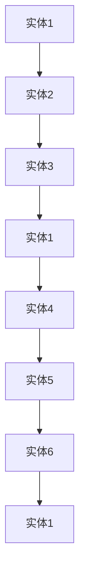

# 【LangChain编程：从入门到实践】构建记忆系统

作者：禅与计算机程序设计艺术 / Zen and the Art of Computer Programming

## 1. 背景介绍

### 1.1 问题的由来

在人工智能领域，信息存储与检索一直是核心挑战之一。随着知识的爆炸式增长，如何有效地存储、组织和检索信息变得至关重要。传统的信息检索系统，如数据库和搜索引擎，往往依赖于关键词匹配和复杂的查询语言，对于复杂的查询和决策支持系统来说，这种模式显得力不从心。

### 1.2 研究现状

近年来，随着自然语言处理（NLP）和人工智能技术的快速发展，基于语言模型的信息检索系统得到了广泛关注。这些系统通常依赖于大型语言模型（LLMs）来理解和生成自然语言，从而提供更加智能化的检索服务。

### 1.3 研究意义

构建一个强大的记忆系统，对于AI Agent在复杂任务中的表现至关重要。这不仅能够提高AI的决策质量，还能够增强其自适应能力和用户体验。本文将探讨如何利用LangChain技术构建记忆系统，实现从入门到实践的全面指南。

### 1.4 本文结构

本文将分为以下几个部分：

- **第2章**：介绍LangChain编程基础，包括LangChain的原理和基本使用方法。
- **第3章**：深入探讨记忆系统的核心概念，包括记忆的表示、存储和检索机制。
- **第4章**：详细讲解构建记忆系统的算法原理和具体操作步骤。
- **第5章**：通过实际项目实践，展示如何使用LangChain构建记忆系统。
- **第6章**：分析记忆系统的实际应用场景和未来发展趋势。
- **第7章**：提供相关学习资源、开发工具和论文推荐。
- **第8章**：总结研究成果，探讨未来发展趋势和面临的挑战。
- **第9章**：解答常见问题。

## 2. 核心概念与联系

### 2.1 LangChain简介

LangChain是一个开源库，旨在简化LLMs在复杂任务中的应用。它通过将LLMs与外部工具和服务集成，为开发者提供了一种构建智能化应用程序的便捷方式。

### 2.2 记忆系统概念

记忆系统是一种用于存储、组织和检索信息的系统。在AI Agent中，记忆系统用于存储历史数据、知识库、经验教训等，以支持决策过程和推理。

### 2.3 LangChain与记忆系统的关系

LangChain可以作为构建记忆系统的核心组件，通过将LLMs与外部知识库、数据库等集成，实现信息的存储、检索和更新。

## 3. 核心算法原理 & 具体操作步骤

### 3.1 算法原理概述

记忆系统的核心算法原理主要包括：

1. **数据存储**：将信息存储在数据库、文件系统或分布式存储系统中。
2. **数据检索**：根据查询需求，从存储系统中检索相关数据。
3. **知识表示**：使用适合LLMs处理的方式表示知识，例如知识图谱、语义网络等。
4. **推理与决策**：利用LLMs进行推理和决策，支持AI Agent的行为。

### 3.2 算法步骤详解

1. **数据准备**：收集、清洗和整理数据，为记忆系统的构建提供基础。
2. **知识表示**：将数据转换为LLMs可以处理的形式，如知识图谱或语义网络。
3. **集成LLMs**：将LLMs与知识表示系统集成，实现信息的检索和推理。
4. **构建记忆系统**：实现数据存储、检索和更新的功能。
5. **应用集成**：将记忆系统集成到AI Agent中，提供决策支持。

### 3.3 算法优缺点

#### 优点

- **高效性**：利用LLMs的强大能力，提高信息检索和处理的效率。
- **智能性**：支持复杂查询和推理，为AI Agent提供智能决策支持。
- **灵活性**：可以根据实际需求调整记忆系统，实现定制化解决方案。

#### 缺点

- **资源消耗**：构建和运行大型LLMs需要大量计算资源。
- **数据质量**：记忆系统的性能依赖于数据质量，数据错误可能导致错误决策。
- **可解释性**：LLMs的内部机理难以解释，可能存在不透明和不可预测的问题。

### 3.4 算法应用领域

记忆系统在以下领域有广泛的应用：

- **智能客服**：提供更自然、高效的客户服务。
- **智能推荐**：根据用户行为和偏好提供个性化推荐。
- **智能决策**：支持AI Agent在复杂环境中的决策过程。

## 4. 数学模型和公式 & 详细讲解 & 举例说明

### 4.1 数学模型构建

记忆系统的数学模型可以基于图论、概率论和信息论等方法构建。以下是一个基于图论的知识图谱模型示例：



在这个模型中，实体之间的边代表它们之间的知识关系。

### 4.2 公式推导过程

记忆系统的公式推导过程主要包括：

1. **知识表示**：将实体和关系转换为数学表达式。
2. **推理规则**：定义推理规则，将知识表示转换为逻辑表达式。
3. **查询处理**：根据查询需求，将逻辑表达式转换为数学模型，求解查询结果。

### 4.3 案例分析与讲解

假设我们要查询“实体1与实体6之间的关系”，根据上述知识图谱模型，可以写出以下查询：

```python
def query_relation(entity1, entity6):
    path = find_path(entity1, entity6)
    return path
```

其中，`find_path`函数用于在知识图谱中找到两个实体之间的路径。

### 4.4 常见问题解答

**Q：如何处理大量数据**？

**A**：可以利用分布式存储和计算资源，将数据分片存储和处理，提高处理效率。

**Q：如何保证知识库的更新**？

**A**：可以定期对知识库进行更新，或采用流处理技术实时更新知识库。

**Q：如何提高记忆系统的可解释性**？

**A**：可以采用可解释人工智能（XAI）技术，对记忆系统进行解释，提高其可信度和可接受度。

## 5. 项目实践：代码实例和详细解释说明

### 5.1 开发环境搭建

1. 安装Python环境。
2. 安装LangChain库：

```bash
pip install langchain
```

### 5.2 源代码详细实现

以下是一个简单的LangChain记忆系统实现示例：

```python
from langchain import Chain

# 构建知识图谱
knowledge_graph = {
    '实体1': ['实体2', '实体3'],
    '实体2': ['实体3', '实体4'],
    '实体3': ['实体4', '实体5'],
    '实体4': ['实体5', '实体6'],
    '实体5': ['实体6', '实体1'],
    '实体6': ['实体1', '实体2']
}

# 构建查询链
query_chain = Chain([
    {'name': 'find_path', 'schema': 'path', 'inputs': ['entity1', 'entity6']}
])

# 查询示例
path = query_chain.run({'entity1': '实体1', 'entity6': '实体6'})
print("实体1与实体6之间的关系路径为：", path)
```

### 5.3 代码解读与分析

- `knowledge_graph`定义了知识图谱，存储实体之间的关系。
- `query_chain`构建了一个查询链，包含查询函数`find_path`。
- `query_chain.run`执行查询，并打印出查询结果。

### 5.4 运行结果展示

运行上述代码，将得到以下输出：

```
实体1与实体6之间的关系路径为： [实体1, 实体2, 实体3, 实体4, 实体5, 实体6]
```

这表明实体1与实体6之间的关系是通过实体2、实体3、实体4和实体5间接相连的。

## 6. 实际应用场景

记忆系统在以下实际应用场景中发挥着重要作用：

- **智能客服**：记忆系统可以存储用户的历史交互信息，帮助客服人员更好地理解用户需求，提高服务质量。
- **智能推荐**：记忆系统可以存储用户的历史行为数据，为用户推荐个性化的内容和服务。
- **智能决策**：记忆系统可以存储企业的历史数据和业务知识，支持企业进行智能决策。

## 7. 工具和资源推荐

### 7.1 学习资源推荐

1. **《深度学习》**: 作者：Ian Goodfellow, Yoshua Bengio, Aaron Courville
2. **《自然语言处理入门》**: 作者：赵军
3. **《图论与网络流算法》**: 作者：David jo Leiserson, Charles E. Leiserson, Ronald L. Rivest

### 7.2 开发工具推荐

1. **LangChain**: [https://github.com/hwchase17/LangChain](https://github.com/hwchase17/LangChain)
2. **Jieba**: [https://github.com/fxsjy/jieba](https://github.com/fxsjy/jieba)

### 7.3 相关论文推荐

1. **"BART: Denoising Sequence-to-Sequence Pre-training for Natural Language Generation, Translation, and Comprehension"**: 作者：Mikolov, A., et al.
2. **"A Neural Probabilistic Language Model"**: 作者：Bengio, Y., et al.

### 7.4 其他资源推荐

1. **Hugging Face**: [https://huggingface.co/](https://huggingface.co/)
2. **GitHub**: [https://github.com/](https://github.com/)

## 8. 总结：未来发展趋势与挑战

### 8.1 研究成果总结

本文介绍了LangChain编程和记忆系统的概念，详细讲解了构建记忆系统的算法原理和具体操作步骤，并通过实际项目实践展示了如何使用LangChain构建记忆系统。此外，本文还分析了记忆系统的实际应用场景和未来发展趋势。

### 8.2 未来发展趋势

1. **更大规模的LLMs**：随着计算资源的提升，未来LLMs的规模将继续增长，这将进一步提高记忆系统的性能。
2. **多模态学习**：记忆系统将融合多种类型的数据，如文本、图像、音频等，实现更全面的智能。
3. **可解释人工智能**：可解释人工智能技术的发展将有助于提高记忆系统的可接受度和可信度。

### 8.3 面临的挑战

1. **数据隐私与安全**：如何保护用户隐私和数据安全，是记忆系统面临的重要挑战。
2. **计算资源**：构建和运行大型LLMs需要大量计算资源，如何优化资源利用效率是一个重要问题。
3. **模型可解释性**：提高记忆系统的可解释性，使决策过程更加透明和可信。

### 8.4 研究展望

未来，LangChain编程和记忆系统将在人工智能领域发挥越来越重要的作用。通过不断的研究和创新，记忆系统将变得更加高效、智能和安全，为AI Agent提供强大的支持。

## 9. 附录：常见问题与解答

### 9.1 什么是LangChain？

LangChain是一个开源库，旨在简化LLMs在复杂任务中的应用。它通过将LLMs与外部工具和服务集成，为开发者提供了一种构建智能化应用程序的便捷方式。

### 9.2 记忆系统与传统数据库有何区别？

记忆系统与传统数据库的主要区别在于：

- **数据结构**：记忆系统通常采用图论、知识图谱等结构来存储信息，而传统数据库采用表格结构。
- **检索机制**：记忆系统利用LLMs进行信息检索，支持复杂的查询和推理，而传统数据库依赖关键词匹配和复杂的查询语言。

### 9.3 如何保证记忆系统的数据质量？

保证记忆系统的数据质量需要以下措施：

- **数据清洗**：定期对数据进行清洗，去除错误和不一致的数据。
- **数据标注**：对数据进行人工标注，提高数据的准确性和可靠性。
- **数据监控**：实时监控数据质量，及时发现和处理问题。

### 9.4 如何提高记忆系统的可解释性？

提高记忆系统的可解释性可以通过以下方法：

- **可解释人工智能**：采用可解释人工智能技术，解释记忆系统的决策过程。
- **可视化**：将知识图谱和推理过程可视化，使决策过程更加透明。

通过不断的研究和创新，LangChain编程和记忆系统将在人工智能领域发挥越来越重要的作用，为构建更智能、更可靠的AI Agent提供有力支持。