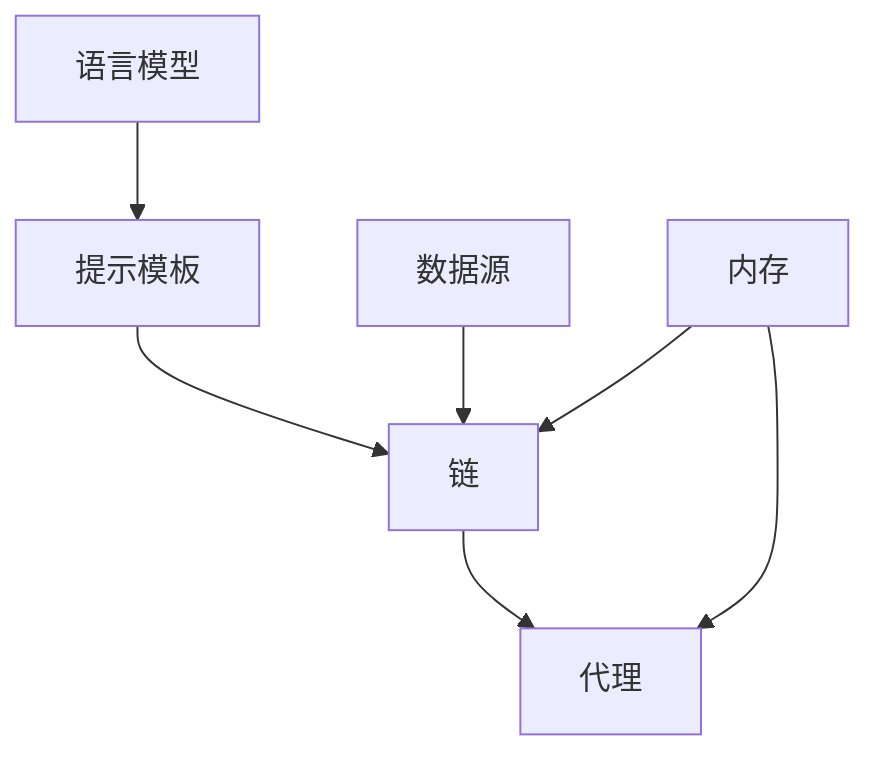

# 【LangChain编程：从入门到实践】语言模型

## 1. 背景介绍
### 1.1  问题的由来
随着人工智能技术的飞速发展，自然语言处理(NLP)领域取得了突破性的进展。大规模预训练语言模型如GPT、BERT等的出现，极大地提升了NLP任务的性能表现。然而，如何将这些强大的语言模型应用到实际的NLP应用中，仍然存在诸多挑战。开发者需要花费大量时间来搭建模型训练和推理的流程，处理数据的输入输出，以及模型的部署和优化等。这无疑增加了开发NLP应用的门槛和复杂度。

### 1.2  研究现状 
为了降低NLP应用开发的难度，业界涌现出一批NLP应用开发框架，如Hugging Face的Transformers库、OpenAI的GPT-3 API等。这些框架提供了预训练模型和简化的API接口，使得开发者可以更加便捷地使用语言模型来构建NLP应用。然而，这些框架主要关注于单个模型的使用，缺乏对多个模型和组件的编排和管理能力。

最近，一个名为LangChain的开源项目引起了广泛关注。LangChain是一个用于构建由语言模型驱动的应用程序的框架。它提供了一套工具和组件，用于将语言模型与其他数据源和API集成，实现更加复杂和智能的NLP应用。LangChain的核心理念是将语言模型作为应用程序的中心，通过编排和链接不同的组件，构建端到端的NLP应用流程。

### 1.3  研究意义
LangChain的出现为NLP应用开发带来了新的思路和方法。它不仅简化了语言模型的使用，更重要的是提供了一种组件化和模块化的开发范式。通过LangChain，开发者可以更加灵活地组合和定制NLP应用的流程，实现更加智能和个性化的功能。同时，LangChain也为探索语言模型在实际应用中的潜力和局限性提供了一个很好的平台。

本文将深入探讨LangChain的核心概念、原理和实践，帮助读者全面了解这一前沿的NLP应用开发框架。通过学习LangChain，读者不仅可以掌握如何使用语言模型构建NLP应用，还可以启发更多关于语言模型应用的思考和创新。

### 1.4  本文结构
本文将按照以下结构展开：

第2部分介绍LangChain的核心概念和组件，包括语言模型、提示模板、数据源、链等，阐述它们之间的关系和作用。

第3部分详细讲解LangChain的工作原理和算法流程，分析其优缺点和适用场景。

第4部分从数学角度对LangChain的关键模型和公式进行推导和说明，并给出具体的案例分析。

第5部分通过一个完整的项目实践，演示如何使用LangChain构建一个智能问答系统，并对关键代码进行解读。

第6部分讨论LangChain在实际应用中的场景和案例，展望其未来的发展方向。

第7部分推荐LangChain相关的学习资源、开发工具和参考文献，方便读者进一步研究和实践。

第8部分对全文进行总结，分析LangChain的研究现状、趋势和挑战，并对未来的研究方向提出展望。

第9部分列出了关于LangChain的常见问题，并给出了详细的解答，帮助读者解决实践中的疑惑。

## 2. 核心概念与联系

LangChain的核心概念包括以下几个方面：

1. 语言模型（Language Models）：指经过预训练的大规模语言模型，如GPT、BERT等，它们能够理解和生成自然语言。LangChain利用语言模型的能力来实现各种NLP任务。

2. 提示模板（Prompt Templates）：指用于与语言模型交互的输入模板，它定义了如何将任务描述、输入数据等信息组织成一个完整的输入，以便语言模型能够正确理解和执行任务。

3. 数据源（Data Sources）：指外部的数据来源，如文档、数据库、API等。LangChain提供了一系列工具来连接和查询这些数据源，以便为语言模型提供所需的信息。

4. 链（Chains）：指由多个组件按照特定逻辑组合而成的任务流程。每个组件可以是一个语言模型、一个提示模板或一个数据源。链定义了数据在不同组件之间的传递和处理方式，实现端到端的任务执行。

5. 代理（Agents）：指由一个或多个链组成的智能代理，它能够根据用户的输入自主决策和执行任务。代理可以调用不同的工具和接口，根据任务的需要动态选择和组合链。

6. 内存（Memory）：指在链或代理执行过程中，用于存储和管理中间状态和上下文信息的机制。内存可以帮助语言模型在对话或多轮交互中保持一致性和连贯性。

下图展示了LangChain的核心概念之间的关系：

从图中可以看出，语言模型通过提示模板来执行特定的任务，多个提示模板可以组合成一个链。链可以访问外部数据源，获取执行任务所需的信息。多个链可以进一步组合成一个代理，由代理来协调和决策任务的执行。内存贯穿于链和代理的执行过程，用于存储和管理状态信息。

LangChain的核心概念围绕语言模型展开，通过模块化和组件化的方式，将语言模型与其他数据和接口连接起来，构建灵活、可扩展的NLP应用。这种组件化的思想使得开发者能够以更低的成本和更高的效率来开发NLP应用，同时也为语言模型的应用开辟了更广阔的空间。

## 3. 核心算法原理 & 具体操作步骤

### 3.1 算法原理概述

LangChain的核心算法可以概括为以下几个步骤：

1. 任务分解：将复杂的NLP任务分解为多个子任务或步骤，每个子任务可以由一个或多个组件来完成。

2. 组件选择：根据任务的需求，选择合适的语言模型、提示模板、数据源等组件，并将它们组合成一个链或代理。

3. 提示生成：根据任务的输入和要求，使用提示模板生成适当的提示，并将其输入到语言模型中。

4. 语言模型推理：语言模型根据输入的提示，生成相应的输出或预测结果。

5. 数据查询：如果任务需要外部数据源，链或代理会根据需要查询相关的数据，并将其传递给语言模型。

6. 结果解析：对语言模型的输出进行解析和后处理，提取出所需的信息或格式化结果。

7. 迭代优化：根据任务的反馈或评估指标，对链或代理的组件和参数进行迭代优化，以提高任务的性能和效果。

### 3.2 算法步骤详解

下面我们对每个步骤进行更详细的说明：

1. 任务分解：
   - 分析任务的目标和要求，确定任务的输入和输出格式。
   - 将任务划分为多个逻辑步骤或子任务，每个子任务负责完成一个相对独立的功能。
   - 确定每个子任务所需的输入数据和处理逻辑。

2. 组件选择：
   - 根据子任务的需求，选择合适的语言模型，如GPT、BERT等。
   - 设计与子任务相匹配的提示模板，定义如何将任务描述、输入数据等信息组织成一个完整的提示。
   - 确定子任务需要的外部数据源，如文档、数据库、API等，并选择相应的数据连接器。
   - 将选定的组件组合成一个链或代理，定义数据在组件之间的流动方式。

3. 提示生成：
   - 根据任务的输入数据和提示模板，生成适当的提示文本。
   - 提示文本应包含任务的描述、输入数据、期望输出等信息，以引导语言模型进行正确的推理。
   - 对提示文本进行必要的格式化和预处理，如替换变量、截断长度等。

4. 语言模型推理：
   - 将生成的提示文本输入到选定的语言模型中。
   - 语言模型根据提示文本进行推理，生成相应的输出或预测结果。
   - 输出结果可以是文本、标签、概率分布等形式，具体取决于任务的类型和要求。

5. 数据查询：
   - 如果任务需要外部数据源，链或代理会根据需要查询相关的数据。
   - 使用选定的数据连接器，如文档加载器、数据库查询器等，从数据源中检索所需的信息。
   - 将查询到的数据传递给语言模型，作为额外的上下文信息。

6. 结果解析：
   - 对语言模型生成的输出进行解析和后处理。
   - 根据任务的要求，提取出所需的信息，如实体、关系、情感等。
   - 对提取出的信息进行结构化、格式化，以便后续的使用或展示。

7. 迭代优化：
   - 根据任务的反馈或评估指标，评估链或代理的性能表现。
   - 分析错误案例，识别出影响性能的关键因素，如提示设计、数据质量、模型选择等。
   - 对链或代理的组件和参数进行调整和优化，如改进提示模板、增加数据源、调整模型超参数等。
   - 重复执行任务，评估优化后的性能，直到达到满意的结果。

以上就是LangChain的核心算法步骤。通过合理地分解任务、选择组件、生成提示、执行推理、查询数据、解析结果，并进行迭代优化，LangChain能够灵活、高效地构建各种NLP应用。

### 3.3 算法优缺点

LangChain的算法设计有以下优点：

1. 模块化和组件化：LangChain将NLP任务划分为多个独立的组件，如语言模型、提示模板、数据源等，每个组件都有明确的输入输出接口。这种模块化的设计使得组件可以灵活地组合和复用，提高了开发效率和可维护性。

2. 可扩展性：LangChain的组件库提供了丰富的预定义组件，如各种语言模型、数据连接器等。同时，LangChain也支持自定义组件，开发者可以根据特定需求实现自己的组件，并与现有组件无缝集成。这种可扩展性使得LangChain能够适应不同的任务场景和技术栈。

3. 任务适应性：LangChain通过任务分解和组件选择，能够灵活地适应不同类型的NLP任务。无论是文本分类、命名实体识别、问答系统还是对话生成，LangChain都能够通过合适的组件组合来实现。这种任务适应性使得LangChain成为一个通用的NLP应用开发框架。

4. 迭代优化：LangChain提供了一套完整的工作流程，包括任务分解、组件选择、提示生成、推理执行、数据查询、结果解析等步骤。每个步骤都可以根据任务的反馈和评估指标进行迭代优化。这种迭代优化机制使得LangChain能够不断改进和提升NLP应用的性能和质量。

当然，LangChain的算法设计也有一些局限性和挑战：

1. 组件兼容性：虽然LangChain提供了标准化的组件接口，但不同组件之间的兼容性仍然可能存在问题。特别是当使用第三方或自定义组件时，需要仔细检查输入输出格式和数据类型的匹配性，以避免集成过程中的错误和冲突。

2. 性能瓶颈：LangChain的性能很大程度上取决于所使用的语言模型和数据源。如果语言模型的推理速度较慢，或者数据源的查询效率较低，可能会导致整个任