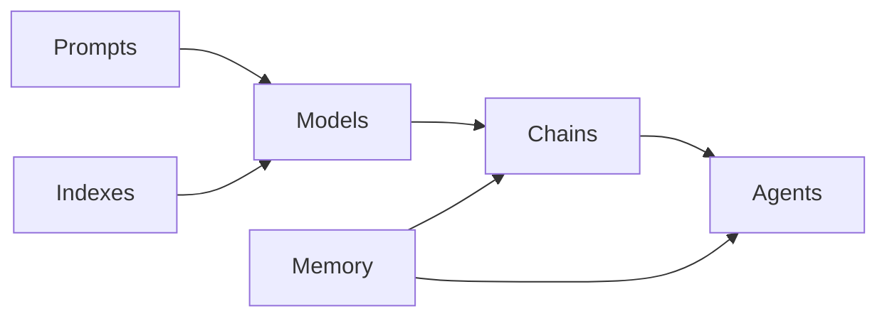
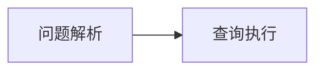

# 【LangChain编程：从入门到实践】资源和工具推荐

## 1. 背景介绍
### 1.1 问题的由来
随着人工智能技术的飞速发展,特别是大语言模型(LLM)的出现,如何更好地利用LLM来构建智能应用,成为了业界关注的热点。然而,直接使用LLM API进行应用开发存在诸多不便,比如prompt engineering的门槛较高,应用逻辑不易组织等。这时,一个名为LangChain的开源框架应运而生,它旨在简化LLM应用开发,让开发者能够更轻松地将LLM整合到应用中。

### 1.2 研究现状
目前业界已经涌现出众多利用LangChain进行LLM应用开发的案例,覆盖了问答系统、文本生成、代码辅助、知识库问答等多个领域。各大科技公司也纷纷投入资源研究LangChain,力图在LLM应用开发领域占据先机。学术界对LangChain的研究还处于起步阶段,但一些顶级会议如ACL、EMNLP等已经出现了相关论文。

### 1.3 研究意义
研究LangChain编程,对于推动LLM技术在实际应用中的落地具有重要意义。一方面,LangChain大大降低了LLM应用开发的门槛,使得更多开发者能够参与其中,加速LLM应用的产业化进程。另一方面,LangChain为LLM应用开发提供了一套标准化的流程和最佳实践,有利于提升应用质量,规避潜在风险。此外,对LangChain的深入研究,也有助于发现LLM技术自身的局限性,为其未来发展指明方向。

### 1.4 本文结构
本文将从以下几个方面对LangChain编程进行系统阐述：首先介绍LangChain的核心概念与内在联系；然后重点讲解其核心组件的工作原理与使用步骤；接着通过数学建模与代码实例深入剖析其技术细节；再然后总结LangChain的典型应用场景,并推荐一些学习资源和开发工具；最后展望LangChain的未来发展趋势与面临的挑战。

## 2. 核心概念与联系
LangChain的核心概念包括：

- **Prompts**：输入到语言模型中的文本,用于指导模型生成所需的输出。
- **Models**：指语言模型,如GPT-3、BLOOM等,是执行自然语言处理任务的核心。
- **Indexes**：将非结构化数据(如文档)转换为可搜索格式,方便语言模型检索信息。
- **Chains**：由多个组件(如Models、Prompts等)以特定逻辑组合而成,用于实现某个特定的任务。
- **Agents**：可以根据给定的目标自主执行多个子任务的链。
- **Memory**：用于在链和代理之间存储状态,使它们具备上下文感知能力。

这些概念之间的关系可以用下图表示：



可以看出,Prompts和Indexes为Models提供输入,Models的输出可以进一步组成Chains和Agents,Memory则贯穿始终,为Chains和Agents提供状态存储。理解这些概念之间的联系,是掌握LangChain编程的基础。

## 3. 核心算法原理 & 具体操作步骤
### 3.1 算法原理概述
LangChain的核心算法可以概括为"以任务为导向动态组装语言模型的prompt",具体来说：

1. 将任务拆解为多个步骤,每个步骤对应一个语言模型调用 
2. 根据每个步骤的需求,从预定义的prompt模板中选择合适的模板并填充参数,生成本步骤使用的prompt
3. 将prompt输入语言模型,获取输出结果
4. 将当前步骤的输出结果作为下一步骤的输入,重复2-4直到任务完成

这套算法允许开发者以声明式的方式定义任务流程,LangChain框架会自动处理底层的prompt生成和语言模型调用,大大简化了开发流程。

### 3.2 算法步骤详解
接下来我们详细讲解上述算法的每个步骤。

**步骤1：任务拆解**
首先需要将任务拆解为多个步骤,每个步骤都是一个相对独立的子任务,可以通过单次语言模型调用完成。步骤的粒度要适中,太粗可能超出语言模型的能力范围,太细又会引入不必要的开销。

以一个问答系统为例,我们可以将其拆解为以下步骤：

1. 对用户问题进行分类,判断其所属领域
2. 根据问题领域,从知识库中检索相关段落
3. 利用检索到的段落,生成问题的答案
4. 对答案进行必要的格式化,输出给用户

**步骤2：动态prompt生成**
在定义好任务步骤后,我们需要为每个步骤设计相应的prompt模板。一个prompt模板包含固定的文本和一些参数占位符,在运行时动态填充参数生成完整的prompt。

例如,步骤1的prompt模板可以设计为：
```
请帮我判断下面这个问题属于哪个领域,并用一个词作答:

问题:{{question}}

领域:
```

其中`{{question}}`就是一个参数占位符,在运行时会被替换为实际的用户问题。

步骤2的prompt模板为:
```
根据下面这个问题,请从以下段落中找出最相关的一段,并输出其内容:

问题:{{question}}

段落:
{{paragraph1}}
{{paragraph2}}
...

最相关段落:
```

这里`{{question}}`和`{{paragraph1}}`等都是参数占位符。

**步骤3：语言模型调用**
生成prompt后,我们将其输入到语言模型中,调用相应的API获取输出。LangChain提供了对各种主流语言模型的封装,支持OpenAI、Anthropic、Hugging Face等,开发者可以根据需要灵活选择。

以OpenAI的`gpt-3.5-turbo`模型为例,调用代码可以写成:

```python
from langchain.llms import OpenAI

llm = OpenAI(model_name="gpt-3.5-turbo", temperature=0.7)
result = llm(prompt)
```

这里`prompt`就是动态生成的完整prompt,`result`是语言模型返回的输出。

**步骤4：链式调用**
将前一步骤的输出结果作为后一步骤的输入参数,可以实现多个步骤的链式调用,从而完成整个任务。

以问答系统为例,完整的链式调用代码为:

```python
from langchain.chains import LLMChain
from langchain.prompts import PromptTemplate

# 定义prompt模板
template1 = "请帮我判断下面这个问题属于哪个领域,并用一个词作答:\n\n问题:{{question}}\n\n领域:"
prompt_template1 = PromptTemplate(template=template1, input_variables=["question"])

template2 = "根据下面这个问题,请从以下段落中找出最相关的一段,并输出其内容:\n\n问题:{{question}}\n\n段落:\n{{paragraphs}}\n\n最相关段落:"
prompt_template2 = PromptTemplate(template=template2, input_variables=["question", "paragraphs"])

template3 = "根据以下相关段落,请生成原问题的答案:\n\n段落:{{paragraph}}\n问题:{{question}}\n\n答案:"
prompt_template3 = PromptTemplate(template=template3, input_variables=["paragraph", "question"])

# 定义链
chain1 = LLMChain(llm=llm, prompt=prompt_template1)
chain2 = LLMChain(llm=llm, prompt=prompt_template2)
chain3 = LLMChain(llm=llm, prompt=prompt_template3)

# 执行任务
question = "巴黎是哪个国家的首都?"
domain = chain1.run(question)
paragraphs = retrieve_paragraphs(domain) 
paragraph = chain2.run(question=question, paragraphs=paragraphs)
answer = chain3.run(paragraph=paragraph, question=question)

print(answer)
```

这里`retrieve_paragraphs`是一个根据领域检索相关段落的函数,其实现省略。最终`answer`即为问题的自动生成答案。

### 3.3 算法优缺点
LangChain的核心算法具有以下优点：

- 简化了LLM应用开发流程,尤其是prompt engineering
- 以声明式方式定义任务,易于理解和维护
- 支持灵活组合多个LLM执行复杂任务
- 可复用的prompt模板,高度模块化

同时也存在一些局限性：

- 任务拆解粒度和prompt设计需要经验,有一定门槛
- 语言模型调用成本高,需权衡任务复杂度
- 对于需要推理多轮对话的任务支持不足

### 3.4 算法应用领域
LangChain的核心算法可以应用于以下领域：

- 智能问答:包括开放域问答、知识库问答等
- 文本生成:如文章写作、文本摘要、对话生成等 
- 代码辅助:代码生成、解释、审查等
- 数据分析:从非结构化数据中提取结构化信息
- 任务规划:为给定目标自动规划执行步骤

## 4. 数学模型和公式 & 详细讲解 & 举例说明
### 4.1 数学模型构建
LangChain可以用有向无环图(DAG)来建模,将每个任务步骤抽象为图中的节点,步骤之间的数据流转对应有向边。设图G=<V, E>,其中V为节点集合,E为有向边集合。

对于节点$v_i \in V$,定义其属性如下:
- $P_i$:节点$v_i$使用的prompt模板
- $M_i$:节点$v_i$调用的语言模型
- $I_i$:节点$v_i$的输入参数集合
- $O_i$:节点$v_i$的输出

对于有向边$e_{ij} \in E$,定义其属性如下:
- $S_{ij}$:边$e_{ij}$的源节点,即$v_i$
- $T_{ij}$:边$e_{ij}$的目标节点,即$v_j$
- $D_{ij}$:边$e_{ij}$上传递的数据,即$O_i$到$I_j$的映射关系

则整个任务流程可以表示为$G=<V,E>$,其中$V={v_1,\cdots,v_n}$,$E={e_{ij}|v_i,v_j \in V 且 v_i 的输出是 v_j 的输入}$。

### 4.2 公式推导过程
对于节点$v_i$,其输出$O_i$可以表示为:

$$
O_i=M_i(P_i(I_i))
$$

其中$P_i(I_i)$表示将输入参数$I_i$填充到prompt模板$P_i$中得到的完整prompt,$M_i(\cdot)$表示将prompt输入语言模型后得到的输出。

假设边$e_{ij}$上的数据映射关系为$D_{ij}$,则有:

$$
I_j=D_{ij}(O_i)
$$

将公式(1)代入公式(2),得:

$$
I_j=D_{ij}(M_i(P_i(I_i)))
$$

这里$I_j$是节点$v_j$的输入,因此可以进一步推导出$v_j$的输出$O_j$:

$$
O_j=M_j(P_j(I_j))=M_j(P_j(D_{ij}(M_i(P_i(I_i)))))
$$

公式(4)描述了任意两个相邻节点之间的输入输出关系。将其递归应用于图G中的所有节点,即可得到整个任务流程的数学表达。

### 4.3 案例分析与讲解
我们以一个简单的问答系统为例,展示如何应用上述数学模型进行建模与求解。

假设问答系统由两个步骤组成:

1. 问题解析:将自然语言问题解析为结构化的查询语句
2. 查询执行:根据查询语句从知识库中检索答案

则可以建模为一个包含两个节点的DAG:



节点$v_1$的属性为:
- $P_1$="请将下列问题解析为结构化的查询语句:\n问题:{{question}}\n查询语句:"
- $M