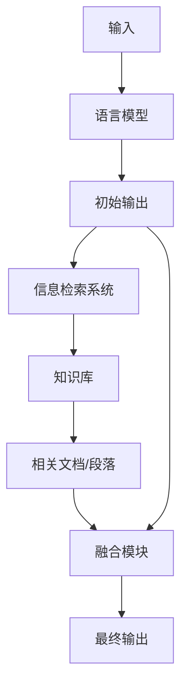

# 【大模型应用开发 动手做AI Agent】RAG和Agent

## 1. 背景介绍

### 1.1 问题的由来

在过去几年中,大型语言模型(Large Language Models, LLMs)取得了令人瞩目的进展,展现出了强大的自然语言理解和生成能力。然而,这些模型仍然存在一些局限性,例如缺乏对事实和常识知识的理解、容易产生不一致和虚构的输出、缺乏对话和任务上下文的理解等。为了解决这些问题,研究人员提出了各种增强大型语言模型的方法,其中一种有前景的方法是将大型语言模型与外部知识库相结合,形成所谓的"检索增强生成"(Retrieval-Augmented Generation, RAG)模型。

### 1.2 研究现状

RAG模型通过将语言模型与信息检索系统相结合,利用外部知识库中的事实性信息来增强语言模型的输出质量。具体来说,RAG模型首先使用语言模型生成一个初始输出,然后利用检索系统从知识库中检索与输出相关的文档或段落,最后将检索到的信息与语言模型的输出进行融合,生成最终的增强输出。

目前,已经有多种RAG模型被提出和研究,例如基于密集向量检索的DPR(Dense Passage Retrieval)模型、基于稀疏向量检索的BM25模型等。这些模型在各种自然语言处理任务上都取得了不错的表现,包括问答、对话、文本生成等。

### 1.3 研究意义

RAG模型的研究对于提高大型语言模型的性能和可靠性具有重要意义。通过融合外部知识库,RAG模型可以减少语言模型产生不一致和虚构输出的风险,提高输出的事实准确性。同时,RAG模型也为语言模型提供了一种获取新知识和扩展能力的途径,有助于缓解语言模型受限于训练数据的局限性。

此外,RAG模型的研究也为构建更加通用和智能的对话代理(Agent)系统奠定了基础。通过将RAG模型与其他模块(如对话管理、任务规划等)相结合,我们可以构建出能够进行多轮对话、完成复杂任务的智能代理系统。

### 1.4 本文结构

本文将全面介绍RAG模型及其在构建智能代理系统中的应用。具体内容包括:

1. RAG模型的核心概念和工作原理
2. RAG模型的核心算法原理和具体实现步骤
3. RAG模型的数学模型和公式推导
4. 基于RAG模型的智能代理系统的实现和案例分析
5. RAG模型在实际应用场景中的应用前景
6. RAG模型相关的工具和学习资源推荐
7. RAG模型的发展趋势、面临的挑战及未来展望

## 2. 核心概念与联系

RAG (Retrieval-Augmented Generation) 模型是一种将大型语言模型与信息检索系统相结合的新型模型,旨在利用外部知识库来增强语言模型的输出质量和能力。RAG 模型的核心思想是:首先使用语言模型生成一个初始输出,然后利用检索系统从知识库中检索与输出相关的文档或段落,最后将检索到的信息与语言模型的输出进行融合,生成最终的增强输出。

RAG 模型的核心组件包括:

1. **语言模型(Language Model)**: 通常是一个经过大规模预训练的大型语言模型,如 GPT、BERT 等,用于生成初始输出。

2. **信息检索系统(Information Retrieval System)**: 负责从知识库中检索与语言模型输出相关的文档或段落。常用的检索系统包括基于密集向量的 DPR(Dense Passage Retrieval)、基于稀疏向量的 BM25 等。

3. **知识库(Knowledge Base)**: 存储了大量的文本数据,如维基百科、网页数据等,作为检索系统的检索源。

4. **融合模块(Fusion Module)**: 将检索到的相关信息与语言模型的输出进行融合,生成最终的增强输出。

RAG 模型的工作流程如下所示:

RAG 模型与传统的语言模型相比,具有以下优势:

1. 减少不一致和虚构的输出,提高输出的事实准确性。
2. 为语言模型提供了获取新知识和扩展能力的途径。
3. 有助于缓解语言模型受限于训练数据的局限性。

RAG 模型在问答、对话、文本生成等多个自然语言处理任务中都展现出了不错的表现。同时,RAG 模型也为构建更加通用和智能的对话代理(Agent)系统奠定了基础。

## 3. 核心算法原理 & 具体操作步骤

### 3.1 算法原理概述

RAG (Retrieval-Augmented Generation) 模型的核心算法原理可以概括为以下几个步骤:

1. **语言模型生成初始输出**: 首先,使用一个经过大规模预训练的语言模型(如 GPT、BERT 等)根据给定的输入(如问题、对话历史等)生成一个初始的文本输出。

2. **相关文档检索**: 将语言模型生成的初始输出作为查询,利用信息检索系统(如 DPR、BM25 等)从知识库中检索与之相关的文档或段落。

3. **文档重要性打分**: 对检索到的文档或段落进行重要性打分,选取与初始输出最相关的前 N 个文档或段落。

4. **文档内容编码**: 将选取的文档或段落内容编码为向量表示,以便与语言模型的输出进行融合。

5. **输出融合**: 将语言模型的初始输出与编码后的文档内容进行融合,生成最终的增强输出。融合方式可以是简单的拼接,也可以使用更复杂的注意力机制等方法。

6. **输出解码**: 将融合后的向量表示解码为最终的文本输出。

整个过程中,语言模型和信息检索系统扮演了互补的角色:语言模型负责生成初始输出,而信息检索系统则负责从知识库中检索相关的补充信息。通过将两者的输出进行融合,RAG 模型可以产生更加准确、内容更加丰富的最终输出。

### 3.2 算法步骤详解

接下来,我们将详细介绍 RAG 模型算法的具体实现步骤:

1. **语言模型生成初始输出**

   - 选择一个经过大规模预训练的语言模型,如 GPT、BERT 等。
   - 根据给定的输入(如问题、对话历史等),使用语言模型生成一个初始的文本输出。

2. **相关文档检索**

   - 选择一种合适的信息检索系统,如基于密集向量的 DPR(Dense Passage Retrieval)或基于稀疏向量的 BM25 等。
   - 将语言模型生成的初始输出作为查询,利用信息检索系统从知识库中检索与之相关的文档或段落。

3. **文档重要性打分**

   - 对检索到的文档或段落进行重要性打分,可以使用如下方法:
     - 基于查询-文档相似度打分,如余弦相似度、点积相似度等。
     - 基于查询-文档相关性模型打分,如 BERT 相关性模型等。
   - 选取与初始输出最相关的前 N 个文档或段落。

4. **文档内容编码**

   - 将选取的文档或段落内容编码为向量表示,以便与语言模型的输出进行融合。
   - 编码方式可以是:
     - 使用语言模型的编码器(如 BERT 编码器)对文档内容进行编码。
     - 使用专门的文档编码模型(如 DPR 编码器)对文档内容进行编码。

5. **输出融合**

   - 将语言模型的初始输出与编码后的文档内容进行融合,生成最终的增强输出。
   - 融合方式可以是:
     - 简单的拼接:将语言模型输出和文档内容拼接在一起,作为语言模型的新输入。
     - 注意力融合:使用注意力机制对语言模型输出和文档内容进行加权融合。

6. **输出解码**

   - 将融合后的向量表示输入到语言模型的解码器中,解码为最终的文本输出。

需要注意的是,上述步骤中的具体实现细节(如编码方式、融合方式等)可能会因不同的 RAG 模型而有所不同。此外,在实际应用中,我们还需要考虑一些其他因素,如检索效率、输出质量评估等。

### 3.3 算法优缺点

RAG 模型作为一种将语言模型与外部知识库相结合的新型模型,具有以下优势:

1. **提高输出的事实准确性**: 通过从知识库中检索相关信息,RAG 模型可以减少语言模型产生不一致和虚构输出的风险,提高输出的事实准确性。

2. **扩展语言模型的知识范围**: RAG 模型为语言模型提供了一种获取新知识和扩展能力的途径,有助于缓解语言模型受限于训练数据的局限性。

3. **支持多种任务**: RAG 模型可以应用于多种自然语言处理任务,如问答、对话、文本生成等,展现出了不错的表现。

4. **模块化设计,易于扩展**: RAG 模型采用了模块化设计,语言模型、信息检索系统和融合模块可以相对独立地进行优化和替换,便于模型的扩展和改进。

然而,RAG 模型也存在一些缺点和挑战:

1. **检索效率**: 在大规模知识库中进行相关文档检索是一个计算密集型任务,可能会影响模型的响应速度和实时性。

2. **知识库覆盖范围**: 知识库的覆盖范围和质量直接影响了 RAG 模型的输出质量,如何构建高质量、广覆盖的知识库是一个挑战。

3. **输出一致性**: 如何确保语言模型输出与检索到的知识库信息保持一致,避免产生矛盾和不协调的输出,也是一个需要解决的问题。

4. **融合策略**: 如何有效地将语言模型输出与检索到的知识库信息进行融合,是 RAG 模型的一个关键环节,需要探索更加高效和智能的融合策略。

5. **评估指标**: 目前缺乏专门用于评估 RAG 模型输出质量的指标,如何定义合理的评估指标也是一个值得研究的问题。

总的来说,RAG 模型为提高语言模型的性能和可靠性提供了一种有前景的解决方案,但也存在一些需要进一步研究和改进的地方。

### 3.4 算法应用领域

RAG 模型作为一种将语言模型与外部知识库相结合的新型模型,可以应用于多种自然语言处理任务,包括但不限于:

1. **问答系统(Question Answering)**: RAG 模型可以用于构建基于知识库的问答系统。通过从知识库中检索相关信息,RAG 模型可以为给定的问题提供更加准确和详尽的答案。

2. **对话系统(Dialogue Systems)**: 在对话系统中,RAG 模型可以用于增强对话代理的响应质量。通过从知识库中检索相关信息,对话代理可以提供更加丰富和有见地的回复,提高对话的自然性和连贯性。

3. **文本生成(Text Generation)**: RAG 模型可以用于生成基于知识库的高质量文本,如新闻报道、文章撰写、内容创作等。通过融合知识库信息,生成的文本可以更加准确、内容更加丰富。

4. **事实核查(Fact Checking)**: RAG 模型可以用于自动化的事实核查任务。通过将待核查的陈述与知识库中的信息进行对比,RAG 模型可以判断该陈述是否准确,并提供相关的支持性或反驳性证据