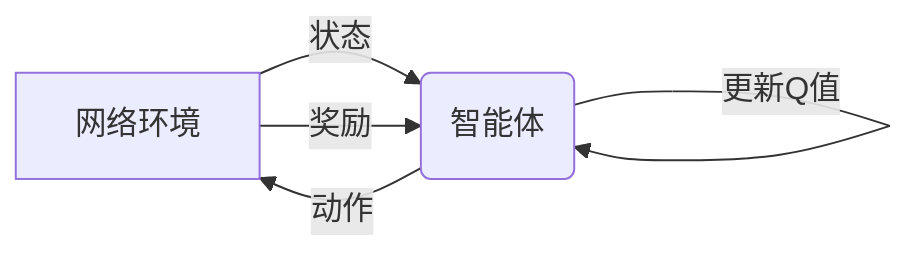

# 一切皆是映射：AI Q-learning在网络安全中的实践

关键词：Q-learning, 网络安全, 人工智能, 强化学习, 入侵检测, 异常检测

## 1. 背景介绍

### 1.1 问题的由来
随着互联网和信息技术的快速发展,网络安全问题日益严峻。传统的基于规则和特征的网络安全防御手段已经难以应对日益复杂多变的网络攻击。人工智能和机器学习技术为解决这一难题提供了新的思路。其中,强化学习作为一种无需预先标注数据、能够通过试错学习的方法,在网络安全领域展现出了广阔的应用前景。

### 1.2 研究现状
近年来,国内外学者围绕强化学习在网络安全中的应用开展了大量研究。一些学者将Q-learning等经典强化学习算法应用于入侵检测、DDoS攻击检测、恶意代码分析等任务中,取得了良好效果。同时,一些改进的强化学习算法如Deep Q-Network(DQN)、Asynchronous Advantage Actor-Critic(A3C)等在网络安全场景下也得到了尝试和验证。这些研究表明,强化学习是解决网络安全问题的有效途径之一。

### 1.3 研究意义
将强化学习应用于网络安全,有望突破传统方法的局限,实现更加智能、自适应的安全防御。通过让智能体在网络环境中自主学习和决策,可以动态应对未知的攻击模式,减少对专家知识和规则的依赖。这对于应对日益复杂的网络安全形势具有重要意义。同时,强化学习代表了人工智能的前沿方向,将其引入网络安全领域,有助于推动安全技术的智能化发展。

### 1.4 本文结构
本文将重点探讨强化学习中的Q-learning算法在网络安全领域的应用实践。第2部分介绍Q-learning的核心概念和数学原理。第3部分详细讲解Q-learning算法的操作步骤和改进方法。第4部分结合具体的网络安全任务,讨论如何建立Q-learning模型并给出数学推导。第5部分通过代码实例演示Q-learning在异常检测中的使用。第6部分分析Q-learning在实际网络安全场景中的应用情况。第7部分推荐相关的学习资源和工具。第8部分总结全文,展望未来发展方向和面临的挑战。

## 2. 核心概念与联系

Q-learning是强化学习的一种重要算法,其核心思想是通过不断试错和反馈来学习最优决策。在Q-learning中,智能体(Agent)通过与环境(Environment)的交互,根据当前状态(State)采取动作(Action),并获得即时奖励(Reward)。智能体的目标是通过学习状态-动作值函数Q(s,a),来最大化累积奖励。

Q-learning与网络安全问题有着天然的契合。网络环境可以看作是一个复杂的状态空间,攻防双方的行为对应着不同的动作选择。通过将安全事件与奖励值关联,就可以引导智能体学习最优的安全策略。例如,对于入侵检测任务,正常请求可以对应正向奖励,而恶意请求对应负向奖励。智能体的目标就是通过学习识别恶意行为,最大化系统安全性。

下图展示了将Q-learning应用于网络安全的基本框架:



智能体通过感知网络环境的状态,根据当前策略选择安全动作,影响环境并获得奖励反馈,再利用反馈不断更新Q值函数,以逐步逼近最优安全策略。这一过程不断循环,使智能体的安全防御能力不断提升。

总的来说,Q-learning通过将复杂的网络安全问题建模为马尔可夫决策过程,并用值函数逼近最优策略,为解决动态变化的安全威胁提供了新的思路和方法。

## 3. 核心算法原理 & 具体操作步骤

### 3.1 算法原理概述
Q-learning的核心是通过值迭代来逼近最优状态-动作值函数Q(s,a)。Q(s,a)表示在状态s下采取动作a的长期累积奖励期望。若Q(s,a)已知,则智能体的最优策略就是在每个状态下选择Q值最大的动作。

Q-learning的更新规则如下:

$$Q(s_t,a_t) \leftarrow Q(s_t,a_t) + \alpha [r_{t+1} + \gamma \max_a Q(s_{t+1},a) - Q(s_t,a_t)]$$

其中,$s_t$和$a_t$分别表示t时刻的状态和动作,$r_{t+1}$为执行动作后获得的即时奖励。$\alpha \in (0,1]$为学习率,控制每次更新的幅度。$\gamma \in [0,1]$为折扣因子,表示对未来奖励的衰减程度。

算法的核心步骤是:在每个时间步,智能体根据当前Q值选择动作(一般采用$\epsilon$-贪婪策略),执行动作后观察下一状态和奖励,并根据上述更新规则更新Q值,然后进入下一轮迭代。

### 3.2 算法步骤详解
Q-learning的具体操作步骤如下:

1. 初始化Q值函数$Q(s,a)$,可以初始化为全0或随机值。
2. 重复以下步骤,直到收敛或达到最大训练轮数:
   1) 根据当前状态$s_t$,采用$\epsilon$-贪婪策略选择动作$a_t$。即以$\epsilon$的概率随机选择动作,否则选择Q值最大的动作。
   2) 执行动作$a_t$,观察下一状态$s_{t+1}$和奖励$r_{t+1}$。
   3) 根据Q-learning的更新规则,更新Q值:
      $$Q(s_t,a_t) \leftarrow Q(s_t,a_t) + \alpha [r_{t+1} + \gamma \max_a Q(s_{t+1},a) - Q(s_t,a_t)]$$
   4) 更新状态$s_t \leftarrow s_{t+1}$,进入下一轮迭代。
3. 返回最终学习到的Q值函数。

在实际使用中,Q值函数一般用值表(Q-table)或神经网络(如DQN)来表示。前者适用于状态和动作空间较小的情况,后者可以处理大规模甚至连续的状态空间。

### 3.3 算法优缺点
Q-learning的主要优点包括:
- 简单易实现,适用于各种序贯决策问题。
- 能够在未知环境中通过试错学习,无需预先建模。
- 在一定条件下能够收敛到最优策略。
- 通过值函数逼近,可以处理大规模状态空间。

但Q-learning也存在一些局限:
- 容易受到状态表征的影响,特征选择很关键。
- 对奖励函数敏感,奖励设计不当会影响学习效果。
- 在复杂环境下收敛速度较慢,样本效率不高。
- 难以处理部分可观察、非平稳环境。

### 3.4 算法应用领域
Q-learning在众多领域得到了成功应用,例如:
- 游戏智能体:国际象棋、围棋、Atari视频游戏等。
- 机器人控制:自动驾驶、机械臂操作等。
- 推荐系统:电商推荐、广告投放等。
- 通信与网络:动态路由、流量调度等。
- 金融投资:股票交易、投资组合管理等。

近年来,Q-learning在网络安全领域也受到了越来越多的关注,主要应用于入侵检测、恶意软件检测、DDoS防御、威胁情报分析等任务。结合专家知识和环境反馈,Q-learning可以学习到更加有效和鲁棒的安全策略。

## 4. 数学模型和公式 & 详细讲解 & 举例说明

### 4.1 数学模型构建
为了将Q-learning应用于网络安全,首先需要建立合适的数学模型。一般将网络安全问题抽象为马尔可夫决策过程(MDP),其核心要素包括:

- 状态空间$\mathcal{S}$:描述网络环境的不同状态,如流量特征、系统调用序列等。
- 动作空间$\mathcal{A}$:描述安全策略可选的动作,如报警、丢弃、放行等。
- 状态转移概率$\mathcal{P}$:描述在状态s下采取动作a后转移到状态s'的概率。
- 奖励函数$\mathcal{R}$:描述在状态s下采取动作a后获得的即时奖励。

以入侵检测为例,可以将一次网络请求视为一个状态,其特征可包括:
- 源/目的IP和端口
- 请求长度、频率
- URL路径、参数
- User-Agent等头部字段

可选动作包括放行(正常)和警告(恶意)。奖励函数的设计需要结合专家知识,对恶意请求给予负向奖励,对正常请求给予正向奖励,同时考虑误报代价。

状态转移概率往往难以准确获知,但Q-learning的优势在于无需显式建模转移概率,只需要通过采样的方式利用奖励信号来更新值函数。

### 4.2 公式推导过程
结合上述MDP模型,可以将Q-learning应用于网络安全领域。核心是通过不断的状态转移和策略改进来更新Q值函数。假设在第t步,智能体处于状态$s_t$,采取动作$a_t$,观察到奖励$r_{t+1}$和下一状态$s_{t+1}$。则Q值的更新公式为:

$$Q(s_t,a_t) \leftarrow Q(s_t,a_t) + \alpha [r_{t+1} + \gamma \max_a Q(s_{t+1},a) - Q(s_t,a_t)]$$

这个公式可以这样理解:Q值的更新量包括两部分,即即时奖励$r_{t+1}$和下一状态的最大Q值$\max_a Q(s_{t+1},a)$,后者代表了未来的累积奖励期望。两者的加权平均构成了时序差分(TD)目标,与当前Q值的差即为TD误差。学习率$\alpha$控制每次更新的步长,折扣因子$\gamma$平衡了当前和未来奖励的重要性。

为了平衡探索和利用,在选择动作时一般采用$\epsilon-$贪婪策略:

$$
a_t=\begin{cases}
\arg\max_a Q(s_t,a) & \text{with probability }1-\epsilon \\
\text{random action} & \text{with probability }\epsilon
\end{cases}
$$

$\epsilon$是一个小于1的正数,表示随机探索的概率。随着训练的进行,$\epsilon$一般会逐渐衰减以鼓励利用。

### 4.3 案例分析与讲解
下面通过一个简单的例子来说明Q-learning在异常检测中的应用。假设要检测一个IP地址的恶意登录行为,状态空间只包含登录成功和失败两种状态,动作空间包含放行和警告两种动作。

初始Q值表如下:

|  状态\动作 | 放行 | 警告 |
|  ----  | ----  | ----  |
| 登录成功  | 0 | 0 |
| 登录失败  | 0 | 0 |

设置学习率$\alpha=0.1$,折扣因子$\gamma=0.9$,探索概率$\epsilon=0.1$。假设连续观察到如下状态转移和奖励:

```
登录失败 -> 放行 -> 奖励0
登录失败 -> 放行 -> 奖励0
登录失败 -> 警告 -> 奖励1
登录成功 -> 放行 -> 奖励1
```

根据Q-learning的更新公式,第一次观察后,更新Q(登录失败,放行):

$$Q(登录失败,放行) \leftarrow 0 + 0.1 \times [0 + 0.9 \times \max(0,0) - 0] = 0$$

第二次观察与第一次相同,Q值不变。第三次观察后,更新Q(登录失败,警告):

$$Q(登录