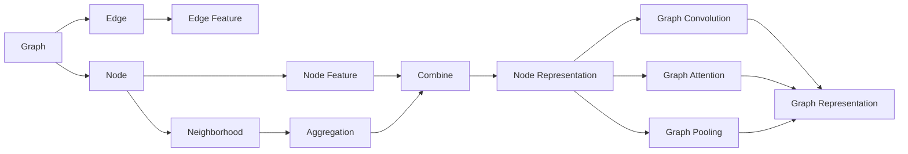

# 一切皆是映射：图神经网络(GNN)与复杂系统分析

关键词：图神经网络、复杂系统、深度学习、网络嵌入、图卷积网络、图注意力网络、知识图谱、推荐系统

## 1. 背景介绍
### 1.1  问题的由来
在现实世界中，许多复杂系统都可以用图(Graph)来表示，如社交网络、交通网络、金融网络、知识图谱等。这些图结构数据蕴含着丰富的信息和模式，对其进行有效的分析和挖掘具有重要的理论意义和实际价值。传统的机器学习方法主要针对规则的结构化数据，难以直接应用于图这种非结构化数据。近年来，深度学习技术的发展为图数据的表示学习和分析提供了新的思路和方法，图神经网络(Graph Neural Networks, GNN)应运而生，并引起了学术界和工业界的广泛关注。

### 1.2  研究现状
图神经网络的研究可以追溯到2005年Gori等人提出的图神经网络模型，该模型利用递归神经网络对图结构数据进行建模。此后，Scarselli等人进一步扩展了图神经网络，提出了图神经网络的一般框架。2016年，Kipf和Welling提出了图卷积网络(Graph Convolutional Networks, GCN)，通过谱图理论将卷积操作引入到图域，有效地提取节点的局部结构特征。GCN的出现掀起了图神经网络研究的热潮，各种改进和变体模型如雨后春笋般涌现，如GraphSAGE、GAT、GIN等。图神经网络在图分类、节点分类、链路预测、社群检测、推荐系统等任务上取得了显著的效果，展现出广阔的应用前景。

### 1.3  研究意义
图神经网络为复杂系统的分析提供了新的视角和方法论。传统的复杂系统分析主要依赖于统计物理的方法，如度分布、聚类系数、最短路径等，难以刻画系统内在的动力学特性。图神经网络通过对图结构数据进行端到端的表示学习，可以自动提取复杂系统的关键特征，揭示其演化规律和动力学机制。此外，图神经网络所学习到的节点/图嵌入表示可用于下游的分析任务，如异常检测、时序预测、控制优化等，为复杂系统的理解和调控提供了新的工具。因此，图神经网络与复杂系统分析的结合具有重要的理论和实践意义，有望推动复杂系统研究的进一步发展。

### 1.4  本文结构
本文将系统地介绍图神经网络的基本概念、核心原理和典型模型，并探讨其在复杂系统分析中的应用。全文共分为9个章节：第1章介绍研究背景；第2章阐述图神经网络的核心概念；第3章讲解图神经网络的原理和算法；第4章建立图神经网络的数学模型并给出公式推导；第5章通过代码实例演示图神经网络的实现；第6章分析图神经网络在复杂系统中的应用场景；第7章推荐相关的工具和资源；第8章总结全文并展望未来；第9章列举常见问题解答。

## 2. 核心概念与联系
图神经网络是一类专门用于处理图结构数据的深度学习模型，其核心思想是通过迭代的信息传播和聚合来学习节点的表示。下面介绍几个图神经网络的核心概念：

- 图(Graph)：由节点(Node)和边(Edge)组成的数据结构，用于表示事物之间的关系。形式化定义为G=(V, E)，其中V为节点集，E为边集。
- 节点(Node)：图中的基本单元，表示一个实体对象，如人、物品、概念等。每个节点可以有自己的属性特征，称为节点特征(Node Feature)。
- 边(Edge)：连接两个节点的有向或无向线段，表示节点之间的关系。边也可以带有属性，称为边特征(Edge Feature)。
- 邻域(Neighborhood)：与节点直接相连的其他节点的集合，记为N(v)。
- 聚合(Aggregation)：对节点邻域信息进行汇总的操作，如求和、平均、最大池化等，用于更新节点表示。
- 组合(Combine)：将节点自身特征与聚合后的邻域信息进行融合，生成新的节点表示。
- 图卷积(Graph Convolution)：类比于传统卷积，对图数据进行卷积操作，提取局部结构特征。
- 图注意力(Graph Attention)：通过注意力机制自适应地为邻居节点分配权重，突出重要的邻居信息。
- 图池化(Graph Pooling)：对图进行下采样，生成层次化的图表示。

这些概念之间紧密相关，共同构成了图神经网络的理论基础。图神经网络通过迭代地聚合邻域信息并更新节点表示，逐层提取图数据的高层特征。图卷积和图注意力机制进一步增强了图神经网络对复杂拓扑结构的建模能力。图池化操作使图神经网络能够处理不同尺度和粒度的图数据。

图神经网络与复杂系统分析有着天然的联系。复杂系统往往呈现出图结构特征，如复杂网络、知识图谱等。图神经网络提供了一种新颖的范式来表示和分析复杂系统，通过端到端的特征学习，自动提取系统的关键属性，刻画其演化动力学。同时，图神经网络所学习到的节点/图嵌入可用于复杂系统的各种分析任务，如节点分类、链路预测、社群检测等。因此，图神经网络为复杂系统研究带来了新的视角和方法，有望推动复杂系统分析的进一步发展。

下图展示了图神经网络的核心概念之间的关系：

## 3. 核心算法原理 & 具体操作步骤
### 3.1  算法原理概述
图神经网络的核心是通过迭代的信息传播和聚合来学习节点的表示。具体而言，每个节点的表示是由其自身特征和邻居节点的表示经过变换和聚合得到的。这个过程可以用如下公式表示：

$$h_v^{(l+1)} = \sigma \left(W^{(l)} \cdot AGG\left(\left\lbrace h_u^{(l)} : u \in N(v) \right\rbrace \right) \right)$$

其中，$h_v^{(l)}$表示第$l$层第$v$个节点的表示，$N(v)$为节点$v$的邻域，$AGG$为聚合函数，$W^{(l)}$为第$l$层的权重矩阵，$\sigma$为激活函数。

图神经网络的训练过程通过反向传播算法来优化模型参数，使得学习到的节点表示能够最大程度地保留图结构信息，并适用于下游的分析任务。

### 3.2  算法步骤详解
图神经网络的具体算法步骤如下：

1. 初始化：为每个节点分配初始特征表示，可以是节点的属性特征，也可以是随机初始化的向量。

2. 信息聚合：对于每个节点，收集其邻居节点的表示，并使用聚合函数(如求和、平均、最大池化等)进行汇总。常见的聚合函数有：
   - 求和：$AGG = \sum_{u \in N(v)} h_u^{(l)}$
   - 平均：$AGG = \frac{1}{|N(v)|} \sum_{u \in N(v)} h_u^{(l)}$
   - 最大池化：$AGG = max_{u \in N(v)} h_u^{(l)}$

3. 信息更新：将节点自身的特征表示与聚合后的邻域信息进行组合，并通过非线性变换得到新的节点表示。常见的组合方式有：
   - 拼接：$h_v^{(l+1)} = \sigma \left(W^{(l)} \cdot [h_v^{(l)} || AGG] \right)$
   - 相加：$h_v^{(l+1)} = \sigma \left(W^{(l)} \cdot (h_v^{(l)} + AGG) \right)$

4. 重复迭代：重复步骤2和3，进行多轮的信息传播和聚合，更新节点表示。迭代次数通常为固定的超参数。

5. 图级表示(可选)：如果任务需要对整个图进行分类或预测，可以使用图池化操作将所有节点的表示聚合为图级表示。常见的图池化方式有：
   - 求和池化：$h_G = \sum_{v \in V} h_v^{(L)}$
   - 平均池化：$h_G = \frac{1}{|V|} \sum_{v \in V} h_v^{(L)}$
   - 最大池化：$h_G = max_{v \in V} h_v^{(L)}$
   - 注意力池化：$h_G = \sum_{v \in V} a_v h_v^{(L)}$，其中$a_v$为注意力权重。

6. 输出及训练：将得到的节点表示或图表示输入到任务特定的输出层，如分类器、预测器等。使用反向传播算法优化模型参数，最小化任务的损失函数。

以上是图神经网络的一般流程，不同的图神经网络变体在聚合函数、组合方式、图池化操作等细节上有所不同，但核心思想是一致的。

### 3.3  算法优缺点
图神经网络相比传统的机器学习方法，在处理图结构数据方面具有显著的优势：

- 能够直接对图数据进行端到端的学习，无需手工设计特征工程。
- 通过迭代的信息传播和聚合，有效地捕捉节点之间的依赖关系和图的拓扑结构信息。
- 学习到的节点嵌入表示可用于各种下游的图分析任务，具有很好的泛化性和可迁移性。

但图神经网络也存在一些局限性：

- 计算复杂度较高，对于大规模图的训练可能面临效率瓶颈。
- 超参数较多，如迭代次数、隐藏层维度等，需要进行调参优化。
- 对于动态图、异构图等复杂图结构的建模能力有待进一步提升。

### 3.4  算法应用领域
图神经网络在许多领域得到了成功应用，包括：

- 社交网络分析：如节点分类、链路预测、社群检测等。
- 推荐系统：通过构建用户-物品二部图，利用图神经网络进行个性化推荐。
- 交通预测：将交通网络建模为图，预测路况、流量等。
- 分子指纹识别：将分子结构表示为图，预测分子属性、药物活性等。
- 知识图谱：利用图神经网络进行实体分类、关系预测、知识推理等。
- 程序分析：将程序抽象语法树(AST)视为图，进行程序分类、漏洞检测等。

图神经网络正在不断拓展其应用边界，为更多领域的复杂系统分析提供新的思路和方法。

## 4. 数学模型和公式 & 详细讲解 & 举例说明
### 4.1  数学模型构建
我们以一个简单的图神经网络模型为例，说明其数学原理。考虑一个无向图$G=(V,E)$，每个节点$v \in V$有其特征向量$x_v \in \mathbb{R}^d$，目标是学习一个映射函数$f: V \rightarrow \mathbb{R}^h$，将节点映射到$h$维嵌入空间。

定义节点$v$在第$l$层的嵌入表示为$h_v^{(l)} \in \mathbb{R}^{h^{(l)}}$，初始嵌入为节点特征，即$h_v^{(0)} = x_v$。每一层的嵌入表示通过如下方式更新：

$$h_v^{