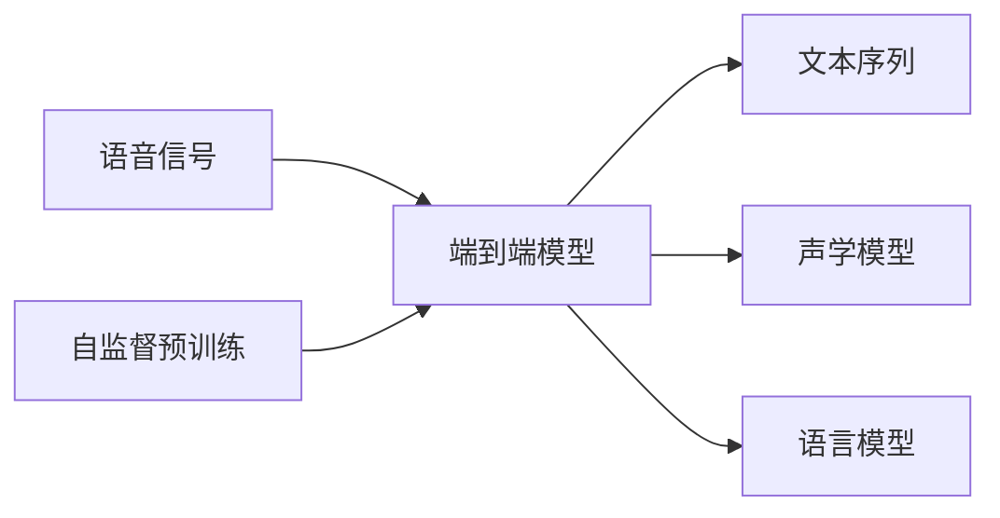

# 一切皆是映射：语音识别技术的AI转型

关键词：语音识别、人工智能、深度学习、端到端、CTC损失函数、注意力机制、Transformer、Wav2Vec、HuBERT

## 1. 背景介绍
### 1.1  问题的由来
语音识别技术一直是人工智能领域的重要研究方向之一。传统的语音识别系统通常由声学模型、发音词典和语言模型等多个模块组成，需要大量的专家知识和人工调优。而随着深度学习的兴起，端到端的语音识别方法开始崭露头角，摆脱了对复杂流水线系统的依赖，直接将语音信号映射到文本序列，大大简化了系统构建流程，提高了识别准确率。

### 1.2  研究现状
目前，基于深度学习的端到端语音识别已经成为主流技术路线。从早期的CTC模型，到注意力机制和Transformer的引入，再到近年来的自监督预训练模型如Wav2Vec和HuBERT，语音识别技术不断突破性能瓶颈，逐步逼近甚至超越人类水平。同时，语音识别也从实验室走向了工业应用，在智能语音助手、会议记录、医疗辅助等领域发挥着重要作用。

### 1.3  研究意义
语音是人类最自然、最便捷的交互方式之一。高效、准确的语音识别技术可以极大提升人机交互体验，让机器更好地理解人类意图，为智能时代的到来奠定基础。同时，语音识别技术的进步也为相关领域如语音合成、语音翻译、说话人识别等带来新的机遇和挑战。深入探讨语音识别中的人工智能技术发展，对推动智能语音交互、智慧城市建设等具有重要意义。

### 1.4  本文结构
本文将围绕语音识别技术的AI转型这一主题展开论述。首先介绍语音识别的核心概念及其内在联系；然后重点阐述几种主流的端到端语音识别算法原理及其演进过程；接着通过数学模型推导和代码实例，深入剖析算法的技术细节；进一步探讨语音识别技术在实际场景中的应用情况；最后总结语音识别的发展趋势与面临的挑战，并提供一些学习资源和工具推荐。

## 2. 核心概念与联系
在语音识别领域，有几个核心概念需要理解：

- 声学模型：用于将语音信号转化为音素或者字符的概率序列，传统上采用高斯混合-隐马尔可夫模型（GMM-HMM），现在多采用深度神经网络（DNN）。
- 语言模型：刻画词与词之间的依赖关系，为识别提供语境信息。常见的有n-gram统计语言模型和RNN神经语言模型。  
- 端到端模型：将声学模型、发音词典和语言模型整合为一个整体，直接将语音信号映射到文本序列。代表性的有CTC、RNN-T、LAS等。
- 自监督预训练：通过大规模无标注语音数据进行预训练，学习语音信号的通用表征，再迁移到下游任务。典型的有Wav2Vec、HuBERT等。

这些概念之间环环相扣。传统的语音识别系统需要分别构建声学模型和语言模型，再通过解码器进行整合；而端到端模型可以一步到位，通过联合优化简化流程。同时，自监督预训练提供了更好的模型初始化，加速了端到端模型的收敛和泛化。总的来说，语音识别技术正朝着端到端化和预训练的方向发展，力求以数据驱动的方式最小化人工参与，提升系统的智能化水平。

## 3. 核心算法原理 & 具体操作步骤
### 3.1  算法原理概述
端到端语音识别的核心是建立从语音信号到文本序列的直接映射函数。以下是几种主要的端到端建模范式：

1. CTC（Connectionist Temporal Classification）：通过引入blank标签，将输入语音序列和输出标签序列对齐，然后优化条件概率 $P(l|x)$，其中 $l$ 为标签序列，$x$ 为语音特征序列。

2. RNN-T（Recurrent Neural Network Transducer）：基于Encoder-Decoder结构，Encoder对语音进行建模，Decoder利用语言模型信息进行解码，通过前向-后向算法计算损失函数并优化。

3. LAS（Listen, Attend and Spell）：同样基于Encoder-Decoder结构，但引入Attention机制来动态地对齐输入输出序列，解决了语音和文本长度不一致的问题。

4. Transformer：基于Self-Attention机制，通过堆叠多层Transformer Block，建立语音和文本的全局依赖关系，并行计算提高了训练效率。

### 3.2  算法步骤详解
以CTC模型为例，详细说明端到端语音识别的实现步骤：

1. 特征提取：将原始语音波形转化为帧级别的特征序列，常用的有Fbank、MFCC等。

2. 搭建模型：构建深度神经网络，通常采用CNN或RNN结构，将特征序列映射到字符概率分布。

3. 定义CTC损失函数：引入blank标签，计算输出序列和标签序列的条件概率，作为优化目标。

$$\begin{aligned}
P(l|x) &= \sum_{a \in \mathcal{B}^{-1}(l)} P(a|x) \\
&= \sum_{a \in \mathcal{B}^{-1}(l)} \prod_{t=1}^{T} y_{a_t}^t
\end{aligned}$$

其中，$\mathcal{B}$ 为去除blank和重复标签的映射函数，$y_{a_t}^t$ 为t时刻标签 $a_t$ 的概率。

4. 模型训练：使用梯度下降法优化CTC损失函数，更新模型参数。

5. 解码预测：给定新的语音输入，通过前向计算得到每一帧的字符概率分布，再通过贪心算法或束搜索算法得到最终的识别结果。

### 3.3  算法优缺点
CTC算法的优点在于：
- 端到端建模，省去了对齐等复杂流程
- 引入blank标签，有效处理了输入输出长度不一致的问题
- 可以与任意神经网络结构相结合，具有很好的灵活性

但CTC也存在一些局限性：
- 假设输出标签之间相互独立，没有考虑语言模型信息
- 需要大量标注数据进行训练，数据准备成本高
- 不能显式地建模语音和文本的对齐关系

### 3.4  算法应用领域
端到端语音识别算法已经在多个领域得到广泛应用，如：

- 智能语音助手：如Siri、Alexa等，通过语音识别实现人机自然交互
- 会议记录：自动将会议音频转化为文本记录，提高工作效率
- 语音输入：在手机、车载等场景下，用语音替代键盘输入文字
- 医疗辅助：医生可以通过语音录入病历，减轻工作负担
- 教育培训：自动生成课程字幕，方便学生学习复习

未来，随着算法的不断进步和硬件设备的升级，语音识别有望在更多领域发挥重要作用。

## 4. 数学模型和公式 & 详细讲解 & 举例说明
### 4.1  数学模型构建
CTC的数学模型可以用概率图模型来表示。设输入语音序列为 $x=(x_1,\dots,x_T)$，输出标签序列为 $z=(z_1,\dots,z_U)$，则CTC的目标是最大化条件概率 $P(z|x)$。

由于输入输出长度不等，需要引入blank标签和映射函数 $\mathcal{B}$：

$$\mathcal{B}(\pi)=\mathcal{B}((\pi_1,\dots,\pi_T))=(b(\pi_1),\dots,b(\pi_T))$$

其中， $\pi$ 为扩展的标签序列，$b$ 为去除blank和重复标签的映射规则。

则条件概率可以表示为：

$$P(z|x)=\sum_{\pi \in \mathcal{B}^{-1}(z)}P(\pi|x)$$

其中， $\mathcal{B}^{-1}(z)$ 为所有可能映射到 $z$ 的 $\pi$ 的集合。

进一步地，假设 $\pi$ 的每一位是相互独立的，则有：

$$P(\pi|x)=\prod_{t=1}^T y_{\pi_t}^t$$

其中， $y_{\pi_t}^t$ 为t时刻标签 $\pi_t$ 的概率，由神经网络输出。

### 4.2  公式推导过程
对数似然函数：

$$\mathcal{L}=\log P(z|x)=\log \sum_{\pi \in \mathcal{B}^{-1}(z)}\prod_{t=1}^T y_{\pi_t}^t$$

由于log求和不便于计算，引入前向概率 $\alpha$：

$$\alpha_t(s)=\sum_{\pi \in \mathcal{B}_t(s)} \prod_{\tau=1}^t y_{\pi_\tau}^\tau$$

其中， $\mathcal{B}_t(s)$ 为长度为t的前缀 $\pi_{1:t}$ 映射为s的所有 $\pi$ 的集合。

则 $\alpha$ 可以递归计算：

$$\alpha_t(s)=\left\{\begin{matrix}
y_{b}^t \cdot \alpha_{t-1}(s) + y_{s}^t \cdot \alpha_{t-1}(s), & s=b \\ 
y_{b}^t \cdot \alpha_{t-1}(s) + y_{s}^t \cdot (\alpha_{t-1}(s)+\alpha_{t-1}(\gamma(s))), & s \neq b
\end{matrix}\right.$$

其中， $\gamma(s)$ 为s去掉最后一个字符的前缀。

最终，CTC的损失函数为：

$$\mathcal{L}=-\log \alpha_T(z)=-\log P(z|x)$$

通过最小化损失函数，可以训练整个神经网络模型。

### 4.3  案例分析与讲解
下面以一个简单的例子来说明CTC的计算过程。

假设输入序列 $x$ 经过神经网络后得到的概率分布为：

$$\begin{aligned}
y^1 &= [0.4, 0.3, 0.2, 0.1] \\
y^2 &= [0.4, 0.1, 0.3, 0.2] \\
y^3 &= [0.2, 0.1, 0.3, 0.4] \\
y^4 &= [0.1, 0.5, 0.3, 0.1] \\
y^5 &= [0.5, 0.1, 0.2, 0.2]
\end{aligned}$$

其中，每一行对应一个时间步，每一列对应blank和a、b、c三个字符的概率。

假设目标标签序列为 $z=(a,c)$，则所有可能的映射 $\pi$ 有：

$$\begin{aligned}
& (b,b,b,b,b) \\
& (b,b,b,b,c) \\
& (b,b,b,c,b) \\
& (b,b,b,c,c) \\
& ... \\
& (a,c,c,c,c)
\end{aligned}$$

根据前向算法递推公式，可以计算出：

$$\begin{aligned}
\alpha_1(b) &= 0.4 \\
\alpha_1(a) &= 0.3 \\
\alpha_2(b) &= 0.4*0.4+0.1*0.3=0.19 \\
\alpha_2(a) &= 0.4*0.3+0.1*0=0.12 \\
... \\
\alpha_5(c) &= 0.0184
\end{aligned}$$

最终，CTC的损失函数值为：

$$\mathcal{L}=-\log P(z|x)=-\log \alpha_5(c)=-\log 0.0184=3.9950$$

通过反向传播和梯度下降，可以不断更新神经网络的参数，提高模型的识别准确率。

### 4.4  常见问题解答
Q: CTC能否处理任意长度的输入输出？

A: 理论上可以，但实际应用中为了提高效率，