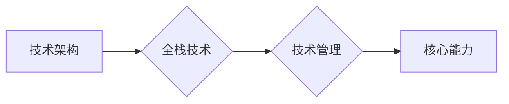

# 互联网技术架构全栈技术管理核心能力

作者：禅与计算机程序设计艺术 / Zen and the Art of Computer Programming

## 1. 背景介绍
### 1.1 问题的由来

随着互联网技术的快速发展，企业对于技术架构的要求越来越高。从单体应用向分布式架构转变，从传统IT向云计算、大数据、人工智能等领域拓展，技术架构的复杂性日益增加。如何构建高效、可靠、可扩展的技术架构，成为了企业IT部门面临的重要挑战。

### 1.2 研究现状

当前，关于技术架构的研究主要集中在以下几个方面：

1. 架构风格：如单体架构、微服务架构、分布式架构等。
2. 技术选型：如数据库、缓存、消息队列、微服务框架等。
3. 架构设计：如分层架构、服务拆分、负载均衡、容灾备份等。
4. 架构评估：如架构评估框架、架构评估方法等。

然而，现有研究往往偏重于技术层面的探讨，而对于技术管理人员所需的全栈技术管理核心能力关注不足。

### 1.3 研究意义

研究互联网技术架构全栈技术管理核心能力，对于提升企业IT部门的管理水平、保障技术架构的稳定运行、推动企业数字化转型具有重要意义。

1. 提升管理效率：掌握全栈技术管理核心能力，有助于技术管理人员更好地协调团队成员、优化工作流程，提高管理效率。
2. 降低技术风险：了解不同技术架构的优缺点，能够帮助技术管理人员选择合适的技术方案，降低技术风险。
3. 提高架构质量：掌握架构设计原则和方法，有助于技术管理人员构建高质量的技术架构，满足企业业务需求。
4. 促进数字化转型：具备全栈技术管理核心能力的技术管理人员，能够推动企业进行数字化转型，提升企业竞争力。

### 1.4 本文结构

本文将围绕互联网技术架构全栈技术管理核心能力展开讨论，主要包括以下内容：

- 核心概念与联系
- 全栈技术管理核心能力体系
- 核心能力提升方法
- 实际应用场景
- 工具和资源推荐
- 未来发展趋势与挑战

## 2. 核心概念与联系

为了更好地理解互联网技术架构全栈技术管理核心能力，本节将介绍几个密切相关的核心概念：

- 技术架构：指在特定业务场景下，为了实现业务目标而设计的各种技术组件及其相互关系。
- 全栈技术：指涵盖前端、后端、数据库、网络、安全等各个层面的技术。
- 技术管理：指对技术团队、技术产品、技术项目等进行规划、组织、领导、控制等活动的过程。
- 核心能力：指在特定领域内，能够为企业创造价值的关键能力。

它们之间的逻辑关系如下图所示：

可以看出，技术架构是全栈技术和技术管理的基础，而技术管理则是实现技术架构的关键。核心能力则是技术管理人员在技术管理过程中需要具备的关键能力。

## 3. 全栈技术管理核心能力体系

本节将介绍互联网技术架构全栈技术管理核心能力体系，主要包括以下几个方面：

### 3.1 技术架构规划能力

技术架构规划能力是指技术管理人员能够根据企业业务需求和发展战略，制定合理的技术架构方案的能力。

1. 业务需求分析：深入理解企业业务需求和发展战略，明确技术架构的建设目标。
2. 架构设计：根据业务需求，选择合适的架构风格、技术选型、架构设计原则等。
3. 架构评估：评估技术架构的可行性、可行性和可维护性。

### 3.2 技术选型能力

技术选型能力是指技术管理人员能够根据项目需求，选择合适的技术组件和平台的能力。

1. 技术调研：了解各类技术组件和平台的性能、特点、优缺点等。
2. 技术评估：根据项目需求，评估技术组件和平台的适用性。
3. 技术选型：选择符合项目需求的技术组件和平台。

### 3.3 架构设计能力

架构设计能力是指技术管理人员能够根据业务需求和技术选型，设计合理的技术架构的能力。

1. 架构风格：选择合适的架构风格，如单体架构、微服务架构、分布式架构等。
2. 服务拆分：将复杂的应用系统拆分为多个独立的服务，提高系统可扩展性和可维护性。
3. 负载均衡：设计负载均衡策略，提高系统性能和可用性。
4. 容灾备份：设计容灾备份方案，保障系统稳定运行。

### 3.4 技术项目管理能力

技术项目管理能力是指技术管理人员能够对技术项目进行有效管理的能力。

1. 项目规划：制定技术项目计划，明确项目目标、范围、进度、资源等。
2. 团队管理：组建技术团队，明确团队成员职责，协调团队成员工作。
3. 进度控制：监控技术项目进度，确保项目按时完成。
4. 质量控制：制定技术项目质量标准，保证项目质量。

### 3.5 技术风险管理能力

技术风险管理能力是指技术管理人员能够识别、评估和控制技术风险的能力。

1. 风险识别：识别技术项目可能面临的风险，如技术风险、业务风险、人员风险等。
2. 风险评估：评估技术风险的严重程度和概率。
3. 风险控制：制定风险控制措施，降低技术风险。

### 3.6 技术团队管理能力

技术团队管理能力是指技术管理人员能够有效管理技术团队的能力。

1. 团队建设：建设高效、协作、创新的技术团队。
2. 团队激励：制定有效的激励机制，提高团队成员积极性和凝聚力。
3. 团队发展：关注团队成员成长，提供培训和发展机会。

### 3.7 技术知识管理能力

技术知识管理能力是指技术管理人员能够管理和利用技术知识的能力。

1. 技术文档管理：建立完善的技术文档体系，方便团队成员查阅和共享技术知识。
2. 知识库建设：建立技术知识库，积累和传播技术经验。
3. 技术培训：开展技术培训，提升团队成员的技术水平。

### 3.8 技术文化建设能力

技术文化建设能力是指技术管理人员能够营造积极向上的技术团队文化的能力。

1. 激励创新：鼓励团队成员进行技术创新，推动技术进步。
2. 传承经验：鼓励团队成员分享经验，促进团队共同成长。
3. 培养价值观：树立正确的价值观，引导团队成员积极向上。

## 4. 核心能力提升方法

为了提升全栈技术管理核心能力，技术管理人员可以采取以下方法：

### 4.1 不断学习

技术管理人员需要持续关注技术发展趋势，不断学习新的技术知识和管理理念。可以通过以下途径进行学习：

1. 阅读专业书籍和文章：阅读相关领域的专业书籍和文章，了解技术发展趋势和管理理念。
2. 参加技术培训：参加技术培训课程，学习新技术、新工具、新方法。
3. 参与技术社区：参与技术社区，与其他技术管理人员交流心得，分享经验。
4. 关注行业动态：关注行业动态，了解行业最新技术和应用案例。

### 4.2 实践经验

技术管理人员需要将所学知识应用于实际工作中，积累实践经验。可以通过以下途径进行实践：

1. 参与项目：参与技术项目，负责项目的技术管理工作。
2. 案例研究：研究成功案例，学习他人经验。
3. 失败分析：分析失败案例，总结经验教训。

### 4.3 沟通协作

技术管理人员需要具备良好的沟通协作能力，能够与团队成员、业务部门、其他部门等各方进行有效沟通协作。可以通过以下途径提升沟通协作能力：

1. 建立沟通机制：建立有效的沟通机制，保证信息畅通。
2. 沟通技巧：学习沟通技巧，提高沟通效果。
3. 团队建设：加强团队建设，增强团队凝聚力。

### 4.4 思考总结

技术管理人员需要具备良好的思考总结能力，能够对工作过程中遇到的问题进行分析和总结。可以通过以下途径提升思考总结能力：

1. 日志记录：记录工作日志，总结经验教训。
2. 思考笔记：定期进行思考笔记，梳理思路，总结经验。
3. 反思总结：对工作中的问题进行反思总结，寻找解决方案。

## 5. 实际应用场景

全栈技术管理核心能力在以下实际应用场景中具有重要意义：

### 5.1 企业数字化转型

随着互联网技术的快速发展，企业数字化转型成为必然趋势。技术管理人员需要具备全栈技术管理核心能力，推动企业进行数字化转型，实现业务创新和效率提升。

### 5.2 新技术应用

新技术不断涌现，如云计算、大数据、人工智能等。技术管理人员需要具备全栈技术管理核心能力，将新技术应用于企业业务场景，为企业创造价值。

### 5.3 信息化建设

企业信息化建设是提高企业竞争力和管理水平的重要手段。技术管理人员需要具备全栈技术管理核心能力，构建高效、可靠、可扩展的信息化系统。

### 5.4 项目管理

技术管理人员需要具备全栈技术管理核心能力，对技术项目进行有效管理，保证项目按时、按质、按预算完成。

## 6. 工具和资源推荐

为了帮助技术管理人员提升全栈技术管理核心能力，以下是一些相关的工具和资源推荐：

### 6.1 学习资源推荐

1. 《深度学习》系列书籍：介绍深度学习原理和应用，帮助技术管理人员了解人工智能技术。
2. 《架构师之路》系列书籍：介绍架构设计原则和方法，帮助技术管理人员提升架构设计能力。
3. 《敏捷软件开发》系列书籍：介绍敏捷开发方法论，帮助技术管理人员提升项目管理和团队管理能力。

### 6.2 开发工具推荐

1. Git：版本控制工具，用于代码管理。
2. JIRA：项目管理工具，用于项目进度跟踪和协作。
3. Docker：容器化技术，用于应用程序打包和部署。

### 6.3 相关论文推荐

1. 《大规模分布式存储系统》
2. 《云计算》
3. 《大数据》

### 6.4 其他资源推荐

1. CSDN：技术社区，提供丰富的技术文章和资源。
2. GitHub：代码托管平台，提供大量的开源项目和技术交流。
3. Stack Overflow：技术问答社区，可以解决技术问题。

## 7. 未来发展趋势与挑战

### 7.1 未来发展趋势

1. 技术融合：未来，云计算、大数据、人工智能等新技术将更加紧密地融合，推动技术架构的演进。
2. 自动化：自动化技术将应用于技术架构的规划、设计、部署、运维等各个环节，提高技术管理的效率。
3. 服务化：技术架构将更加服务化，提供更加灵活、可扩展、可定制的技术服务。
4. 智能化：人工智能技术将应用于技术架构的优化和决策，提高技术管理的智能化水平。

### 7.2 面临的挑战

1. 技术更新迅速：新技术不断涌现，技术管理人员需要不断学习，跟上技术发展趋势。
2. 技术复杂性增加：随着技术架构的复杂化，技术管理人员需要具备更高的技术能力和管理能力。
3. 安全风险增加：随着网络攻击手段的多样化，技术管理人员需要加强安全风险防范。
4. 人才短缺：具备全栈技术管理核心能力的技术管理人员短缺，企业需要加强人才培养。

### 7.3 研究展望

为了应对未来发展趋势和挑战，技术管理人员需要：

1. 持续学习：不断学习新技术、新方法、新理念，提升自身能力。
2. 重视团队建设：加强团队建设，培养和引进人才。
3. 加强安全管理：加强安全风险防范，保障技术架构的安全稳定运行。
4. 优化管理流程：优化技术架构的规划、设计、部署、运维等各个环节的管理流程，提高效率。

## 8. 总结：未来发展趋势与挑战

本文对互联网技术架构全栈技术管理核心能力进行了系统研究。通过分析核心概念、能力体系、提升方法、实际应用场景等内容，揭示了全栈技术管理核心能力在企业数字化转型、新技术应用、信息化建设、项目管理等场景中的重要作用。

展望未来，随着技术发展趋势和挑战的不断变化，技术管理人员需要不断提升自身能力，以适应未来技术架构的发展需求。相信通过不断学习和实践，技术管理人员能够成为企业数字化转型的推动者，为企业创造更大的价值。

作者：禅与计算机程序设计艺术 / Zen and the Art of Computer Programming