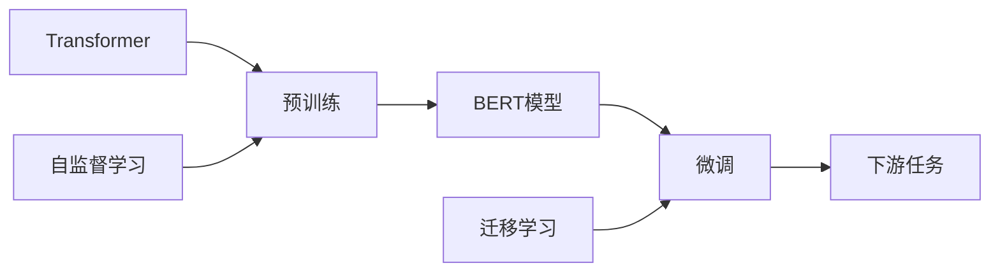

# 从零开始大模型开发与微调：BERT的基本架构与应用

关键词：BERT, Transformer, 预训练, 微调, NLP, 自然语言处理, 深度学习, 迁移学习

## 1. 背景介绍
### 1.1  问题的由来
随着互联网的快速发展,海量的文本数据正在以前所未有的速度增长。如何从这些非结构化的文本数据中挖掘有价值的信息,成为自然语言处理(NLP)领域的一个重要研究课题。传统的NLP方法主要基于人工特征工程,需要大量的领域知识和人力成本,且泛化能力有限。近年来,深度学习技术的崛起为NLP领域带来了革命性的变革。以BERT(Bidirectional Encoder Representations from Transformers)为代表的预训练语言模型,通过在大规模无监督语料上进行预训练,可以学习到语言的通用表示,再结合少量标注数据进行微调,即可应用于下游的各种NLP任务,取得了显著的性能提升。

### 1.2  研究现状 
自从2018年Google发布BERT以来,预训练语言模型迅速成为NLP领域的研究热点。各大科技公司和研究机构纷纷开展相关研究,提出了一系列基于Transformer的预训练模型,如OpenAI GPT、XLNet、RoBERTa、ALBERT等,不断刷新着NLP任务的性能记录。预训练模型也从最初的通用语言理解发展到具体垂直领域,如BioBERT用于生物医疗领域,SciBERT用于科学文献,说明预训练模型具有强大的迁移学习能力。目前,预训练模型已经成为NLP任务的标配,正在深刻影响和改变着NLP技术的发展格局。

### 1.3  研究意义
预训练语言模型代表了NLP技术发展的新方向,对于推动NLP在各领域的应用具有重要意义:

(1) 提升模型性能。通过在海量语料上学习通用语言知识,预训练模型能更好地理解文本语义,捕捉长距离依赖,从而大幅提升下游任务性能。

(2) 减少标注成本。利用预训练模型进行迁移学习,只需少量标注数据就可以训练出性能优异的模型,大大节省了人力标注成本。

(3) 促进跨领域研究。预训练模型提供了统一的语言表示框架,有利于不同领域知识的融合与迁移,促进了跨领域的研究与应用。

(4) 赋能行业应用。预训练模型为NLP技术在各行业的应用提供了新的可能,如智能客服、舆情分析、知识图谱等,有望带来业务流程的变革与效率的提升。

### 1.4  本文结构
本文将以BERT为例,介绍如何从零开始开发和微调预训练语言模型。内容安排如下:第2部分介绍BERT的核心概念;第3部分详细讲解BERT的架构原理和预训练方法;第4部分阐述BERT涉及的关键数学知识;第5部分通过代码实例演示BERT的开发与微调过程;第6部分总结BERT的典型应用场景;第7部分推荐相关的学习资源;第8部分对BERT的发展趋势与挑战进行展望;第9部分为常见问题解答。

## 2. 核心概念与联系
BERT是一种基于Transformer的双向语言表示模型。其核心思想是通过自监督学习,在大规模无标注语料上预训练一个通用的语言表示模型,然后在具体的下游任务上通过微调来适应任务的特点。BERT的核心概念如下:

- Transformer: 一种基于自注意力机制的神经网络架构,通过建模文本元素之间的依赖关系来学习文本表示。BERT使用多层Transformer作为主体编码器。

- 预训练(Pre-training): 在大规模无监督语料上训练模型学习通用语言表示的过程。BERT采用掩码语言模型(Masked Language Model, MLM)和句子连贯性预测(Next Sentence Prediction, NSP)两个预训练任务。

- 微调(Fine-tuning): 在预训练的基础上,利用任务的标注数据对模型进行进一步训练,使其适应具体任务的过程。BERT可以灵活地应用于各种下游NLP任务。

- 自监督学习(Self-supervised Learning): 一种无需人工标注训练数据的学习范式。通过对输入数据进行某种形式的自动标注,从而训练模型学习有意义的表示。BERT利用MLM和NSP构建自监督信号。

- 迁移学习(Transfer Learning): 将从源任务学到的知识迁移应用到目标任务,提高目标任务的学习效率和性能。BERT通过预训练和微调实现了语言知识的迁移学习。

下图展示了BERT的核心概念之间的关系:

## 3. 核心算法原理 & 具体操作步骤
### 3.1 算法原理概述
BERT的核心是基于Transformer的双向编码器,通过自监督预训练来学习文本的上下文表示。具体来说,BERT采用以下两个预训练任务:

(1) 掩码语言模型(MLM):随机掩盖输入文本中的一部分token,然后训练模型根据上下文预测被掩盖的token。这使得模型能学习到词汇和上下文之间的双向关系。

(2) 句子连贯性预测(NSP):给定两个句子,训练模型预测第二个句子是否是第一个句子的下文。这使得模型能学习到句子之间的逻辑关系。

通过在大规模无标注语料上进行MLM和NSP预训练,BERT可以学习到语言的通用表示。在应用于下游任务时,只需在预训练模型的基础上添加一个简单的输出层,并用少量标注数据进行微调即可。

### 3.2 算法步骤详解
BERT的训练过程分为两个阶段:预训练阶段和微调阶段。

预训练阶段的主要步骤如下:

(1) 语料准备:收集大规模无标注的文本语料,进行清洗和预处理。

(2) 输入表示:将输入文本转换为token序列,并添加特殊标记[CLS]和[SEP]。对于NSP任务,将两个句子拼接为一个序列。

(3) Token嵌入:将每个token映射为一个嵌入向量,同时加入位置嵌入和段嵌入。

(4) Transformer编码:将嵌入序列输入Transformer编码器,通过多头自注意力和前馈网络学习上下文表示。

(5) MLM任务:随机掩码一定比例的token,用[MASK]标记替换,并让模型预测被掩码的token。损失函数为被掩码位置的交叉熵损失。

(6) NSP任务:对于每个句子对,标记第二个句子是否为第一个句子的下文。以[CLS]位置的表示为分类特征,计算二元交叉熵损失。

(7) 模型优化:使用Adam优化器训练模型,并采用学习率预热和线性衰减策略。

微调阶段的主要步骤如下:

(1) 任务数据准备:根据具体任务收集和标注少量训练数据。

(2) 模型构建:在预训练BERT的基础上,根据任务类型添加相应的输出层,如分类、序列标注等。

(3) 模型训练:使用任务的标注数据对模型进行微调,通常只需训练几个epoch即可。

(4) 模型评估:在任务的验证集或测试集上评估模型性能。

(5) 模型应用:将微调后的模型部署到实际应用系统中。

### 3.3 算法优缺点
BERT算法的主要优点包括:

(1) 强大的特征提取能力:通过在大规模语料上的预训练,BERT可以学习到语言的通用表示,包含丰富的语义和语法知识。

(2) 广泛的适用性:BERT采用统一的Transformer架构,可以灵活地应用于各种NLP任务,且只需少量任务数据就能取得不错的效果。

(3) 双向建模:与单向语言模型不同,BERT采用MLM进行双向建模,可以更好地捕捉上下文信息。

(4) 开源性:Google提供了BERT的开源实现和预训练模型,极大降低了研究和应用的门槛。

BERT算法的主要缺点包括:

(1) 计算开销大:BERT采用多层Transformer,训练和推理的计算开销都比较大,对硬件要求较高。

(2) 模型体积大:BERT的参数量很大(基础版1.1亿,大版3.4亿),存储和部署成本高。

(3) 长文本处理能力有限:由于Transformer的计算复杂度与序列长度的平方呈正比,BERT对长文本的处理能力有限。

(4) 训练数据要求高:BERT的预训练需要大量高质量的无标注语料,对训练数据的质量和数量要求较高。

### 3.4 算法应用领域
得益于其强大的语言理解能力和广泛的适用性,BERT在NLP的各个领域都有着广泛的应用,主要包括:

(1) 文本分类:如情感分析、新闻分类、意图识别等。

(2) 序列标注:如命名实体识别、词性标注、语义角色标注等。

(3) 句子关系判断:如自然语言推理、语义相似度计算等。

(4) 问答系统:基于BERT的阅读理解和问答系统在多个数据集上取得了最优性能。

(5) 信息抽取:如关系抽取、事件抽取、观点抽取等。

(6) 文本生成:如对话生成、文本摘要、机器翻译等。

(7) 垂直领域应用:在医疗、金融、法律等专业领域,通过在垂直语料上预训练BERT,可以显著提升领域任务的性能。

## 4. 数学模型和公式 & 详细讲解 & 举例说明
### 4.1 数学模型构建
BERT的数学模型主要包括三个部分:输入表示、Transformer编码器和输出层。

输入表示:设输入文本序列为 $\mathbf{w}=(w_1,\ldots,w_n)$,其中 $w_i$ 表示第 $i$ 个token。将每个token映射为一个 $d$ 维的嵌入向量 $\mathbf{e}_i\in \mathbb{R}^d$,再加上位置嵌入 $\mathbf{p}_i\in \mathbb{R}^d$ 和段嵌入 $\mathbf{s}_i\in \mathbb{R}^d$(用于区分两个句子),得到第 $i$ 个位置的输入表示 $\mathbf{h}_i^0$:

$$\mathbf{h}_i^0 = \mathbf{e}_i + \mathbf{p}_i + \mathbf{s}_i$$

Transformer编码器:Transformer编码器由 $L$ 个相同的层堆叠而成,每一层包括两个子层:多头自注意力(Multi-Head Attention)和前馈网络(Feed-Forward Network)。

多头自注意力将上一层的输出 $\mathbf{h}^{l-1}=(\mathbf{h}_1^{l-1},\ldots,\mathbf{h}_n^{l-1})$ 分别线性映射为查询矩阵 $\mathbf{Q}^h$、键矩阵 $\mathbf{K}^h$ 和值矩阵 $\mathbf{V}^h$,然后计算注意力分数:

$$\mathbf{A}^h = \text{softmax}(\frac{\mathbf{Q}^h{\mathbf{K}^h}^\top}{\sqrt{d_k}})\mathbf{V}^h$$

其中 $h=1,\ldots,H$ 为注意力头的编号, $d_k=d/H$ 为每个头的维度。将所有头的输出拼接并线性变换,得到多头自注意力的输出:

$$\text{MultiHead}(\mathbf{h}^{l-1}) = \text{Concat}(\mathbf{A}^1,\ldots,\mathbf{A}^H)\mathbf{W}^O$$

其中 $\mathbf{W}^O\in \mathbb{R}^{d\times d}$ 为线性变换矩阵。