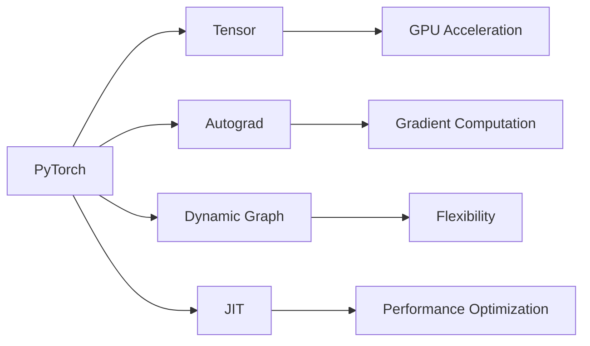
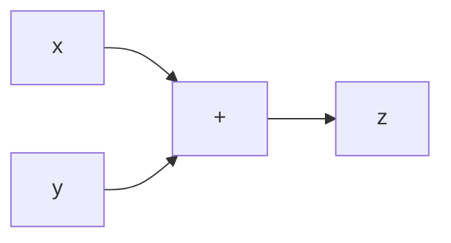

# 从零开始大模型开发与微调：环境搭建2：安装PyTorch 2.0

作者：禅与计算机程序设计艺术 / Zen and the Art of Computer Programming

关键词：大模型、PyTorch 2.0、环境搭建、深度学习、人工智能

## 1. 背景介绍 

### 1.1 问题的由来

近年来,随着人工智能技术的飞速发展,尤其是深度学习领域的突破性进展,大模型(Large Language Models)成为了学术界和工业界关注的焦点。大模型以其强大的语言理解和生成能力,在自然语言处理、对话系统、知识问答等领域取得了令人瞩目的成就。然而,大模型的训练和部署对计算资源提出了极高的要求,这给许多研究者和开发者带来了挑战。

### 1.2 研究现状

目前,业界主流的大模型训练框架包括Google的TensorFlow、Facebook的PyTorch、微软的ONNX Runtime等。其中,PyTorch凭借其简洁灵活的接口设计、强大的动态计算图机制,以及活跃的开源社区,受到了广大开发者的青睐。尤其是最新发布的PyTorch 2.0版本,进一步提升了框架的性能和易用性,为大模型的开发和部署提供了更好的支持。

### 1.3 研究意义

掌握PyTorch 2.0的安装和使用,是开展大模型研究和应用的基础。通过系统学习PyTorch 2.0的环境搭建流程,读者可以快速上手PyTorch,并利用其强大的功能进行模型开发、训练和部署。这不仅能够提升个人的动手实践能力,也为后续深入研究大模型奠定了坚实的基础。

### 1.4 本文结构

本文将从以下几个方面展开介绍PyTorch 2.0的安装和环境搭建:

- 核心概念与联系
- 安装步骤详解 
- 实践操作指南
- 常见问题解答
- 学习资源推荐

通过对上述内容的系统阐述,帮助读者全面掌握PyTorch 2.0环境搭建的关键要点,快速上手PyTorch进行大模型开发。

## 2. 核心概念与联系

在正式开始安装PyTorch 2.0之前,我们有必要对其背后的一些核心概念有所了解:

- 张量(Tensor):PyTorch的核心数据结构,类似于NumPy的多维数组,但可以在GPU上运行以加速计算。
- 自动微分(Autograd):PyTorch的自动微分机制,可以根据输入和前向传播过程自动构建计算图并计算梯度。  
- 动态计算图:与TensorFlow的静态计算图不同,PyTorch采用动态计算图,可以在运行时动态改变网络结构。
- 即时编译(JIT):PyTorch 2.0引入的即时编译技术,可以将动态图转换为静态图,提高推理性能。

下图展示了PyTorch的核心架构和各组件之间的联系:



PyTorch通过上述组件的协同工作,为开发者提供了一个全面、灵活、高效的深度学习框架。

## 3. 核心算法原理 & 具体操作步骤

### 3.1 算法原理概述

PyTorch的核心是一个基于带权自动微分(weighted autograd)的张量库。通过自动微分机制,PyTorch可以自动跟踪和记录张量的运算过程,并根据链式法则计算梯度,实现高效的反向传播。

### 3.2 算法步骤详解

PyTorch的自动微分主要涉及以下几个步骤:

1. 前向传播:定义输入张量,并根据模型结构进行一系列张量运算,得到输出张量。在此过程中,PyTorch会自动构建一个动态计算图。

2. 计算损失:根据输出张量和真实标签计算损失函数,如均方误差、交叉熵等。

3. 反向传播:调用`loss.backward()`方法,PyTorch会自动根据计算图和链式法则,计算每个张量的梯度。

4. 优化更新:根据梯度信息,利用优化算法(如SGD、Adam)更新模型参数,以最小化损失函数。

5. 清空梯度:在每个迭代开始前,需要调用`optimizer.zero_grad()`方法清空上一次迭代的梯度信息。

下面是一个简单的PyTorch自动微分示例:

```python
import torch

# 定义输入张量
x = torch.tensor([1.0, 2.0, 3.0], requires_grad=True)
y = torch.tensor([4.0, 5.0, 6.0], requires_grad=True)

# 前向传播
z = x + y
loss = torch.sum(z)

# 反向传播
loss.backward()

# 访问梯度
print(x.grad)  # tensor([1., 1., 1.])
print(y.grad)  # tensor([1., 1., 1.])
```

### 3.3 算法优缺点

PyTorch自动微分的主要优点包括:

- 简洁易用:用户只需定义前向传播,PyTorch即可自动完成反向传播和梯度计算。
- 灵活高效:基于动态计算图,可以方便地构建和修改复杂的网络结构。
- 性能优异:底层使用C++实现,并针对GPU进行了优化,计算速度很快。

但PyTorch自动微分也存在一些局限性,如:

- 不支持二阶导数:目前PyTorch只支持一阶导数的自动计算,对于需要二阶导数的算法(如牛顿法)需要手动实现。
- 动态图的内存开销:动态图的构建和释放会带来额外的内存开销,一定程度上影响了训练速度。

### 3.4 算法应用领域

PyTorch凭借其灵活性和性能,在学术研究和工业应用中得到了广泛使用,主要应用领域包括:

- 计算机视觉:图像分类、目标检测、语义分割等
- 自然语言处理:语言模型、机器翻译、命名实体识别等  
- 语音识别:声学模型、语言模型、端到端建模等
- 强化学习:DQN、A3C、PPO等
- 图神经网络:节点分类、链路预测、图生成等

## 4. 数学模型和公式 & 详细讲解 & 举例说明

### 4.1 数学模型构建

PyTorch自动微分的数学模型可以用一个有向无环图(DAG)来表示,其中:

- 节点表示张量或者运算操作
- 边表示张量之间的依赖关系

例如,对于表达式$z = x + y$,其计算图可以表示为:



### 4.2 公式推导过程

根据链式法则,假设$L$是损失函数,我们有:

$$
\frac{\partial L}{\partial x} = \frac{\partial L}{\partial z} \frac{\partial z}{\partial x} = \frac{\partial L}{\partial z} \cdot 1 = \frac{\partial L}{\partial z}
$$

$$
\frac{\partial L}{\partial y} = \frac{\partial L}{\partial z} \frac{\partial z}{\partial y} = \frac{\partial L}{\partial z} \cdot 1 = \frac{\partial L}{\partial z}
$$

因此,对于加法操作,其输入张量的梯度等于输出张量的梯度。

### 4.3 案例分析与讲解

下面我们以一个简单的线性回归模型为例,演示PyTorch自动微分的完整过程。

假设我们有如下训练数据:

| $x$ | $y$ |
|:---:|:---:|
| 1   | 2   |
| 2   | 4   |
| 3   | 6   |

我们希望学习一个线性模型$y = w \cdot x + b$,使其能够很好地拟合训练数据。

首先,定义模型参数和输入数据:

```python
import torch

# 定义模型参数
w = torch.randn(1, requires_grad=True)
b = torch.zeros(1, requires_grad=True)

# 定义输入数据
x = torch.tensor([1.0, 2.0, 3.0])
y = torch.tensor([2.0, 4.0, 6.0])
```

然后,定义前向传播过程和损失函数:

```python
# 前向传播
y_pred = x * w + b

# 定义损失函数
loss = torch.mean((y_pred - y) ** 2)
```

接下来,进行反向传播和参数更新:

```python
# 反向传播
loss.backward()

# 参数更新
with torch.no_grad():
    w -= 0.01 * w.grad
    b -= 0.01 * b.grad
    
    # 清空梯度
    w.grad.zero_()
    b.grad.zero_()
```

通过多次迭代,我们就可以得到一个较优的线性模型。

### 4.4 常见问题解答

Q: 为什么需要在参数更新前调用`torch.no_grad()`?

A: 在参数更新时,我们不希望将更新过程记录到计算图中,因此需要使用`torch.no_grad()`临时禁用自动微分。否则可能会导致计算图不断增长,占用大量内存。

Q: 为什么每次迭代后要清空梯度?

A: PyTorch的默认行为是累积梯度,即每次`backward()`调用都会将新的梯度累加到原有梯度上。因此,在每次迭代开始前,需要清空上一次的梯度信息,以免影响当前步的梯度计算。

Q: 自动微分和符号微分的区别是什么?

A: 符号微分是在编译时根据数学表达式推导出导数公式,而自动微分则在运行时记录前向传播过程并自动计算梯度。相比符号微分,自动微分更加灵活,不需要手动推导公式,且能够处理控制流等动态计算。

## 5. 项目实践：代码实例和详细解释说明

下面我们通过一个完整的项目实践,来演示如何利用PyTorch搭建一个简单的卷积神经网络,并进行训练和测试。

### 5.1 开发环境搭建

首先,确保已经正确安装了PyTorch和相关依赖。可以通过以下命令来检查PyTorch的版本信息:

```python
import torch
print(torch.__version__)
```

如果输出的版本号与预期一致,则说明PyTorch安装成功。

### 5.2 源代码详细实现

下面是项目的完整代码实现:

```python
import torch
import torch.nn as nn
import torch.optim as optim
from torchvision import datasets, transforms

# 定义超参数
batch_size = 64
learning_rate = 0.01
num_epochs = 10

# 定义数据预处理
transform = transforms.Compose([
    transforms.ToTensor(),
    transforms.Normalize((0.1307,), (0.3081,))
])

# 加载MNIST数据集
train_dataset = datasets.MNIST(root='./data', train=True, download=True, transform=transform)
test_dataset = datasets.MNIST(root='./data', train=False, download=True, transform=transform)

train_loader = torch.utils.data.DataLoader(train_dataset, batch_size=batch_size, shuffle=True)
test_loader = torch.utils.data.DataLoader(test_dataset, batch_size=batch_size, shuffle=False)

# 定义卷积神经网络
class Net(nn.Module):
    def __init__(self):
        super(Net, self).__init__()
        self.conv1 = nn.Conv2d(1, 32, 3, 1)
        self.conv2 = nn.Conv2d(32, 64, 3, 1)
        self.dropout1 = nn.Dropout2d(0.25)
        self.dropout2 = nn.Dropout2d(0.5)
        self.fc1 = nn.Linear(9216, 128)
        self.fc2 = nn.Linear(128, 10)

    def forward(self, x):
        x = self.conv1(x)
        x = nn.functional.relu(x)
        x = self.conv2(x)
        x = nn.functional.max_pool2d(x, 2)
        x = self.dropout1(x)
        x = torch.flatten(x, 1)
        x = self.fc1(x)
        x = nn.functional.relu(x)
        x = self.dropout2(x)
        x = self.fc2(x)
        output = nn.functional.log_softmax(x, dim=1)
        return output

# 初始化模型
model = Net()

# 定义损失函数和优化器
criterion = nn.CrossEn