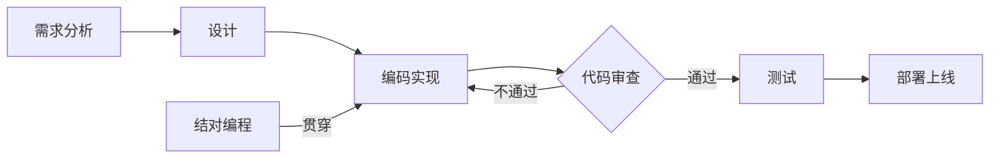

# 代码审查与结对编程原理与代码实战案例讲解

关键词：代码审查, 结对编程, 代码质量, 软件开发, 协作, 最佳实践

## 1. 背景介绍
### 1.1  问题的由来
在软件开发过程中,代码质量一直是一个备受关注的话题。随着软件系统日益复杂,开发团队规模不断扩大,如何保证代码的可读性、可维护性和稳定性成为了一个重要挑战。传统的个人编码模式难以满足高质量、高效率的开发需求,因此代码审查和结对编程应运而生。
### 1.2  研究现状
近年来,代码审查和结对编程在软件工程领域得到了广泛的研究和应用。微软、谷歌等知名IT企业都将其作为提高代码质量和开发效率的重要实践。学术界对代码审查和结对编程的有效性、适用场景、最佳实践等方面进行了深入探讨,取得了丰硕的研究成果。
### 1.3  研究意义
系统地总结代码审查和结对编程的原理和实践经验,对于提升软件开发团队的能力具有重要意义。通过学习和掌握代码审查和结对编程的方法和技巧,开发人员可以写出更高质量、更易维护的代码,有效降低Bug率,加快开发进度。团队可以建立起高效协作的氛围,促进知识共享和经验传承。
### 1.4  本文结构
本文将从以下几个方面对代码审查和结对编程进行系统阐述：
- 介绍代码审查和结对编程的核心概念和内在联系
- 剖析代码审查和结对编程的关键原理和具体操作步骤
- 构建数学模型,推导相关公式,并结合案例进行分析讲解
- 给出代码审查和结对编程的代码实例,并进行详细的解释说明
- 探讨代码审查和结对编程在实际软件项目中的应用场景
- 推荐代码审查和结对编程相关的工具和学习资源
- 总结代码审查和结对编程的研究现状,展望未来发展趋势和挑战
- 梳理代码审查和结对编程的常见问题,给出专业的解答意见

## 2. 核心概念与联系
代码审查(Code Review)和结对编程(Pair Programming)是软件开发中的两种重要实践,它们的目标都是提高代码质量,增强团队协作。尽管二者在形式上有所不同,但内在逻辑却是一脉相承的。

代码审查指的是由专门的审查者(通常由其他开发人员担任)对已完成的代码进行系统检查的过程。审查者仔细阅读代码,检查其中潜在的错误、安全漏洞、性能问题、可读性等方面的不足,并提出改进意见。代码审查可以作为一种事后把关机制,在代码正式合入主干之前进行质量把控。

结对编程则是指两名程序员在同一台电脑上协同编写代码的过程。通常由一名驱动者(Driver)负责编写代码,另一名观察者(Observer)负责审查代码、提出建议、思考设计等。两人角色可以定期互换。结对编程强调在编码的同时进行主动的质量控制。

从流程上看,代码审查发生在代码编写完成之后,侧重事后检查,而结对编程则贯穿于整个编码过程,侧重事前预防。但二者都体现了团队协作、主动质量控制的思想,对提高代码质量有着积极作用。

下图展示了代码审查和结对编程在软件开发流程中的位置和作用:

## 3. 核心算法原理 & 具体操作步骤
### 3.1  算法原理概述
代码审查和结对编程本质上都是一种人工智能算法,即利用人的智慧对代码进行理解、分析和优化的过程。其核心是通过人机交互,将人的经验知识和机器的计算能力相结合,以期达到事半功倍的效果。
### 3.2  算法步骤详解
代码审查的一般步骤如下:

1. 开发人员完成代码编写,并提交审查申请
2. 审查者接受审查任务,下载代码到本地
3. 审查者仔细阅读代码,重点关注以下几个方面:
   - 代码的正确性:是否存在 Bug、逻辑错误、边界条件遗漏等
   - 代码的可读性:命名是否规范,注释是否清晰,代码风格是否一致
   - 代码的性能:算法和数据结构是否合理,是否存在内存泄漏等问题
   - 代码的安全性:是否存在常见的安全漏洞,如 SQL 注入、XSS 等
4. 审查者记录下所有发现的问题和改进建议
5. 审查者将审查结果反馈给代码作者,并进行讨论
6. 代码作者根据审查意见进行代码修改和完善
7. 重复步骤2-6,直到代码满足质量要求
8. 审查者批准代码合入,代码审查完成

结对编程的一般步骤如下:

1. 开发人员结成两人小组,明确分工
2. 驱动者开始编写代码,观察者在一旁观察和思考
3. 观察者实时审查驱动者的代码,提出问题和建议
4. 两人就代码的实现方案进行充分讨论,达成一致
5. 遇到难题时,两人一起分析问题,寻求解决方案
6. 定期切换角色,保持思维的活跃
7. 完成代码编写后,两人一起对代码进行审查和测试
8. 对于发现的问题,两人一起分析原因,并进行修复
9. 重构代码,提高代码质量,消除代码异味
10. 总结经验教训,并应用到下一轮结对编程中

### 3.3  算法优缺点
代码审查的优点包括:

- 能够在代码合入主干前发现大部分错误和问题,减少线上事故
- 有利于知识共享和经验传承,提高团队整体水平
- 促进代码风格和规范的统一,提高代码可维护性
- 作为团队协作的重要环节,增强团队凝聚力

代码审查的缺点包括:

- 需要投入额外的人力和时间成本
- 审查者水平参差不齐,审查质量难以保证
- 审查过程缺乏有效的量化标准和考核机制

结对编程的优点包括:

- 代码质量显著提高,Bug率大幅降低
- 有利于思想碰撞和经验分享,开阔思路
- 工作专注度和效率提升,避免分心和开小差
- 缩短新人的学习曲线,让其更快进入状态

结对编程的缺点包括:

- 需要两名开发人员投入,人力成本较高
- 开发人员之间如果缺乏默契,效率可能降低
- 容易引发争执和矛盾,导致团队不和谐
- 有悖于某些开发人员独立工作的习惯

### 3.4  算法应用领域
代码审查和结对编程在各种类型的软件项目中都有广泛应用,从中小型项目到大型企业级系统,从桌面软件到移动应用再到云服务,都能见到它们的身影。一些对代码质量和系统稳定性要求较高的领域,如金融、医疗、航天等,对代码审查和结对编程的需求尤其迫切。

下面列举了几个代码审查和结对编程的典型应用场景:

- 在持续集成/持续交付(CI/CD)流程中,代码审查常作为自动化测试和部署的前置条件,以保证进入后续环节的代码质量
- 在敏捷开发中,结对编程常用于完成某个复杂的功能或攻克某个棘手的难题,体现了高度协作的敏捷精神
- 在开源软件项目中,由于参与者背景各异,代码审查成为了保证代码质量、控制项目方向的重要手段
- 在软件外包项目中,代码审查和结对编程常被用来弥补团队成员能力的不足,提高项目交付质量

## 4. 数学模型和公式 & 详细讲解 & 举例说明
### 4.1  数学模型构建
为了定量分析代码审查和结对编程的效果,我们可以构建一个简单的数学模型。假设某软件项目出现Bug的概率为$p$,每个Bug被发现并修复的概率为$q$,则该项目最终出现Bug的概率$P$可以表示为:

$$P = p * (1-q)$$

其中,$p$的大小与项目规模、复杂度、人员素质等因素有关,$q$的大小则与代码审查和结对编程的效果直接相关。我们可以假设引入代码审查后$q$的值为$q_r$,引入结对编程后$q$的值为$q_p$,则有:

$$q_r > q, q_p > q$$

进一步,我们可以定义一个指标来衡量代码审查和结对编程的效果,即Bug发现率$E$:

$$E_r = \frac{q_r - q}{q}$$

$$E_p = \frac{q_p - q}{q}$$

$E_r$和$E_p$的值越大,表明代码审查和结对编程的效果越好。

### 4.2  公式推导过程
根据以上定义,我们可以推导出引入代码审查和结对编程后Bug出现概率的变化:

$$\Delta P_r = P - P_r = p * (1-q) - p * (1-q_r) = p * (q_r - q)$$

$$\Delta P_p = P - P_p = p * (1-q) - p * (1-q_p) = p * (q_p - q)$$

将Bug发现率$E$代入上式,得到:

$$\Delta P_r = p * q * E_r$$

$$\Delta P_p = p * q * E_p$$

可见,Bug出现概率的降低幅度与$p$、$q$和$E$均成正比。$p$和$q$反映了项目自身的特点,而$E$则反映了代码审查和结对编程的效果。$E$越大,Bug出现概率的降低就越明显。

### 4.3  案例分析与讲解
下面我们用一个具体的例子来说明模型的应用。假设某软件项目原本Bug出现概率$p=0.1$,Bug被发现并修复的概率$q=0.5$。经过统计发现,引入代码审查后$q_r=0.7$,引入结对编程后$q_p=0.8$。则Bug发现率为:

$$E_r = \frac{0.7 - 0.5}{0.5} = 0.4$$

$$E_p = \frac{0.8 - 0.5}{0.5} = 0.6$$

Bug出现概率的变化为:

$$\Delta P_r = 0.1 * 0.5 * 0.4 = 0.02$$

$$\Delta P_p = 0.1 * 0.5 * 0.6 = 0.03$$

也就是说,引入代码审查后Bug出现概率从0.05降到了0.03,降低了40%;引入结对编程后Bug出现概率进一步降到了0.02,降低了60%。可见,代码审查和结对编程对提高代码质量有着显著效果。

### 4.4  常见问题解答
问题1:在实际项目中,如何准确估算$p$和$q$的值?

答:$p$和$q$的估算需要依赖历史数据和经验判断。可以通过分析以往项目的Bug统计数据,结合项目规模、复杂度等因素进行类比估算。也可以组织专家评审会,收集多方意见,给出一个大致的范围。$p$和$q$的值只是一个粗略的估计,模型的重点在于定性分析,而非定量计算。

问题2:除了Bug发现率,还有哪些指标可以衡量代码审查和结对编程的效果?

答:可以从Bug类型、严重程度、修复难度、引入时间等多个维度来综合评估。比如通过引入代码审查发现的Bug中,有多少是严重Bug,多少是在上线后才发现的Bug等。还可以统计代码审查和结