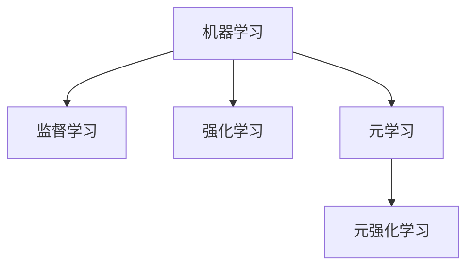

好的，我会按照您的要求，以《元强化学习原理与代码实战案例讲解》为主题，撰写一篇专业的技术博客文章。文章将遵循您提供的结构模板，并满足所有约束条件。下面是正文部分：

# 元强化学习原理与代码实战案例讲解

## 1. 背景介绍

### 1.1 问题的由来

在传统的强化学习(Reinforcement Learning)中,智能体(Agent)通过与环境交互来学习一个最优策略,以最大化其预期的累积回报。然而,这种方法存在一些局限性:

1. **环境复杂性**: 对于复杂环境,探索空间可能非常庞大,导致学习效率低下。
2. **任务转移**: 当环境或任务发生变化时,智能体需要从头开始学习,无法利用已有的经验。
3. **奖励稀疏性**: 在某些任务中,奖励信号可能非常稀疏,使得学习过程变得困难。

为了解决这些问题,**元强化学习**(Meta Reinforcement Learning)应运而生。

### 1.2 研究现状  

元强化学习旨在开发一种通用的学习算法,使智能体能够快速适应新的任务和环境。近年来,该领域取得了长足的进展,出现了多种有前景的方法,例如:

- **模型无关的元学习**(Model-Agnostic Meta-Learning, MAML)
- **基于梯度的元学习**(Gradient-Based Meta-Learning)
- **基于记忆的元学习**(Memory-Based Meta-Learning)
- **基于进化的元学习**(Evolutionary Meta-Learning)

这些方法在不同的任务和环境中表现出了优异的性能。

### 1.3 研究意义

元强化学习有着广阔的应用前景,可以帮助解决现实世界中的各种复杂问题,例如:

- **机器人控制**: 使机器人能够快速适应新的环境和任务。
- **推荐系统**: 根据用户的偏好和行为动态调整推荐策略。
- **自动驾驶**: 让自动驾驶系统能够处理各种复杂的交通场景。
- **游戏AI**: 开发出能够快速学习和适应新游戏规则的AI代理。

因此,深入研究元强化学习的原理和方法对于推进人工智能的发展至关重要。

### 1.4 本文结构

本文将全面介绍元强化学习的核心概念、算法原理、数学模型、代码实现和实际应用。具体内容安排如下:

1. **核心概念与联系**: 阐释元强化学习的基本思想,并与传统强化学习进行对比。
2. **核心算法原理与具体操作步骤**: 详细解释几种主流的元强化学习算法,包括MAML、基于梯度的元学习等。
3. **数学模型和公式详细讲解与举例说明**: 推导算法背后的数学模型,并通过具体案例进行说明。
4. **项目实践:代码实例和详细解释说明**: 提供完整的代码实现,并逐行解读关键部分。
5. **实际应用场景**: 介绍元强化学习在机器人控制、推荐系统等领域的应用案例。
6. **工具和资源推荐**: 推荐学习元强化学习的书籍、论文、开源项目等资源。
7. **总结:未来发展趋势与挑战**: 总结元强化学习的研究成果,并展望未来的发展方向和挑战。
8. **附录:常见问题与解答**: 解答一些常见的疑问和问题。

## 2. 核心概念与联系

元强化学习(Meta Reinforcement Learning)是一种新兴的机器学习范式,旨在开发出能够快速适应新任务和环境的通用学习算法。它的核心思想是利用多个相关但不同的任务,从中学习一种能够快速获取新技能的元策略(meta-strategy)或元学习器(meta-learner)。

传统的强化学习算法通常专注于解决单一任务,并且需要大量的试错来学习一个有效的策略。而元强化学习则是在多个相关任务之间进行学习,以获取一种通用的学习能力,从而能够在新的任务中快速适应并找到最优策略。

可以将元强化学习看作是一种"学习如何学习"(Learning to Learn)的范式。与监督学习和强化学习不同,元强化学习的目标是优化学习算法本身,使其能够更高效地从经验中获取知识。

元强化学习算法通常包含两个主要组成部分:

1. **任务分布** (Task Distribution): 一组相关但不同的任务,用于训练元学习器。
2. **元学习器** (Meta-Learner): 一种能够从任务分布中学习获取新技能的算法,通常是基于梯度下降或其他优化方法。

在训练过程中,元学习器会在多个任务上进行学习,并试图找到一种通用的策略,使其能够在新的任务中快速适应并获得良好的性能。这种策略可以是一个初始化参数、一个优化算法或者一个记忆模块等。

元强化学习与其他机器学习范式的关系如下:



监督学习和强化学习都是传统的机器学习范式,而元学习则是一种新兴的范式,旨在开发能够快速适应新任务的通用学习算法。元强化学习可以看作是元学习在强化学习领域的一个分支。

通过对元强化学习核心概念的理解,我们可以更好地把握其与传统强化学习的区别和联系,为后续算法原理的学习打下基础。

## 3. 核心算法原理与具体操作步骤

在本节中,我们将详细介绍几种主流的元强化学习算法,包括模型无关的元学习(MAML)、基于梯度的元学习等。对于每种算法,我们将解释其核心思想、算法流程,并分析其优缺点和适用场景。

### 3.1 算法原理概述

#### 3.1.1 模型无关的元学习 (MAML)

MAML是一种广为人知的元强化学习算法,由Chelsea Finn等人于2017年提出。它的核心思想是:在多个任务上进行训练,使得模型参数能够快速适应新的任务,只需通过几步梯度更新即可获得良好的性能。

MAML将整个优化过程分为两个阶段:

1. **内循环** (Inner Loop): 在每个任务上,使用几步梯度更新来适应当前任务,获得任务特定的参数。
2. **外循环** (Outer Loop): 跨多个任务,优化模型参数,使得在内循环中只需少量更新步骤,就能获得良好的性能。

通过这种方式,MAML能够学习到一组通用的初始参数,使得在新的任务中,只需少量的梯度更新步骤,就能快速适应该任务并找到一个好的策略。

#### 3.1.2 基于梯度的元学习

基于梯度的元学习算法的核心思想是:直接优化模型在新任务上的梯度更新过程,使其能够快速适应新任务。

一种典型的基于梯度的元学习算法是**基于梯度的模型无关的元学习** (Gradient-Based Model-Agnostic Meta-Learning, GBML)。它的工作流程如下:

1. 在一批任务上进行训练,获得模型的初始参数。
2. 对于每个新任务,使用少量数据进行几步梯度更新,获得任务特定的参数。
3. 计算任务特定参数相对于初始参数的梯度,并将其作为目标函数的一部分。
4. 优化初始参数,使得在新任务上的梯度更新能够获得良好的性能。

通过这种方式,GBML能够直接优化模型在新任务上的适应能力,从而提高元学习的效率和性能。

#### 3.1.3 基于记忆的元学习

基于记忆的元学习算法的核心思想是:在训练过程中,构建一个可更新的记忆模块,用于存储任务相关的知识和经验。在新任务中,该记忆模块能够快速提取相关知识,从而加速学习过程。

一种典型的基于记忆的元学习算法是**记忆增强的神经网络** (Memory Augmented Neural Networks, MANNS)。它的工作流程如下:

1. 构建一个神经网络模型,包含可更新的记忆模块。
2. 在多个任务上进行训练,同时更新模型参数和记忆模块的内容。
3. 在新任务中,利用记忆模块中存储的相关知识,加速模型在该任务上的学习过程。

通过这种方式,MANNS能够累积跨任务的知识和经验,并在新任务中加以利用,从而提高元学习的效率和性能。

#### 3.1.4 基于进化的元学习

基于进化的元学习算法的核心思想是:利用进化算法(如遗传算法)来优化模型参数或学习算法,使其能够在新任务中表现良好。

一种典型的基于进化的元学习算法是**进化策略** (Evolution Strategies, ES)。它的工作流程如下:

1. 初始化一组候选解(模型参数或学习算法)的种群。
2. 在多个任务上评估每个候选解的性能。
3. 根据性能指标,选择表现良好的候选解,并通过变异和交叉等操作产生新的种群。
4. 重复步骤2和3,直到达到停止条件。

通过这种方式,ES能够在多个任务上进行全局搜索,找到能够快速适应新任务的模型参数或学习算法。

### 3.2 算法步骤详解

在这一部分,我们将以MAML算法为例,详细解释其具体的操作步骤。

MAML算法的伪代码如下:

```python
# 初始化模型参数
初始化 θ

# 外循环: 跨任务训练
for 每个任务批次 task_batch:
    # 内循环: 在每个任务上进行适应
    for 每个任务 task:
        # 计算任务特定的参数
        θ_task = θ - α * ∇_θ L_task(θ)  # 几步梯度更新
        
    # 计算元梯度
    meta_grad = ∇_θ Σ L_task(θ_task)
    
    # 更新模型参数
    θ = θ - β * meta_grad
```

算法步骤如下:

1. **初始化模型参数θ**。

2. **外循环: 跨任务训练**。对于每个任务批次`task_batch`:
    1. **内循环: 在每个任务上进行适应**。对于每个任务`task`:
        1. 计算任务特定的参数`θ_task`。这是通过在当前任务上进行几步梯度更新来实现的,其中`α`是内循环的学习率。
    2. 计算**元梯度** `meta_grad`。这是通过对所有任务的损失函数求和,并对`θ`求导得到的。
    3. 使用`meta_grad`更新模型参数`θ`,其中`β`是外循环的学习率。

通过这种两层循环的方式,MAML能够在多个任务上进行元学习,使得模型参数`θ`能够快速适应新的任务。

在实际应用中,我们还需要注意以下几点:

1. **任务批次的选择**。任务批次的大小和组成会影响算法的性能和收敛速度。
2. **内循环步数的选择**。内循环步数越多,适应新任务的能力越强,但计算开销也越大。
3. **学习率的调整**。内外循环的学习率需要根据具体问题进行调整,以获得最佳性能。
4. **优化算法的选择**。除了基本的梯度下降,我们还可以使用其他优化算法(如Adam)来加速训练过程。

通过对MAML算法步骤的详细解释,我们可以更好地理解其核心思想和实现细节,为后续的代码实现和应用奠定基础。

### 3.3 算法优缺点

每种元强化学习算法都有其优缺点,我们需要根据具体问题和场景来选择合适的算法。

#### 3.3.1 MAML算法

**优点**:

- 算法思想简单直观,易于理解和实现。
- 能够快速适应新任务,只