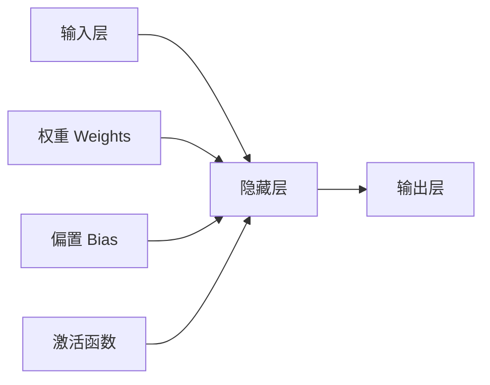

# 全连接层 (Fully Connected Layer) 原理与代码实例讲解

关键词：全连接层, 前向传播, 反向传播, 权重矩阵, 偏置向量, 神经网络, 深度学习

## 1. 背景介绍
### 1.1  问题的由来
在深度学习和神经网络中,全连接层(Fully Connected Layer,简称FC)是一种最基本也是最重要的网络层。它在卷积神经网络(CNN)、循环神经网络(RNN)等各种网络架构中都有广泛应用。理解全连接层的原理对于深入学习神经网络非常关键。

### 1.2  研究现状
目前业界对全连接层的研究已经比较成熟,但仍有一些有待探索的问题,如全连接层的参数量优化、计算效率提升等。一些最新的研究成果如 SENet[1] 和 SqueezeNet[2] 等都在全连接层上做了改进,取得了不错的效果。

### 1.3  研究意义
深入理解全连接层的原理,对于更好地应用深度学习技术解决实际问题具有重要意义。通过剖析全连接层的内部机制,我们可以优化网络结构、提高训练和推理效率,设计出性能更优的模型。

### 1.4  本文结构
本文将分为以下几个部分展开论述:
- 第2部分介绍全连接层的核心概念
- 第3部分讲解全连接层的算法原理和具体步骤
- 第4部分给出全连接层涉及的数学模型和公式推导
- 第5部分提供详细的代码实例和解释说明
- 第6部分分析全连接层的实际应用场景
- 第7部分推荐相关的学习资源和开发工具
- 第8部分总结全连接层的未来发展趋势和面临的挑战
- 第9部分附录,解答一些常见问题

## 2. 核心概念与联系

在讨论全连接层的原理之前,我们先来了解几个核心概念:

- **神经元 (Neuron)**: 神经网络的基本单元,类似于生物神经网络中的神经元,负责接收、处理和传递信息。
- **权重 (Weight)**: 神经元之间连接的重要性系数,用于控制信息的流动。
- **偏置 (Bias)**: 神经元的阈值,控制神经元的激活难易程度。
- **激活函数 (Activation Function)**: 神经元的非线性变换函数,如ReLU、Sigmoid等,用于提高网络的表达能力。
- **前向传播 (Forward Propagation)**: 信息从输入层经隐藏层传递到输出层的过程。
- **反向传播 (Backward Propagation)**: 根据损失函数,从输出层开始,调整网络参数的过程。

下图展示了一个全连接神经网络的结构和信息传递过程:



可以看出,全连接层是神经网络的核心组件,通过前向传播和反向传播来学习数据的特征表示。理解了这些概念后,下面我们来详细分析全连接层的算法原理。

## 3. 核心算法原理 & 具体操作步骤
### 3.1  算法原理概述
全连接层的核心是通过矩阵运算实现前向传播,并利用链式法则求梯度实现反向传播。设第 $l$ 层有 $n_l$ 个神经元,第 $l+1$ 层有 $n_{l+1}$ 个神经元,则连接这两层的权重矩阵 $W^{(l)}$ 的维度为 $n_{l+1} \times n_l$,第 $l+1$ 层的偏置向量 $b^{(l)}$ 的维度为 $n_{l+1}$。前向传播时,第 $l+1$ 层的输出 $a^{(l+1)}$ 为:

$$a^{(l+1)} = \sigma(z^{(l+1)}) = \sigma(W^{(l)}a^{(l)} + b^{(l)}) \tag{1}$$

其中 $\sigma$ 为激活函数。反向传播时,假设损失函数为 $J$,则第 $l+1$ 层的残差 $\delta^{(l+1)}$ 为:

$$\delta^{(l+1)} = \frac{\partial J}{\partial z^{(l+1)}} = \frac{\partial J}{\partial a^{(l+1)}} \odot \sigma'(z^{(l+1)}) \tag{2}$$

其中 $\odot$ 表示 Hadamard 积(对应元素相乘)。进一步地,第 $l$ 层的残差为:

$$\delta^{(l)} = (W^{(l)})^T\delta^{(l+1)} \odot \sigma'(z^{(l)}) \tag{3}$$

最后,权重矩阵 $W^{(l)}$ 和偏置向量 $b^{(l)}$ 的梯度为:

$$\frac{\partial J}{\partial W^{(l)}} = \delta^{(l+1)}(a^{(l)})^T, \quad \frac{\partial J}{\partial b^{(l)}} = \delta^{(l+1)} \tag{4}$$

### 3.2  算法步骤详解
基于以上原理,全连接层的前向和反向传播可分为以下步骤:

**前向传播:**
1. 输入数据 $a^{(l)}$
2. 计算加权和 $z^{(l+1)} = W^{(l)}a^{(l)} + b^{(l)}$
3. 激活函数处理 $a^{(l+1)} = \sigma(z^{(l+1)})$ 
4. 输出结果 $a^{(l+1)}$ 传递给下一层

**反向传播:**
1. 从输出层开始,计算损失函数 $J$ 对输出的梯度 $\frac{\partial J}{\partial a^{(L)}}$
2. 逐层计算残差 $\delta^{(l)} = (W^{(l)})^T\delta^{(l+1)} \odot \sigma'(z^{(l)})$
3. 计算权重和偏置的梯度 $\frac{\partial J}{\partial W^{(l)}} = \delta^{(l+1)}(a^{(l)})^T, \quad \frac{\partial J}{\partial b^{(l)}} = \delta^{(l+1)}$
4. 更新权重和偏置 $W^{(l)} := W^{(l)} - \alpha \frac{\partial J}{\partial W^{(l)}}, \quad b^{(l)} := b^{(l)} - \alpha \frac{\partial J}{\partial b^{(l)}}$

其中 $\alpha$ 为学习率。以上步骤不断迭代,直到网络收敛或达到预设的迭代次数。

### 3.3  算法优缺点
全连接层的优点主要有:
- 原理简单,易于理解和实现
- 具有较强的特征提取和抽象能力
- 适用于多种类型的数据和任务

但全连接层也存在一些缺点:
- 参数量大,容易过拟合,需要较多的训练数据
- 计算复杂度高,训练和推理耗时
- 缺乏平移不变性,不适合处理图像等数据

因此在实际应用中,我们需要根据任务的特点选择合适的网络结构。在卷积神经网络中,全连接层通常用于最后的分类器,而特征提取主要靠卷积层完成。

### 3.4  算法应用领域
全连接层几乎在所有的神经网络中都有应用,一些典型的领域包括:
- 图像分类、物体检测、语义分割等计算机视觉任务
- 语音识别、自然语言处理等语音和文本任务
- 推荐系统、广告点击率预估等大数据挖掘任务
- 游戏智能体、智能机器人等强化学习任务

下面我们通过一个具体的数学模型来深入理解全连接层的原理。

## 4. 数学模型和公式 & 详细讲解 & 举例说明
### 4.1  数学模型构建
考虑一个简单的三层全连接网络,其结构如下:

```mermaid
graph LR
    A[输入层, a^{(0)}] --> B[隐藏层, a^{(1)}] 
    B --> C[输出层, a^{(2)}]
    D[W^{(0)}, b^{(0)}] --> B
    E[W^{(1)}, b^{(1)}] --> C
```

假设输入向量为 $x \in \mathbb{R}^{n_0}$,隐藏层有 $n_1$ 个神经元,输出层有 $n_2$ 个神经元,激活函数为 $\sigma$,损失函数为 $J$。则前向传播的过程可以表示为:

$$
\begin{aligned}
a^{(0)} &= x \\
z^{(1)} &= W^{(0)}a^{(0)} + b^{(0)} \\
a^{(1)} &= \sigma(z^{(1)}) \\
z^{(2)} &= W^{(1)}a^{(1)} + b^{(1)} \\ 
a^{(2)} &= \sigma(z^{(2)})
\end{aligned}
$$

其中权重矩阵 $W^{(0)} \in \mathbb{R}^{n_1 \times n_0}, W^{(1)} \in \mathbb{R}^{n_2 \times n_1}$,偏置向量 $b^{(0)} \in \mathbb{R}^{n_1}, b^{(1)} \in \mathbb{R}^{n_2}$。

### 4.2  公式推导过程
根据反向传播算法,我们需要计算损失函数 $J$ 对各层权重和偏置的梯度。首先,定义输出层的残差:

$$\delta^{(2)} = \frac{\partial J}{\partial z^{(2)}} = \frac{\partial J}{\partial a^{(2)}} \odot \sigma'(z^{(2)})$$

接着,计算隐藏层的残差:

$$\delta^{(1)} = (W^{(1)})^T\delta^{(2)} \odot \sigma'(z^{(1)})$$

最后,计算梯度:

$$
\begin{aligned}
\frac{\partial J}{\partial W^{(1)}} &= \delta^{(2)}(a^{(1)})^T \\
\frac{\partial J}{\partial b^{(1)}} &= \delta^{(2)} \\
\frac{\partial J}{\partial W^{(0)}} &= \delta^{(1)}(a^{(0)})^T \\
\frac{\partial J}{\partial b^{(0)}} &= \delta^{(1)}
\end{aligned}
$$

有了梯度后,我们就可以用梯度下降法更新网络参数:

$$
\begin{aligned}
W^{(1)} &:= W^{(1)} - \alpha \frac{\partial J}{\partial W^{(1)}} \\
b^{(1)} &:= b^{(1)} - \alpha \frac{\partial J}{\partial b^{(1)}} \\
W^{(0)} &:= W^{(0)} - \alpha \frac{\partial J}{\partial W^{(0)}} \\
b^{(0)} &:= b^{(0)} - \alpha \frac{\partial J}{\partial b^{(0)}}
\end{aligned}
$$

以上就是全连接层前向传播和反向传播的完整数学推导过程。

### 4.3  案例分析与讲解
下面我们用一个具体的例子来说明全连接层的计算过程。假设输入向量 $x = [1, 2]^T$,权重矩阵和偏置向量为:

$$
W^{(0)} = \begin{bmatrix}
1 & 2 \\ 3 & 4
\end{bmatrix}, \quad
b^{(0)} = \begin{bmatrix}
1 \\ -1
\end{bmatrix}
$$

$$
W^{(1)} = \begin{bmatrix}
2 & -1  
\end{bmatrix}, \quad
b^{(1)} = \begin{bmatrix}
1
\end{bmatrix}
$$

激活函数取 ReLU 函数 $\sigma(x) = \max(0, x)$。则前向传播的结果为:

$$
\begin{aligned}
a^{(0)} &= \begin{bmatrix}
1 \\ 2
\end{bmatrix} \\
z^{(1)} &= \begin{bmatrix}
1 & 2 \\ 3 & 4
\end{bmatrix}\begin{bmatrix}
1 \\ 2
\end{bmatrix} + \begin{bmatrix}
1 \\ -1
\end{bmatrix} = \begin{bmatrix}
6 \\ 10
\end{bmatrix} \\
a^{(1)} &= \max\left(0, \begin{bmatrix}
6 \\ 10
\end{bmatrix}\right) = \begin{b