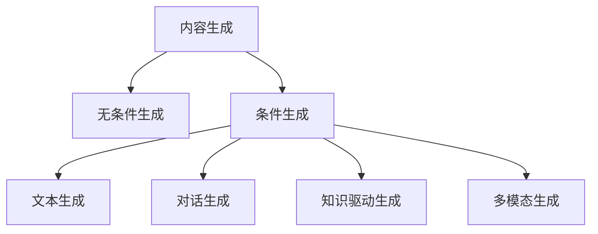

# 内容生成(Content Generation) - 原理与代码实例讲解

关键词：内容生成, 自然语言处理, 机器学习, 深度学习, Transformer, GPT, BERT, 文本生成, 知识图谱, 语言模型

## 1. 背景介绍

### 1.1 问题的由来

在当今信息爆炸的时代,海量的数据和内容正以前所未有的速度增长。人们对高质量、个性化内容的需求日益增加,传统的人工创作方式已经无法满足快速增长的内容需求。如何利用人工智能技术,特别是自然语言处理(Natural Language Processing, NLP)领域的最新进展,来自动生成高质量、多样化的内容,成为了业界和学术界共同关注的热点问题。

### 1.2 研究现状

近年来,以深度学习为代表的人工智能技术取得了突破性进展,尤其是在NLP领域,Transformer[1]、BERT[2]、GPT[3]等预训练语言模型的出现,极大地提升了各类NLP任务的性能,也为内容生成任务带来了新的契机。当前,内容生成技术已经在新闻写作[4]、对话生成[5]、文案创作[6]、知识问答[7]等领域得到了广泛应用,并取得了可喜的成果。

### 1.3 研究意义

内容生成技术的研究和应用具有重要意义:

1. 提高内容创作效率:传统人工创作耗时耗力,应用内容生成技术可大幅提升内容产出效率,节省人力成本。

2. 满足个性化需求:通过内容生成技术,可根据用户画像、偏好等因素,生成个性化、定制化的内容,提升用户体验。

3. 知识传播与普及:利用内容生成技术,可自动生成科普文章、教程等内容,加速知识的传播与普及。

4. 创意激发与创新:内容生成模型可作为创意辅助工具,为人类创作者提供灵感和素材,激发创新思维。

### 1.4 本文结构

本文将围绕内容生成技术展开深入探讨,内容安排如下:第2部分介绍内容生成的核心概念;第3部分重点阐述内容生成的核心算法原理与具体步骤;第4部分从数学角度对相关模型与公式进行详细讲解;第5部分给出内容生成的代码实例与详细解释;第6部分讨论内容生成技术的实际应用场景;第7部分推荐相关工具与学习资源;第8部分对全文进行总结,并展望内容生成技术的未来发展趋势与挑战;第9部分列举内容生成领域的常见问题与解答。

## 2. 核心概念与联系

内容生成是指利用计算机程序自动生成文本、图像、音频、视频等内容的技术。其核心是建立生成模型,通过学习大规模数据,掌握内容的内在规律和特征,进而根据输入信息生成相应的内容输出。以文本生成为例,其主要涉及以下核心概念:

- 语料库(Corpus):大规模的文本数据集,用于训练语言模型。
- 语言模型(Language Model):以概率的方式描述语言中词语的序列关系,可用于预测下一个词出现的概率。
- 神经网络(Neural Network):由大量神经元组成的计算模型,能够学习和表征复杂的特征与模式。
- 注意力机制(Attention Mechanism):一种聚焦于输入序列中重要信息的机制,增强模型学习输入与输出的相关性。
- Transformer:基于注意力机制的神经网络结构,广泛应用于NLP任务。
- 预训练(Pre-training):在大规模语料上预先训练通用语言模型,再应用到下游任务,如BERT、GPT等。
- 微调(Fine-tuning):在预训练模型的基础上,用下游任务的数据进行训练,使模型适应特定任务。
- 知识图谱(Knowledge Graph):结构化地表示实体及其关系的知识库,可用于增强内容生成的知识性和逻辑性。

内容生成任务通常分为两类:无条件生成和条件生成。无条件生成不需要额外的输入信息,直接生成内容;条件生成则根据给定的条件或约束,如文本、关键词、知识等,生成相应的内容。下图展示了内容生成任务的分类与关系:

## 3. 核心算法原理 & 具体操作步骤

### 3.1 算法原理概述

内容生成的核心是语言模型,其本质是学习语言的概率分布。给定前面的词语序列,语言模型可以预测下一个词出现的概率。传统的语言模型如N-gram[8]基于词频统计,难以刻画语言的长距离依赖。近年来,基于神经网络的语言模型如RNN[9]、Transformer[1]等,通过深度学习技术,能够建模更加复杂的语言规律。

以Transformer为例,其主要由编码器(Encoder)和解码器(Decoder)组成。编码器用于对输入序列进行特征提取,解码器根据编码器的输出和之前生成的词,预测下一个词。Transformer的核心是自注意力机制(Self-Attention),通过计算序列中不同位置之间的相关性,捕捉词语的长距离依赖,从而生成更加通顺、连贯的文本。

### 3.2 算法步骤详解

以Transformer为例,其文本生成的具体步骤如下:

1. 输入表示:将输入文本转化为向量表示,通过词嵌入(Word Embedding)将每个词映射为低维稠密向量。

2. 位置编码:为每个词向量添加位置信息,使模型能够区分词语的顺序。

3. 编码器计算:编码器由若干个相同的层堆叠而成,每一层包括两个子层:
   - 多头自注意力(Multi-Head Self-Attention):将输入序列分成多个头(Head),每个头独立计算注意力分数,再将结果拼接。
   - 前馈神经网络(Feed-Forward Neural Network):对自注意力的输出进行非线性变换。

4. 解码器计算:解码器也由若干个相同的层堆叠而成,每一层包括三个子层:
   - 带掩码的多头自注意力(Masked Multi-Head Self-Attention):在计算当前位置的注意力时,只考虑该位置之前的词,防止信息泄露。
   - 编码-解码注意力(Encoder-Decoder Attention):将解码器的输出与编码器的输出进行注意力计算,使解码器聚焦于输入序列的相关部分。
   - 前馈神经网络(Feed-Forward Neural Network):对注意力输出进行非线性变换。

5. softmax归一化:对解码器的输出进行softmax归一化,得到下一个词的概率分布。

6. 贪心搜索或采样:根据概率分布,选择概率最大的词作为输出(贪心搜索),或按照概率采样生成词(如beam search)。

7. 重复4-6步,直到生成结束符或达到最大长度。

### 3.3 算法优缺点

Transformer相比传统的RNN语言模型,具有以下优点:

1. 并行计算:Transformer摒弃了RNN的序列依赖,各个位置的计算可以并行,大幅提升了训练和推理速度。

2. 长距离建模:通过自注意力机制,Transformer可以直接建模任意两个位置之间的依赖,更好地捕捉长距离语义信息。

3. 特征表示:Transformer中的自注意力可以学习到更加丰富的特征表示,增强了模型的表达能力。

但Transformer也存在一些局限:

1. 计算复杂度:自注意力机制的计算复杂度随序列长度平方增长,在处理较长文本时,时空开销较大。

2. 位置信息缺失:Transformer缺乏RNN中的位置先后信息,需要额外引入位置编码。

3. 解释性不足:Transformer作为黑盒模型,其内部工作机制难以解释,可解释性有待提高。

### 3.4 算法应用领域

Transformer及其变体已成为NLP领域的主流模型,广泛应用于内容生成的各个任务,如:

- 文本摘要:自动生成文章的摘要或标题。
- 对话生成:根据上下文生成回复,实现人机对话。
- 机器翻译:将一种语言的文本翻译成另一种语言。
- 写作辅助:协助人类进行文章写作,提供素材、思路等。
- 知识问答:根据知识库生成问题的答案。

此外,Transformer还被拓展到其他模态,如图像、语音、视频等,实现多模态内容的生成。

## 4. 数学模型和公式 & 详细讲解 & 举例说明

### 4.1 数学模型构建

Transformer的数学模型可以用概率图模型[10]来表示。假设输入序列为$\mathbf{x}=(x_1,\cdots,x_n)$,输出序列为$\mathbf{y}=(y_1,\cdots,y_m)$,Transformer的目标是学习条件概率分布$P(\mathbf{y}|\mathbf{x})$。根据链式法则,可以将联合概率分解为:

$$P(\mathbf{y}|\mathbf{x})=\prod_{t=1}^m P(y_t|y_1,\cdots,y_{t-1},\mathbf{x})$$

其中,$P(y_t|y_1,\cdots,y_{t-1},\mathbf{x})$表示在给定输入$\mathbf{x}$和之前生成的词$y_1,\cdots,y_{t-1}$的条件下,生成下一个词$y_t$的概率。Transformer通过最大化该条件概率来学习模型参数。

### 4.2 公式推导过程

以下详细推导Transformer中的关键公式。

1. 自注意力(Self-Attention):

对于输入序列的第$i$个位置,其特征表示为$\mathbf{x}_i\in\mathbb{R}^d$。自注意力通过三个线性变换得到查询(Query)、键(Key)、值(Value)向量:

$$\mathbf{q}_i=\mathbf{W}_q\mathbf{x}_i,\quad \mathbf{k}_i=\mathbf{W}_k\mathbf{x}_i,\quad \mathbf{v}_i=\mathbf{W}_v\mathbf{x}_i$$

其中,$\mathbf{W}_q,\mathbf{W}_k,\mathbf{W}_v\in\mathbb{R}^{d\times d}$为可学习的参数矩阵。

然后,计算第$i$个位置与其他位置的注意力分数:

$$\alpha_{ij}=\frac{\exp(\mathbf{q}_i^\top\mathbf{k}_j/\sqrt{d})}{\sum_{l=1}^n\exp(\mathbf{q}_i^\top\mathbf{k}_l/\sqrt{d})}$$

最后,将注意力分数与值向量加权求和,得到第$i$个位置的输出表示:

$$\mathbf{z}_i=\sum_{j=1}^n\alpha_{ij}\mathbf{v}_j$$

2. 多头注意力(Multi-Head Attention):

将输入序列的特征表示$\mathbf{x}_i$分成$h$个头,每个头独立计算自注意力,再将结果拼接:

$$\text{head}_j=\text{Attention}(\mathbf{W}_q^j\mathbf{x}_i,\mathbf{W}_k^j\mathbf{x}_i,\mathbf{W}_v^j\mathbf{x}_i)$$
$$\text{MultiHead}(\mathbf{x}_i)=\text{Concat}(\text{head}_1,\cdots,\text{head}_h)\mathbf{W}_o$$

其中,$\mathbf{W}_q^j,\mathbf{W}_k^j,\mathbf{W}_v^j\in\mathbb{R}^{d/h\times d},\mathbf{W}_o\in\mathbb{R}^{d\times d}$为可学习的参数矩阵。

3. 前馈神经网络(Feed-Forward Neural Network):

对多头注意力的输出进行两层线性变换,中间加入ReLU激活函数:

$$\text{FFN}(\mathbf{z}_i)=\text{ReLU}(\mathbf{z}_i\mathbf{W}_1+\mathbf{b