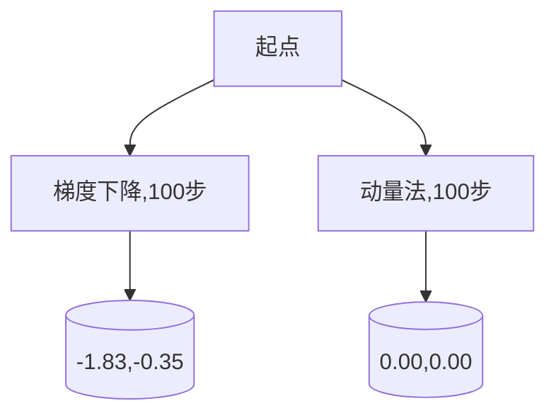

# 动量优化算法原理与代码实战案例讲解

关键词：动量优化算法、梯度下降、深度学习优化、机器学习

## 1. 背景介绍
### 1.1  问题的由来
在机器学习和深度学习中,优化算法是训练模型的核心。而梯度下降(Gradient Descent)是最常用的优化算法之一。然而,标准的梯度下降算法存在一些问题,如收敛速度慢、容易陷入局部最优等。为了克服这些问题,研究者们提出了许多改进的优化算法,动量优化算法就是其中之一。

### 1.2  研究现状
动量优化算法最早由Polyak在1964年提出,后来被Rumelhart等人引入到神经网络的训练中。近年来,随着深度学习的发展,动量优化算法得到了广泛应用,并衍生出许多变体,如Nesterov动量、Adam、RMSprop等。这些算法在图像分类、语音识别、自然语言处理等任务上取得了很好的效果。

### 1.3  研究意义
深入理解动量优化算法的原理,并掌握其代码实现,对于从事机器学习和深度学习研究的学者和工程师来说非常重要。本文将系统地介绍动量优化算法的核心思想、数学推导过程、代码实现以及在实际问题中的应用,帮助读者全面掌握这一重要算法。

### 1.4  本文结构
本文的结构安排如下:第2节介绍动量优化算法的核心概念;第3节详细讲解算法原理和步骤;第4节给出数学模型和推导过程;第5节通过代码实例演示算法的具体实现;第6节讨论算法在实际问题中的应用;第7节推荐一些学习资源;第8节总结全文并展望未来研究方向。

## 2. 核心概念与联系
动量优化算法的核心思想是在标准梯度下降算法的基础上引入动量项,以加速收敛并减少震荡。具体来说,动量项是前一次迭代的更新量乘以一个衰减因子 $\beta$,表示惯性或动量。

动量优化与标准梯度下降的联系可以用下面的更新公式表示:

标准梯度下降:
$$
\theta_{t+1} = \theta_t - \alpha \nabla_{\theta} J(\theta_t)
$$

动量优化:
$$
\begin{aligned}
v_{t+1} &= \beta v_t + (1-\beta) \nabla_{\theta} J(\theta_t) \\
\theta_{t+1} &= \theta_t - \alpha v_{t+1}
\end{aligned}
$$

其中 $\theta$ 表示模型参数,$\alpha$ 是学习率,$\nabla_{\theta} J(\theta)$ 是损失函数 $J(\theta)$ 对参数 $\theta$ 的梯度,$v$ 是动量变量,$\beta$ 是动量衰减因子,控制着过去梯度的影响程度。

从公式可以看出,动量优化在标准梯度下降的基础上增加了一项与过去梯度相关的动量项,以平滑优化轨迹、加速收敛。动量项起到了一个滤波器的作用,使得参数更新方向更加一致,减少了震荡。

## 3. 核心算法原理 & 具体操作步骤
### 3.1  算法原理概述
动量优化算法的基本原理可以概括为:每次参数更新考虑了当前梯度和过去梯度的综合,形成了一种惯性,使得参数持续朝着一个方向更新,从而加速收敛并减少震荡。

### 3.2  算法步骤详解
动量优化算法的具体步骤如下:

1. 初始化参数 $\theta$ 和动量变量 $v$ 为0。
2. 在每个迭代步 $t$:
   a. 计算当前参数 $\theta_t$ 处的梯度 $g_t = \nabla_{\theta} J(\theta_t)$。
   b. 根据指数衰减计算动量项:$v_{t+1} = \beta v_t + (1-\beta) g_t$。
   c. 更新参数:$\theta_{t+1} = \theta_t - \alpha v_{t+1}$。
3. 重复步骤2,直到满足停止条件(如达到最大迭代次数或满足收敛标准)。

其中超参数 $\alpha$ 和 $\beta$ 需要根据具体问题调节。通常 $\beta$ 取值在0.9左右。

### 3.3  算法优缺点
动量优化算法的主要优点有:
- 加速收敛,特别是在损失函数曲面较为平坦的情况下
- 减少震荡,使优化轨迹更加平滑
- 可以跳出局部最优,更容易找到全局最优解

缺点包括:
- 引入了新的超参数 $\beta$,增加了调参复杂度 
- 在一些病态问题上可能会发散,需要谨慎选择学习率
- 初始阶段可能会偏离最优解方向,需要较长的预热期

### 3.4  算法应用领域
动量优化算法广泛应用于各种机器学习和深度学习问题,如图像分类、目标检测、语音识别、自然语言处理等。一些著名的深度学习框架如PyTorch、TensorFlow都内置了动量优化算法及其变体。

## 4. 数学模型和公式 & 详细讲解 & 举例说明
### 4.1  数学模型构建
考虑一个标准的机器学习优化问题:
$$
\min_{\theta} J(\theta) = \frac{1}{N} \sum_{i=1}^N L(y_i, f(x_i, \theta)) + \lambda R(\theta)
$$

其中 $\theta$ 是模型参数,$\{(x_i,y_i)\}_{i=1}^N$ 是训练数据,包括输入特征 $x_i$ 和目标值 $y_i$,$L$ 是损失函数,衡量模型预测 $f(x_i,\theta)$ 与真实值 $y_i$ 的差异,$R$ 是正则化项,用于控制模型复杂度,$\lambda$ 是平衡两项的系数。

问题的目标是找到最优参数 $\theta^*$ 使得目标函数 $J(\theta)$ 最小化。

### 4.2  公式推导过程
动量法的思想是每次迭代考虑了过去的梯度方向,形成一种惯性。数学上可以表示为引入了一个与梯度相关的动量项 $v$。

首先,回顾标准梯度下降的更新公式:
$$
\theta_{t+1} = \theta_t - \alpha g_t
$$
其中 $g_t = \nabla_{\theta} J(\theta_t)$ 是目标函数在 $\theta_t$ 处的梯度。

现在引入动量项,得到动量法的更新公式:

$$
\begin{aligned}
v_{t+1} &= \beta v_t + (1-\beta) g_t \\
\theta_{t+1} &= \theta_t - \alpha v_{t+1}
\end{aligned}
$$

可以看到,新的动量项 $v_{t+1}$ 是当前梯度 $g_t$ 和上一步动量 $v_t$ 的加权平均,权重由 $\beta$ 控制。然后用更新后的动量项来更新参数。

展开递推式,可以得到:

$$
\begin{aligned}
v_{t+1} &= \beta v_t + (1-\beta) g_t \\
&= \beta (\beta v_{t-1} + (1-\beta) g_{t-1}) + (1-\beta) g_t \\
&= \beta^2 v_{t-1} + (1-\beta) (\beta g_{t-1} + g_t) \\
&= \beta^2 (\beta v_{t-2} + (1-\beta) g_{t-2}) + (1-\beta) (\beta g_{t-1} + g_t) \\ 
&= \beta^3 v_{t-2} + (1-\beta) (\beta^2 g_{t-2} + \beta g_{t-1} + g_t) \\
&\ldots \\
&= (1-\beta) \sum_{i=0}^{t} \beta^i g_{t-i}
\end{aligned}
$$

由此可见,动量项 $v_{t+1}$ 实际上是之前所有梯度的指数加权平均,越近的梯度权重越大,而 $\beta$ 控制着过去梯度的衰减速度。$\beta$ 越大,过去梯度的影响越持久。

### 4.3  案例分析与讲解
下面我们以一个简单的二次函数为例,直观地看看动量法的优化轨迹。

考虑目标函数:
$$
J(\theta) = \theta_1^2 + 50 \theta_2^2
$$

其中 $\theta=(\theta_1,\theta_2)$ 是待优化的参数向量。函数的最小值在 $(0,0)$ 处。

分别用标准梯度下降和动量法优化该函数,学习率设为0.01,动量法的 $\beta$ 取0.9。优化轨迹如下图所示:



可以看到,动量法只用了100步就基本收敛到最小值点,而梯度下降则还有一定偏差。直观上,动量法的优化路径更加平滑,没有梯度下降的锯齿形震荡。这体现了动量项的平滑作用。

### 4.4  常见问题解答
问:动量法中的超参数 $\beta$ 如何选择?

答:$\beta$ 控制着过去梯度的衰减速度,是动量法的关键超参数。通常取值在0.9左右。如果 $\beta$ 太小,则接近标准梯度下降;如果 $\beta$ 太大,比如接近1,则可能会发散。需要根据具体问题试验调节。

问:动量法对学习率的选择有什么影响?

答:从更新公式可以看出,动量法叠加了过去的梯度,所以每次参数更新的幅度更大。因此,相比标准梯度下降,动量法通常需要用更小的学习率,否则可能会不稳定。

## 5. 项目实践：代码实例和详细解释说明
### 5.1  开发环境搭建
本节的代码演示基于Python 3和PyTorch。需要预先安装以下包:
- PyTorch
- Numpy
- Matplotlib

可以用pip或conda安装:
```bash
pip install torch numpy matplotlib
```

### 5.2  源代码详细实现
下面的代码定义了一个用PyTorch实现的动量优化器`MomentumOptimizer`:

```python
import torch

class MomentumOptimizer:
    def __init__(self, params, lr=0.01, momentum=0.9):
        self.lr = lr
        self.momentum = momentum
        self.v = {p: torch.zeros_like(p) for p in params}
    
    def zero_grad(self):
        for p in self.v:
            self.v[p].zero_()
        
    def step(self, grads):
        for p, g in zip(self.v, grads):
            self.v[p] = self.momentum * self.v[p] + (1 - self.momentum) * g
            p.data -= self.lr * self.v[p]
```

这个优化器的使用方法与PyTorch内置的优化器类似:

```python
# 假设模型参数存储在列表params中
optimizer = MomentumOptimizer(params, lr=0.01, momentum=0.9)

for epoch in range(num_epochs):
    # 前向传播和反向传播
    ...
    
    # 清零梯度
    optimizer.zero_grad()
    
    # 计算损失函数的梯度
    loss.backward()
    
    # 更新参数
    optimizer.step(params)
```

下面我们用这个优化器来训练一个简单的线性回归模型:

```python
import numpy as np
import matplotlib.pyplot as plt

# 生成随机数据
X = np.random.rand(100, 1)
y = 2 * X + 1 + 0.1 * np.random.randn(100, 1)

# 定义模型参数
w = torch.randn(1, 1, requires_grad=True)
b = torch.zeros(1, 1, requires_grad=True)

# 定义损失函数
def loss_fn(y_pred, y_true):
    return torch.mean((y_pred - y_true)**2)

# 训练模型
optimizer = MomentumOptimizer([w, b], lr=0.1, momentum=0.9)
num_epochs = 10

for epoch in range(num_epochs):
    # 前向传播
    y_pred = torch.matmul(X, w) + b
    
    # 计算损失
    loss = loss_fn(y_pred, y) 
    
    # 反向传播
    optimizer.zero_