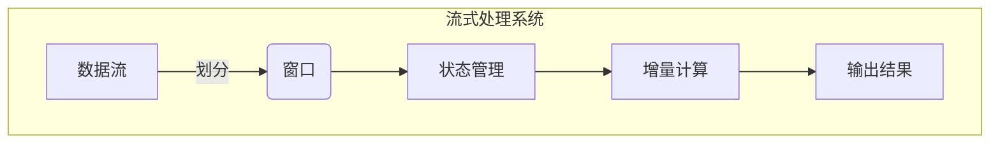

好的,我明白了您的要求。以下是根据您提供的框架和约束条件撰写的技术博客文章正文部分:

# 原理与代码实战案例讲解

## 1. 背景介绍

### 1.1 问题的由来

在当今快速发展的数字时代,海量数据的处理和分析成为了各行业的核心需求。传统的数据处理方式已经不能满足现代应用的实时性、可扩展性和高效性要求。因此,一种新的数据处理范式应运而生——流式数据处理。

流式数据处理(Stream Data Processing)是指持续不断地从各种数据源获取数据,并对这些数据进行实时处理、分析和响应的过程。与传统的批量数据处理不同,流式处理更注重数据的实时性和连续性,能够及时地从不断产生的数据流中提取有价值的信息,并根据这些信息作出相应的决策或行动。

随着物联网、移动互联网、社交网络等新兴技术的快速发展,海量的连续数据流不断涌现,对流式数据处理系统的需求与日俱增。然而,构建一个高效、可靠、易于扩展的流式数据处理系统并非一蹴而就,需要解决诸多技术挑战。

### 1.2 研究现状

近年来,流式数据处理领域取得了长足的进步,涌现出了多种流式处理系统和框架,如Apache Storm、Apache Spark Streaming、Apache Flink、Apache Kafka Streams等。这些系统提供了流式数据的实时接收、转换、分析和持久化等功能,并在可靠性、容错性、吞吐量、延迟等方面做了大量优化。

然而,现有的流式处理系统也面临着一些挑战和限制:

1. **状态管理**:在流式处理中,需要维护大量的状态信息(如窗口聚合、连接查询等),状态管理的效率和一致性对系统的性能和正确性至关重要。
2. **容错与恢复**:由于流式处理系统通常运行在分布式环境中,容错和故障恢复机制是必不可少的。如何在出现故障时快速恢复并保证结果的正确性是一个巨大的挑战。
3. **资源管理**:流式处理系统需要动态地调度和分配资源,以应对不断变化的工作负载和数据流量。高效的资源管理对于系统的可扩展性和成本效益至关重要。
4. **低延迟处理**:对于一些关键任务,流式处理系统需要在毫秒级别的低延迟下完成数据处理,这对系统的设计和优化提出了更高的要求。

### 1.3 研究意义

构建一个高效、可靠、易于扩展的流式数据处理系统,对于各行业的数字化转型和智能化发展具有重要意义:

1. **实时决策支持**:通过流式处理,企业可以从不断产生的数据流中实时获取洞察力,并根据这些洞察力作出及时的决策和响应,提高业务敏捷性和竞争力。
2. **复杂事件处理**:流式处理系统能够对复杂的事件模式进行检测和响应,在金融风险监控、网络安全防护、物联网设备监控等领域发挥重要作用。
3. **实时数据集成**:通过流式处理,可以实现来自不同数据源的实时数据集成,为数据分析和决策提供更全面、更及时的数据支持。
4. **大数据处理**:流式处理为大数据的实时处理提供了有效途径,能够及时处理和分析不断产生的海量数据,挖掘隐藏其中的价值。

综上所述,研究和构建高性能的流式数据处理系统,对于推动数字化转型、促进智能化发展、提高企业竞争力具有重要意义。

### 1.4 本文结构

本文将全面介绍流式数据处理的核心概念、算法原理、数学模型、实际应用以及相关工具和资源。文章结构如下:

1. **背景介绍**:阐述流式数据处理的由来、研究现状和意义。
2. **核心概念与联系**:介绍流式处理的关键概念,如数据流、窗口、状态等,并探讨它们之间的关系。
3. **核心算法原理与具体操作步骤**:深入剖析流式处理的核心算法原理,如增量计算、有状态计算等,并详细解释算法的具体操作步骤。
4. **数学模型和公式详细讲解与举例说明**:构建流式处理的数学模型,推导相关公式,并通过实际案例进行详细讲解和分析。
5. **项目实践:代码实例和详细解释说明**:提供流式处理的实际代码实现,包括开发环境搭建、源代码解读、运行结果展示等。
6. **实际应用场景**:介绍流式处理在不同领域的实际应用场景,如物联网、金融风控、网络安全等,并探讨未来的应用前景。
7. **工具和资源推荐**:推荐流式处理相关的学习资源、开发工具、论文等资源,为读者提供进一步学习和实践的途径。
8. **总结:未来发展趋势与挑战**:总结流式处理的研究成果,展望未来的发展趋势,并分析面临的主要挑战。
9. **附录:常见问题与解答**:解答流式处理领域的常见问题,帮助读者更好地理解和掌握相关知识。

通过全面、深入的介绍,本文旨在为读者提供流式数据处理的核心理论基础和实践指导,帮助读者掌握这一前沿技术,并为未来的发展做好准备。

## 2. 核心概念与联系

在深入探讨流式数据处理的算法原理和实现细节之前,我们需要先了解一些核心概念,这些概念是构建流式处理系统的基础。

### 2.1 数据流(Data Stream)

数据流是指持续不断、有序地产生的数据序列。与传统的静态数据集不同,数据流是动态的、无边界的,新的数据一直在源源不断地产生。

数据流可以来自各种数据源,如物联网传感器、网络日志、社交媒体更新、金融交易记录等。每个数据元素(如一条日志记录或一笔交易)都携带有时间戳信息,表示其产生的时间点。

处理数据流的核心挑战在于,我们无法像处理静态数据集那样多次扫描整个数据集,而是需要在数据持续到来时就进行实时处理。因此,流式处理系统必须具备高效的增量计算能力,能够基于之前的计算结果和新到达的数据快速更新结果。

### 2.2 窗口(Window)

由于数据流是无边界的,我们通常需要将其划分为有限的"窗口"进行处理。窗口可以根据时间或数据计数来定义,例如:

- **时间窗口**:对最近5分钟内的数据进行统计分析
- **计数窗口**:对最新的1000条记录进行模式匹配

窗口的概念使得我们能够将无限的数据流转化为有限的"数据批次",从而应用传统的批量处理算法。同时,窗口也为状态管理提供了边界,使得我们能够有效地维护和更新相关的状态信息。

不同类型的窗口适用于不同的场景,如滑动窗口、会话窗口、全局窗口等。选择合适的窗口类型对于获得准确的计算结果至关重要。

### 2.3 状态(State)

在流式处理中,我们通常需要维护某些中间状态,以支持诸如窗口聚合、连接查询、事件模式匹配等复杂操作。这些状态可能包括:

- 窗口聚合的部分结果
- 连接查询的缓存数据
- 事件模式匹配的历史事件序列

有效地管理这些状态对于流式处理系统的正确性和性能至关重要。状态管理需要解决以下几个关键问题:

1. **状态一致性**:如何确保状态在故障恢复后的一致性?
2. **状态分区**:如何在分布式环境中有效地分区和管理状态?
3. **状态访问效率**:如何提高对状态的访问和更新效率?
4. **状态大小控制**:如何控制状态的大小,避免内存溢出?

流式处理系统通常采用检查点机制、状态后写日志、增量检查点等技术来解决上述问题,确保状态的一致性、高效性和可扩展性。

### 2.4 核心概念关系

上述三个核心概念——数据流、窗口和状态——是相互关联的。我们可以将它们之间的关系用一个流程图来表示:

1. 数据流被划分为有限的窗口,使得我们能够对有限的数据批次进行处理。
2. 在窗口处理过程中,系统需要维护相关的状态信息,如窗口聚合的部分结果、连接查询的缓存数据等。
3. 基于当前的状态和新到达的数据,系统进行增量计算,快速更新计算结果。
4. 最终,系统输出更新后的结果,供下游应用或者用户使用。

理解这些核心概念及其关系,是掌握流式处理原理的基础。在后续章节中,我们将深入探讨流式处理的算法细节、数学模型、实现方式和实际应用。

## 3. 核心算法原理与具体操作步骤

### 3.1 算法原理概述

流式数据处理的核心算法原理可以概括为"增量计算"(Incremental Computation)。与传统的批量计算不同,增量计算旨在基于之前的计算结果和新到达的数据,快速更新输出结果,而不需要重新处理所有数据。

增量计算的基本思想是:将计算过程分解为一系列的"增量步骤",每个步骤只处理新到达的数据增量,并基于之前的中间结果进行更新。通过这种方式,我们可以避免重复计算,从而提高计算效率和系统吞吐量。

增量计算算法通常包括以下三个核心组件:

1. **Delta Extractor(增量提取器)**: 从新到达的数据流中提取出"增量数据",即自上次计算后发生变化的数据部分。
2. **State Manager(状态管理器)**: 维护和管理计算过程中的中间状态,如窗口聚合的部分结果、连接查询的缓存数据等。
3. **Incremental Processor(增量处理器)**: 基于增量数据和当前状态,执行增量计算逻辑,更新中间结果和输出结果。

不同的流式处理算法(如窗口聚合、连接查询、模式匹配等)对上述三个组件的具体实现会有所不同,但总体思路是一致的。我们将在后续章节中详细介绍几种典型算法的原理和实现细节。

### 3.2 算法步骤详解

以下是一个通用的增量计算算法步骤,适用于大多数流式处理场景:

1. **初始化**:初始化状态管理器和增量处理器,准备好计算所需的数据结构和资源。

2. **提取增量数据**:使用增量提取器从新到达的数据流中提取出自上次计算后发生变化的数据增量。

3. **更新状态**:将提取出的增量数据应用到状态管理器中,更新相关的中间状态,如窗口聚合的部分结果、连接查询的缓存数据等。

4. **执行增量计算**:增量处理器基于更新后的状态和增量数据,执行特定的增量计算逻辑,生成新的中间结果。

5. **输出结果**:将增量计算得到的新中间结果与之前的结果进行合并,生成最终的输出结果。

6. **回到第2步**:当有新的数据到达时,重复执行步骤2到步骤5,持续进行增量计算和结果更新。

这个通用算法框架强调了"增量"的思想,即只处理变化的数据部分,并基于之前的中间结果进行更新,从而避免了重复计算,提高