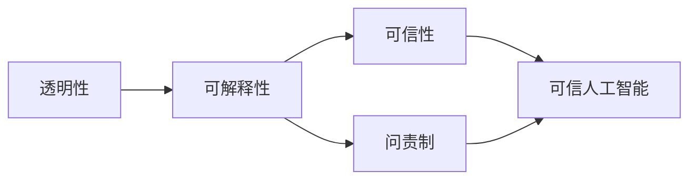

# 可解释人工智能原理与代码实战案例讲解

关键词：可解释人工智能、XAI、机器学习、深度学习、模型可解释性、LIME、SHAP、代码实战

## 1. 背景介绍
### 1.1 问题的由来
人工智能技术的快速发展，尤其是深度学习模型在各领域取得了突破性进展。然而，随着模型结构日益复杂，决策过程变得晦涩难懂，人们对AI系统的信任度和接受度面临巨大挑战。因此，如何让机器学习模型作出的预测和决策对人类来说是可解释、可理解的，成为了亟待解决的关键问题。

### 1.2 研究现状
针对AI可解释性问题，学术界和工业界展开了广泛而深入的探索。一方面，研究者们从理论层面对可解释性的内涵、评估体系、分类框架等进行了系统梳理；另一方面，各种可解释性方法如LIME、SHAP、LRP等被相继提出，并在图像、文本、语音等领域得到应用。然而，将可解释性技术落地到实际系统中仍面临诸多挑战。

### 1.3 研究意义
可解释人工智能研究对于推动AI应用落地、增强用户信任、保障系统安全等方面具有重要意义。通过让AI模型和决策过程变得透明可控，有助于识别系统中的偏差和错误，提升模型的鲁棒性和泛化能力。同时，可解释性也是实现可信、可靠、可问责AI系统的关键因素，对于推动AI技术在安全攸关领域的应用具有重要价值。

### 1.4 本文结构
本文将围绕可解释人工智能的核心原理和代码实践展开详细论述。第2部分介绍XAI领域的核心概念；第3部分重点剖析几种主流的可解释性算法；第4部分给出相关数学模型和公式推导；第5部分通过案例代码演示可解释性方法的具体实现；第6部分讨论XAI技术在实际场景中的应用；第7部分推荐相关学习资源；第8部分对全文进行总结并探讨XAI未来的机遇与挑战。

## 2. 核心概念与联系

可解释人工智能（Explainable AI, XAI）是一个涵盖多个研究方向的交叉领域，其核心目标是赋予机器学习模型以向人类解释其决策和行为的能力。XAI所涉及的关键概念包括：

- 可解释性：模型输出结果背后的推理逻辑对人类是可理解的，体现为人类可以解释模型是如何得出特定输出的。
- 透明性：模型内部工作机制对人类是可见、可审视的，人类可以检查模型的结构、参数、中间状态等。
- 可信性：模型的预测和决策可以被人类所信任，这来源于人类对其内在逻辑的理解和认可。
- 问责制：模型的决策需要能被追溯和审计，一旦出现问题，可以找出负责的环节。

上述概念之间环环相扣，共同构成了可解释人工智能的基本内涵。可解释性是透明性的高阶形式，模型的透明性是实现可解释性的基础。而可信性和问责制则是可解释性的外在表现，是构建可信人工智能的两大支柱。下图描绘了这些概念间的逻辑关系：



总的来说，可解释性是实现可信人工智能的关键抓手，而可信则是人工智能走向应用落地的必由之路。随着AI技术的不断发展，可解释性已成为学界和业界的研究热点，受到越来越多的关注。

## 3. 核心算法原理 & 具体操作步骤
### 3.1 算法原理概述
可解释性算法从不同角度为黑盒模型的决策提供解释。主流的可解释性算法可分为两大类：基于特征的归因方法和基于样本的归因方法。前者关注每个输入特征对模型输出的贡献，代表性方法有LIME、SHAP、DeepLIFT等；后者通过分析与待解释样本相似或相反的样本来解释模型行为，代表性方法有MMD-Critic、Influence Function等。

### 3.2 算法步骤详解
下面以LIME为例，详细讲解其算法步骤。LIME（Local Interpretable Model-agnostic Explanations）通过在待解释样本附近的局部区域拟合一个可解释的线性模型来近似原模型的决策边界，从而得到每个特征的权重作为重要性度量。其主要步骤如下：

1. 对待解释样本 $x$ 进行扰动，生成一批扰动样本 $\{z_i\}_{i=1}^n$。
2. 利用原模型对扰动样本进行预测，得到标签 $\{f(z_i)\}_{i=1}^n$。
3. 计算每个扰动样本 $z_i$ 与原样本 $x$ 的距离 $\pi_x(z_i)$，用于衡量局部权重。
4. 在扰动样本上拟合一个加权的线性模型 $g$，损失函数定义为：
$$ \mathcal{L}(f,g,\pi_x)=\sum_{i=1}^n \pi_x(z_i)(f(z_i)-g(z_i))^2 $$
5. 将线性模型 $g$ 的系数作为每个特征的重要性度量，得到局部解释。

### 3.3 算法优缺点
LIME的优点在于其灵活性和通用性，可以适用于任意模型（model-agnostic），且可以生成人类可解释的特征权重。但其局限性在于解释的局部性和不稳定性，对扰动策略和距离度量较为敏感，且无法提供全局性解释。

### 3.4 算法应用领域
LIME在图像、文本、表格等结构化和非结构化数据上都有广泛应用。在医疗领域，LIME可用于解释疾病诊断模型；在金融领域，LIME可用于解释信用评分模型；在司法领域，LIME可用于解释案情分析模型。总的来说，可解释性算法有助于提升人工智能系统的透明度，让人类更好地理解模型的决策逻辑。

## 4. 数学模型和公式 & 详细讲解 & 举例说明
### 4.1 数学模型构建
可解释性方法的数学基础是因果推理和博弈论。以Shapley值为例，其源于博弈论中对合作对策贡献值的分配问题。将特征看作博弈的参与者，模型预测看作博弈的结果，Shapley值衡量了每个特征对预测结果的贡献大小。Shapley值的定义为：

$$\phi_i=\sum_{S\subseteq F \setminus \{i\}} \frac{|S|!(|F|-|S|-1)!}{|F|!} (f_{S\cup\{i\}}(x_{S\cup\{i\}})-f_S(x_S))$$

其中，$F$ 为所有特征的集合，$S$ 为任意特征子集，$\phi_i$ 表示第 $i$ 个特征的Shapley值。直观理解，Shapley值衡量了特征 $i$ 的存在与否对模型预测的影响，考虑了所有可能的特征组合情况。

### 4.2 公式推导过程
Shapley值的推导过程涉及博弈论和组合数学知识。首先，根据Shapley公理，任意一种贡献度量 $\phi$ 都应满足以下性质：

1. 效率性：$\sum_{i=1}^{|F|} \phi_i=f(x)-f(\emptyset)$
2. 对称性：若对任意 $S\subseteq F\setminus\{i,j\}$，都有 $f_{S\cup\{i\}}(x)=f_{S\cup\{j\}}(x)$，则 $\phi_i=\phi_j$
3. 虚值性：若对任意 $S\subseteq F\setminus\{i\}$，都有 $f_{S\cup\{i\}}(x)=f_S(x)$，则 $\phi_i=0$

可以证明，Shapley值是唯一满足以上三条公理的贡献度量。Shapley值的表达式可通过组合数学技巧推导得到。由于每个特征的边际贡献与其出现在特征子集中的顺序有关，因此需要考虑所有可能的特征排列，计算特征 $i$ 的边际贡献在所有排列中的平均值。

### 4.3 案例分析与讲解
下面以一个简单的二分类任务为例，直观展示Shapley值的计算过程。假设有三个二值特征 $x_1,x_2,x_3$，模型在不同特征子集上的预测概率如下：

|  特征子集   | 预测概率 |
|  ----  | ----  |
| $\{\}$  | 0.2 |
| $\{x_1\}$  | 0.3 |
| $\{x_2\}$  | 0.4 | 
| $\{x_3\}$  | 0.5 |
| $\{x_1,x_2\}$  | 0.7 |
| $\{x_1,x_3\}$  | 0.6 |
| $\{x_2,x_3\}$  | 0.8 |
| $\{x_1,x_2,x_3\}$  | 0.9 |

根据Shapley值的定义，可以计算出每个特征的贡献度量：

$$\phi_1=\frac{1}{3}(0.3-0.2)+\frac{1}{6}(0.7-0.4)+\frac{1}{6}(0.6-0.5)+\frac{1}{3}(0.9-0.8)=0.15$$

$$\phi_2=\frac{1}{3}(0.4-0.2)+\frac{1}{6}(0.7-0.3)+\frac{1}{6}(0.8-0.5)+\frac{1}{3}(0.9-0.6)=0.25$$

$$\phi_3=\frac{1}{3}(0.5-0.2)+\frac{1}{6}(0.6-0.3)+\frac{1}{6}(0.8-0.4)+\frac{1}{3}(0.9-0.7)=0.30$$

可以看出，特征 $x_3$ 的贡献最大，其次是 $x_2$ 和 $x_1$。这表明特征 $x_3$ 对模型预测结果的影响最为显著。

### 4.4 常见问题解答
Q: Shapley值是否适用于任意模型？
A: 理论上Shapley值可以用于解释任意模型，但从计算效率的角度，更适合树模型和线性模型等可解释性较好的模型。对于神经网络等复杂模型，计算Shapley值的复杂度较高，需要近似估计。

Q: Shapley值与LIME的区别是什么？
A: 两者都用于衡量特征重要性，但Shapley值是一种基于博弈论的全局解释方法，考虑了所有可能的特征组合，具有理论保障；而LIME是一种基于扰动的局部解释方法，通过在样本附近拟合线性模型得到局部近似解释，但缺乏理论保障。

Q: Shapley值对特征相关性敏感吗？
A: Shapley值假设特征之间相互独立，当特征高度相关时，Shapley值可能出现不稳定的情况。因此在使用Shapley值时，需要注意特征相关性问题，必要时可以考虑使用Shapley交互指数（Shapley interaction index）捕捉特征交互作用。

## 5. 项目实践：代码实例和详细解释说明
### 5.1 开发环境搭建
本项目使用Python作为开发语言，需要安装以下依赖库：

- numpy：科学计算库
- pandas：数据处理库
- sklearn：机器学习库
- matplotlib：数据可视化库
- shap：SHAP算法实现库

可以使用pip命令进行安装：

```bash
pip install numpy pandas scikit-learn matplotlib shap
```

### 5.2 源代码详细实现
下面给出基于SHAP的可解释性分析的示例代码。以经典的Iris数据集为例，使用决策树模型进行分类，并利用SHAP计算特征重要性。

```python
from sklearn.datasets import load_iris
from sklearn.model_selection import train_test_split
from sklearn.tree import DecisionTreeClassifier
from sklearn.metrics import accuracy_score